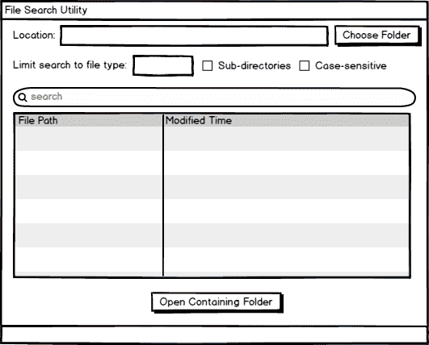
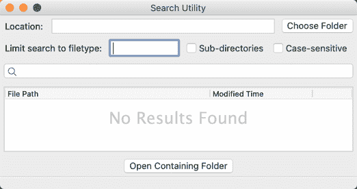

# 用 wxPython 创建文件搜索 GUI

> 原文：<https://www.blog.pythonlibrary.org/2021/09/02/creating-a-file-search-gui-with-wxpython/>

你曾经需要在你的计算机上搜索一个文件吗？大多数操作系统都有办法做到这一点。Windows 资源管理器有搜索功能，现在开始菜单中也有内置的搜索功能。其他操作系统如 Mac 和 Linux 也类似。你也可以下载一些应用程序，它们搜索硬盘的速度有时比内置的要快。

在本文中，您将使用 wxPython 创建一个简单的文件搜索实用程序。

您需要支持文件搜索工具的以下任务:

*   按文件类型搜索
*   区分大小写的搜索
*   在子目录中搜索

你可以在 [GitHub](https://github.com/driscollis/applications_with_wxpython/tree/master/chapter11_search_utility) 上下载这篇文章的源代码。

我们开始吧！

## 设计您的文件搜索工具

尝试再造一个你自己使用的工具总是很有趣的。然而，在这种情况下，您只需利用上面提到的特性，创建一个简单明了的用户界面。您可以使用`wx.SearchCtrl`来搜索文件，使用`ObjectListView`来显示结果。对于这个特定的实用程序，一两个`wx.CheckBox`将很好地告诉您的应用程序在子目录中搜索，或者搜索项是否区分大小写。

以下是应用程序最终外观的模型:



文件搜索模型

既然你心中有了目标，那就让我们开始编码吧！

## 创建文件搜索实用程序

您的搜索工具将需要两个模块。第一个模块将被称为 **main** ，它将保存你的用户界面和应用程序的大部分逻辑。第二个模块被命名为 **search_threads** ，它将包含使用 Python 的`threading`模块搜索文件系统所需的逻辑。找到结果后，您将使用`pubsub`更新**主**模块。

### 主脚本

**主**模块拥有您的应用程序的大部分代码。如果您继续并增强这个应用程序，代码的搜索部分可能最终拥有大部分代码，因为这可能是您的代码应该进行大量改进的地方。

不管怎样，这里是**主**的开始:

```py
# main.py

import os
import sys
import subprocess
import time
import wx

from ObjectListView import ObjectListView, ColumnDefn
from pubsub import pub
from search_threads import SearchFolderThread, SearchSubdirectoriesThread
```

这一次，您将使用更多的内置 Python 模块，比如`os`、`sys`、`subprocess`和`time`。其他的导入都很正常，最后一个是几个类，你将从`threading`模块中基于 Python 的`Thread`类创建。

不过现在，让我们只关注**主**模块。

下面是您需要创建的第一个类:

```py
class SearchResult:

    def __init__(self, path, modified_time):
        self.path = path
        self.modified = time.strftime('%D %H:%M:%S',
                                      time.gmtime(modified_time))

```

`SearchResult`类用于保存搜索结果的相关信息。它也由`ObjectListView`小部件使用。目前，您将使用它来保存搜索结果的完整路径以及文件的修改时间。您可以很容易地增强它，使其包括文件大小、创建时间等。

现在让我们创建包含大部分 UI 代码的`MainPanel`:

```py
class MainPanel(wx.Panel):

    def __init__(self, parent):
        super().__init__(parent)
        self.search_results = []
        self.main_sizer = wx.BoxSizer(wx.VERTICAL)
        self.create_ui()
        self.SetSizer(self.main_sizer)
        pub.subscribe(self.update_search_results, 'update')

```

`__init__()`方法设置好了一切。这里您创建了`main_sizer`，一个空的`search_results`列表和一个使用`pubsub`的监听器或订阅。您还可以调用`create_ui()`将用户界面小部件添加到面板中。

让我们看看现在有什么:

```py
def create_ui(self):
    # Create the widgets for the search path
    row_sizer = wx.BoxSizer()
    lbl = wx.StaticText(self, label='Location:')
    row_sizer.Add(lbl, 0, wx.ALL | wx.CENTER, 5)
    self.directory = wx.TextCtrl(self, style=wx.TE_READONLY)
    row_sizer.Add(self.directory, 1, wx.ALL | wx.EXPAND, 5)
    open_dir_btn = wx.Button(self, label='Choose Folder')
    open_dir_btn.Bind(wx.EVT_BUTTON, self.on_choose_folder)
    row_sizer.Add(open_dir_btn, 0, wx.ALL, 5)
    self.main_sizer.Add(row_sizer, 0, wx.EXPAND)

```

有很多小部件可以添加到这个用户界面中。首先，添加一行由标签、文本控件和按钮组成的小部件。这一系列小部件允许用户使用按钮选择他们想要搜索的目录。文本控件将保存他们的选择。

现在让我们添加另一行小部件:

```py
# Create search filter widgets
row_sizer = wx.BoxSizer()
lbl = wx.StaticText(self, label='Limit search to filetype:')
row_sizer.Add(lbl, 0, wx.ALL|wx.CENTER, 5)

self.file_type = wx.TextCtrl(self)
row_sizer.Add(self.file_type, 0, wx.ALL, 5)

self.sub_directories = wx.CheckBox(self, label='Sub-directories')
row_sizer.Add(self.sub_directories, 0, wx.ALL | wx.CENTER, 5)

self.case_sensitive = wx.CheckBox(self, label='Case-sensitive')
row_sizer.Add(self.case_sensitive, 0, wx.ALL | wx.CENTER, 5)
self.main_sizer.Add(row_sizer)

```

这一行小部件包含另一个标签、一个文本控件和两个`wx.Checkbox`实例。这些是过滤器部件，控制你要搜索的内容。您可以根据以下任何一项进行筛选:

*   文件类型
*   搜索子目录(选中时)或只搜索选定的目录
*   搜索词区分大小写

后两个选项通过使用`wx.Checkbox`小部件来表示。

接下来让我们添加搜索控件:

```py
# Add search bar
self.search_ctrl = wx.SearchCtrl(
    self, style=wx.TE_PROCESS_ENTER, size=(-1, 25))
self.search_ctrl.Bind(wx.EVT_SEARCHCTRL_SEARCH_BTN, self.on_search)
self.search_ctrl.Bind(wx.EVT_TEXT_ENTER, self.on_search)
self.main_sizer.Add(self.search_ctrl, 0, wx.ALL | wx.EXPAND, 5)

```

`wx.SearchCtrl`是用于搜索的小部件。不过你可以很容易地使用一个`wx.TextCtrl`来代替。无论如何，在这种情况下，您绑定到 Enter 键的按下和控件内的放大类的鼠标单击。如果你做了这些动作中的任何一个，你将呼叫`search()`。

现在让我们添加最后两个小部件，您将完成`create_ui()`的代码:

```py
# Search results widget
self.search_results_olv = ObjectListView(
    self, style=wx.LC_REPORT | wx.SUNKEN_BORDER)
self.search_results_olv.SetEmptyListMsg("No Results Found")
self.main_sizer.Add(self.search_results_olv, 1, wx.ALL | wx.EXPAND, 5)
self.update_ui()

show_result_btn = wx.Button(self, label='Open Containing Folder')
show_result_btn.Bind(wx.EVT_BUTTON, self.on_show_result)
self.main_sizer.Add(show_result_btn, 0, wx.ALL | wx.CENTER, 5)

```

您的搜索结果将出现在您的`ObjectListView`小工具中。您还需要添加一个按钮，尝试在包含文件夹中显示结果，有点像 Mozilla Firefox 有一个名为“打开包含文件夹”的右键菜单，用于打开下载的文件。

下一个要创建的方法是`on_choose_folder()`:

```py
def on_choose_folder(self, event):
    with wx.DirDialog(self, "Choose a directory:",
                      style=wx.DD_DEFAULT_STYLE,
                      ) as dlg:
        if dlg.ShowModal() == wx.ID_OK:
            self.directory.SetValue(dlg.GetPath())

```

您需要允许用户选择您想要在其中进行搜索的文件夹。您可以让用户输入路径，但是这很容易出错，并且您可能需要添加特殊的错误检查。相反，您选择使用一个`wx.DirDialog`，它可以防止用户输入一个不存在的路径。用户可以选择文件夹，然后在执行搜索之前删除文件夹，但这种情况不太可能发生。

现在您需要一种用 Python 打开文件夹的方法:

```py
def on_show_result(self, event):
    """
    Attempt to open the folder that the result was found in
    """
    result = self.search_results_olv.GetSelectedObject()
    if result:
        path = os.path.dirname(result.path)
        try:
            if sys.platform == 'darwin':
                subprocess.check_call(['open', '--', path])
            elif 'linux' in sys.platform:
                subprocess.check_call(['xdg-open', path])
            elif sys.platform == 'win32':
                subprocess.check_call(['explorer', path])
        except:
            if sys.platform == 'win32':
                # Ignore error on Windows as there seems to be
                # a weird return code on Windows
                return

            message = f'Unable to open file manager to {path}'
            with wx.MessageDialog(None, message=message,
                                  caption='Error',
                                  style= wx.ICON_ERROR) as dlg:
                dlg.ShowModal()

```

`on_show_result()`方法将检查代码在什么平台下运行，然后尝试启动该平台的文件管理器。Windows 用 **Explorer** 而 Linux 用 **xdg-open** 比如。

在测试过程中，我们注意到在 Windows 上，即使 Explorer 成功打开，它也会返回一个非零结果，所以在这种情况下，您可以忽略该错误。但是在其他平台上，您可以向用户显示一条消息，说明您无法打开该文件夹。

您需要编写的下一段代码是`on_search()`事件处理程序:

```py
def on_search(self, event):
    search_term = self.search_ctrl.GetValue()
    file_type = self.file_type.GetValue()
    file_type = file_type.lower()
    if '.' not in file_type:
        file_type = f'.{file_type}'

    if not self.sub_directories.GetValue():
        # Do not search sub-directories
        self.search_current_folder_only(search_term, file_type)
    else:
        self.search(search_term, file_type)

```

当你点击“搜索”按钮时，你希望它做一些有用的事情。这就是上面的代码发挥作用的地方。这里你得到了`search_term`和`file_type`。为了防止出现问题，您将文件类型设置为小写，并在搜索过程中执行同样的操作。

接下来，检查是否勾选了`sub_directories`复选框。如果`sub_directories`没有勾选，那么你调用`search_current_folder_only()`；不然你叫`search()`。

让我们先看看`search()`里有什么:

```py
def search(self, search_term, file_type):
    """
    Search for the specified term in the directory and its
    sub-directories
    """
    folder = self.directory.GetValue()
    if folder:
        self.search_results = []
        SearchSubdirectoriesThread(folder, search_term, file_type,
                                   self.case_sensitive.GetValue())

```

在这里，您获取用户选择的文件夹。如果用户没有选择文件夹，搜索按钮将不起任何作用。但是如果他们已经选择了什么，那么你就用合适的参数调用`SearchSubdirectoriesThread`线程。您将在后面的部分看到该类中的代码。

但是首先，您需要创建`search_current_folder_only()`方法:

```py
def search_current_folder_only(self, search_term, file_type):
    """
    Search for the specified term in the directory only. Do
    not search sub-directories
    """
    folder = self.directory.GetValue()
    if folder:
        self.search_results = []
        SearchFolderThread(folder, search_term, file_type,
                           self.case_sensitive.GetValue())

```

这段代码与前面的函数非常相似。它唯一的区别是执行
`SearchFolderThread`而不是`SearchSubdirectoriesThread`。

下一个要创建的函数是`update_search_results()`:

```py
def update_search_results(self, result):
    """
    Called by pubsub from thread
    """
    if result:
        path, modified_time = result
        self.search_results.append(SearchResult(path, modified_time))
    self.update_ui()

```

当找到一个搜索结果时，线程将使用线程安全的方法和`pubsub`把结果发送回主应用程序。假设主题与您在`__init__()`中创建的订阅相匹配，这个方法将被调用。一旦被调用，这个方法将把结果追加到`search_results`中，然后调用`update_ui()`。

说到这里，你现在可以编码了:

```py
def update_ui(self):
    self.search_results_olv.SetColumns([
        ColumnDefn("File Path", "left", 300, "path"),
        ColumnDefn("Modified Time", "left", 150, "modified")
    ])
    self.search_results_olv.SetObjects(self.search_results)

```

`update_ui()`方法定义了在`ObjectListView`小部件中显示的列。它还调用`SetObjects()`,这将更新小部件的内容，并向用户显示您的搜索结果。

为了包装**主**模块，您需要编写`Search`类:

```py
class Search(wx.Frame):

    def __init__(self):
        super().__init__(None, title='Search Utility',
                         size=(600, 600))
        pub.subscribe(self.update_status, 'status')
        panel = MainPanel(self)
        self.statusbar = self.CreateStatusBar(1)
        self.Show()

    def update_status(self, search_time):
        msg = f'Search finished in {search_time:5.4} seconds'
        self.SetStatusText(msg)

if __name__ == '__main__':
    app = wx.App(False)
    frame = Search()
    app.MainLoop()

```

这个类创建了`MainPanel`,它保存了用户将会看到并与之交互的大多数小部件。它还设置应用程序的初始大小及其标题。还有一个状态栏，用于通知用户搜索何时完成，以及搜索完成需要多长时间。

下面是该应用程序的外观:



现在让我们继续创建保存搜索线程的模块。

### 搜索线程模块

**search_threads** 模块包含两个用于搜索文件系统的`Thread`类。线程类实际上在形式和功能上非常相似。

让我们开始吧:

```py
# search_threads.py

import os
import time
import wx

from pubsub import pub
from threading import Thread

```

这些是使代码工作所需的模块。您将使用`os`模块来检查路径、遍历文件系统并从文件中获取统计数据。当您的搜索返回结果时，您将使用`pubsub`与您的应用程序通信。

下面是第一节课:

```py
class SearchFolderThread(Thread):

    def __init__(self, folder, search_term, file_type, case_sensitive):
        super().__init__()
        self.folder = folder
        self.search_term = search_term
        self.file_type = file_type
        self.case_sensitive = case_sensitive
        self.start()

```

这个线程接受要搜索的`folder`、要查找的`search_term`、一个`file_type`过滤器以及搜索词是否为`case_sensitive`。您接受这些变量，并将它们赋给同名的实例变量。这个线程的目的只是搜索传入的文件夹的内容，而不是它的子目录。

您还需要覆盖线程的`run()`方法:

```py
def run(self):
    start = time.time()
    for entry in os.scandir(self.folder):
        if entry.is_file():
            if self.case_sensitive:
                path = entry.name
            else:
                path = entry.name.lower()

            if self.search_term in path:
                _, ext = os.path.splitext(entry.path)
                data = (entry.path, entry.stat().st_mtime)
                wx.CallAfter(pub.sendMessage, 'update', result=data)
    end = time.time()
    # Always update at the end even if there were no results
    wx.CallAfter(pub.sendMessage, 'update', result=[])
    wx.CallAfter(pub.sendMessage, 'status', search_time=end-start)

```

这里你收集线程的开始时间。然后使用`os.scandir()`循环遍历`folder`的内容。如果路径是一个文件，您将检查`search_term`是否在路径中，以及是否有正确的`file_type`。如果这两个函数都返回`True`，那么您将获得必要的数据，并使用`wx.CallAfter()`将其发送到您的应用程序，这是一个线程安全的方法。

最后，您获取`end_time`并使用它来计算搜索的总运行时间，然后将其发送回应用程序。然后，应用程序会用搜索时间更新状态栏。

现在让我们看看另一个类:

```py
class SearchSubdirectoriesThread(Thread):

    def __init__(self, folder, search_term, file_type, case_sensitive):
        super().__init__()
        self.folder = folder
        self.search_term = search_term
        self.file_type = file_type
        self.case_sensitive = case_sensitive
        self.start()

```

`SearchSubdirectoriesThread`线程不仅用于搜索传入的`folder`，还用于搜索它的子目录。它接受与前一个类相同的参数。

下面是您需要放入它的`run()`方法中的内容:

```py
def run(self):
    start = time.time()
    for root, dirs, files in os.walk(self.folder):
        for f in files:
            full_path = os.path.join(root, f)
            if not self.case_sensitive:
                full_path = full_path.lower()

            if self.search_term in full_path and os.path.exists(full_path):
                _, ext = os.path.splitext(full_path)
                data = (full_path, os.stat(full_path).st_mtime)
                wx.CallAfter(pub.sendMessage, 'update', result=data)

    end = time.time()
    # Always update at the end even if there were no results
    wx.CallAfter(pub.sendMessage, 'update', result=[])
    wx.CallAfter(pub.sendMessage, 'status', search_time=end-start)

```

对于这个线程，需要使用`os.walk()`来搜索传入的`folder`及其子目录。除此之外，条件语句实际上与前面的课程相同。

## 包扎

创建搜索工具并不特别困难，但是很耗时。在创建软件时，找出边缘情况以及如何考虑它们通常是最耗时的事情。在本文中，您了解了如何创建一个实用程序来搜索计算机上的文件。

以下是您可以添加到该程序中的一些增强功能:

*   添加停止搜索的功能
*   防止多个搜索同时发生
*   添加其他过滤器

## 相关阅读

想学习如何用 wxPython 创建更多的 GUI 应用程序吗？然后查看以下资源:

*   用 wxPython 为 NASA 的 API 创建一个 GUI 应用程序

*   **在 [Leanpub](https://leanpub.com/creatingapplicationswithwxpython/) 、 [Gumroad](https://gum.co/Eogsr) 或 [Amazon](https://www.amazon.com/dp/0996062890) 上用 wxPython (book)** 创建 GUI 应用。