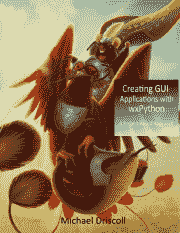

# 用 wxPython 为 NASA 的 API 创建 GUI 应用程序

> 原文：<https://www.blog.pythonlibrary.org/2019/04/18/creating-a-gui-application-for-nasas-api-with-wxpython/>

从小到大，我一直觉得宇宙和太空总的来说是令人兴奋的。梦想什么样的世界尚未被探索是很有趣的。我也喜欢看来自其他世界的照片或思考浩瀚的太空。但是这和 Python 有什么关系呢？嗯，美国国家航空航天局(NASA)有一个 web API，允许你搜索他们的图像库。

你可以在他们的网站上看到所有的信息。

美国宇航局网站建议获取一个[应用编程接口(API)密钥](https://api.nasa.gov/index.html#apply-for-an-api-key)。如果你去那个网站，你要填写的表格又好又短。

从技术上讲，你不需要一个 API 键来请求 NASA 的服务。然而，他们对没有 API 密匙访问他们网站的开发者有限制。即使有一个键，默认情况下每小时也只能处理 1000 个请求。如果您检查了您的分配，您将被暂时禁止提出请求。不过，你可以联系美国宇航局要求更高的速率限制。

有趣的是，文档并没有真正说明在没有 API 键的情况下可以发出多少个请求。

API 文档与 NASA 的图像 API 文档不一致，这使得他们的网站有点混乱。

例如，您会看到 API 文档中谈到了这个 URL:

*   https://api.nasa.gov/planetary/apod?api_key=API_KEY_GOES_HERE

但是在图像 API 文档中，API 根是:

*   https://images-api.nasa.gov

出于本教程的目的，您将使用后者。

| [](https://leanpub.com/creatingapplicationswithwxpython/) | 这篇文章改编自我的书:

### 用 wxPython 创建 GUI 应用程序

**[在 Leanpub](https://leanpub.com/creatingapplicationswithwxpython/) 上立即购买** |

* * *

### 使用美国宇航局的 API

当您开始使用一个不熟悉的 API 时，最好从阅读该接口的文档开始。另一种方法是在互联网上快速搜索，看看是否有包装了目标 API 的 Python 包。不幸的是，似乎没有任何维护 Python 的 NASA 库。当这种情况发生时，你可以创造你自己的。

要开始，请尝试阅读 NASA [图像 API 文档](https://images.nasa.gov/docs/images.nasa.gov_api_docs.pdf)。

他们的 API 文档不是很长，所以阅读或至少浏览它不会花费你很长时间。

下一步是获取这些信息并尝试使用他们的 API。

下面是访问他们的 API 的实验的前几行:

```py

# simple_api_request.py

import requests

from urllib.parse import urlencode, quote_plus

base_url = 'https://images-api.nasa.gov/search'
search_term = 'apollo 11'
desc = 'moon landing'
media = 'image'
query = {'q': search_term, 'description': desc, 'media_type': media}
full_url = base_url + '?' + urlencode(query, quote_via=quote_plus)

r = requests.get(full_url)
data = r.json()

```

如果在调试器中运行，可以打印出返回的 JSON。

以下是返回内容的一个片段:

```py

'items': [{'data': 
              [{'center': 'HQ',
                 'date_created': '2009-07-18T00:00:00Z',
                 'description': 'On the eve of the '
                                'fortieth anniversary of '
                                "Apollo 11's first human "
                                'landing on the Moon, '
                                'Apollo 11 crew member, '
                                'Buzz Aldrin speaks during '
                                'a lecture in honor of '
                                'Apollo 11 at the National '
                                'Air and Space Museum in '
                                'Washington, Sunday, July '
                                '19, 2009\. Guest speakers '
                                'included Former NASA '
                                'Astronaut and U.S. '
                                'Senator John Glenn, NASA '
                                'Mission Control creator '
                                'and former NASA Johnson '
                                'Space Center director '
                                'Chris Kraft and the crew '
                                'of Apollo 11\.  Photo '
                                'Credit: (NASA/Bill '
                                'Ingalls)',
                 'keywords': ['Apollo 11',
                              'Apollo 40th Anniversary',
                              'Buzz Aldrin',
                              'National Air and Space '
                              'Museum (NASM)',
                              'Washington, DC'],
                 'location': 'National Air and Space '
                             'Museum',
                 'media_type': 'image',
                 'nasa_id': '200907190008HQ',
                 'photographer': 'NASA/Bill Ingalls',
                 'title': 'Glenn Lecture With Crew of '
                          'Apollo 11'}],
       'href': 'https://images-assets.nasa.gov/image/200907190008HQ/collection.json',
       'links': [{'href': 'https://images-assets.nasa.gov/image/200907190008HQ/200907190008HQ~thumb.jpg',
                  'rel': 'preview',
                  'render': 'image'}]}

```

现在您已经知道了 JSON 的格式，您可以试着对它进行一点解析。

让我们将以下代码行添加到您的 Python 脚本中:

```py

item = data['collection']['items'][0]
nasa_id = item['data'][0]['nasa_id']
asset_url = 'https://images-api.nasa.gov/asset/' + nasa_id
image_request = requests.get(asset_url)
image_json = image_request.json()
image_urls = [url['href'] for url in image_json['collection']['items']]
print(image_urls)

```

这将从 JSON 响应中提取出列表中第一个条目。然后您可以提取 **nasa_id** ，这是获取与这个特定结果相关的所有图像所必需的。现在，您可以将那个 **nasa_id** 添加到一个新的 URL 端点，并提出一个新的请求。

对图像 JSON 的请求返回如下内容:

```py

{'collection': {'href': 'https://images-api.nasa.gov/asset/200907190008HQ',
                'items': [{'href': 'http://images-assets.nasa.gov/image/200907190008HQ/200907190008HQ~orig.tif'},
                          {'href': 'http://images-assets.nasa.gov/image/200907190008HQ/200907190008HQ~large.jpg'},
                          {'href': 'http://images-assets.nasa.gov/image/200907190008HQ/200907190008HQ~medium.jpg'},
                          {'href': 'http://images-assets.nasa.gov/image/200907190008HQ/200907190008HQ~small.jpg'},
                          {'href': 'http://images-assets.nasa.gov/image/200907190008HQ/200907190008HQ~thumb.jpg'},
                          {'href': 'http://images-assets.nasa.gov/image/200907190008HQ/metadata.json'}],
                'version': '1.0'}}

```

Python 代码中的最后两行将从 JSON 中提取 URL。现在你已经拥有了编写一个基本用户界面所需的所有部分！

* * *

### 设计用户界面

有许多不同的方法可以设计你的图像下载应用程序。您将做最简单的事情，因为这几乎总是创建原型的最快方法。原型设计的好处在于，您最终获得了创建有用应用程序所需的所有部分。然后你可以利用你的知识，或者增强原型，或者用你获得的知识创造新的东西。

这里有一个你将尝试创建的模型:


美国宇航局图像搜索模型

如您所见，您希望应用程序具有以下特性:

*   搜索栏
*   保存搜索结果的小部件
*   选择结果时显示图像的方式
*   下载图像的能力

现在让我们来学习如何创建这个用户界面！

* * *

### 创建 NASA 搜索应用程序

快速原型是一种想法，在这种想法中，您将尽可能快地创建一个小的、可运行的应用程序。让我们在应用程序中从上到下添加小部件，而不是花费大量时间来布置所有的小部件。这将比创建一系列嵌套的 sizers 更快地为您提供一些工作。

让我们首先创建一个名为 **nasa_search_ui.py** 的脚本:

```py

# nasa_search_ui.py

import os
import requests
import wx

from download_dialog import DownloadDialog
from ObjectListView import ObjectListView, ColumnDefn
from urllib.parse import urlencode, quote_plus

```

在这里，您导入了一些您尚未看到的新项目。第一个是**请求**包。这是一个用 Python 在互联网上下载文件和做事情的便利包。很多开发者觉得比 Python 自己的 urllib 要好。你需要安装它来使用它。您还需要安装 ObjectListView。

下面是你如何用 **pip** 来做这件事:

```py

pip install requests ObjectListView

```

另一个新的部分是从 **urllib.parse** 的导入。您将使用这个模块对 URL 参数进行编码。最后， **DownloadDialog** 是一个小对话框的类，您将创建它来下载 NASA 的图像。

因为您将在这个应用程序中使用 ObjectListView，所以您需要一个类来表示该小部件中的对象:

```py

class Result:

    def __init__(self, item):
        data = item['data'][0]
        self.title = data['title']
        self.location = data.get('location', '')
        self.nasa_id = data['nasa_id']
        self.description = data['description']
        self.photographer = data.get('photographer', '')
        self.date_created = data['date_created']
        self.item = item

        if item.get('links'):
            try:
                self.thumbnail = item['links'][0]['href']
            except:
                self.thumbnail = ''

```

**结果**类是您将用来保存构成您的**对象列表视图**中每一行的数据。**项**参数是 JSON 的一部分，它是 NASA 对您的查询的回应。在这堂课上，你需要分析出你所需要的信息。

在这种情况下，您需要以下字段:

*   标题
*   图像的位置
*   NASA 的内部 ID
*   照片的描述
*   摄影师的名字
*   图像的创建日期
*   缩略图 URL

其中一些条目并不总是包含在 JSON 响应中，所以在这些情况下，您将使用字典的 **get()** 方法返回一个空字符串。

现在让我们开始研究用户界面:

```py

class MainPanel(wx.Panel):

    def __init__(self, parent):
        super().__init__(parent)
        self.search_results = []
        self.max_size = 300
        self.paths = wx.StandardPaths.Get()
        font = wx.Font(12, wx.SWISS, wx.NORMAL, wx.NORMAL)

        main_sizer = wx.BoxSizer(wx.VERTICAL)

```

主面板是你的大部分代码所在的地方。这里你做一些内务处理，创建一个 **search_results** 来保存用户搜索时的 ****Result**** 对象列表。你也可以设置缩略图的最大尺寸，使用的字体，尺寸，你也可以得到一些标准路径。

现在让我们将下面的代码添加到 **__init__()** 中:

```py

txt = 'Search for images on NASA'
label = wx.StaticText(self, label=txt)
main_sizer.Add(label, 0, wx.ALL, 5)
self.search = wx.SearchCtrl(
    self, style=wx.TE_PROCESS_ENTER, size=(-1, 25))
self.search.Bind(wx.EVT_SEARCHCTRL_SEARCH_BTN, self.on_search)
self.search.Bind(wx.EVT_TEXT_ENTER, self.on_search)
main_sizer.Add(self.search, 0, wx.EXPAND)

```

这里您使用 **wx 为应用程序创建一个标题标签。静态文本**。然后你加一个 **wx。SearchCtrl** ，非常类似于一个 **wx。除了它内置了特殊的按钮。您还可以将搜索按钮的点击事件(【TEXT _ 搜索 ctrl _ 搜索 _BTN** 和【TEXT _ 文本 _ 输入绑定到一个与搜索相关的事件处理程序(**开 _ 搜索**)。

接下来的几行添加了搜索结果小部件:

```py

self.search_results_olv = ObjectListView(
    self, style=wx.LC_REPORT | wx.SUNKEN_BORDER)
self.search_results_olv.SetEmptyListMsg("No Results Found")
self.search_results_olv.Bind(wx.EVT_LIST_ITEM_SELECTED,
                             self.on_selection)
main_sizer.Add(self.search_results_olv, 1, wx.EXPAND)
self.update_search_results()

```

这段代码设置了 **ObjectListView** ,与我的其他文章使用它的方式非常相似。您可以通过调用 **SetEmptyListMsg()** 来定制空消息，还可以将小部件绑定到**EVT _ 列表 _ 项目 _ 选定的**，以便在用户选择搜索结果时执行操作。

现在让我们将剩余的代码添加到 **__init__()** 方法中:

```py

main_sizer.AddSpacer(30)
self.title = wx.TextCtrl(self, style=wx.TE_READONLY)
self.title.SetFont(font)
main_sizer.Add(self.title, 0, wx.ALL|wx.EXPAND, 5)
img = wx.Image(240, 240)
self.image_ctrl = wx.StaticBitmap(self,
                                  bitmap=wx.Bitmap(img))
main_sizer.Add(self.image_ctrl, 0, wx.CENTER|wx.ALL, 5
               )
download_btn = wx.Button(self, label='Download Image')
download_btn.Bind(wx.EVT_BUTTON, self.on_download)
main_sizer.Add(download_btn, 0, wx.ALL|wx.CENTER, 5)

self.SetSizer(main_sizer)

```

最后几行代码添加了一个标题文本控件和一个图像小部件，当结果被选中时，它将会更新。您还添加了一个下载按钮，允许用户选择他们想要下载的图像大小。NASA 通常会给出几个不同版本的图像，从缩略图一直到原始的 TIFF 图像。

要查看的第一个事件处理程序是 **on_download()** :

```py

def on_download(self, event):
    selection = self.search_results_olv.GetSelectedObject()
    if selection:
        with DownloadDialog(selection) as dlg:
            dlg.ShowModal()

```

这里调用 **GetSelectedObject()** 来获取用户的选择。如果用户没有选择任何东西，那么这个方法退出。另一方面，如果用户选择了一个项目，那么你实例化 **DownloadDialog** 并显示给用户以允许他们下载一些东西。

现在我们来学习如何进行搜索:

```py

def on_search(self, event):
    search_term = event.GetString()
    if search_term:
        query = {'q': search_term, 'media_type': 'image'}
        full_url = base_url + '?' + urlencode(query, quote_via=quote_plus)
        r = requests.get(full_url)
        data = r.json()
        self.search_results = []
        for item in data['collection']['items']:
            if item.get('data') and len(item.get('data')) > 0:
                data = item['data'][0]
                if data['title'].strip() == '':
                    # Skip results with blank titles
                    continue
                result = Result(item)
                self.search_results.append(result)
        self.update_search_results()

```

**on_search()** 事件处理程序将获取用户输入到搜索控件中的字符串，或者返回一个空字符串。假设用户实际输入了要搜索的东西，您使用 NASA 的通用搜索查询， **q** 并将 **media_type** 硬编码为**图像**。然后，将查询编码成格式正确的 URL，并使用 **requests.get()** 请求 JSON 响应。

接下来，您尝试循环搜索结果。请注意，如果没有数据返回，此代码将失败并引发异常。但是如果您确实获得了数据，那么您将需要解析它以获得您需要的片段。

您将跳过未设置标题字段的项目。否则，您将创建一个结果对象，并将其添加到 **search_results** 列表中。在方法的最后，您告诉您的 UI 更新搜索结果。

在我们开始这个函数之前，您需要创建 **on_selection()** :

```py

def on_selection(self, event):
    selection = self.search_results_olv.GetSelectedObject()
    self.title.SetValue(f'{selection.title}')
    if selection.thumbnail:
        self.update_image(selection.thumbnail)
    else:
        img = wx.Image(240, 240)
        self.image_ctrl.SetBitmap(wx.Bitmap(img))
        self.Refresh()
        self.Layout()

```

您再次获得选定的项目，但这一次您接受该选择，并用该选择的标题文本更新标题文本控件。然后检查是否有缩略图，如果有，就相应地更新它。当没有缩略图时，您可以将其设置回空图像，因为您不希望它一直显示以前选择的图像。

下一个要创建的方法是 **update_image()** :

```py

def update_image(self, url):
    filename = url.split('/')[-1]
    tmp_location = os.path.join(self.paths.GetTempDir(), filename)
    r = requests.get(url)
    with open(tmp_location, "wb") as thumbnail:
        thumbnail.write(r.content)

    if os.path.exists(tmp_location):
        img = wx.Image(tmp_location, wx.BITMAP_TYPE_ANY)
        W = img.GetWidth()
        H = img.GetHeight()
        if W > H:
            NewW = self.max_size
            NewH = self.max_size * H / W
        else:
            NewH = self.max_size
            NewW = self.max_size * W / H
        img = img.Scale(NewW,NewH)
    else:
        img = wx.Image(240, 240)

    self.image_ctrl.SetBitmap(wx.Bitmap(img))
    self.Refresh()
    self.Layout()

```

**update_image()** 接受一个 URL 作为它的唯一参数。它获取这个 URL 并分离出**文件名**。然后，它会创建一个新的下载位置，即计算机的临时目录。然后，您的代码下载图像并检查以确保文件保存正确。如果是，那么缩略图使用您设置的 **max_size** 加载；否则，您可以将其设置为使用空白图像。

最后几行**刷新()**和**布局()**面板，以便小部件正确显示。

最后，您需要创建最后一个方法:

```py

def update_search_results(self):
    self.search_results_olv.SetColumns([
        ColumnDefn("Title", "left", 250, "title"),
        ColumnDefn("Description", "left", 350, "description"),
        ColumnDefn("Photographer", "left", 100, "photographer"),
        ColumnDefn("Date Created", "left", 150, "date_created")
    ])
    self.search_results_olv.SetObjects(self.search_results)

```

在这里，您创建框架，设置标题和初始大小，并添加面板。然后你展示框架。

这是主用户界面的样子:


美国宇航局图像搜索主应用程序

现在让我们来学习如何制作一个下载对话框！

* * *

### 下载对话框

下载对话框将允许用户下载他们选择的一个或多个图像。几乎总是有至少两个版本的每张图片，有时五个或六个。

要学习的第一段代码是前几行:

```py

# download_dialog.py

import requests
import wx

wildcard = "All files (*.*)|*.*"

```

这里您再次导入**请求**并设置一个**通配符**，您将在保存图像时使用它。

现在让我们创建对话框的 **__init__()** :

```py

class DownloadDialog(wx.Dialog):

    def __init__(self, selection):
        super().__init__(None, title='Download images')
        self.paths = wx.StandardPaths.Get()
        main_sizer = wx.BoxSizer(wx.VERTICAL)
        self.list_box = wx.ListBox(self, choices=[], size=wx.DefaultSize)
        urls = self.get_image_urls(selection)
        if urls:
            choices = {url.split('/')[-1]: url for url in urls if 'jpg' in url}
            for choice in choices:
                self.list_box.Append(choice, choices[choice])
        main_sizer.Add(self.list_box, 1, wx.EXPAND|wx.ALL, 5)

        save_btn = wx.Button(self, label='Save')
        save_btn.Bind(wx.EVT_BUTTON, self.on_save)
        main_sizer.Add(save_btn, 0, wx.ALL|wx.CENTER, 5)
        self.SetSizer(main_sizer)

```

在本例中，您创建了一个对**标准路径**的新引用，并添加了一个 **wx。列表框**。列表框将包含您可以下载的照片的变体。它还会自动添加一个滚动条，如果有太多的结果，以适应屏幕上一次。你用传入的**选择**对象调用 **get_image_urls** 来获得一个**URL**的列表。然后循环遍历**URL**并提取名称中包含 **jpg** 的 URL。这确实会导致您错过其他图像文件类型，如 PNG 或 TIFF。

这给了你一个增强和改进代码的机会。您过滤 URL 的原因是，结果中通常包含非图像 URL，您可能不想将这些 URL 显示为潜在的可下载 URL，因为这会使用户感到困惑。

最后要添加的小部件是“保存”按钮。你也可以添加一个“取消”按钮，但是对话框顶部有一个退出按钮，所以不需要。

现在是时候了解一下 **get_image_urls()** 的功能了:

```py

def get_image_urls(self, item):
    asset_url = f'https://images-api.nasa.gov/asset/{item.nasa_id}'
    image_request = requests.get(asset_url)
    image_json = image_request.json()
    try:
        image_urls = [url['href'] for url in image_json['collection']['items']]
    except:
        image_urls = []
    return image_urls

```

当用户按下“保存”按钮时，该事件处理程序被激活。当用户试图在不选择列表框中的项目的情况下保存某些内容时，它将返回-1。如果发生这种情况，你向他们显示一个 **MessageDialog** 来告诉他们可能想要选择某样东西。当他们选择某样东西时，你会给他们看一个 **wx。FileDialog** 允许他们选择文件的保存位置和命名方式。

事件处理程序调用 **save()** 方法，这就是您的下一个项目:

```py

def save(self, path):
    selection = self.list_box.GetSelection()
    r = requests.get(
        self.list_box.GetClientData(selection))
    try:
        with open(path, "wb") as image:
            image.write(r.content)

        message = 'File saved successfully'
        with wx.MessageDialog(None, message=message,
                              caption='Save Successful',
                              style=wx.ICON_INFORMATION) as dlg:
            dlg.ShowModal()
    except:
        message = 'File failed to save!'
        with wx.MessageDialog(None, message=message,
                              caption='Save Failed',
                              style=wx.ICON_ERROR) as dlg:
            dlg.ShowModal()

```

这里您再次获得选择，并使用**请求**包下载图像。注意，没有检查来确保用户已经添加了扩展，更不用说正确的扩展了。有机会可以自己补充一下。

无论如何，当文件下载完成时，你将向用户显示一条消息让他们知道。

如果出现异常，你可以显示一个对话框让他们知道！

下载对话框如下所示:


NASA 图像下载对话框

现在让我们添加一些新的功能！

* * *

### 添加高级搜索

您可以使用几个字段来帮助缩小搜索范围。然而，除非用户真的想使用这些过滤器，否则你不会想让你的用户界面变得杂乱。为此，您可以添加一个“高级搜索”选项。

添加这个选项需要您稍微重新安排一下代码，所以让我们将您的 **nasa_search_ui.py** 文件和您的 **download_dialog.py** 模块复制到一个名为 **version_2** 的新文件夹中。

现在将**重新命名为**main . py**NASA _ search _ ui . py**,这样可以更明显地看出哪个脚本是你的程序的主入口点。为了使事情更加模块化，您将把您的搜索结果提取到它自己的类中，并在一个单独的类中进行高级搜索。这意味着您最终将拥有三个面板:

*   主面板
*   搜索结果面板
*   高级搜索面板

以下是完成后主对话框的样子:


带有高级搜索选项的 NASA 图像搜索

让我们分别检查一下这些。

* * *

### main.py 脚本

**main** 模块是应用程序的主要入口点。入口点是用户将运行来启动应用程序的代码。如果要将应用程序捆绑到可执行文件中，也可以使用这个脚本。

让我们来看看您的**主**模块是如何启动的:

```py

# main.py

import wx

from advanced_search import RegularSearch
from regular_search import SearchResults
from pubsub import pub

class MainPanel(wx.Panel):

    def __init__(self, parent):
        super().__init__(parent)
        pub.subscribe(self.update_ui, 'update_ui')

        self.main_sizer = wx.BoxSizer(wx.VERTICAL)
        search_sizer = wx.BoxSizer()

```

此示例导入两个与搜索相关的面板:

*   高级搜索
*   常规搜索

它还使用 **pubsub** 来订阅更新主题。

让我们看看 **__init__()** 中还有什么:

```py

txt = 'Search for images on NASA'
label = wx.StaticText(self, label=txt)
self.main_sizer.Add(label, 0, wx.ALL, 5)
self.search = wx.SearchCtrl(
    self, style=wx.TE_PROCESS_ENTER, size=(-1, 25))
self.search.Bind(wx.EVT_SEARCHCTRL_SEARCH_BTN, self.on_search)
self.search.Bind(wx.EVT_TEXT_ENTER, self.on_search)
search_sizer.Add(self.search, 1, wx.EXPAND)

self.advanced_search_btn = wx.Button(self, label='Advanced Search',
                            size=(-1, 25))
self.advanced_search_btn.Bind(wx.EVT_BUTTON, self.on_advanced_search)
search_sizer.Add(self.advanced_search_btn, 0, wx.ALL, 5)
self.main_sizer.Add(search_sizer, 0, wx.EXPAND)

```

在这里，您可以像以前一样添加页面标题和搜索控件。您还添加了新的**高级搜索**按钮，并使用新的 sizer 来包含搜索小部件和按钮。然后将该筛选器添加到主筛选器中。

现在让我们添加面板:

```py

self.search_panel = RegularSearch(self)
self.advanced_search_panel = AdvancedSearch(self)
self.advanced_search_panel.Hide()
self.main_sizer.Add(self.search_panel, 1, wx.EXPAND)
self.main_sizer.Add(self.advanced_search_panel, 1, wx.EXPAND)

```

在这个例子中，您实例化了**常规搜索**和**高级搜索**面板。因为**常规搜索**是默认的，所以你在启动时对用户隐藏了高级搜索。

现在我们来更新一下 **on_search()** :

```py

def on_search(self, event):
    search_results = []
    search_term = event.GetString()
    if search_term:
        query = {'q': search_term, 'media_type': 'image'}
        pub.sendMessage('search_results', query=query)

```

当用户按下键盘上的“Enter / Return”键或者当他们按下搜索控件中的搜索按钮图标时，就会调用 **on_search()** 方法。如果用户在搜索控件中输入了一个搜索字符串，搜索查询将被构建，然后使用 **pubsub** 发送出去。

让我们看看当用户按下**高级搜索**按钮时会发生什么:

```py

def on_advanced_search(self, event):
    self.search.Hide()
    self.search_panel.Hide()
    self.advanced_search_btn.Hide()
    self.advanced_search_panel.Show()
    self.main_sizer.Layout()

```

当 **on_advanced_search()** 触发时，它会隐藏搜索小工具、常规搜索面板和高级搜索按钮。接下来，它显示高级搜索面板并调用 **main_sizer** 上的 **Layout()** 。这将导致面板向外切换并调整大小以适合框架。

最后创建的方法是 **update_ui()** :

```py

def update_ui(self):
    """
    Hide advanced search and re-show original screen

    Called by pubsub when advanced search is invoked
    """
    self.advanced_search_panel.Hide()
    self.search.Show()
    self.search_panel.Show()
    self.advanced_search_btn.Show()
    self.main_sizer.Layout()

```

当用户进行**高级搜索**时，调用 **update_ui()** 方法。该方法由**发布订阅**调用。它将在 _advanced_search() 上执行与**相反的操作，取消隐藏高级搜索面板显示时隐藏的所有小部件。它还会隐藏高级搜索面板。**

帧代码和之前一样，所以这里不显示。

让我们继续学习如何创建常规搜索面板！

* * *

### 正则 _ 搜索. py 脚本

**regular_search** 模块是您重构的模块，它包含将显示您的搜索结果的**对象列表视图**。它上面还有**下载**按钮。

下面的方法/类将不被涵盖，因为它们与前一个迭代中的相同:

*   下载时()
*   on_selection()
*   更新图像()
*   更新搜索结果()
*   结果类

让我们先看看模块中的前几行是如何布局的:

```py

# regular_search.py

import os
import requests
import wx

from download_dialog import DownloadDialog
from ObjectListView import ObjectListView, ColumnDefn
from pubsub import pub
from urllib.parse import urlencode, quote_plus

base_url = 'https://images-api.nasa.gov/search'

```

在这里，你拥有了来自**版本 1** 的原始 **nasa_search_ui.py** 脚本中的所有导入。您还需要向 NASA 的图像 API 发出请求的 **base_url** 。唯一的新导入是针对 **pubsub** 的。

让我们继续创建 **RegularSearch** 类:

```py

class RegularSearch(wx.Panel):

    def __init__(self, parent):
        super().__init__(parent)
        self.search_results = []
        self.max_size = 300
        font = wx.Font(12, wx.SWISS, wx.NORMAL, wx.NORMAL)
        main_sizer = wx.BoxSizer(wx.VERTICAL)
        self.paths = wx.StandardPaths.Get()
        pub.subscribe(self.load_search_results, 'search_results')

        self.search_results_olv = ObjectListView(
            self, style=wx.LC_REPORT | wx.SUNKEN_BORDER)
        self.search_results_olv.SetEmptyListMsg("No Results Found")
        self.search_results_olv.Bind(wx.EVT_LIST_ITEM_SELECTED,
                                     self.on_selection)
        main_sizer.Add(self.search_results_olv, 1, wx.EXPAND)
        self.update_search_results()

```

这段代码将把 **search_results** 列表初始化为空列表，并设置图像的 **max_size** 。它还设置了一个 sizer 和用于向用户显示搜索结果的 **ObjectListView** 小部件。该代码实际上非常类似于所有类被组合时的第一次代码迭代。

下面是 **__init__()** 的其余代码:

```py

main_sizer.AddSpacer(30)
self.title = wx.TextCtrl(self, style=wx.TE_READONLY)
self.title.SetFont(font)
main_sizer.Add(self.title, 0, wx.ALL|wx.EXPAND, 5)
img = wx.Image(240, 240)
self.image_ctrl = wx.StaticBitmap(self,
                                  bitmap=wx.Bitmap(img))
main_sizer.Add(self.image_ctrl, 0, wx.CENTER|wx.ALL, 5
               )
download_btn = wx.Button(self, label='Download Image')
download_btn.Bind(wx.EVT_BUTTON, self.on_download)
main_sizer.Add(download_btn, 0, wx.ALL|wx.CENTER, 5)

self.SetSizer(main_sizer)

```

这里的第一项是给 **main_sizer** 添加一个垫片。然后添加与**标题**和 **img** 相关的小部件。最后添加的小部件仍然是下载按钮。

接下来，您需要编写一个新方法:

```py

def reset_image(self):
    img = wx.Image(240, 240)
    self.image_ctrl.SetBitmap(wx.Bitmap(img))
    self.Refresh()

```

**reset_image()** 方法用于复位 **wx。StaticBitmap** 回一个空图像。当用户首先使用常规搜索，选择一个项目，然后决定进行高级搜索时，就会发生这种情况。重置图像可以防止用户看到之前选择的项目，并可能使用户感到困惑。

您需要添加的最后一个方法是 **load_search_results()** :

```py

def load_search_results(self, query):
    full_url = base_url + '?' + urlencode(query, quote_via=quote_plus)
    r = requests.get(full_url)
    data = r.json()
    self.search_results = []
    for item in data['collection']['items']:
        if item.get('data') and len(item.get('data')) > 0:
            data = item['data'][0]
            if data['title'].strip() == '':
                # Skip results with blank titles
                continue
            result = Result(item)
            self.search_results.append(result)
    self.update_search_results()
    self.reset_image()

```

使用 **pubsub** 调用 **load_search_results()** 方法。 **main** 和 **advanced_search** 模块都通过传入查询字典来调用它。然后将字典编码成格式化的 URL。接下来，使用**请求**发送一个 JSON 请求，然后提取结果。这也是您调用 **reset_image()** 的地方，这样当加载一组新的结果时，就不会有结果被选中。

现在您已经准备好创建高级搜索了！

* * *

### 高级 _ 搜索. py 脚本

**高级搜索**模块是一个 **wx。面板**有你需要的所有小部件来对 NASA 的 API 进行高级搜索。如果你阅读他们的文档，你会发现大约有十几个过滤器可以应用于搜索。

让我们从顶部开始:

```py

class AdvancedSearch(wx.Panel):

    def __init__(self, parent):
        super().__init__(parent)

        self.main_sizer = wx.BoxSizer(wx.VERTICAL)

        self.free_text = wx.TextCtrl(self)
        self.ui_helper('Free text search:', self.free_text)
        self.nasa_center = wx.TextCtrl(self)
        self.ui_helper('NASA Center:', self.nasa_center)
        self.description = wx.TextCtrl(self)
        self.ui_helper('Description:', self.description)
        self.description_508 = wx.TextCtrl(self)
        self.ui_helper('Description 508:', self.description_508)
        self.keywords = wx.TextCtrl(self)
        self.ui_helper('Keywords (separate with commas):',
                       self.keywords)

```

设置各种过滤器的代码都非常相似。您为过滤器创建一个文本控件，然后将它和一个字符串一起传递给 **ui_helper()** ，该字符串是文本控件小部件的标签。重复，直到你有所有的过滤器到位。

以下是其余的过滤器:

```py

self.location = wx.TextCtrl(self)
self.ui_helper('Location:', self.location)
self.nasa_id = wx.TextCtrl(self)
self.ui_helper('NASA ID:', self.nasa_id)
self.photographer = wx.TextCtrl(self)
self.ui_helper('Photographer:', self.photographer)
self.secondary_creator = wx.TextCtrl(self)
self.ui_helper('Secondary photographer:', self.secondary_creator)
self.title = wx.TextCtrl(self)
self.ui_helper('Title:', self.title)
search = wx.Button(self, label='Search')
search.Bind(wx.EVT_BUTTON, self.on_search)
self.main_sizer.Add(search, 0, wx.ALL | wx.CENTER, 5)

self.SetSizer(self.main_sizer)

```

最后，将 sizer 设置为 **main_sizer** 。请注意，并非 NASA API 中的所有过滤器都在这段代码中实现。例如，我没有添加 **media_type** ，因为这个应用程序将被硬编码为只查找图像。然而，如果你想要音频或视频，你可以更新这个应用程序。我也没有包括**年初**和**年末**过滤器。如果你愿意，可以随意添加。

现在让我们继续创建 **ui_helper()** 方法:

```py

def ui_helper(self, label, textctrl):
    sizer = wx.BoxSizer()
    lbl = wx.StaticText(self, label=label, size=(150, -1))
    sizer.Add(lbl, 0, wx.ALL, 5)
    sizer.Add(textctrl, 1, wx.ALL | wx.EXPAND, 5)
    self.main_sizer.Add(sizer, 0, wx.EXPAND)

```

**ui_helper()** 接受标签文本和文本控件小部件。然后它创建一个 **wx。BoxSizer** 和一个 **wx。静态文本**。 **wx。StaticText** 被添加到 sizer 中，传入的文本控件也是如此。最后，新的 sizer 被添加到 **main_sizer** 中，然后就完成了。这是减少重复代码的好方法。

这个类中最后创建的项目是 **on_search()** :

```py

def on_search(self, event):
    query = {'q': self.free_text.GetValue(),
             'media_type': 'image',
             'center': self.nasa_center.GetValue(),
             'description': self.description.GetValue(),
             'description_508': self.description_508.GetValue(),
             'keywords': self.keywords.GetValue(),
             'location': self.location.GetValue(),
             'nasa_id': self.nasa_id.GetValue(),
             'photographer': self.photographer.GetValue(),
             'secondary_creator': self.secondary_creator.GetValue(),
             'title': self.title.GetValue()}
    pub.sendMessage('update_ui')
    pub.sendMessage('search_results', query=query)

```

当用户按下**搜索**按钮时，这个事件处理程序被调用。它根据用户在每个字段中输入的内容创建搜索查询。然后，处理程序将使用 **pubsub** 发出两条消息。第一条消息将更新 UI，以便隐藏高级搜索并显示搜索结果。第二条消息将根据 NASA 的 API 执行搜索。

以下是高级搜索页面的外观:


美国宇航局图像搜索与高级搜索页面

现在让我们更新下载对话框。

* * *

### 下载 _ 对话框. py 脚本

下载对话框有几处小改动。基本上你需要添加一个 Python 的 **os** 模块的导入，然后更新 **save()** 函数。

将以下几行添加到函数的开头:

```py

def save(self, path):
    _, ext = os.path.splitext(path)
    if ext.lower() != '.jpg':
        path = f'{path}.jpg'

```

添加此代码是为了解决用户没有在保存的文件名中指定图像扩展名的情况。

* * *

### 包扎

这篇文章涵盖了许多有趣的新信息。您了解了一种使用开放 API 的方法，该 API 周围没有 Python 包装器。您发现了阅读 API 文档的重要性，然后为该 API 添加了一个用户界面。然后您学习了如何解析 JSON 和从互联网下载图像。

虽然这里没有涉及，但是 Python 有一个 **json** 模块，您也可以使用。

以下是增强该应用程序的一些想法:

*   缓存搜索结果
*   在后台下载缩略图
*   在后台下载链接

您可以使用线程下载缩略图和较大的图像，以及进行一般的 web 请求。这将提高应用程序的性能。您可能已经注意到，根据您的互联网连接，应用程序变得稍微没有响应。这是因为当它执行 web 请求或下载文件时，它会阻塞 UI 的主循环。如果你觉得这种事情很麻烦，你应该试试线程。

* * *

### 下载代码

*   源代码作为一个 [tarball](https://www.blog.pythonlibrary.org/wp-content/uploads/2019/04/nasa_image_downloader.tar.gz)

* * *

### 相关阅读

*   用 wxPython 创建一个[计算器](https://www.blog.pythonlibrary.org/2019/02/12/creating-a-calculator-with-wxpython/)
*   如何分发一个 [wxPython 应用](https://www.blog.pythonlibrary.org/2019/03/19/distributing-a-wxpython-application/)