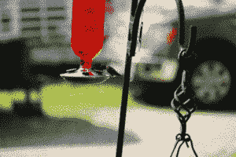
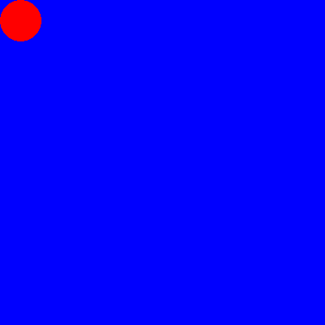

# 用 Python 制作动画 GIF

> 原文：<https://www.blog.pythonlibrary.org/2021/06/23/creating-an-animated-gif-with-python/>

动画 gif 是一种图像类型，包含多幅略有不同的图像。然后这些像卡通一样被回放。你甚至可以把它想象成一本翻页的书，每一页都有一个小棍。当你翻书的时候，图像似乎在移动。

您可以使用 Python 编程语言和 Pillow 包创建自己的动画 gif。

我们开始吧！

## 你需要什么

你需要在你的机器上安装 Python。你可以从 [Python 网站](https://www.python.org/)安装或者使用 [Anaconda](https://www.anaconda.com/) 。你还需要有枕头。如果您使用的是 Anaconda，Pillow 已经安装了。

否则，您将需要安装枕头。下面是如何使用画中画:

```py
python3 -m pip install Pillow
```

一旦 Pillow 安装完毕，你就可以创建 GIF 了！

## 创建动画

你需要有多个动画帧来创建一个动画 GIF。如果你有一个好的傻瓜相机或 DSLR 相机，你通常可以使用它们的高速设置来快速拍摄一系列照片。

如果你想让你的 GIF 看起来漂亮，你应该在拍照前使用三脚架或将相机放在坚固的表面上。

您还可以使用 Pillow 绘制一系列图像，并将该系列图像转换为 GIF。在本文中，您将学习如何使用这两种方法来创建动画 GIF。

您将学习的第一种方法是如何拍摄一系列图像(jpg)并将它们转换成动画 GIF。创建一个新文件，命名为 **gif_maker.py** 。然后输入以下代码:

```py
import glob

from PIL import Image

def make_gif(frame_folder):
    frames = [Image.open(image) for image in glob.glob(f"{frame_folder}/*.JPG")]
    frame_one = frames[0]
    frame_one.save("my_awesome.gif", format="GIF", append_images=frames,
               save_all=True, duration=100, loop=0)

if __name__ == "__main__":
    make_gif("/path/to/images")

```

这里你导入 Python 的 **glob** 模块和 Pillow 的 **Image** 类。使用 **glob** 在传递给函数 **make_gif()** 的路径中搜索 JPG 文件。

*注意:你需要传入一个真实的路径，而不是使用上面代码中的占位符*

下一步是创建一个包含**图像**对象的 Python 列表。如果你的图片很大，你可能需要添加一个步骤来调整它们的大小，这样 GIF 本身就不会很大！如果你不这样做，你实际上是在接受所有这些图像，并把它们变成一个巨大的文件。查看[如何用枕头调整照片大小](https://www.blog.pythonlibrary.org/2017/10/12/how-to-resize-a-photo-with-python/)了解更多信息！

一旦你有了你的 Python 图像列表，你告诉 Pillow 使用你的 Python 列表中的第一个**图像**将它**保存()**为 GIF。为了实现这一点，你需要明确地告诉 Pillow，**格式**被设置为“GIF”。您还可以将动画帧传递给 **append_images** 参数。您还必须将 **save_all** 参数设置为 **True。**

可以以毫秒为单位设置每帧的**时长**。在这个例子中，你将它设置为 100 毫秒。最后，你将**循环**设置为 0(零)，这意味着你希望 GIF 永远循环。如果你把它设置为一个大于零的数字，它会循环很多次，然后停止。

如果你想在某些东西上测试这个代码，你可以使用这个压缩的蜂鸟图片档案。当你对这个解压后的文件夹运行这段代码时，你的 GIF 看起来会像这样:



这张 GIF 不太流畅的原因是这些照片是在没有三脚架的情况下拍摄的。尝试使用三脚架拍摄一些移动的东西，然后重新运行这段代码，它会平滑得多。

现在你已经准备好学习如何用枕头来制作动画了！

## 用枕头画动画

枕头可以让你画各种形状的图像对象。你可以用它来制作你自己的动画！如果您想了解更多关于使用 Pillow 可以创建哪些类型的绘图，那么您可能会喜欢这篇文章:[使用 Python 和 Pillow 在图像上绘制形状](https://www.blog.pythonlibrary.org/2021/02/23/drawing-shapes-on-images-with-python-and-pillow/)。

对于本例，您将使用 Pillow 的**椭圆**形状绘制圆形。你也可以画弧线，直线，矩形，多边形，直线等等。

首先，创建一个新文件并添加以下代码:

```py
from PIL import Image, ImageDraw

def ellipse(x, y, offset):
    image = Image.new("RGB", (400, 400), "blue")
    draw = ImageDraw.Draw(image)
    draw.ellipse((x, y, x+offset, y+offset), fill="red")
    return image

def make_gif():
    frames = []
    x = 0
    y = 0
    offset = 50
    for number in range(20):
        frames.append(ellipse(x, y, offset))
        x += 35
        y += 35

    frame_one = frames[0]
    frame_one.save("circle.gif", format="GIF", append_images=frames,
                   save_all=True, duration=100, loop=0)

if __name__ == "__main__":
    make_gif()

```

**make_gif()** 函数中的代码与前面的例子几乎相同。主要区别在于如何构建 Python 框架列表。在本例中，您创建了一个循环，该循环创建了 20 幅图像并将它们附加到**帧**列表中。

要创建您的圆，您可以调用 **ellipse()** 函数。它接受要绘制椭圆的 x 和 y 位置。它还包括一个**偏移**值。偏移量用于确定图像的绘制大小。Pillow 的 **ellipse()** 方法接受椭圆半径的起始 x/y 坐标和半径的结束 x/y 坐标。然后它画椭圆。

绘制椭圆时，它会添加到一个 400 x 400 像素的新图像中。这张图片背景是蓝色的。圆形(或椭圆形)有蓝色背景。

继续运行您的代码。输出将如下所示:



这不是很好吗？尝试更改您绘制的形状。或者编辑您的代码以使用不同的颜色。你也可以在你的动画中添加多个球！

## 包扎

枕头套装能让你收获更多。您可以编辑照片、应用效果、更改图像对比度等等。尽情了解 Pillow 和 Python 吧！太棒了。