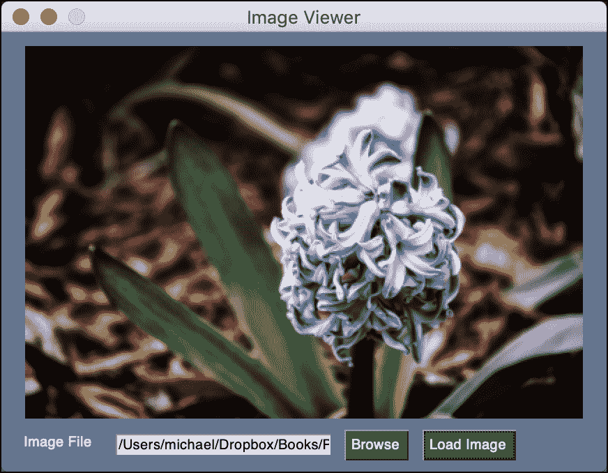
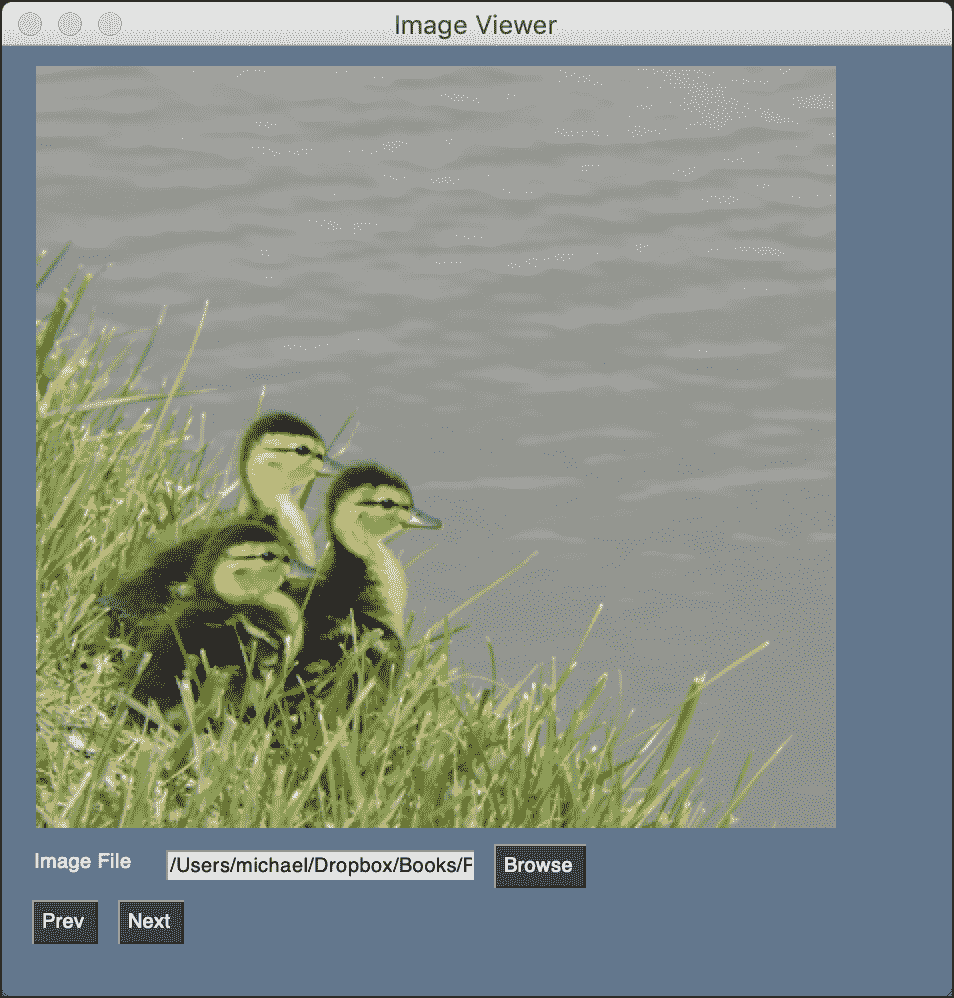

# 使用 PySimpleGUI 创建图像查看器

> 原文：<https://www.blog.pythonlibrary.org/2021/02/16/creating-an-image-viewer-with-pysimplegui/>

PySimpleGUI 使创建应用程序变得容易。在本教程中，您将学习如何使用 PySimpleGUI 创建一个简单的图像查看器。您将使用包装了 Tkinter 的 PySimpleGUI 的常规版本，而不是它的 wxPython 或 PyQt 变体。

我们开始吧！

#### 入门指南

您需要安装 PySimpleGUI，因为它不包含在 Python 中。您还需要 Pillow，因为 Tkinter 只支持 GIF 和 PGM/PPM 图像类型。

幸运的是，您可以使用 pip 轻松安装这两个软件包:

```py
python3 -m pip install PySimpleGUI Pillow
```

现在您已经安装了您的依赖项，您可以创建一个全新的应用程序了！

#### 创建图像查看器

PySimpleGUI 允许您用不到 50 行代码创建一个简单的图像查看器。要了解如何操作，请创建一个新文件并将其命名为 **image_viewer.py** 。然后将以下代码添加到文件中:

```py
# image_viewer.py

import io
import os
import PySimpleGUI as sg
from PIL import Image

file_types = [("JPEG (*.jpg)", "*.jpg"),
              ("All files (*.*)", "*.*")]

def main():
    layout = [
        [sg.Image(key="-IMAGE-")],
        [
            sg.Text("Image File"),
            sg.Input(size=(25, 1), key="-FILE-"),
            sg.FileBrowse(file_types=file_types),
            sg.Button("Load Image"),
        ],
    ]

    window = sg.Window("Image Viewer", layout)

    while True:
        event, values = window.read()
        if event == "Exit" or event == sg.WIN_CLOSED:
            break
        if event == "Load Image":
            filename = values["-FILE-"]
            if os.path.exists(filename):
                image = Image.open(values["-FILE-"])
                image.thumbnail((400, 400))
                bio = io.BytesIO()
                image.save(bio, format="PNG")
                window["-IMAGE-"].update(data=bio.getvalue())

    window.close()

if __name__ == "__main__":
    main()
```

这是一段相当不错的代码。让我们把它分成几个小部分:

```py
# image_viewer.py

import io
import os
import PySimpleGUI as sg
from PIL import Image

file_types = [("JPEG (*.jpg)", "*.jpg"),
              ("All files (*.*)", "*.*")]
```

这是您的初始设置代码。您从 PIL 导入 **PySimpleGUI** 和您需要的模块，并将 file_types 设置为表单中**浏览**按钮的文件选择选项，默认为 JPEG。

现在您已经准备好学习 **main()** 函数了:

```py
def main():
    elements = [
        [sg.Image(key="-IMAGE-")],
        [
            sg.Text("Image File"),
            sg.Input(size=(25, 1), enable_events=True, key="-FILE-"),
            sg.FileBrowse(file_types=file_types),
        ],
    ]

    window = sg.Window("Image Viewer", elements)
```

这是你的`main()`功能。这 11 行代码定义了元素的布局。PySimpleGUI 使用 Python 列表来布局用户界面。在这种情况下，您告诉它您想要在您的`Window`顶部创建一个`Image`小部件。然后，您想在它下面再添加三个小部件。这三个小部件以从左到右的形式水平排列。它们水平排列的原因是因为它们在嵌套列表中。

这三个小部件如下:

*   `Text` -一个标签元素
*   `Input` -文本输入元素
*   `FileBrowse` -打开文件浏览器对话框的按钮

要为一个元素启用事件，可以将`enable_events`参数设置为`True`——这将在元素发生变化时提交一个事件。您禁用了 Input 元素，使其成为只读的，并防止向其中键入内容——每一次按键都是一个单独的事件，您的循环没有为此做好准备。以后需要访问的任何元素都应该有一个名字，这就是`key`参数。这些必须是独一无二的。

要覆盖的最后一段代码是这几行:

```py
    while True:
        event, values = window.read()
        if event == "Exit" or event == sg.WIN_CLOSED:
            break
        if event == "Load Image":
            filename = values["-FILE-"]
            if os.path.exists(filename):
                image = Image.open(values["-FILE-"])
                image.thumbnail((400, 400))
                bio = io.BytesIO()
                image.save(bio, format="PNG")
                window["-IMAGE-"].update(data=bio.getvalue())

    window.close()

if __name__ == "__main__":
    main()
```

这就是在 PySimpleGUI 中创建事件循环的方法。你`read()`的`window`对象为事件和值。您检查`Exit`事件，它在您关闭应用程序时发生。您还要检查`file`事件。这是您之前为`Input`元素定义的`key`名称。当该元素发生事件时，将使用该元素的`key`或名称将其添加到`window`中。

这是该计划的核心所在。当触发`file`事件时，您将通过使用`values`字典上的键进行查找来获取所选择的图像。现在你有了通向图像的路径！你可以用枕头打开图像，然后用`thumbnail()`调整大小。要显示图像，您可以使用`io.BytesIO`将文件转换成字节流，这允许您将图像保存在内存中。然后从内存文件中取出字节数据，并在最后将其传递给`window.update()`方法中的`sg.Image`对象。

最后，通过调用`Image`小部件上的`update()`并传入`PhotoImage`对象来显示图像。你可以通过使用包含在`window`对象中的`image`键来实现。

当您运行这段代码时，您将得到类似这样的结果:


这是图像浏览器在图像未加载时的样子。如果你加载一个图像，它看起来会像这样:



那看起来不是很好吗？在你的电脑上打开一张照片试试吧！

#### 创建图像浏览器

您的应用程序让您通过一次浏览一个文件来不断打开新图像。如果你能让浏览器加载一个图片目录并循环浏览它们，那就太好了。

将您在上一节中学到的内容重写到一个名为 **image_browser.py:** 的新文件中

```py
# image_browser.py

import glob
import PySimpleGUI as sg

from PIL import Image, ImageTk

def parse_folder(path):
    images = glob.glob(f'{path}/*.jpg') + glob.glob(f'{path}/*.png')
    return images

def load_image(path, window):
    try:
        image = Image.open(path)
        image.thumbnail((400, 400))
        photo_img = ImageTk.PhotoImage(image)
        window["image"].update(data=photo_img)
    except:
        print(f"Unable to open {path}!")

def main():
    elements = [
        [sg.Image(key="image")],
        [
            sg.Text("Image File"),
            sg.Input(size=(25, 1), enable_events=True, key="file"),
            sg.FolderBrowse(),
        ],
        [
            sg.Button("Prev"),
            sg.Button("Next")
        ]
    ]

    window = sg.Window("Image Viewer", elements, size=(475, 475))
    images = []
    location = 0

    while True:
        event, values = window.read()
        if event == "Exit" or event == sg.WIN_CLOSED:
            break
        if event == "file":
            images = parse_folder(values["file"])
            if images:
                load_image(images[0], window)
        if event == "Next" and images:
            if location == len(images) - 1:
                location = 0
            else:
                location += 1
            load_image(images[location], window)
        if event == "Prev" and images:
            if location == 0:
                location = len(images) - 1
            else:
                location -= 1
            load_image(images[location], window)

    window.close()

if __name__ == "__main__":
    main()

```

用户选择一个文件夹后，通过使用 Python 的 **glob** 模块在文件夹中搜索 JPG 和 PNG 文件来加载图像。接下来，检查用户是否按下了“下一页”或“上一页”,图像是否已经加载。如果是，那么在加载下一个图像之前，检查您在路径列表中的位置并相应地更新它。

当您运行这段代码时，您的应用程序将如下所示:



现在，您可以使用 PySimpleGUI 轻松浏览整个文件夹。

#### 包扎

PySimpleGUI 使得创建图像应用程序变得非常简单。你可以用很少的代码写一个非常漂亮的小图像浏览器。只要稍加润色，您就可以让这个应用程序变得更加有用。尝试添加菜单栏或工具栏，使打开文件/文件夹更简单。您还可以创建一个支持打开文件和文件夹的应用程序。你还可以添加许多其他功能，但这些都是简单的功能，可以激发你的创造力。开心快乐编码！