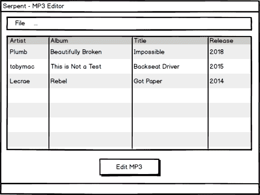
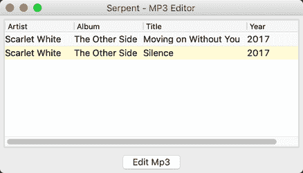
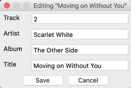
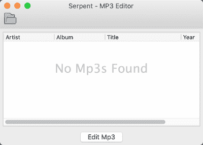

# 用 wxPython 创建 MP3 标记器 GUI

> 原文：<https://www.blog.pythonlibrary.org/2021/09/22/creating-an-mp3-tagger-gui-with-wxpython/>

我不知道你怎么样，但是我喜欢听音乐。作为一个狂热的音乐迷，我也喜欢把我的 CD 翻成 MP3，这样我就可以在旅途中更轻松地听音乐了。仍有许多音乐无法通过数字方式购买。不幸的是，当你翻录大量音乐时，你有时会在 MP3 标签中出现错误。通常，标题中会有拼写错误，或者一首歌没有正确的艺术家标签。虽然您可以使用许多开源和付费程序来标记 MP3 文件，但编写自己的程序也很有趣。

这就是本文的主题。在本文中，您将编写一个简单的 MP3 标签应用程序。此应用程序将允许您查看 MP3 文件的当前标签，并编辑以下标签:

*   艺术家
*   唱片
*   轨道名称
*   曲目编号

冒险的第一步是找到适合这项工作的 Python 包！

## 寻找 MP3 包

有几个 Python 包可以用来编辑 MP3 标签。以下是我在谷歌搜索时发现的一些例子:

*   眼睛 3
*   诱导有机体突变的物质
*   mp3 标签
*   pytaglib

在本章中，你将使用 **eyeD3** 。它有一个非常简单的 API。坦率地说，我发现这些包的大多数 API 都很简短，并不那么有用。然而，eyeD3 的工作方式似乎比我尝试的其他产品更自然一些，这也是它被选中的原因。

对了，包名 eyeD3 指的是 MP3 文件相关元数据的 ID3 规范。

然而，**诱变剂**包绝对是一个很好的后备选择，因为它支持许多其他类型的音频元数据。如果你碰巧在处理 MP3 之外的其他音频文件类型，那么你绝对应该尝试一下诱变剂。

### 安装孔眼 3

eyeD3 包可以和 pip 一起安装。如果你已经为这本书使用了一个虚拟环境(`venv`或`virtualenv`)，确保你在安装 eyeD3:

```py
python3 -m pip install eyeD3
```

一旦你安装了 eyeD3，你可能想看看它的文档:

*   [https://pypi.org/project/eyeD3/](https://pypi.org/project/eyeD3/)

现在让我们开始制作一个整洁的应用程序吧！

## 设计 MP3 标签

你的第一步是弄清楚你想要的用户界面是什么样子的。要制作一个有用的应用程序，您将需要以下特性:

*   导入 MP3 的一些方法
*   显示文件的一些元数据的方法
*   一种编辑元数据的方法

下面是主界面的一个简单模型:



MP3 标签图形用户界面模型

这个用户界面没有显示如何实际编辑 MP3，但它暗示用户需要按下底部的按钮来开始编辑。这似乎是一个合理的开始方式。

先给主界面编码吧！

## 创建主应用程序

现在有趣的部分来了，就是编写实际的应用程序。在这个例子中，您将再次使用`ObjectListView`来显示 MP3 的元数据。从技术上讲，你可以使用 wxPython 的列表控件。如果你想要一个挑战，你应该试着把本章的代码改成使用其中的一个。

注意:本文的代码可以在 [GitHub](https://github.com/driscollis/applications_with_wxpython/tree/master/chapter8_mp3_tagger) 上下载

无论如何，您可以首先创建一个名为 **main.py** 的文件，并输入以下内容:

```py
# main.py

import eyed3
import editor
import glob
import wx

from ObjectListView import ObjectListView, ColumnDefn

class Mp3:

    def __init__(self, id3):
        self.artist = ''
        self.album = ''
        self.title = ''
        self.year = ''

        # Attempt to extract MP3 tags
        if not isinstance(id3.tag, type(None)):
            id3.tag.artist = self.normalize_mp3(
                id3.tag.artist)
            self.artist = id3.tag.artist
            id3.tag.album = self.normalize_mp3(
                id3.tag.album)
            self.album = id3.tag.album
            id3.tag.title = self.normalize_mp3(
                id3.tag.title)
            self.title = id3.tag.title
            if hasattr(id3.tag, 'best_release_date'):
                if not isinstance(
                    id3.tag.best_release_date, type(None)):
                    self.year = self.normalize_mp3(
                        id3.tag.best_release_date.year)
                else:
                    id3.tag.release_date = 2019
                    self.year = self.normalize_mp3(
                        id3.tag.best_release_date.year)
        else:
            tag = id3.initTag()
            tag.release_date = 2019
            tag.artist = 'Unknown'
            tag.album = 'Unknown'
            tag.title = 'Unknown'
        self.id3 = id3
        self.update()

```

这里有你需要的进口货。您还创建了一个名为`Mp3`的类，它将由`ObjectListView`小部件使用。该类中的前四个实例属性是将在应用程序中显示的元数据，默认为字符串。最后一个实例属性`id3`，将是当你加载一个 MP3 文件时从`eyed3`返回的对象。

并非所有的 MP3 都是一样的。有些没有任何标签，有些可能只有部分标签。由于这些问题，您将检查`id3.tag`是否存在。如果没有，那么 MP3 没有标签，您需要调用`id3.initTag()`来添加空白标签。如果`id3.tag`确实存在，那么你需要确保你感兴趣的标签也存在。这就是`if`语句的第一部分在调用`normalize_mp3()`函数时试图做的事情。

这里的另一项是，如果没有设置日期，那么`best_release_date`属性将返回`None`。所以你需要检查一下，如果碰巧是`None`，就把它设置成默认值。

现在让我们继续创建`normalize_mp3()`方法:

```py
def normalize_mp3(self, tag):
    try:
        if tag:
            return tag
        else:
            return 'Unknown'
    except:
        return 'Unknown'

```

这将检查指定的标签是否存在。如果是的话，它只是返回标签的值。如果没有，则返回字符串:“未知”

您需要在`Mp3`类中实现的最后一个方法是`update()`:

```py
def update(self):
    self.artist = self.id3.tag.artist
    self.album = self.id3.tag.album
    self.title = self.id3.tag.title
    self.year = self.id3.tag.best_release_date.year

```

这个方法在类的`__init__()`方法中的外层`else`的末尾被调用。它用于在初始化 MP3 文件的标签后更新实例属性。

这种方法和`__init__()`方法可能会捕捉不到一些边缘情况。我们鼓励您自己增强这些代码，看看是否能够解决这些问题。

现在让我们继续创建一个名为`TaggerPanel`的`wx.Panel`的子类:

```py
class TaggerPanel(wx.Panel):

    def __init__(self, parent):
        super().__init__(parent)
        self.mp3s = []
        main_sizer = wx.BoxSizer(wx.VERTICAL)

        self.mp3_olv = ObjectListView(
            self, style=wx.LC_REPORT | wx.SUNKEN_BORDER)
        self.mp3_olv.SetEmptyListMsg("No Mp3s Found")
        self.update_mp3_info()
        main_sizer.Add(self.mp3_olv, 1, wx.ALL | wx.EXPAND, 5)

        edit_btn = wx.Button(self, label='Edit Mp3')
        edit_btn.Bind(wx.EVT_BUTTON, self.edit_mp3)
        main_sizer.Add(edit_btn, 0, wx.ALL | wx.CENTER, 5)

        self.SetSizer(main_sizer)

```

`TaggerPanel`又好看又短。这里您设置了一个名为`mp3s`的实例属性，它被初始化为一个空列表。这个列表将最终保存你的`Mp3`类的实例列表。您还可以在这里创建您的`ObjectListView`实例，并添加一个用于编辑 MP3 文件的按钮。

说到编辑，让我们创建用于编辑 MP3 的事件处理程序:

```py
def edit_mp3(self, event):
    selection = self.mp3_olv.GetSelectedObject()
    if selection:
        with editor.Mp3TagEditorDialog(selection) as dlg:
            dlg.ShowModal()
            self.update_mp3_info()

```

在这里，您将使用`ObjectListView`小部件中的`GetSelectedObject()`方法来获取您要编辑的选定 MP3。然后你要确保你得到了一个有效的选择，并打开一个编辑器对话框，这个对话框包含在你即将编写的`editor`模块中。该对话框接受一个参数，即`eyed3`对象，您在这里称其为`selection`。

请注意，您需要调用`update_mp3_info()`来应用您在编辑器对话框中对 MP3 标签所做的任何更新。

现在让我们学习如何加载包含 MP3 文件的文件夹:

```py
def load_mp3s(self, path):
    if self.mp3s:
        # clear the current contents
        self.mp3s = []
    mp3_paths = glob.glob(path + '/*.mp3')
    for mp3_path in mp3_paths:
        id3 = eyed3.load(mp3_path)
        mp3_obj = Mp3(id3)
        self.mp3s.append(mp3_obj)
    self.update_mp3_info()

```

在这个例子中，您接受一个文件夹路径，并使用 Python 的`glob`模块来搜索 MP3 文件。假设您找到了这些文件，那么您将循环遍历结果并将它们加载到`eyed3`中。然后创建一个`Mp3`类的实例，这样就可以向用户显示 MP3 的元数据。为此，您调用了`update_mp3_info()`方法。方法开头的`if`语句是用来清除`mp3s`列表的，这样你就不会无限期地追加列表。

现在让我们继续创建`update_mp3_info()`方法:

```py
def update_mp3_info(self):
    self.mp3_olv.SetColumns([
        ColumnDefn("Artist", "left", 100, "artist"),
        ColumnDefn("Album", "left", 100, "album"),
        ColumnDefn("Title", "left", 150, "title"),
        ColumnDefn("Year", "left", 100, "year")
    ])
    self.mp3_olv.SetObjects(self.mp3s)

```

`update_mp3_info()`方法用于向用户显示 MP3 元数据。在这种情况下，您将向用户显示艺术家、专辑名称、曲目名称(标题)以及歌曲发行的年份。为了实际更新小部件，您在最后调用了`SetObjects()`方法。

现在让我们继续创建`TaggerFrame`类:

```py
class TaggerFrame(wx.Frame):

    def __init__(self):
        super().__init__(
            None, title="Serpent - MP3 Editor")
        self.panel = TaggerPanel(self)
        self.create_menu()
        self.Show()

```

在这里，您创建了前面提到的`TaggerPanel`类的一个实例，创建了一个菜单并向用户显示了框架。这也是您设置应用程序初始大小和应用程序标题的地方。只是为了好玩，我称它为**蛇**，但是你可以随意命名这个应用程序。

接下来让我们学习如何创建菜单:

```py
def create_menu(self):
    menu_bar = wx.MenuBar()
    file_menu = wx.Menu()
    open_folder_menu_item = file_menu.Append(
        wx.ID_ANY, 'Open Mp3 Folder', 'Open a folder with MP3s'
    )
    menu_bar.Append(file_menu, '&File')
    self.Bind(wx.EVT_MENU, self.on_open_folder,
              open_folder_menu_item)
    self.SetMenuBar(menu_bar)

```

在这段代码中，您创建了一个 menubar 对象。然后，创建带有单个菜单项的文件菜单，用于打开计算机上的文件夹。这个菜单项被绑定到一个名为`on_open_folder()`的事件处理程序。为了向用户显示菜单，您需要调用框架的`SetMenuBar()`方法。

拼图的最后一块是创建`on_open_folder()`事件处理程序:

```py
def on_open_folder(self, event):
    with wx.DirDialog(self, "Choose a directory:",
                      style=wx.DD_DEFAULT_STYLE,
                      ) as dlg:
        if dlg.ShowModal() == wx.ID_OK:
            self.panel.load_mp3s(dlg.GetPath())

```

您将希望在这里使用 Python 的`with`语句打开一个`wx.DirDialog`,并有模式地向用户显示它。这可以防止用户在选择文件夹时与您的应用程序进行交互。如果用户按下 OK 按钮，您将使用他们选择的路径调用面板实例的`load_mp3s()`方法。

为了完整起见，下面是您将如何运行该应用程序:

```py
if __name__ == '__main__':
    app = wx.App(False)
    frame = TaggerFrame()
    app.MainLoop()

```

您总是需要创建一个`wx.App`实例，以便您的应用程序能够响应事件。

您的应用程序还不会运行，因为您还没有创建`editor`模块。

接下来让我们学习如何做！

## 编辑 MP3

编辑 MP3 是这个应用程序的重点，所以你肯定需要有一个方法来完成它。您可以修改`ObjectListView`小部件，这样您就可以在那里编辑数据，或者您可以打开一个带有可编辑字段的对话框。两者都是有效的方法。对于这个版本的应用程序，您将执行后者。

让我们从创建`Mp3TagEditorDialog`类开始:

```py
# editor.py

import wx

class Mp3TagEditorDialog(wx.Dialog):

    def __init__(self, mp3):
        title = f'Editing "{mp3.id3.tag.title}"'
        super().__init__(parent=None, title=title)

        self.mp3 = mp3
        self.create_ui()

```

在这里，您实例化您的类，并从它的标签中获取 MP3 的标题，使对话框的标题引用您正在编辑的 MP3。然后设置一个实例属性并调用`create_ui()`方法来创建对话框的用户界面。

现在让我们创建对话框的用户界面:

```py
def create_ui(self):
    self.main_sizer = wx.BoxSizer(wx.VERTICAL)

    size = (200, -1)
    track_num = str(self.mp3.id3.tag.track_num[0])
    year = str(self.mp3.id3.tag.best_release_date.year)

    self.track_number = wx.TextCtrl(
        self, value=track_num, size=size)
    self.create_row('Track Number', self.track_number)

    self.artist = wx.TextCtrl(self, value=self.mp3.id3.tag.artist,
                              size=size)
    self.create_row('Artist', self.artist)

    self.album = wx.TextCtrl(self, value=self.mp3.id3.tag.album,
                             size=size)
    self.create_row('Album', self.album)

    self.title = wx.TextCtrl(self, value=self.mp3.id3.tag.title,
                             size=size)
    self.create_row('Title', self.title)

    btn_sizer = wx.BoxSizer()
    save_btn = wx.Button(self, label="Save")
    save_btn.Bind(wx.EVT_BUTTON, self.save)

    btn_sizer.Add(save_btn, 0, wx.ALL, 5)
    btn_sizer.Add(wx.Button(self, id=wx.ID_CANCEL), 0, wx.ALL, 5)
    self.main_sizer.Add(btn_sizer, 0, wx.CENTER)

    self.SetSizerAndFit(self.main_sizer)

```

这里您创建了一系列的`wx.TextCtrl`小部件，并将其传递给一个名为`create_row()`的函数。您还可以在末尾添加“保存”按钮，并将其绑定到`save()`事件处理程序。最后，添加一个“取消”按钮。创建取消按钮的方式有点独特。你需要做的就是给`wx.Button`一个特殊的 id: `wx.ID_CANCEL`。这将为按钮添加正确的标签，并自动让它为您关闭对话框，而无需将其绑定到函数。

这是内置于 wxPython 工具包中的便利函数之一。只要不需要做什么特别的事情，这个功能就很棒。

现在让我们来学习将什么放入`create_row()`方法:

```py
def create_row(self, label, text):
    sizer = wx.BoxSizer(wx.HORIZONTAL)
    row_label = wx.StaticText(self, label=label, size=(50, -1))
    widgets = [(row_label, 0, wx.ALL, 5),
               (text, 0, wx.ALL, 5)]
    sizer.AddMany(widgets)
    self.main_sizer.Add(sizer)

```

在本例中，您创建了一个水平 sizer 和一个带有传入标签的`wx.StaticText`实例。然后将这两个小部件添加到一个元组列表中，其中每个元组都包含需要传递给主 sizer 的参数。这允许您通过`AddMany()`方法一次向 sizer 添加多个小部件。

您需要创建的最后一段代码是`save()`事件处理程序:

```py
def save(self, event):
    current_track_num = self.mp3.id3.tag.track_num
    if current_track_num:
        new_track_num = (int(self.track_number.GetValue()),
                         current_track_num[1])
    else:
        new_track_num = (int(self.track_number.GetValue()), 0)

    artist = self.artist.GetValue()
    album = self.album.GetValue()
    title = self.title.GetValue()

    self.mp3.id3.tag.artist = artist if artist else 'Unknown'
    self.mp3.id3.tag.album = album if album else 'Unknown'
    self.mp3.id3.tag.title = title if title else 'Unknown'
    self.mp3.id3.tag.track_num = new_track_num
    self.mp3.id3.tag.save()
    self.mp3.update()
    self.Close()

```

在这里，您可以检查 MP3 的标签中是否设置了音轨编号。如果是，那么就将其更新为您设置的新值。另一方面，如果没有设置轨道号，那么您需要自己创建元组。元组中的第一个数字是曲目号，第二个数字是专辑中曲目的总数。如果没有设置轨道号，那么您就不能通过编程方式可靠地知道轨道的总数，所以您只需在默认情况下将其设置为零。

剩下的功能是将各种 MP3 对象的标签属性设置为对话框的文本控件中的内容。一旦所有的属性都设置好了，你就可以调用`eyed3` MP3 对象上的`save()`方法，告诉`Mp3`类实例更新自己并关闭对话框。请注意，如果您试图为`artist`、`album`或`title`传入一个空值，它将被替换为字符串`Unknown`。

现在你已经有了所有你需要的部分，你应该可以运行程序了。

下面是主应用程序在我的机器上的样子:



MP3 标记图形用户界面

这是编辑器对话框的样子:



MP3 编辑器对话框

现在让我们学习如何给你的程序增加一些增强功能！

## 添加新功能

这种类型的大多数应用程序都允许用户将文件或文件夹拖放到上面。除了菜单之外，它们通常还有一个打开文件夹的工具栏。在前一章中，您已经学习了如何做到这两点。现在，您也要将这些特性添加到这个程序中。

让我们从创建我们的`DropTarget`类到 **main.py** 开始:

```py
import os

class DropTarget(wx.FileDropTarget):

    def __init__(self, window):
        super().__init__()
        self.window = window

    def OnDropFiles(self, x, y, filenames):
        self.window.update_on_drop(filenames)
        return True

```

添加拖放功能需要您子类化`wx.FileDropTarget`。您还需要传入将成为拖放目标的小部件。在这种情况下，您希望将`wx.Panel`作为放置目标。然后你覆盖`OnDropFiles`以便它调用`update_on_drop()`方法。这是一个新方法，您将很快添加它。

但是在这之前，您需要更新您的`TaggerPanel`类的开头:

```py
class TaggerPanel(wx.Panel):

    def __init__(self, parent):
        super().__init__(parent)
        self.mp3s = []
        drop_target = DropTarget(self)
        self.SetDropTarget(drop_target)
        main_sizer = wx.BoxSizer(wx.VERTICAL)      

```

这里您创建了一个`DropTarget`的实例，然后通过`SetDropTarget()`方法将面板设置为放置目标。这样做的好处是，现在你可以拖放文件或文件夹在你的应用程序的任何地方，它会工作。

请注意，上面的代码并不是`__init__()`方法的完整代码，只是显示了上下文中的变化。完整版见 Github 上的源代码。

第一个要研究的新方法是`add_mp3()`:

```py
def add_mp3(self, path):
    id3 = eyed3.load(path)
    mp3_obj = Mp3(id3)
    self.mp3s.append(mp3_obj)

```

在这里，您可以传递想要添加到用户界面的 MP3 文件的路径。它将采用该路径并加载`eyed3`并将它添加到您的`mp3s`列表中。

这个版本的应用程序没有改变`edit_mp3()`方法，所以这里不再赘述。

现在让我们继续创建另一个新方法`find_mp3s()`:

```py
def find_mp3s(self, folder):
    mp3_paths = glob.glob(folder + '/*.mp3')
    for mp3_path in mp3_paths:
        self.add_mp3(mp3_path)

```

这段代码和`add_mp3s()`方法中的代码对您来说可能有点熟悉。它最初来自您之前创建的`load_mp3()`方法。您正在将这段代码移动到它自己的函数中。这就是所谓的**重构**你的代码。重构代码有很多原因。在这种情况下，您这样做是因为您需要从多个地方调用这个函数。与其将这段代码复制到多个函数中，不如将它分离到自己可以调用的函数中。

现在让我们更新`load_mp3s()`方法，以便它调用上面的新方法:

```py
def load_mp3s(self, path):
    if self.mp3s:
        # clear the current contents
        self.mp3s = []
    self.find_mp3s(path)
    self.update_mp3_info()

```

这个方法已经减少到两行代码。第一个调用您刚刚编写的`find_mp3s()`方法，而第二个调用`update_mp3_info()`，这将更新用户界面(即`ObjectListView`小部件)。

`DropTarget`类正在调用`update_on_drop()`方法，所以现在让我们这样写:

```py
def update_on_drop(self, paths):
    for path in paths:
        if os.path.isdir(path):
            self.load_mp3s(path)
        elif os.path.isfile(path):
            self.add_mp3(path)
            self.update_mp3_info()

```

`update_on_drop()`方法是您之前进行重构的原因。它还需要调用`load_mp3s()`，但是只有当传入的路径被确定为目录时。否则，检查路径是否是一个文件并加载它。

但是等等！上面的代码有问题。你能说出这是什么吗？

问题是当路径是一个文件时，你不会检查它是否是一个 MP3。如果按原样运行这段代码，将会引发一个异常，因为`eyed3`包无法将所有文件类型转换成 Mp3 对象。

让我们来解决这个问题:

```py
def update_on_drop(self, paths):
    for path in paths:
        _, ext = os.path.splitext(path)
        if os.path.isdir(path):
            self.load_mp3s(path)
        elif os.path.isfile(path) and ext.lower() == '.mp3':
            self.add_mp3(path)
            self.update_mp3_info()

```

您可以使用 Python 的`os`模块通过`splitext()`函数获得文件的扩展名。它将返回一个包含两项的元组:文件的路径和扩展名。

现在您已经有了扩展，您可以检查它是否是`.mp3`，如果是，只更新 UI。顺便说一下，当您向函数传递一个目录路径时，`splitext()`函数会返回一个空字符串。

您需要更新的下一段代码是`TaggerFrame`类，以便您可以添加一个工具栏:

```py
class TaggerFrame(wx.Frame):

    def __init__(self):
        super().__init__(
            None, title="Serpent - MP3 Editor")
        self.panel = TaggerPanel(self)
        self.create_menu()
        self.create_tool_bar()
        self.Show()

```

上面代码的唯一变化是添加了对`create_tool_bar()`方法的调用。您几乎总是希望用单独的方法创建工具栏，因为通常每个工具栏按钮都有几行代码。对于工具栏中有许多按钮的应用程序，您可能应该将这些代码分离出来，放到一个单独的类或模块中。

让我们继续编写这个方法:

```py
def create_tool_bar(self):
    self.toolbar = self.CreateToolBar()

    add_folder_ico = wx.ArtProvider.GetBitmap(
        wx.ART_FOLDER_OPEN, wx.ART_TOOLBAR, (16, 16))
    add_folder_tool = self.toolbar.AddTool(
        wx.ID_ANY, 'Add Folder', add_folder_ico,
        'Add a folder to be archived')
    self.Bind(wx.EVT_MENU, self.on_open_folder,
              add_folder_tool)
    self.toolbar.Realize()

```

为了简单起见，您添加了一个工具栏按钮，它将通过`on_open_folder()`方法打开一个目录对话框。

当您运行这段代码时，更新后的应用程序应该如下所示:



MP3 标记图形用户界面(空)

随意添加更多的工具栏按钮，菜单项，状态栏或其他有趣的增强功能。

## 包扎

本文向您介绍了一些 Python 的 MP3 相关包，您可以用它们来编辑 MP3 标签以及其他音乐文件格式的标签。您了解了如何创建一个漂亮的主应用程序来打开编辑对话框。主应用程序可用于向用户显示相关的 MP3 元数据。如果用户决定编辑一个或多个标签，它还可以向用户显示他们的更新。

wxPython tookit 支持播放某些类型的音频文件格式，包括 MP3。您可以使用这些功能创建一个 MP3 播放器，并使该应用程序成为其中的一部分。

## 下载源代码

您可以在 [GitHub](https://github.com/driscollis/applications_with_wxpython/tree/master/chapter8_mp3_tagger) 上下载本文中示例的源代码

## 相关文章

想了解更多关于 wxPython 的内容吗？查看以下文章:

*   [用 wxPython 创建一个简单的向导(视频)](https://www.blog.pythonlibrary.org/2021/09/10/creating-a-simple-wizard-with-wxpython-video/)
*   [用 wxPython 创建文件搜索 GUI](https://www.blog.pythonlibrary.org/2021/09/02/creating-a-file-search-gui-with-wxpython/)

*   [用 wxPython 为 NASA 的 API 创建 GUI 应用](https://www.blog.pythonlibrary.org/2019/04/18/creating-a-gui-application-for-nasas-api-with-wxpython/)