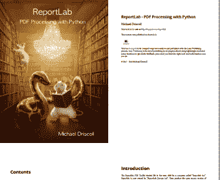

# 使用 pdfrw 创建和操作 pdf

> 原文：<https://www.blog.pythonlibrary.org/2018/06/06/creating-and-manipulating-pdfs-with-pdfrw/>

帕特里克·莫平创建了一个他称之为 **pdfrw** 的包，并于 2012 年发布。pdfrw 包是一个纯 Python 库，可以用来读写 PDF 文件。在撰写本文时，pdfrw 的版本是 0.4。在该版本中，它支持在 pdf 中设置子集、合并、旋转和修改数据。自 2010 年以来，pdfrw 包一直被 rst2pdf 包(见第 18 章)使用，因为 pdfrw 可以“忠实地再现矢量格式，而无需光栅化”。您还可以将 pdfrw 与 ReportLab 结合使用，以便在您使用 ReportLab 创建的新 pdf 中重用现有 pdf 的某些部分。

在本文中，我们将学习如何执行以下操作:

*   从 PDF 中提取某些类型的信息
*   分割 pdf
*   合并/连接 pdf
*   旋转页面
*   创建覆盖或水印
*   缩放页面
*   结合使用 pdfrw 和 ReportLab

我们开始吧！

**注:本文基于我的书， [ReportLab:用 Python 处理 PDF](https://leanpub.com/reportlab)。代码可以在 [GitHub](https://github.com/driscollis/reportlabbookcode/tree/master/chapter15_pdfrw) 上找到。**

* * *

### 装置

如您所料，您可以使用 pip 安装 pdfrw。让我们完成这项工作，然后开始使用 pdfrw:

```py
python -m pip install pdfrw

```

现在我们已经安装了 pdfrw，让我们学习如何从我们的 pdf 中提取一些信息。

* * *

### 从 PDF 中提取信息

pdfrw 包提取数据的方式与 PyPDF2 不同。如果您过去使用过 PyPDF2，那么您可能还记得 PyPDF2 让您提取一个文档信息对象，您可以用它来提取诸如作者、标题等信息。虽然 pdfrw 允许您获取 Info 对象，但它以一种不太友好的方式显示它。让我们来看看:

注意:我在这个例子中使用了美国国税局的标准 [W9 表格](https://www.irs.gov/pub/irs-pdf/fw9.pdf)。

```py
# reader.py

from pdfrw import PdfReader

def get_pdf_info(path):
    pdf = PdfReader(path)

    print(pdf.keys())
    print(pdf.Info)
    print(pdf.Root.keys())
    print('PDF has {} pages'.format(len(pdf.pages)))

if __name__ == '__main__':
    get_pdf_info('w9.pdf')

```

这里我们导入 pdfrw 的 **PdfReader** 类，并通过传入我们想要读取的 PDF 文件的路径来实例化它。然后我们提取 PDF 对象的键、信息对象和根。我们还获取文档中有多少页。运行这段代码的结果如下:

```py
['/ID', '/Root', '/Info', '/Size']
{'/Author': '(SE:W:CAR:MP)',
 '/CreationDate': "(D:20171109144422-05'00')",
 '/Creator': '(Adobe LiveCycle Designer ES 9.0)',
 '/Keywords': '(Fillable)',
 '/ModDate': "(D:20171109144521-05'00')",
 '/Producer': '(Adobe LiveCycle Designer ES 9.0)',
 '/SPDF': '(1112)',
 '/Subject': '(Request for Taxpayer Identification Number and Certification)',
 '/Title': '(Form W-9 \\(Rev. November 2017\\))'}
['/Pages', '/Perms', '/MarkInfo', '/Extensions', '/AcroForm', '/Metadata', '/Type', '/Names', '/StructTreeRoot']
PDF has 6 pages

```

如果您对我在这篇文章的源代码中包含的**reportlab-sample.pdf**文件运行这个命令，您会发现返回的作者名是“”，而不是“迈克尔·德里斯科尔”。我还没有弄清楚这到底是为什么，但是我假设 PyPDF2 对 PDF 预告片信息做了一些额外的数据处理，而 pdfrw 目前没有这样做。

* * *

### 剧烈的

您也可以使用 PDF wr 来分割 PDF。例如，您可能出于某种原因想要拿掉一本书的封面，或者您只想将一本书的章节提取到多个 pdf 中，而不是将它们存储在一个文件中。这对于 pdfrw 来说相当简单。对于这个例子，我们将使用我的 ReportLab 书的样本章节 PDF，你可以在 [Leanpub](https://leanpub.com/reportlab) 上下载。

```py
# splitter.py

from pdfrw import PdfReader, PdfWriter

def split(path, number_of_pages, output):
    pdf_obj = PdfReader(path)
    total_pages = len(pdf_obj.pages)

    writer = PdfWriter()

    for page in range(number_of_pages):
        if page <= total_pages:
            writer.addpage(pdf_obj.pages[page])

    writer.write(output)

if __name__ == '__main__':
    split('reportlab-sample.pdf', 10, 'subset.pdf')

```

这里我们创建一个名为 **split** 的函数，它接受一个输入 PDF 文件路径、您想要提取的页数和输出路径。然后我们使用 pdfrw 的 **PdfReader** 类打开文件，并从输入的 PDF 中获取总页数。然后我们创建一个 **PdfWriter** 对象，并在我们传入的页面范围内循环。在每次迭代中，我们试图从输入 PDF 中提取一个页面，并将该页面添加到我们的 writer 对象中。最后，我们将提取的页面写入磁盘。

* * *

### 合并/连接

pdfrw 包使得合并多个 pdf 文件变得非常容易。让我们写一个简单的例子来演示如何做:

```py
# concatenator.py

from pdfrw import PdfReader, PdfWriter, IndirectPdfDict

def concatenate(paths, output):
    writer = PdfWriter()

    for path in paths:
        reader = PdfReader(path)
        writer.addpages(reader.pages)

    writer.trailer.Info = IndirectPdfDict(
        Title='Combined PDF Title',
        Author='Michael Driscoll',
        Subject='PDF Combinations',
        Creator='The Concatenator'
    )

    writer.write(output)

if __name__ == '__main__':
    paths = ['reportlab-sample.pdf', 'w9.pdf']
    concatenate(paths, 'concatenate.pdf')

```

在这个例子中，我们创建了一个名为 **concatenate** 的函数，它接受我们想要连接在一起的 pdf 的路径列表和输出路径。然后遍历这些路径，打开文件，通过 writer 的 **addpages** 方法将所有页面添加到 writer 对象中。只是为了好玩，我们还导入了 **IndirectPdfDict** ，这允许我们向 PDF 添加一些预告片信息。在这种情况下，我们向 PDF 添加标题、作者、主题和创建者脚本信息。然后，我们将连接的 PDF 写到磁盘上。

* * *

### 轮流

pdfrw 包也支持旋转 PDF 的页面。因此，如果您碰巧有一个以奇怪的方式保存的 PDF，或者一个实习生颠倒地扫描了一些文档，那么您可以使用 pdfrw(或 PyPDF2)来修复 PDF。请注意，在 pdfrw 中，您必须以可被 90 度整除的增量顺时针旋转。

对于这个例子，我创建了一个函数，它将从输入 PDF 中提取所有奇数页，并将它们旋转 90 度:

```py
# rotator.py

from pdfrw import PdfReader, PdfWriter, IndirectPdfDict

def rotate_odd(path, output):
    reader = PdfReader(path)
    writer = PdfWriter()
    pages = reader.pages

    for page in range(len(pages)):
        if page % 2:
            pages[page].Rotate = 90
            writer.addpage(pages[page])

    writer.write(output)

if __name__ == '__main__':
    rotate_odd('reportlab-sample.pdf', 'rotate_odd.pdf')

```

在这里，我们只需打开目标 PDF 并创建一个 writer 对象。然后我们抓取所有的页面，并对它们进行迭代。如果页面是奇数页，我们旋转它，然后将该页面添加到 writer 对象中。这段代码在我的机器上运行得相当快，输出结果如您所料。

* * *

### 覆盖/水印页面

您可以使用 pdfrw 为您的 PDF 添加某种信息的水印。例如，您可能希望在 PDF 中添加买家的电子邮件地址或您的徽标。您也可以将一个 PDF 覆盖在另一个 PDF 上。实际上，我们将在第 17 章中使用覆盖技术来填写 PDF 表单。

让我们创建一个简单的 watermarker 脚本来演示如何使用 pdfrw 将一个 PDF 叠加到另一个之上。

```py
# watermarker.py

from pdfrw import PdfReader, PdfWriter, PageMerge

def watermarker(path, watermark, output):
    base_pdf = PdfReader(path)
    watermark_pdf = PdfReader(watermark)
    mark = watermark_pdf.pages[0]

    for page in range(len(base_pdf.pages)):
        merger = PageMerge(base_pdf.pages[page])
        merger.add(mark).render()

    writer = PdfWriter()
    writer.write(output, base_pdf)

if __name__ == '__main__':
    watermarker('reportlab-sample.pdf',
                'watermark.pdf',
                'watermarked-test.pdf')

```

这里我们创建一个简单的 **watermarker** 函数，它接受一个输入 PDF 路径、包含水印的 PDF 和最终结果的输出路径。然后我们打开基础 PDF 和水印 PDF。我们提取水印页面，然后迭代基本 PDF 中的页面。在每次迭代中，我们使用当前的基本 PDF 页面创建一个**页面合并**对象。然后，我们将水印覆盖在该页面的顶部，并渲染它。循环完成后，我们创建一个 PdfWriter 对象，并将合并的 PDF 写入磁盘。

* * *

### 缩放比例

pdfrw 包也可以在内存中操作 pdf。事实上，它将允许您创建 XObjects 的表单**。这些对象可以代表 PDF 中的任何页面或矩形。这意味着一旦你创建了这些对象中的一个，你就可以缩放、旋转和定位页面或子页面。pdfrw Github 页面上有一个有趣的例子，叫做 **4up.py** ，它从 PDF 中提取页面，将其缩小到原来大小的四分之一，并将四页放在一页中。**

以下是我的版本:

```py
# scaler.py

from pdfrw import PdfReader, PdfWriter, PageMerge

def get4(srcpages):
    scale = 0.5
    srcpages = PageMerge() + srcpages
    x_increment, y_increment = (scale * i for i in srcpages.xobj_box[2:])
    for i, page in enumerate(srcpages):
        page.scale(scale)
        page.x = x_increment if i & 1 else 0
        page.y = 0 if i & 2 else y_increment
    return srcpages.render()

def scale_pdf(path, output):
    pages = PdfReader(path).pages
    writer = PdfWriter(output)
    scaled_pages = 4

    for i in range(0, len(pages), scaled_pages):
        four_pages = get4(pages[i: i + 4])
        writer.addpage(four_pages)

    writer.write()

if __name__ == '__main__':
    scale_pdf('reportlab-sample.pdf', 'four-page.pdf')

```

**get4** 函数来自 **4up.py** 脚本。该函数获取一系列页面，并使用 pdfrw 的 **PageMerge** 类将这些页面合并在一起。我们基本上是在传入的页面上循环，将它们缩小一点，然后将它们放置在页面上，并在一个页面上呈现页面系列。

下一个函数是 **scale_pdf** ，它接受输入 pdf 和输出路径。然后，我们从输入文件中提取页面并创建一个 writer 对象。接下来，我们一次遍历输入文档 4 的页面，并将它们传递给**get4**函数。然后，我们将该函数的结果添加到我们的 writer 对象中。

最后，我们将文档写到磁盘上。下面是一个截图，显示了它的样子:

[](https://www.blog.pythonlibrary.org/wp-content/uploads/2018/06/four-page.png)

现在让我们学习如何将 pdfrw 与 ReportLab 结合起来！

* * *

### 结合 pdfrw 和 ReportLab

pdfrw 的一个优秀特性是它能够与 ReportLab 工具包集成。pdfrw Github 页面上有几个例子，展示了两个包一起使用的不同方式。pdfrw 的创建者认为您可以模拟 ReportLab 的一些 **pagecatcher** 功能，这是 ReportLab 付费产品的一部分。不知道有没有，但是你绝对可以用 pdfrw 和 ReportLab 做一些好玩的事情。

例如，您可以使用 pdfrw 从预先存在的 PDF 中读入页面，并将它们转换为可以在 ReportLab 中写出的对象。让我们编写一个脚本，使用 pdfrw 和 ReportLab 创建 PDF 的子集。以下示例基于 pdfrw 项目中的一个示例:

```py
# split_with_rl.py

from pdfrw import PdfReader
from pdfrw.buildxobj import pagexobj
from pdfrw.toreportlab import makerl

from reportlab.pdfgen.canvas import Canvas

def split(path, number_of_pages, output):
    pdf_obj = PdfReader(path)

    my_canvas = Canvas(output)

    # create page objects
    pages = pdf_obj.pages[0: number_of_pages]
    pages = [pagexobj(page) for page in pages]

    for page in pages:
        my_canvas.setPageSize((page.BBox[2], page.BBox[3]))
        my_canvas.doForm(makerl(my_canvas, page))
        my_canvas.showPage()

    # write the new PDF to disk
    my_canvas.save()

if __name__ == '__main__':
    split('reportlab-sample.pdf', 10, 'subset-rl.pdf')

```

这里我们引入了一些新的功能。首先我们导入 **pagexobj** ，它将从你给它的视图中创建一个**表单 XObject】。视图默认为整个页面，但是您可以告诉 pdfrw 只提取页面的一部分。接下来，我们导入 **makerl** 函数，该函数将获取一个 ReportLab 画布对象和一个 pdfrw Form XObject，并将其转换为 ReportLab 可以添加到其画布对象的表单。**

所以让我们稍微检查一下这段代码，看看它是如何工作的。这里我们创建了一个 reader 对象和一个 canvas 对象。然后我们创建一个表单 XForm 对象列表，从指定的第一页到最后一页。请注意，我们不会检查我们是否要求了太多的页面，所以我们可以做一些事情来增强这个脚本，使它不太可能失败。

接下来，我们迭代刚刚创建的页面，并将它们添加到 ReportLab 画布中。您会注意到，我们使用 pdfrw 的 **BBox** 属性提取的宽度和高度来设置页面大小。然后，我们将表单 XObjects 添加到画布中。对**showPage**的调用告诉 ReportLab 您已经完成了一个页面的创建，并开始创建一个新页面。最后，我们将新的 PDF 保存到磁盘。

pdfrw 的网站上还有一些其他的例子，您应该看看。例如，有一段简洁的代码显示了如何从预先存在的 PDF 中提取一个页面，并将其用作在 ReportLab 中创建的新 PDF 的背景。还有一个非常有趣的缩放示例，您可以使用 pdfrw 和 ReportLab 来缩小页面，就像我们单独使用 pdfrw 一样。

* * *

### 包扎

pdfrw 包实际上非常强大，具有 PyPDF2 所没有的特性。它与 ReportLab 集成的能力是我认为非常有趣的一个特性，可以用来创造一些原创的东西。您还可以使用 PDFrw 做许多我们可以用 PyPDF2 做的事情，例如分割、合并、旋转和连接 pdf。实际上，我认为 PDFrw 在生成可行的 pdf 方面比 PyPDF2 更健壮，但是我没有进行大量的测试来证实这一点。

无论如何，我相信 pdfrw 值得添加到您的工具包中。

* * *

### 相关阅读

*   [pdfrw](https://github.com/pmaupin/pdfrw) 的 Github 页面
*   pdfrw 简介
*   Pdfrw 和 PDF 表单:[使用 Python 填充它们](https://sigmoidal.io/pdfrw-explained/)