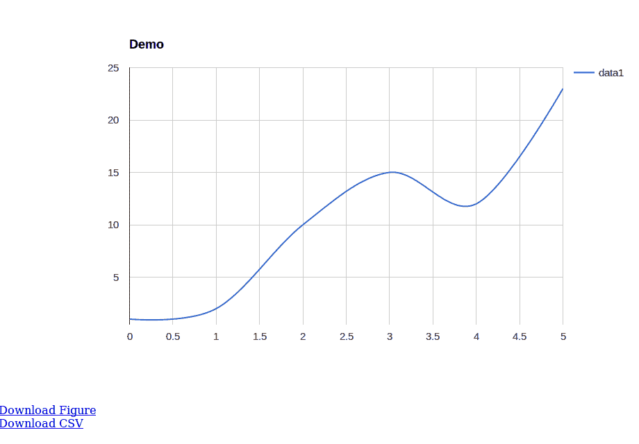
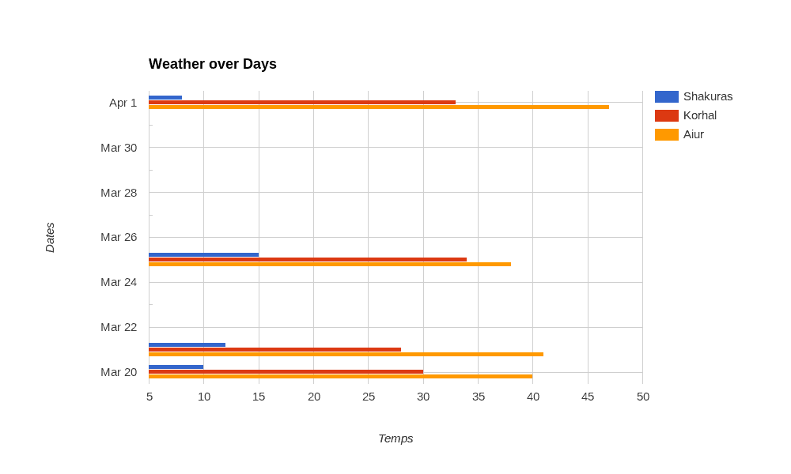
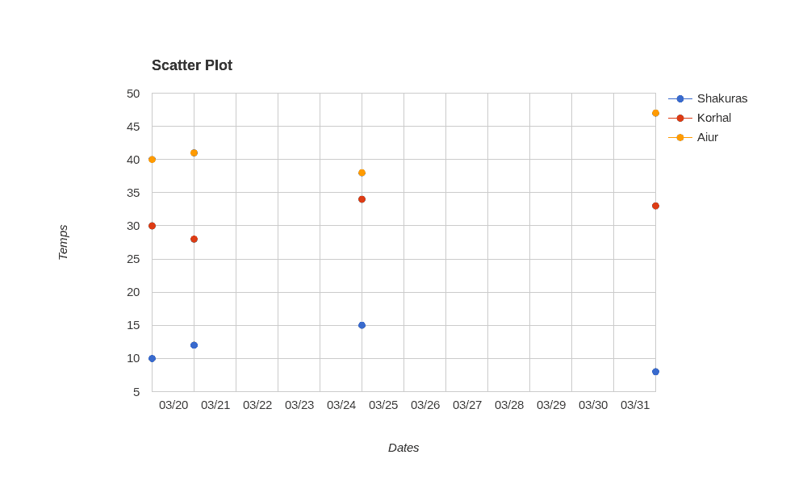
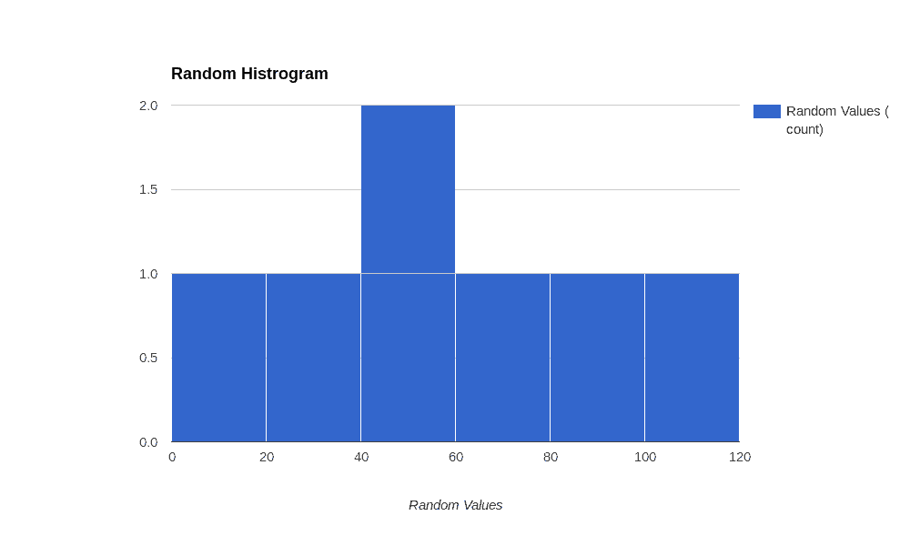

# 使用 Python 和 GooPyCharts 创建图表

> 原文：<https://www.blog.pythonlibrary.org/2016/10/26/creating-graphs-with-python-and-goopycharts/>

整个夏天，我遇到了一个有趣的绘图库，名为 [GooPyCharts](https://github.com/Dfenestrator/GooPyCharts) ，它是 Google Charts API 的 Python 包装器。在本文中，我们将花几分钟时间学习如何使用这个有趣的包。GooPyCharts 遵循类似于 MATLAB 的语法，实际上是 matplotlib 的替代方案。

要安装 GooPyCharts，您需要做的就是像这样使用 pip:

```py

pip install gpcharts

```

现在我们已经安装好了，我们可以试一试了！

* * *

### 我们的第一张图表

使用 GooPyCharts 创建图表或图形非常容易。事实上，您可以用 3 行代码创建一个简单的图形:

```py

>>> from gpcharts import figure
>>> my_plot = figure(title='Demo')
>>> my_plot.plot([1, 2, 10, 15, 12, 23])

```

如果运行此代码，您应该会看到默认浏览器弹出窗口，显示如下图像:



您会注意到，您可以下载 PNG 格式的图表，也可以将制作图表的数据保存为 CSV 文件。GooPyCharts 还集成了 Jupyter 笔记本。

* * *

### 创建条形图

GooPyCharts 包有一个很好的 **testGraph.py** 脚本来帮助你学习如何使用这个包。不幸的是，它实际上并没有展示不同类型的图表。所以我从那里拿了一个例子，并修改它来创建一个条形图:

```py

from gpcharts import figure

fig3 = figure()
xVals = ['Temps','2016-03-20','2016-03-21','2016-03-25','2016-04-01']
yVals = [['Shakuras','Korhal','Aiur'],[10,30,40],[12,28,41],[15,34,38],[8,33,47]]

fig3.title = 'Weather over Days'
fig3.ylabel = 'Dates'
fig3.bar(xVals, yVals)

```

您会注意到，在这个例子中，我们使用 figure 实例的 **title** 属性来创建标题。我们也以同样的方式设置了 **ylabel** 。您还可以看到如何定义图表的日期，以及如何使用嵌套列表设置自动图例。最后你可以看到，我们需要调用**条形图**来生成条形图，而不是调用**图**。结果如下:



### 创建其他类型的图表

让我们再修改一下代码，看看能否创建其他类型的图形。我们将从散点图开始:

```py

from gpcharts import figure

my_fig = figure()
xVals = ['Dates','2016-03-20','2016-03-21','2016-03-25','2016-04-01']
yVals = [['Shakuras','Korhal','Aiur'],[10,30,40],[12,28,41],[15,34,38],[8,33,47]]

my_fig.title = 'Scatter Plot'
my_fig.ylabel = 'Temps'

my_fig.scatter(xVals, yVals)

```

在这里，我们可以使用上一个示例中使用的大部分数据。我们只需要修改一些值来使 X 和 Y 标签正确工作，我们需要用一些有意义的东西来给图表命名。当您运行这段代码时，您应该会看到类似这样的内容:



这很简单。让我们试着创建一个快速而肮脏的直方图:

```py

from gpcharts import figure

my_fig = figure()
my_fig.title = 'Random Histrogram'
my_fig.xlabel = 'Random Values'
vals = [10, 40, 30, 50, 80, 100, 65]
my_fig.hist(vals)

```

直方图比我们创建的最后两个图表简单得多，因为它只需要一个值列表就可以成功创建。这是我运行代码时得到的结果:



这是一个看起来很无聊的直方图，但是修改它并添加一组更真实的数据是非常容易的。

* * *

### 包扎

虽然这只是对一些 GooPyCharts 功能的快速浏览，但我认为我们已经对这个图表包的功能有了很好的了解。它真的很容易使用，但只有一个小的图表集工作。PyGal 、Bokeh 和 [matplotlib](http://matplotlib.org/) 有许多他们可以创建的其他类型的图表。然而，如果你正在寻找一个超级容易安装和使用的东西，并且你不介意它支持的小图表集，那么 GooPyCharts 可能就是适合你的软件包！

* * *

### 相关阅读

*   Python: [用散景可视化](https://www.blog.pythonlibrary.org/2016/07/27/python-visualization-with-bokeh/)
*   [使用烧瓶中的 pyGal 图](https://www.blog.pythonlibrary.org/2015/04/16/using-pygal-graphs-in-flask/)
*   wxPython: PyPlot - [用 Python 绘制的图形](https://www.blog.pythonlibrary.org/2010/09/27/wxpython-pyplot-graphs-with-python/)