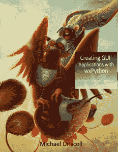

# 使用 wxPython Kickstarter 创建 GUI 应用程序

> 原文：<https://www.blog.pythonlibrary.org/2019/01/14/creating-gui-applications-with-wxpython-kickstarter/>

我很高兴地宣布我最新的图书项目，**用 wxPython** 创建 GUI 应用程序，我正在为它在 [Kickstarter 上开展活动](https://www.kickstarter.com/projects/34257246/create-gui-applications-with-python-wxpython)。

用 wxPython 创建 GUI 应用程序是一本教你如何使用 wxPython 通过实际创建几个小程序来创建应用程序的书。我发现，虽然学习 wxPython 中各种小部件的工作方式是有价值的，但通过创建一个简单的应用程序来学习更好。

本书中的代码将只针对使用 wxPython 4 的 Python 3。

更多信息，请查看 [Kickstarter](https://www.kickstarter.com/projects/34257246/create-gui-applications-with-python-wxpython) 。