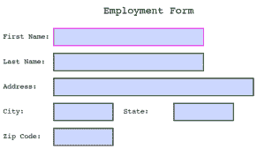

# 使用 Python 在 ReportLab 中创建交互式 PDF 表单

> 原文：<https://www.blog.pythonlibrary.org/2018/05/29/creating-interactive-pdf-forms-in-reportlab-with-python/>

ReportLab 工具包允许您创建交互式可填充表单。PDF 标准实际上有相当丰富的交互元素。ReportLab 并不支持所有这些元素，但它涵盖了其中的大部分。在本节中，我们将了解以下小部件:

*   检验盒
*   收音机
*   选择
*   列表框
*   文本字段

所有这些小部件都是通过调用 **canvas.acroform** 属性上的各种方法创建的。请注意，每个文档只能有一个表单。让我们来看看 ReportLab 支持的小部件！

* * *

### 检验盒

**复选框**小部件就像它听起来的那样。这是一个你可以检查的小盒子。尽管 ReportLab 支持几种不同的“检查”样式，所以当复选框被选中时，根据您设置的样式，它看起来会有所不同。

现在让我们写一个简单的例子来演示这些参数是如何工作的:

```py
# simple_checkboxes.py

from reportlab.pdfgen import canvas
from reportlab.pdfbase import pdfform
from reportlab.lib.colors import magenta, pink, blue, green

def create_simple_checkboxes():
    c = canvas.Canvas('simple_checkboxes.pdf')

    c.setFont("Courier", 20)
    c.drawCentredString(300, 700, 'Pets')
    c.setFont("Courier", 14)
    form = c.acroForm

    c.drawString(10, 650, 'Dog:')
    form.checkbox(name='cb1', tooltip='Field cb1',
                  x=110, y=645, buttonStyle='check',
                  borderColor=magenta, fillColor=pink, 
                  textColor=blue, forceBorder=True)

    c.drawString(10, 600, 'Cat:')
    form.checkbox(name='cb2', tooltip='Field cb2',
                  x=110, y=595, buttonStyle='cross',
                  borderWidth=2, forceBorder=True)

    c.drawString(10, 550, 'Pony:')
    form.checkbox(name='cb3', tooltip='Field cb3',
                  x=110, y=545, buttonStyle='star',
                  borderWidth=1, forceBorder=True)

    c.drawString(10, 500, 'Python:')
    form.checkbox(name='cb4', tooltip='Field cb4',
                  x=110, y=495, buttonStyle='circle',
                  borderWidth=3, forceBorder=True)

    c.drawString(10, 450, 'Hamster:')
    form.checkbox(name='cb5', tooltip='Field cb5',
                  x=110, y=445, buttonStyle='diamond',
                  borderWidth=None,
                  checked=True,
                  forceBorder=True)

    c.save()

if __name__ == '__main__':
    create_simple_checkboxes()

```

如您所见，我们设置了名称并设置了工具提示，以基本上匹配小部件的名称。然后我们设置它的位置和其他一些东西。您可以调整复选框边框的宽度，或者关闭边框。如果你关闭它，复选框可能会变得不可见，所以你可能想通过 fillColor 设置它的背景颜色。我为每个复选框设置了不同的 buttonStyle。下面是我运行代码时得到的结果:


如果您打开文档并选中所有复选框，您将看到它们如下所示:


现在让我们来了解一下 radio 小部件！

* * *

### 收音机

单选按钮小部件有点像复选框，只是通常你把单选按钮放在一个组中，在这个组中只能选择一个单选按钮。复选框很少被限制为每个组只允许一个复选框。ReportLab 似乎没有办法明确地将一组单选按钮组合在一起。这似乎只是隐性的。换句话说，如果您一个接一个地创建一系列收音机，它们将被组合在一起。

现在，让我们花点时间来创建一个简单的 radio 小部件演示:

```py
# simple_radios.py

from reportlab.pdfgen import canvas
from reportlab.pdfbase import pdfform
from reportlab.lib.colors import magenta, pink, blue, green

def create_simple_radios():
    c = canvas.Canvas('simple_radios.pdf')

    c.setFont("Courier", 20)
    c.drawCentredString(300, 700, 'Radio demo')
    c.setFont("Courier", 14)
    form = c.acroForm

    c.drawString(10, 650, 'Dog:')
    form.radio(name='radio1', tooltip='Field radio1',
               value='value1', selected=False,
               x=110, y=645, buttonStyle='check',
               borderStyle='solid', shape='square',
               borderColor=magenta, fillColor=pink, 
               textColor=blue, forceBorder=True)
    form.radio(name='radio1', tooltip='Field radio1',
               value='value2', selected=True,
               x=110, y=645, buttonStyle='check',
               borderStyle='solid', shape='square',
               borderColor=magenta, fillColor=pink, 
               textColor=blue, forceBorder=True)    

    c.drawString(10, 600, 'Cat:')
    form.radio(name='radio2', tooltip='Field radio2',
               value='value1', selected=True,
               x=110, y=595, buttonStyle='cross',
               borderStyle='solid', shape='circle',
               borderColor=green, fillColor=blue, 
               borderWidth=2,
               textColor=pink, forceBorder=True)
    form.radio(name='radio2', tooltip='Field radio2',
               value='value2', selected=False,
               x=110, y=595, buttonStyle='cross',
               borderStyle='solid', shape='circle',
               borderColor=green, fillColor=blue, 
               borderWidth=2,
               textColor=pink, forceBorder=True)

    c.drawString(10, 550, 'Pony:')
    form.radio(name='radio3', tooltip='Field radio3',
               value='value1', selected=False,
               x=110, y=545, buttonStyle='star',
               borderStyle='bevelled', shape='square',
               borderColor=blue, fillColor=green, 
               borderWidth=2,
               textColor=magenta, forceBorder=False)
    form.radio(name='radio3', tooltip='Field radio3',
               value='value2', selected=True,
               x=110, y=545, buttonStyle='star',
               borderStyle='bevelled', shape='circle',
               borderColor=blue, fillColor=green, 
               borderWidth=2,
               textColor=magenta, forceBorder=True)

    c.save()

if __name__ == '__main__':
    create_simple_radios()

```

当您运行这个代码时，您会注意到您只得到 3 个收音机。这是因为您需要为每个单选按钮创建两个同名的实例，但是具有不同的值和部分。文档没有说明原因，但我认为这样做是为了帮助 ReportLab 跟踪小部件的“选中”状态。这也允许您在选择或取消选择收音机时更改其外观。


现在让我们来看看如何创建一个选择小部件！

* * *

### 选择

**choice** 小部件基本上是一个组合框，当用户点击它时会显示一个下拉列表。这允许用户根据您设置的**字段标志**从下拉列表中选择一个或多个选项。如果将**编辑**添加到**字段标志**中，那么用户可以编辑 choice 小部件中的项目。

让我们花点时间在 PDF 文档中创建几个选择小部件:

```py
# simple_choices.py

from reportlab.pdfgen import canvas
from reportlab.pdfbase import pdfform
from reportlab.lib.colors import magenta, pink, blue, green, red

def create_simple_choices():
    c = canvas.Canvas('simple_choices.pdf')

    c.setFont("Courier", 20)
    c.drawCentredString(300, 700, 'Choices')
    c.setFont("Courier", 14)
    form = c.acroForm

    c.drawString(10, 650, 'Choose a letter:')
    options = [('A','Av'),'B',('C','Cv'),('D','Dv'),'E',('F',),('G','Gv')]
    form.choice(name='choice1', tooltip='Field choice1',
                value='A',
                x=165, y=645, width=72, height=20,
                borderColor=magenta, fillColor=pink, 
                textColor=blue, forceBorder=True, options=options)

    c.drawString(10, 600, 'Choose an animal:')
    options = [('Cat', 'cat'), ('Dog', 'dog'), ('Pig', 'pig')]
    form.choice(name='choice2', tooltip='Field choice2',
                value='Cat',
                options=options, 
                x=165, y=595, width=72, height=20,
                borderStyle='solid', borderWidth=1,
                forceBorder=True)

    c.save()

if __name__ == '__main__':
    create_simple_choices()

```

在这个例子中，我们创建了两个应用了稍微不同样式的 choice 小部件。虽然我在文档中找不到它，但是**值**参数似乎是必需的。如果你不包括它，你会得到一个相当奇怪的错误，它没有说任何关于参数丢失的事情。无论如何，当你运行这段代码时，你会发现它会生成这样的东西:


现在让我们来学习列表框！

* * *

### 列表框

除了列表框是一个可滚动的框而不是组合框之外，**列表框**小部件有点像选择小部件。您可以使用 **fieldFlags** 参数来允许用户从列表框中选择一个或多个项目。

现在，让我们编写一个快速演示，看看如何创建这些小部件之一:

```py
# simple_listboxes.py

from reportlab.pdfgen import canvas
from reportlab.pdfbase import pdfform
from reportlab.lib.colors import magenta, pink, blue, green, red

def create_simple_listboxes():
    c = canvas.Canvas('simple_listboxes.pdf')

    c.setFont("Courier", 20)
    c.drawCentredString(300, 700, 'Listboxes')
    c.setFont("Courier", 14)
    form = c.acroForm

    c.drawString(10, 650, 'Choose a letter:')
    options = [('A','Av'),'B',('C','Cv'),('D','Dv'),'E',('F',),('G','Gv')]
    form.listbox(name='listbox1', value='A',
                x=165, y=590, width=72, height=72,
                borderColor=magenta, fillColor=pink, 
                textColor=blue, forceBorder=True, options=options,
                fieldFlags='multiSelect')

    c.drawString(10, 500, 'Choose an animal:')
    options = [('Cat', 'cat'), ('Dog', 'dog'), ('Pig', 'pig')]
    form.listbox(name='choice2', tooltip='Field choice2',
                value='Cat',
                options=options, 
                x=165, y=440, width=72, height=72,
                borderStyle='solid', borderWidth=1,
                forceBorder=True)

    c.save()

if __name__ == '__main__':
    create_simple_listboxes()

```

这个例子实际上非常类似于我们创建了**选择**小部件的上一个例子。这里的主要区别是 listbox 小部件和 choice 小部件的外观。除此之外，它们几乎是一样的。以下是此代码生成内容的屏幕截图:


现在让我们了解一下 textfield 小部件！

* * *

### 文本字段

**文本字段**是一个文本输入小工具。你会在输入你的姓名和地址的表格中看到这些。文本字段的大多数参数与您在前面的小部件中看到的参数相同。

```py
# simple_form.py

from reportlab.pdfgen import canvas
from reportlab.pdfbase import pdfform
from reportlab.lib.colors import magenta, pink, blue, green

def create_simple_form():
    c = canvas.Canvas('simple_form.pdf')

    c.setFont("Courier", 20)
    c.drawCentredString(300, 700, 'Employment Form')
    c.setFont("Courier", 14)
    form = c.acroForm

    c.drawString(10, 650, 'First Name:')
    form.textfield(name='fname', tooltip='First Name',
                   x=110, y=635, borderStyle='inset',
                   borderColor=magenta, fillColor=pink, 
                   width=300,
                   textColor=blue, forceBorder=True)

    c.drawString(10, 600, 'Last Name:')
    form.textfield(name='lname', tooltip='Last Name',
                   x=110, y=585, borderStyle='inset',
                   borderColor=green, fillColor=magenta, 
                   width=300,
                   textColor=blue, forceBorder=True)

    c.drawString(10, 550, 'Address:')
    form.textfield(name='address', tooltip='Address',
                   x=110, y=535, borderStyle='inset',
                   width=400, forceBorder=True)

    c.drawString(10, 500, 'City:')
    form.textfield(name='city', tooltip='City',
                   x=110, y=485, borderStyle='inset',
                   forceBorder=True)

    c.drawString(250, 500, 'State:')
    form.textfield(name='state', tooltip='State',
                   x=350, y=485, borderStyle='inset',
                   forceBorder=True)

    c.drawString(10, 450, 'Zip Code:')
    form.textfield(name='zip_code', tooltip='Zip Code',
                   x=110, y=435, borderStyle='inset',
                   forceBorder=True)

    c.save()

if __name__ == '__main__':
    create_simple_form()

```

这里我们创建了一系列应用了不同设置的文本字段。如您所见，我们更改了几个字段的边框和背景色。然后我们只是添加了一些相当标准的。我们还使用了 **width** 参数来改变文本字段的宽度。

下面是这段代码最终为我生成的结果:



* * *

### 包扎

在本文中，我们学习了如何创建 ReportLab 支持的用于创建交互式 PDF 表单的各种小部件。您可能想要获取一份 ReportLab 用户指南，以了解小部件支持的各种小部件形状、边框类型、字段标志和注释标志，但这在这里不容易再现。如您所见，ReportLab 确实提供了创建相当健壮的表单所需的一切。

* * *

### 相关阅读

*   ReportLab [论坛帖子](https://groups.google.com/forum/#!topic/reportlab-users/mvxFKJNaBLQ)关于交互形式
*   ReportLab 在 [Bitbucket](https://bitbucket.org/rptlab/reportlab/src/tip/tests/test_pdfbase_pdfform.py?at=default&fileviewer=file-view-default) 上测试交互表单的源代码
*   ReportLab 在[位桶](https://bitbucket.org/rptlab/reportlab/src/tip/src/reportlab/pdfbase/acroform.py?at=default&fileviewer=file-view-default)上的表单实现源
*   用 Python 填充 PDF 表单