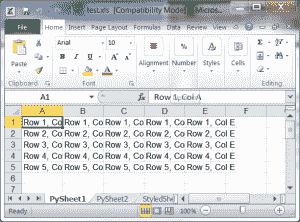
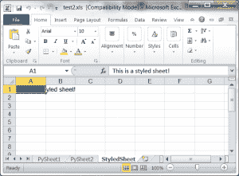
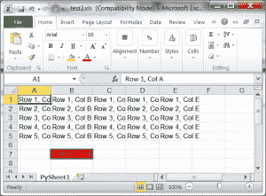

# 用 Python 和 xlwt 创建 Microsoft Excel 电子表格

> 原文：<https://www.blog.pythonlibrary.org/2014/03/24/creating-microsoft-excel-spreadsheets-with-python-and-xlwt/>

用 Python 创建 Microsoft Excel 电子表格有几种方法。你可以使用 PyWin32 的 **win32com.client** 方法，这在几年前的一篇旧的[文章](https://www.blog.pythonlibrary.org/2010/07/16/python-and-microsoft-office-using-pywin32/)中讨论过，或者你可以使用 **xlwt** 包。在本文中，我们将着眼于后者。您将学习如何创建包含多个工作表的 Excel 电子表格，以及如何创建样式化的单元格。我们开始吧！

* * *

### 获取 xlwt

您会想去下载 xlwt，这样您就可以跟着做了。它在 [PyPI](https://pypi.python.org/pypi/xlwt) 上可用。如果你已经安装了 **pip** ，那么你也可以这样安装。一旦你有了模块，我们将准备继续。

* * *

### 使用 xlwt

[](https://www.blog.pythonlibrary.org/wp-content/uploads/2014/03/xlwt_simple.png)

xlwt 包非常容易使用，尽管文档有点少。从好的方面来看，xlwt [Github 资源库](https://github.com/python-excel/xlwt/tree/master/xlwt/examples)有很多例子。让我们用一张工作表创建一个简单的 Excel 电子表格:

```py

import xlwt

#----------------------------------------------------------------------
def main():
    """"""
    book = xlwt.Workbook()
    sheet1 = book.add_sheet("PySheet1")

    cols = ["A", "B", "C", "D", "E"]
    txt = "Row %s, Col %s"

    for num in range(5):
        row = sheet1.row(num)
        for index, col in enumerate(cols):
            value = txt % (num+1, col)
            row.write(index, value)

    book.save("test.xls")

#----------------------------------------------------------------------
if __name__ == "__main__":
    main()

```

让我们把它分解一下。首先，我们导入 xlwt 模块并创建一个名为 **main** 的函数。在 main 函数中，我们创建了一个 **xlwt 的实例。工作簿**并通过 **add_sheet** 方法添加一个工作表。我们用文本“PySheet1”标记工作表。然后我们创建一个嵌套循环来创建 5 行 5 列的内容。基本上，我们将行/列信息写入每个单元格。然后我们保存文件，我们就完成了！

* * *

### 创建样式化单元格

[](https://www.blog.pythonlibrary.org/wp-content/uploads/2014/03/xlwt_styled.png)

现在让我们以这样一种方式重构代码，即我们可以通过使用函数来添加工作表。我们还将创建另一个函数，该函数可以创建带有样式化单元格的工作表:

```py

import xlwt

#----------------------------------------------------------------------
def add_sheet(book, name):
    """
    Add a sheet with one line of data
    """
    value = "This sheet is named: %s" % name
    sheet = book.add_sheet(name)
    sheet.write(0,0, value)

#----------------------------------------------------------------------
def add_styled_sheet(book, name):
    """
    Add a sheet with styles
    """
    value = "This is a styled sheet!"
    sheet = book.add_sheet(name)
    style = 'pattern: pattern solid, fore_colour blue;'
    sheet.row(0).write(0, value, xlwt.Style.easyxf(style))

#----------------------------------------------------------------------
def main():
    """"""
    book = xlwt.Workbook()
    sheet1 = book.add_sheet("PySheet1")

    cols = ["A", "B", "C", "D", "E"]
    txt = "Row %s, Col %s"

    for num in range(5):
        row = sheet1.row(num)
        for index, col in enumerate(cols):
            value = txt % (num+1, col)
            row.write(index, value)

    add_sheet(book, "PySheet2")
    add_styled_sheet(book, "StyledSheet")

    book.save("test2.xls")

#----------------------------------------------------------------------
if __name__ == "__main__":
    main()

```

这里我们创建一个 **add_sheet** 方法，它接受一个工作簿实例和工作表的名称。它将向图书中添加一个工作表，并带有一个标识工作表名称的单元格。 **add_styled_sheet** 的工作方式基本相同，只是它创建了一个带有消息的样式化单元格。

* * *

### 创建更复杂样式的单元格

[](https://www.blog.pythonlibrary.org/wp-content/uploads/2014/03/xlwt_styled2.png)

在本例中，我们将使用原始代码创建相同的 5x5 单元格集。然后，我们还将创建一个具有红色背景、边框和特定日期格式的单元格:

```py

from datetime import date
import xlwt

#----------------------------------------------------------------------
def main():
    """"""
    book = xlwt.Workbook()
    sheet1 = book.add_sheet("PySheet1")

    cols = ["A", "B", "C", "D", "E"]
    txt = "Row %s, Col %s"

    for num in range(5):
        row = sheet1.row(num)
        for index, col in enumerate(cols):
            value = txt % (num+1, col)
            row.write(index, value)

    value = date(2009,3,18)
    fmt = xlwt.Style.easyxf("""
    font: name Arial;
    borders: left thick, right thick, top thick, bottom thick;
    pattern: pattern solid, fore_colour red;
    """, num_format_str='YYYY-MM-DD')
    sheet1.write(6,1,value, fmt)

    book.save("test3.xls")

#----------------------------------------------------------------------
if __name__ == "__main__":
    main()

```

这里，我们使用一个大字符串来指定 xlwt，我们希望应用一个使用 Arial 字体的样式，单元格的四边都有边框，fore_color 是红色。当你执行代码的时候，你会发现 fore_color 其实就是背景色的意思。总之，这种语法使得对单元格的内容进行样式化变得非常容易。Python Excel 网站发布的这个 [PDF](http://www.simplistix.co.uk/presentations/python-excel.pdf) 中有很多很好的例子。

* * *

### 包扎

现在您知道了如何使用 xlwt 包创建简单的 Microsoft Excel 电子表格。您会注意到它使用旧的 ***创建电子表格。xls** 格式。xlwt 模块目前不支持 ***。xlsx** 格式。为此，你可能不得不使用 PyWin32 或者 [openpyxl](http://pythonhosted.org/openpyxl/) 项目或者 [XlsxWriter](https://pypi.python.org/pypi/XlsxWriter) 。祝你好运，编码快乐！

### 相关阅读

*   PyPI 上的 xlwt
*   Python-Excel [网站](http://www.python-excel.org/)
*   an〔t0〕xlwt/xlrd 用户指南(pdf)〔t1〕
*   Python 和微软 Office 使用 PyWin32