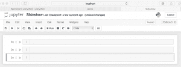
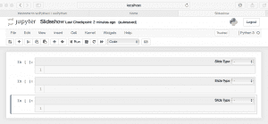
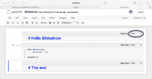
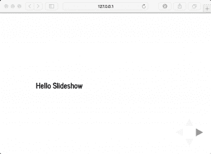
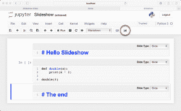
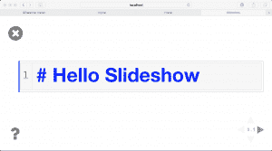
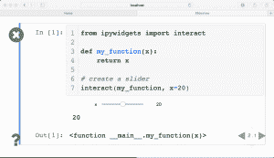

# 使用 Jupyter 笔记本创建演示文稿

> 原文：<https://www.blog.pythonlibrary.org/2018/09/25/creating-presentations-with-jupyter-notebook/>

Jupyter Notebook 可以变成幻灯片演示，有点像使用 Microsoft Powerpoint，只是您可以实时运行幻灯片的代码！它真的很好用。在我的书中，唯一的缺点是没有太多的主题可以应用到你的幻灯片上，所以它们最终看起来有点简单。

在这篇文章中，我们将看看用你的 Jupyter 笔记本制作幻灯片的两种方法。第一种方法是使用 Jupyter Notebook 内置的幻灯片放映功能。第二种是通过使用一个名为 **RISE** 的插件。

我们开始吧！

*注意:本文假设你已经安装了 Jupyter 笔记本。如果你没有，那么你可能想去他们的[网站](http://jupyter.org/)学习如何这样做。*

* * *

我们需要做的第一件事是创建一个新的笔记本。完成并运行后，让我们创建三个单元格，这样我们就可以有三张幻灯片。您的笔记本现在应该如下所示:



有 3 个单元格的空笔记本

现在让我们打开“幻灯片放映”工具。进入**视图**菜单，然后点击**单元格工具栏**菜单选项。你会在那里找到一个叫做**幻灯片**的子菜单。选择那个。现在，您笔记本的单元格应该是这样的:



一张空幻灯片

现在每个单元格的右上角都有了小的组合框。这些小部件为您提供了以下选项:

*   幻灯片
*   子幻灯片
*   碎片
*   跳跃
*   笔记

如果你喜欢，你可以创建一系列幻灯片，但是你可以通过添加子幻灯片和片段来使幻灯片更有趣。子幻灯片是前一张幻灯片下面的幻灯片，而片段基本上是前一张幻灯片中的片段。顺便说一句，我自己实际上从未使用过片段。无论如何，你也可以设置一张幻灯片跳过，这只是让你跳过一张幻灯片或笔记，这只是发言者的笔记。

让我们给第一个单元格添加一些文本。我们将向它添加文本“# Hello Slideshow ”,并将单元格类型设置为 Markdown。请注意文本开头的英镑符号。这将使文本成为标题。

在单元格二中，我们可以添加一个简单的函数。让我们使用下面的代码:

```py

def double(x):
    print(x * 2)

double(4)

```

对于最后一个单元格，我们将添加以下文本:

```py

# The end

```

请确保将该单元格也设置为减价单元格。这是我完成后我的细胞看起来的样子:



准备好幻灯片

为了简单起见，只需将每个单元格的单独组合框设置为 **Slide** 。

现在我们只需要把它变成一个真正的幻灯片。为此，您需要保存您的笔记本并关闭 Jupyter 笔记本服务器。接下来，您需要运行以下命令:

```py

jupyter nbconvert slideshow.ipynb --to slides --post serve

```



运行幻灯片

要浏览幻灯片，您可以使用左右箭头键，或者使用空格键前进，shift _ 空格键后退。这创建了一个非常漂亮简单的幻灯片，但是它不允许你运行单元格。为此，我们需要使用 RISE 插件！

### RISE 入门

reveal . js-Jupyter/IPython slide show Extension(RISE)是一个插件，它使用*reveal.js*使幻灯片实时运行。这意味着您现在可以在幻灯片中运行您的代码，而无需退出幻灯片。我们需要了解的第一件事是如何安装 RISE。

#### 安装带 conda 的 rise

如果您碰巧是 Anaconda 用户，那么您可以使用以下方法来安装 RISE:

```py

conda install -c conda-forge rise

```

这是安装 RISE 最简单的方法。然而大多数人仍然使用常规的 CPython，所以接下来我们将学习如何使用 pip！

#### 安装带 pip 的 rise

您可以使用 Python 的 pip 安装工具来安装 RISE，如下所示:

```py

pip install RISE

```

你也可以做‘python-m pip install rise’如果你想的话。一旦安装了这个包，第二步就是在适当的位置安装 JS 和 CSS，这需要您运行下面的命令:

```py

jupyter-nbextension install rise --py --sys-prefix

```

如果你得到了一个比 5.3.0 更老的 RISE 版本，那么你还需要在 Jupyter 中启用 RISE 扩展。然而，我建议使用最新版本，这样你就不用担心了。

#### 将 RISE 用于幻灯片显示

现在我们已经安装并启用了 RISE，让我们重新打开之前创建的 Jupyter 笔记本。您的笔记本现在应该看起来像这样:



添加上升

你会注意到我在你的笔记本上圈出了一个由 RISE 添加的新按钮。如果你把鼠标放在那个按钮上，你会看到它有一个工具提示显示“进入/退出上升幻灯片”。点击它，你应该会看到一个幻灯片，看起来很像前一个。这里的区别是，你可以在幻灯片中编辑和运行所有的单元格。只需双击第一张幻灯片，您应该会看到它转换为以下内容:



带着上升奔跑

完成编辑后，按 SHIFT+ENTER 运行单元格。以下是有效播放幻灯片所需的主要快捷方式:

*   空格键-在幻灯片放映中前进一张幻灯片
*   SHIFT+空格键-在幻灯片放映中后退一张幻灯片
*   SHIFT+ENTER -运行当前幻灯片上的单元格
*   双击-可编辑降价单元格

不在幻灯片模式时，进入**帮助**菜单，点击**键盘快捷键**选项，即可查看所有键盘快捷键。这些快捷方式中的大部分(如果不是全部的话)应该可以在 RISE 幻灯片中使用。

如果您想在特定单元格上开始放映幻灯片，只需选择该单元格，然后按下 Enter Slideshow 按钮。

RISE 还支持笔记本小部件。尝试使用以下代码创建一个新单元格:

```py

from ipywidgets import interact

def my_function(x):
    return x

# create a slider
interact(my_function, x=20)

```

现在，在该单元格上开始放映幻灯片，并尝试运行该单元格(SHIFT+ENTER)。您应该会看到类似这样的内容:



在 RISE 中使用 widget

您可以使用 RISE 将整洁的小部件、图形和其他交互式元素添加到您的幻灯片中，您可以实时编辑这些元素，以便向您的与会者演示概念。这真的很有趣，我曾亲自用 RISE 向工程师展示 Python 中的中级材料。

RISE 也有几个不同的主题，你可以应用它们作为幻灯片切换的最小支持。参见[文档](https://rise.readthedocs.io/en/docs_hot_fixes/customize.html)了解全部信息。

* * *

### 包扎

在这一章中，我们学习了用 Jupyter 笔记本制作演示文稿的两种好方法。您可以通过 Jupyter 的 **nbconvert** 工具直接使用 Jupyter，从您笔记本中的单元格生成幻灯片。这是很好的，但我个人更喜欢上升。这使得演示更加互动和有趣。我强烈推荐。你会发现使用 Jupyter Notebook 做演示会让幻灯片更吸引人，而且在演示过程中还可以修改幻灯片，这真是太好了！

* * *

### 相关阅读

*   使用 [Jupyter 笔记本](https://medium.com/@mjspeck/presenting-code-using-jupyter-notebook-slides-a8a3c3b59d67)展示代码
*   崛起 [Github 页面](https://github.com/damianavila/RISE)
*   Jupyter nbconvert [用法](https://github.com/jupyter/nbconvert/blob/master/docs/source/usage.rst)
*   如何使用 [Jupyter Notebook 创建交互式演示文稿并显示 JS](https://medium.freecodecamp.org/how-to-build-interactive-presentations-with-jupyter-notebook-and-reveal-js-c7e24f4bd9c5)