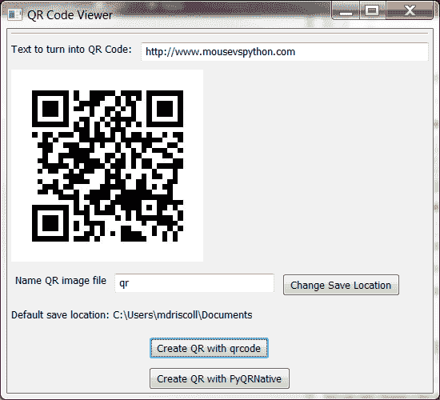
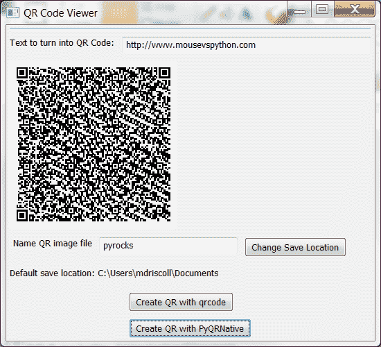

# 用 Python 创建二维码

> 原文：<https://www.blog.pythonlibrary.org/2012/05/18/creating-qr-codes-with-python/>

前几天，我觉得用 wxPython 创建一个可以生成二维码并显示在屏幕上的小程序会很有趣。当然，我想用 Python 来完成这一切，所以稍微看了一下，我遇到了 3 个候选人:

*   [python-qrd](https://github.com/lincolnloop/python-qrcode)on github
*   sourceforge 上的 [pyqrcode](http://pyqrcode.sourceforge.net/) 和
*   谷歌代码上的 [pyqrnative](http://code.google.com/p/pyqrnative/)

我尝试了 python-qrcode 和 pyqrnative，因为它们既能在 Windows 上运行，也能在 Mac 和 Linux 上运行。他们也不需要任何东西，除了 Python 图像库。pyqrcode 项目需要其他几个先决条件，并且不能在 Windows 上工作，所以我不想弄乱它。我最终基于我的[照片浏览器](https://www.blog.pythonlibrary.org/2010/03/26/creating-a-simple-photo-viewer-with-wxpython/)应用程序获取了一些旧代码，并对其稍作修改，使其成为一个二维码浏览器。如果我激起了你的兴趣，那就继续读下去吧！

### 入门指南

正如我在开始时提到的，您将需要 [Python 图像库](http://www.pythonware.com/products/pil/)。我们将使用 [wxPython](http://www.wxpython.org) 作为 GUI 部分，所以你也需要它。你会想下载 python-qrcode 和 pyqrnative。我发现的主要区别是 python-qrcode 在生成图像方面要快得多，并且它生成的图像类型可能是你见过最多的。出于某种原因，pyqrnative 运行时间要长得多，它创建了一个看起来更密集的二维码。这两个项目可能都有选项允许您生成不同种类的代码，但是这两个项目的文档都很糟糕。我最终更多地使用源代码和 Wingware 的 IDE 来遍历代码。

### 生成二维码

无论如何，一旦你具备了所有的先决条件，你就可以运行下面的代码，看看 Python 能做什么:

```py

import os
import wx

try:
    import qrcode
except ImportError:
    qrcode = None

try:
    import PyQRNative
except ImportError:
    PyQRNative = None

########################################################################
class QRPanel(wx.Panel):
    """"""

    #----------------------------------------------------------------------
    def __init__(self, parent):
        """Constructor"""
        wx.Panel.__init__(self, parent=parent)
        self.photo_max_size = 240
        sp = wx.StandardPaths.Get()
        self.defaultLocation = sp.GetDocumentsDir()

        img = wx.EmptyImage(240,240)
        self.imageCtrl = wx.StaticBitmap(self, wx.ID_ANY,
                                         wx.BitmapFromImage(img))

        qrDataLbl = wx.StaticText(self, label="Text to turn into QR Code:")
        self.qrDataTxt = wx.TextCtrl(self, value="http://www.mousevspython.com", size=(200,-1))
        instructions = "Name QR image file"
        instructLbl = wx.StaticText(self, label=instructions)
        self.qrPhotoTxt = wx.TextCtrl(self, size=(200,-1))
        browseBtn = wx.Button(self, label='Change Save Location')
        browseBtn.Bind(wx.EVT_BUTTON, self.onBrowse)
        defLbl = "Default save location: " + self.defaultLocation
        self.defaultLocationLbl = wx.StaticText(self, label=defLbl)

        qrcodeBtn = wx.Button(self, label="Create QR with qrcode")
        qrcodeBtn.Bind(wx.EVT_BUTTON, self.onUseQrcode)
        pyQRNativeBtn = wx.Button(self, label="Create QR with PyQRNative")
        pyQRNativeBtn.Bind(wx.EVT_BUTTON, self.onUsePyQR)

        # Create sizer
        self.mainSizer = wx.BoxSizer(wx.VERTICAL)
        qrDataSizer = wx.BoxSizer(wx.HORIZONTAL)
        locationSizer = wx.BoxSizer(wx.HORIZONTAL)
        qrBtnSizer = wx.BoxSizer(wx.VERTICAL)

        qrDataSizer.Add(qrDataLbl, 0, wx.ALL, 5)
        qrDataSizer.Add(self.qrDataTxt, 1, wx.ALL|wx.EXPAND, 5)
        self.mainSizer.Add(wx.StaticLine(self, wx.ID_ANY),
                           0, wx.ALL|wx.EXPAND, 5)
        self.mainSizer.Add(qrDataSizer, 0, wx.EXPAND)
        self.mainSizer.Add(self.imageCtrl, 0, wx.ALL, 5)
        locationSizer.Add(instructLbl, 0, wx.ALL, 5)
        locationSizer.Add(self.qrPhotoTxt, 0, wx.ALL, 5)
        locationSizer.Add(browseBtn, 0, wx.ALL, 5)
        self.mainSizer.Add(locationSizer, 0, wx.ALL, 5)
        self.mainSizer.Add(self.defaultLocationLbl, 0, wx.ALL, 5)

        qrBtnSizer.Add(qrcodeBtn, 0, wx.ALL, 5)
        qrBtnSizer.Add(pyQRNativeBtn, 0, wx.ALL, 5)
        self.mainSizer.Add(qrBtnSizer, 0, wx.ALL|wx.CENTER, 10)

        self.SetSizer(self.mainSizer)
        self.Layout()

    #----------------------------------------------------------------------
    def onBrowse(self, event):
        """"""
        dlg = wx.DirDialog(self, "Choose a directory:",
                           style=wx.DD_DEFAULT_STYLE)
        if dlg.ShowModal() == wx.ID_OK:
            path = dlg.GetPath()
            self.defaultLocation = path
            self.defaultLocationLbl.SetLabel("Save location: %s" % path)
        dlg.Destroy()

    #----------------------------------------------------------------------
    def onUseQrcode(self, event):
        """
        https://github.com/lincolnloop/python-qrcode
        """
        qr = qrcode.QRCode(version=1, box_size=10, border=4)
        qr.add_data(self.qrDataTxt.GetValue())
        qr.make(fit=True)
        x = qr.make_image()

        qr_file = os.path.join(self.defaultLocation, self.qrPhotoTxt.GetValue() + ".jpg")
        img_file = open(qr_file, 'wb')
        x.save(img_file, 'JPEG')
        img_file.close()
        self.showQRCode(qr_file)

    #----------------------------------------------------------------------
    def onUsePyQR(self, event):
        """
        http://code.google.com/p/pyqrnative/
        """
        qr = PyQRNative.QRCode(20, PyQRNative.QRErrorCorrectLevel.L)
        qr.addData(self.qrDataTxt.GetValue())
        qr.make()
        im = qr.makeImage()

        qr_file = os.path.join(self.defaultLocation, self.qrPhotoTxt.GetValue() + ".jpg")
        img_file = open(qr_file, 'wb')
        im.save(img_file, 'JPEG')
        img_file.close()
        self.showQRCode(qr_file)

    #----------------------------------------------------------------------
    def showQRCode(self, filepath):
        """"""
        img = wx.Image(filepath, wx.BITMAP_TYPE_ANY)
        # scale the image, preserving the aspect ratio
        W = img.GetWidth()
        H = img.GetHeight()
        if W > H:
            NewW = self.photo_max_size
            NewH = self.photo_max_size * H / W
        else:
            NewH = self.photo_max_size
            NewW = self.photo_max_size * W / H
        img = img.Scale(NewW,NewH)

        self.imageCtrl.SetBitmap(wx.BitmapFromImage(img))
        self.Refresh()

########################################################################
class QRFrame(wx.Frame):
    """"""

    #----------------------------------------------------------------------
    def __init__(self):
        """Constructor"""
        wx.Frame.__init__(self, None, title="QR Code Viewer", size=(550,500))
        panel = QRPanel(self)

if __name__ == "__main__":
    app = wx.App(False)
    frame = QRFrame()
    frame.Show()
    app.MainLoop()

```

改变和显示图片的代码在我写的上一篇文章中解释过(并链接到上面)，所以你可能关心的只是生成二维码的两种方法: **onUseQrcode** 和 **onUsePyQR** 。我只是从他们各自的网站上取了一些例子，稍微修改了一下，就制作出了二维码图片。它们非常直截了当，但没有很好地记录，所以我真的不能告诉你发生了什么。遗憾的是，在撰写本文时，这些项目的代码严重缺乏 docstrings，到处都是。不过，我还是生成了一些不错的二维码。以下是使用 python-qrcode 完成的:

[](https://www.blog.pythonlibrary.org/wp-content/uploads/2012/05/qrcode1.png)

如您所见，这是一个非常标准的代码。下一个是用 PyQRNative 创建的，看起来更密集:

[](https://www.blog.pythonlibrary.org/wp-content/uploads/2012/05/qrcode2.png)

我试着用我的 Android 手机的条形码扫描应用程序扫描两张图片，两张二维码都被它正确地读取了。因此，如果你需要为你的项目生成二维码图像，我希望其中一个项目能够满足你的需求！

### 2012 年 5 月 21 日更新

我的一个读者(Mike Farmer)最近联系了我关于他的 PyQRNative 实验，告诉我“第一个参数是容器大小，第二个参数是冗余/错误
纠正”。我大概猜到了第二个是什么，但我不知道纠错级别是什么。幸运的是，法默先生向我解释道:*如果纠错能力很低，它将无法容忍标签被涂污或撕破而无法读取。但是，如果你提高错误等级，显然会得到更大的二维码，但你所做的是在标签内创建重复的数据。因此，如果标签被弄脏或撕破，它仍然可以读取和恢复剩余的数据。因此，如果你的应用程序正在创建可能被破坏的标签，明智的做法是加快错误纠正。你还可以做一些很酷的事情，比如在标签上叠加图片或文本，通过启动纠错功能，使数据冗余，然后它可以容忍“损坏”。*无论如何，如果你改变第一个数字，你可以放大或缩小二维码图像的大小。你为什么要这么做？你需要在图像中存储的信息越多，图像就需要越大。法默先生想出了一些有趣的测试代码，以帮助他准确地计算出二维码的最小尺寸。我复制下面的代码:

```py

import PyQRNative

def makeQR(data_string,path,level=1):
    quality={1: PyQRNative.QRErrorCorrectLevel.L,
             2: PyQRNative.QRErrorCorrectLevel.M,
             3: PyQRNative.QRErrorCorrectLevel.Q,
             4: PyQRNative.QRErrorCorrectLevel.H}
    size=3
    while 1:
        try:
            q = PyQRNative.QRCode(size,quality[level])
            q.addData(data_string)
            q.make()
            im=q.makeImage()
            im.save(path,format="png")
            break
        except TypeError:
            size+=1

```

### 源代码

*   [qrcdeviewer . zip](https://www.blog.pythonlibrary.org/wp-content/uploads/2012/05/QRCodeViewer.zip)