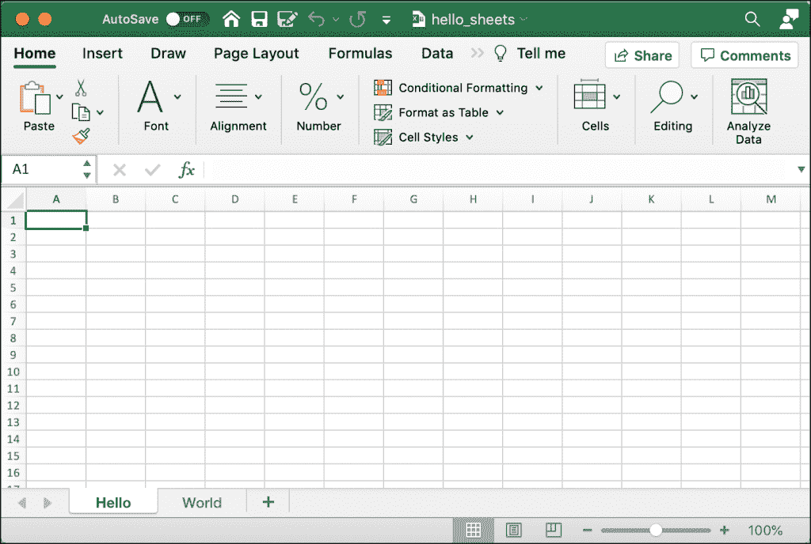

# 用 OpenPyXL 和 Python 创建电子表格

> 原文：<https://www.blog.pythonlibrary.org/2021/07/27/creating-spreadsheets-with-openpyxl-and-python/>

[阅读 Excel 电子表格](https://www.blog.pythonlibrary.org/2021/07/20/reading-spreadsheets-with-openpyxl-and-python/)当然很好。但是，您还需要能够创建或编辑电子表格。本章的重点将是学习如何做到这一点！OpenPyXL 让您可以轻松创建 Microsoft Excel 电子表格。

使用 Python 创建 Excel 电子表格允许您生成用户将使用的新型报告。例如，您可能以 JSON 或 XML 的形式从客户端接收数据。这些数据格式不是大多数会计师或商务人士习惯阅读的。

一旦您学会了如何使用 Python 创建 Excel 电子表格，您就可以利用这些知识将其他数据转换成 Excel 电子表格。这些知识还允许您反过来做，接受一个 Excel 电子表格并输出一种不同的格式，比如 JSON 或 XML。

在本文中，您将学习如何使用 OpenPyXL 完成以下任务:

*   创建电子表格
*   写入电子表格
*   添加和移除工作表
*   插入和删除行和列
*   编辑单元格数据
*   创建合并单元格
*   折叠行和列

让我们开始创建一个全新的电子表格吧！

编者按:本文基于《用 Python 自动化 Excel》一书中的一章。你可以在 [Gumroad](https://gum.co/openpyxl) **或者 [Kickstarter](https://www.kickstarter.com/projects/driscollis/automating-excel-with-python) 上订购一份。**

## 创建电子表格

使用 OpenPyXL 创建一个空的电子表格不需要太多代码。打开 Python 编辑器，创建一个新文件。命名为`creating_spreadsheet.py`。

现在将以下代码添加到您的文件中:

```py
# creating_spreadsheet.py

from openpyxl import Workbook

def create_workbook(path):
    workbook = Workbook()
    workbook.save(path)

if __name__ == "__main__":
    create_workbook("hello.xlsx")
```

这里的关键部分是您需要导入`Workbook`类。这个类允许您实例化一个`workbook`对象，然后您可以保存它。这些代码所做的就是创建您传递给它的文件并保存它。

您的新电子表格将如下所示:


现在，您已经准备好学习如何将一些数据添加到电子表格的单元格中。

## 写入电子表格

当在电子表格中写入数据时，您需要获得“sheet”对象。在上一章中，您已经学习了如何使用`workbook.active`来实现这一点，这将为您提供活动的或当前可见的工作表。您还可以通过向 OpenPyXL 传递一个工作表标题来明确地告诉它您想要访问哪个工作表。

对于本示例，您将创建另一个新程序，然后使用活动工作表。打开一个新文件，命名为`adding_data.py`。现在将这段代码添加到您的文件中:

```py
# adding_data.py

from openpyxl import Workbook

def create_workbook(path):
    workbook = Workbook()
    sheet = workbook.active
    sheet["A1"] = "Hello"
    sheet["A2"] = "from"
    sheet["A3"] = "OpenPyXL"
    workbook.save(path)

if __name__ == "__main__":
    create_workbook("hello.xlsx")
```

这段代码将覆盖前面示例的 Excel 电子表格。在创建了`Workbook()`对象之后，您获取了活动工作表。然后向单元格添加文本字符串:A1、A2 和 A3。最后一步是保存新的电子表格。

当您运行这段代码时，您的新电子表格将如下所示:


您可以使用这种技术将数据写入电子表格中的任何单元格。

现在让我们看看如何添加和删除工作表！

## 添加和移除工作表

创建新工作簿时，会自动向工作簿添加工作表。默认情况下，工作表将被命名为“sheet”。如果需要，您可以自己设置工作表的名称。

要了解这是如何工作的，创建一个名为`creating_sheet_title.py`的新文件，并添加以下代码:

```py
# creating_sheet_title.py

from openpyxl import Workbook

def create_sheets(path):
    workbook = Workbook()
    sheet = workbook.active
    sheet.title = "Hello"
    sheet2 = workbook.create_sheet(title="World")
    workbook.save(path)

if __name__ == "__main__":
    create_sheets("hello_sheets.xlsx")
```

这里您创建了`Workbook`，然后获取活动工作表。然后，您可以使用`title`属性设置工作表的标题。下面一行代码通过调用`create_sheet()`向工作簿添加一个新工作表。

`create_sheet()`方法有两个参数:`title`和`index`。`title`属性给工作表一个标题。`index`告诉`Workbook`从左到右在哪里插入工作表。如果您指定零，您的工作表将从开始处插入。

如果您运行此代码，您的新电子表格将如下所示:



有时您需要删除工作表。也许该工作表不再包含有效信息，或者它是意外创建的。

要查看如何删除工作表，创建另一个新文件并将其命名为`delete_sheets.py`。然后添加以下代码:

```py
# delete_sheets.py

import openpyxl

def create_worksheets(path):
    workbook = openpyxl.Workbook()
    workbook.create_sheet()
    print(workbook.sheetnames)
    # Insert a worksheet
    workbook.create_sheet(index=1, title="Second sheet")
    print(workbook.sheetnames)
    del workbook["Second sheet"]
    print(workbook.sheetnames)
    workbook.save(path)

if __name__ == "__main__":
    create_worksheets("del_sheets.xlsx")
```

在本例中，您将创建两个新工作表。第一个工作表没有指定标题，因此默认为“Sheet1”。您为第二个工作表提供一个标题，然后打印出所有当前工作表的标题。

接下来，使用 Python 的`del`关键字从工作簿中删除工作表的名称，这将删除工作表。然后再次打印出当前的工作表标题。

以下是运行代码的输出:

```py
['Sheet', 'Sheet1']
['Sheet', 'Second sheet', 'Sheet1']
['Sheet', 'Sheet1']
```

当实例化`Workbook`时，第一个工作表会自动创建。该工作表名为“sheet”。然后，您制作“Sheet1”。最后，您创建了“第二张工作表”，但是您将它插入到位置 1，这告诉工作簿将“Sheet1”向右移动一个位置。

从上面的输出可以看出，在添加和删除“第二个工作表”之前和之后，工作表是如何排序的。

现在让我们学习插入和删除行和列！

## 插入和删除行和列

OpenPyXL 包为您提供了几种方法，您可以使用它们来插入或删除行和列。这些方法是`Worksheet`对象的一部分。

您将了解以下四种方法:

*   `.insert_rows()`
*   `.delete_rows()`
*   `.insert_cols()`
*   `.delete_cols()`

这些方法中的每一个都可以接受这两个参数:

*   `idx`–要插入(或删除)的索引
*   `amount`–要添加(或删除)的行数或列数

您可以使用 insert 方法在指定的索引处插入行或列。

打开一个新文件，命名为`insert_demo.py`。然后在新文件中输入以下代码:

```py
# insert_demo.py

from openpyxl import Workbook

def inserting_cols_rows(path):
    workbook = Workbook()
    sheet = workbook.active
    sheet["A1"] = "Hello"
    sheet["A2"] = "from"
    sheet["A3"] = "OpenPyXL"
    # insert a column before A
    sheet.insert_cols(idx=1)
    # insert 2 rows starting on the second row
    sheet.insert_rows(idx=2, amount=2)
    workbook.save(path)

if __name__ == "__main__":
    inserting_cols_rows("inserting.xlsx")
```

在这里，您创建另一个新的电子表格。在这种情况下，您将文本添加到“A”列的前三个单元格中。然后在索引一处插入一列。这意味着您在“A”之前插入了一个单独的列，这将导致“A”列中的单元格移动到“B”列。

接下来，从索引 2 开始插入两个新行。这段代码将在第一行和第二行之间插入两行。

通过下面的截图，您可以看到这是如何改变事情的:


尝试更改索引或要插入的行数和列数，看看效果如何。

您还需要不时地删除列和行。为此，您将使用`.delete_rows()`和`.delete_cols()`。

打开一个新文件，命名为`delete_demo.py`。然后添加以下代码:

```py
# delete_demo.py

from openpyxl import Workbook

def deleting_cols_rows(path):
    workbook = Workbook()
    sheet = workbook.active
    sheet["A1"] = "Hello"
    sheet["B1"] = "from"
    sheet["C1"] = "OpenPyXL"
    sheet["A2"] = "row 2"
    sheet["A3"] = "row 3"
    sheet["A4"] = "row 4"
    # Delete column A
    sheet.delete_cols(idx=1)
    # delete 2 rows starting on the second row
    sheet.delete_rows(idx=2, amount=2)
    workbook.save(path)

if __name__ == "__main__":
    deleting_cols_rows("deleting.xlsx")
```

在本例中，您将文本添加到六个不同的单元格中。其中四个单元格位于“A”列。然后你用`delete_cols()`删除列“A”！这意味着你去掉了四个值。接下来，删除两行，从第二行开始。

当您运行这段代码时，您的结果应该如下所示:


尝试编辑索引或数量值，以熟悉删除行和列。

现在您已经准备好学习如何编辑电子表格的值了！

## 编辑单元格数据

您可以使用 OpenPyXL 来更改预先存在的 Excel 电子表格中的值。您可以通过指定要更改的单元格，然后将其设置为新值来实现。

对于这个例子，您将使用您在上一节中创建的`inserting.xlsx`文件。现在创建一个名为`editing_demo.py`的新 Python 文件。然后添加以下代码:

```py
# editing_demo.py

from openpyxl import load_workbook

def edit(path, data):
    workbook = load_workbook(filename=path)
    sheet = workbook.active
    for cell in data:
        current_value = sheet[cell].value
        sheet[cell] = data[cell]
        print(f'Changing {cell} from {current_value} to {data[cell]}')
    workbook.save(path)

if __name__ == "__main__":
    data = {"B1": "Hi", "B5": "Python"}
    edit("inserting.xlsx", data)
```

这段代码加载您在上一节中创建的 Excel 文件。然后，它对传递给`edit()`函数的`data`字典中的每个值进行循环。使用字典中的一个键可以获得单元格的当前值。然后，更改该单元格的值以匹配字典中的值。

为了更清楚地说明发生了什么，您打印出了单元格的新旧值。

当您运行此代码时，您将看到以下输出:

```py
Changing B1 from Hello to Hi
Changing B5 from OpenPyXL to Python
```

打开新版本的`inserting.xlsx`文件，它应该看起来像这样:


在这里，您可以看到单元格值是如何变化的，以匹配在`data`字典中指定的值。

现在，您可以继续学习如何创建合并单元格了！

## 创建合并单元格

合并单元格是指两个或多个单元格合并成一个。要设置 MergedCell 的值，必须使用最左上角的单元格。例如，如果您合并“A2:E2”，您将为合并的单元格设置单元格“A2”的值。

要了解这在实践中是如何工作的，创建一个名为`merged_cells.py`的文件，并向其中添加以下代码:

```py
# merged_cells.py

from openpyxl import Workbook
from openpyxl.styles import Alignment

def create_merged_cells(path, value):
    workbook = Workbook()
    sheet = workbook.active
    sheet.merge_cells("A2:E2")
    top_left_cell = sheet["A2"]
    top_left_cell.alignment = Alignment(horizontal="center",
                                        vertical="center")
    sheet["A2"] = value
    workbook.save(path)

if __name__ == "__main__":
    create_merged_cells("merged.xlsx", "Hello World")
```

OpenPyXL 有很多方法来样式化单元格。在这个例子中，您从`openpyxl.styles`导入`Alignment`。在后面的章节中，你会学到更多关于单元格样式和格式的知识。

在这里，您合并单元格“A2:E2 ”,并将对齐方式设置为单元格的中心。然后将“A2”的值设置为传递给`create_merged_cells()`函数的字符串。

运行此示例时，新的 Excel 电子表格将如下所示:


要获得一些实践经验，请更改要合并的单元格范围，并在有和没有对齐设置的情况下进行尝试。

现在您已经准备好学习折叠列或行了！

## 折叠行和列

Microsoft Excel 支持行和列的折叠。术语“折叠”也称为“隐藏”或创建“轮廓”。折叠的行或列可以展开(或展开)以使它们再次可见。您可以使用该功能使电子表格更加简洁。例如，您可能希望只显示小计或公式的结果，而不是一次显示所有数据。

OpenPyXL 也支持折叠。要了解这是如何工作的，创建一个名为`folding.py`的新文件，并输入以下代码:

```py
# folding.py

import openpyxl

def folding(path, rows=None, cols=None, hidden=True):
    workbook = openpyxl.Workbook()
    sheet = workbook.active

    if rows:
        begin_row, end_row = rows
        sheet.row_dimensions.group(begin_row, end_row, hidden=hidden)

    if cols:
        begin_col, end_col = cols
        sheet.column_dimensions.group(begin_col, end_col, hidden=hidden)

    workbook.save(path)

if __name__ == "__main__":
    folding("folded.xlsx", rows=(1, 5), cols=("C", "F"))
```

您的`folding()`函数接受行或列或者两者的元组。您可以告诉 OpenPyXL 是否希望隐藏或折叠这些行和列。在这个例子中，您折叠第 1-5 行和第 C-F 列。

当您运行这段代码时，您的电子表格将如下所示:


您可以在该电子表格中看到一些行和列被折叠或隐藏。第 6 行旁边有一个“+”符号，第“G”列上方有另一个“+”符号。如果您单击这些按钮中的任何一个，它将展开折叠的行或列。

试一试这段代码。您还可以尝试不同的行或列范围。

现在你已经准备好学习如何冻结一个窗格！

## 冻结窗格

Microsoft Excel 允许您冻结窗格。这意味着您可以冻结一个或多个列或行。一个流行的用例是冻结一行标题，这样在滚动大量数据时标题总是可见的。

OpenPyXL 在工作表对象上提供了一个可以设置的`freeze_panes`属性。您需要在要冻结的列的右下方选择一个单元格。例如，如果您想要冻结电子表格中的第一行，那么您可以选择“A2”处的单元格来冻结该行。

您可以通过编写一些代码来了解这是如何工作的。打开一个新文件，命名为`freezing_panes.py`。然后在其中输入以下内容:

```py
# freezing_panes.py

from openpyxl import Workbook

def freeze(path, row_to_freeze):
    workbook = Workbook()
    sheet = workbook.active
    sheet.title = "Freeze"
    sheet.freeze_panes = row_to_freeze
    headers = ["Name", "Address", "State", "Zip"]
    sheet["A1"] = headers[0]
    sheet["B1"] = headers[1]
    sheet["C1"] = headers[2]
    sheet["D1"] = headers[3]
    data = [dict(zip(headers, ("Mike", "123 Storm Dr", "IA", "50000"))),
            dict(zip(headers, ("Ted", "555 Tornado Alley", "OK", "90000")))]
    row = 2
    for d in data:
        sheet[f'A{row}'] = d["Name"]
        sheet[f'B{row}'] = d["Address"]
        sheet[f'C{row}'] = d["State"]
        sheet[f'D{row}'] = d["Zip"]
        row += 1
    workbook.save(path)

if __name__ == "__main__":
    freeze("freeze.xlsx", row_to_freeze="A2")
```

在这里创建一个新的`Workbook`，并将当前工作表的标题设置为“冻结”。然后将`freeze_panes`属性设置为“A2”。函数中的其余代码向工作表添加了几行数据。

运行此代码时，您创建的电子表格将如下所示:


尝试向下滚动电子表格中的一些行。最上面一行应该始终可见，因为它已经被“冻结”了。

## 包扎

您不仅可以使用 OpenPyXL 创建 Excel 电子表格，还可以修改预先存在的电子表格。在本章中，您学习了如何执行以下操作:

*   创建电子表格
*   写入电子表格
*   添加和移除工作表
*   插入和删除行和列
*   编辑单元格数据
*   创建合并单元格
*   冻结窗格

试一试本章中的例子。然后稍微修改一下，看看自己还能做些什么。