# 如何分发 wxPython 应用程序

> 原文：<https://www.blog.pythonlibrary.org/2019/03/19/distributing-a-wxpython-application/>

假设您使用 wxPython 完成了一个精彩的 GUI 应用程序。如何与世界分享？当你完成一个惊人的程序时，这总是一个两难的选择。幸运的是，有几种方法可以共享您的代码。如果你想和其他开发者分享你的代码，那么 Github 或者类似的网站绝对是一个不错的选择。我不会在这里讨论使用 Git 或 Mercurial。相反，您将在这里学习如何将您的应用程序转换成可执行文件。

通过将您的代码转换为可执行文件，您可以允许用户只下载二进制文件并运行它，而不需要他们下载 Python、您的源代码和您的依赖项。所有这些都将被打包成可执行文件。

有许多工具可以用来生成可执行文件:

*   [py2exe](http://www.py2exe.org/)
*   [py2app](https://py2app.readthedocs.io/en/latest/)
*   [PyInstaller](https://www.pyinstaller.org/)
*   [cx_Freeze](https://cx-freeze.readthedocs.io/en/latest/)
*   [bbfreeze](https://pypi.org/project/bbfreeze/)
*   [呜呜呜](http://nuitka.net/)
*   [公文包](https://pybee.org/project/projects/tools/briefcase/)

在本教程中，您将使用 **PyInstaller** 。使用 PyInstaller 的主要好处是它可以为 Windows、Mac 和 Linux 生成可执行文件。注意，它不**不**支持交叉编译。这意味着您不能在 Linux 上运行 PyInstaller 来创建 Windows 可执行文件。相反，PyInstaller 将只为运行它的操作系统创建一个可执行文件。换句话说，如果您在 Windows 上运行 PyInstaller，它将只创建一个 Windows 可执行文件。

* * *

### 安装 PyInstaller

安装 PyInstaller 包非常简单明了。你只需要匹普。

下面是将 PyInstaller 安装到 Python 系统的方法:

```py

pip install pyinstaller

```

您还可以使用 Python 的 **venv** 模块或 **virtualenv** 包将 PyInstaller 安装到虚拟 Python 环境中。

* * *

### 生成可执行文件

PyInstaller 的优点是开箱即用非常容易。你所需要做的就是运行“pyinstaller”命令，后跟你要转换成可执行文件的应用程序主文件的路径。

下面是一个不起作用的例子:

```py

pyinstaller path/to/main/script.py

```

如果没有找到 PyInstaller 应用程序，您可能需要指定它的完整路径。默认情况下，PyInstaller 安装到 Python 的**Scripts**子文件夹，该文件夹将位于您的系统 Python 文件夹或虚拟环境中。

让我们从我即将出版的[书](https://leanpub.com/creatingapplicationswithwxpython/)中选取一个简单的应用程序，并把它变成一个可执行程序。例如，您可以使用第 3 章中的**image _ viewer _ slide show . py**:

```py

# image_viewer_slideshow.py

import glob
import os
import wx

class ImagePanel(wx.Panel):

    def __init__(self, parent):
        super().__init__(parent)
        self.max_size = 240
        self.photos = []
        self.current_photo = 0
        self.total_photos = 0
        self.layout()

        self.slideshow_timer = wx.Timer(self)
        self.Bind(wx.EVT_TIMER, self.on_next, self.slideshow_timer)

    def layout(self):
        """
        Layout the widgets on the panel
        """

        self.main_sizer = wx.BoxSizer(wx.VERTICAL)
        btn_sizer = wx.BoxSizer(wx.HORIZONTAL)

        img = wx.Image(self.max_size, self.max_size)
        self.image_ctrl = wx.StaticBitmap(self, wx.ID_ANY, 
                                             wx.Bitmap(img))
        self.main_sizer.Add(self.image_ctrl, 0, wx.ALL|wx.CENTER, 5)
        self.image_label = wx.StaticText(self, label="")
        self.main_sizer.Add(self.image_label, 0, wx.ALL|wx.CENTER, 5)

        btn_data = [("Previous", btn_sizer, self.on_previous),
                    ("Slide Show", btn_sizer, self.on_slideshow),
                    ("Next", btn_sizer, self.on_next)]
        for data in btn_data:
            label, sizer, handler = data
            self.btn_builder(label, sizer, handler)

        self.main_sizer.Add(btn_sizer, 0, wx.CENTER)
        self.SetSizer(self.main_sizer)

    def btn_builder(self, label, sizer, handler):
        """
        Builds a button, binds it to an event handler and adds it to a sizer
        """
        btn = wx.Button(self, label=label)
        btn.Bind(wx.EVT_BUTTON, handler)
        sizer.Add(btn, 0, wx.ALL|wx.CENTER, 5)

    def on_next(self, event):
        """
        Loads the next picture in the directory
        """
        if not self.photos:
            return

        if self.current_photo == self.total_photos - 1:
            self.current_photo = 0
        else:
            self.current_photo += 1
        self.update_photo(self.photos[self.current_photo])

    def on_previous(self, event):
        """
        Displays the previous picture in the directory
        """
        if not self.photos:
            return

        if self.current_photo == 0:
            self.current_photo = self.total_photos - 1
        else:
            self.current_photo -= 1
        self.update_photo(self.photos[self.current_photo])

    def on_slideshow(self, event):
        """
        Starts and stops the slideshow
        """
        btn = event.GetEventObject()
        label = btn.GetLabel()
        if label == "Slide Show":
            self.slideshow_timer.Start(3000)
            btn.SetLabel("Stop")
        else:
            self.slideshow_timer.Stop()
            btn.SetLabel("Slide Show")

    def update_photo(self, image):
        """
        Update the currently shown photo
        """
        img = wx.Image(image, wx.BITMAP_TYPE_ANY)
        # scale the image, preserving the aspect ratio
        W = img.GetWidth()
        H = img.GetHeight()
        if W > H:
            NewW = self.max_size
            NewH = self.max_size * H / W
        else:
            NewH = self.max_size
            NewW = self.max_size * W / H
        img = img.Scale(NewW, NewH)

        self.image_ctrl.SetBitmap(wx.Bitmap(img))
        self.Refresh()

    def reset(self):
        img = wx.Image(self.max_size,
                       self.max_size)
        bmp = wx.Bitmap(img)
        self.image_ctrl.SetBitmap(bmp)
        self.current_photo = 0
        self.photos = []

class MainFrame(wx.Frame):

    def __init__(self):
        super().__init__(None, title='Image Viewer',
                                        size=(400, 400))
        self.panel = ImagePanel(self)
        self.create_toolbar()
        self.Show()

    def create_toolbar(self):
        """
        Create a toolbar
        """
        self.toolbar = self.CreateToolBar()
        self.toolbar.SetToolBitmapSize((16,16))

        open_ico = wx.ArtProvider.GetBitmap(
            wx.ART_FILE_OPEN, wx.ART_TOOLBAR, (16,16))
        openTool = self.toolbar.AddTool(
            wx.ID_ANY, "Open", open_ico, "Open an Image Directory")
        self.Bind(wx.EVT_MENU, self.on_open_directory, openTool)

        self.toolbar.Realize()

    def on_open_directory(self, event):
        """
        Open a directory dialog
        """
        with wx.DirDialog(self, "Choose a directory",
                          style=wx.DD_DEFAULT_STYLE) as dlg:

            if dlg.ShowModal() == wx.ID_OK:
                self.folderPath = dlg.GetPath()

                photos = glob.glob(os.path.join(self.folderPath, '*.jpg'))
                self.panel.photos = photos
                if photos:
                    self.panel.update_photo(photos[0])
                    self.panel.total_photos = len(photos)
                else:
                    self.panel.reset()

if __name__ == '__main__':
    app = wx.App(redirect=False)
    frame = MainFrame()
    app.MainLoop()

```

如果您想将其转换为可执行文件，您可以运行以下命令:

```py

pyinstaller image_viewer_slideshow.py

```

确保在运行该命令时，当前工作目录是包含要转换为可执行文件的脚本的目录。PyInstaller 将在当前工作目录下创建输出。

当您运行这个命令时，您应该在终端中看到类似这样的内容:

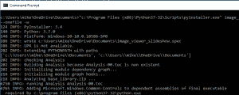

PyInstaller 将在与您正在转换的脚本相同的文件夹中创建两个文件夹，分别名为**dist**和**build**。如果 PyInstaller 成功完成，您将在**dist**文件夹中找到您的可执行文件。除了您的可执行文件，**dist**文件夹中还有许多其他文件。这些是运行可执行文件所必需的文件。

现在让我们尝试运行您新创建的可执行文件。当我运行我的副本时，我注意到一个终端/控制台出现在我的应用程序后面。

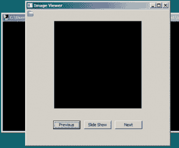

背景中带有控制台的图像查看器

这是正常的，因为 PyInstaller 的默认行为是将您的应用程序构建为命令行应用程序，而不是 GUI。

您需要添加 **- noconsole** 标志来移除控制台:

```py

pyinstaller image_viewer_slideshow.py --noconsole

```

现在，当您运行结果时，您应该不会再看到一个控制台窗口出现在您的应用程序后面。

分发大量文件可能会很复杂，因此 PyInstaller 有另一个命令，您可以使用它将所有内容打包成一个可执行文件。该命令是`- onefile`。顺便说一下，您在 PyInstaller 中使用的许多命令都有较短的别名。例如，您也可以使用“- noconsole”的一个更短的别名: **-w** 。注意`-w '中的单破折号。

因此，让我们利用这些信息，让 PyInstaller 创建一个没有控制台的可执行文件:

`dist folder.`

* * *

### 规格文件

PyInstaller 有规范文件的概念。它们有点像是一个 **setup.py** 脚本，你可以在 Python 的 **distutils** 中使用它。这些规范文件告诉 PyInstaller 如何构建您的可执行文件。PyInstaller 将自动为您生成一个与脚本中传递的名称相同的文件，但是带有一个**。规格**扩展。所以如果你传入了**image _ viewer _ slide show . py**，那么在运行 PyInstaller 之后你应该会看到一个**image _ viewer _ slide show . spec**文件。该规格文件将创建在与应用程序文件相同的位置。

下面是上次运行 PyInstaller 时创建的规范文件的内容:

```py

# -*- mode: python -*-

block_cipher = None

a = Analysis(['image_viewer.py'],
             pathex=['C:\\Users\\mdriscoll\\Documents\\test'],
             binaries=[],
             datas=[],
             hiddenimports=[],
             hookspath=[],
             runtime_hooks=[],
             excludes=[],
             win_no_prefer_redirects=False,
             win_private_assemblies=False,
             cipher=block_cipher,
             noarchive=False)
pyz = PYZ(a.pure, a.zipped_data,
             cipher=block_cipher)
exe = EXE(pyz,
          a.scripts,
          a.binaries,
          a.zipfiles,
          a.datas,
          [],
          name='image_viewer',
          debug=False,
          bootloader_ignore_signals=False,
          strip=False,
          upx=True,
          runtime_tmpdir=None,
          console=False )

```

虽然 PyInstaller 可以很好地处理图像查看器示例，但您可能会发现，如果您有其他依赖项，如 NumPy 或 Pandas，它就不能开箱即用了。如果您遇到 PyInstaller 的问题，它有非常详细的日志，您可以使用它来帮助您解决问题。一个很好的位置是“build/cli/warn-cli.txt”文件。您可能还想在不使用`-w '命令的情况下进行重建，以便可以在控制台窗口中看到输出到 stdout 的内容。

还有一些选项可以在构建过程中更改日志级别，这可能有助于发现问题。

如果这些都不起作用，试试谷歌或者去 PyInstaller 的[支持页面](https://www.pyinstaller.org/support.html)获得帮助。

* * *

### 为 Mac 创建可执行文件

虽然相同的命令在 Mac OSX 上应该和在 Windows 上一样有效，但是我发现我需要运行以下命令来生成一个有效的可执行文件:

```py

pyinstaller image_viewer_slideshow.py --windowed

```

PyInstaller 生成的输出会略有不同，结果是一个应用程序文件。

在 Mac 上生成应用程序的另一个流行选项是名为 **py2app** 的 Python 包。

* * *

### 为 Linux 创建可执行文件

对于 Linux，通常建议您用旧版本的 glibc 构建可执行文件，因为新版本的 glibc 是向后兼容的。通过使用旧版本的 Linux 进行构建，您通常可以针对更广泛的 Linux 版本。但是您的里程可能会有所不同。

文件生成后，您可以将它们打包成一个 gzipped tarball (.tax.gz)。如果您愿意，您甚至可以使用您在本书中创建的归档应用程序来完成这项工作。

另一种方法是学习如何创建一个大多数 Linux 版本都可以安装的. deb 或相关文件。

* * *

### 了解关于 PyInstaller 的更多信息

本文并不是 PyInstaller 的深入指南。它的变化可能比 wxPython 快得多，所以建议您阅读 PyInstaller 的文档。它将永远是您获取项目所需信息的最新位置。

* * *

### 安装工呢？

Windows 用户知道，大多数时候你都有一个安装程序，你可以运行它在你的计算机上安装你的应用程序，并在这里或那里放一些快捷方式。有几个有用的免费程序，你可以用来创建一个 Windows Installer 以及一些付费的

以下是我看到提及最多的两个免费软件应用:

*   [NSIS](https://nsis.sourceforge.io/Main_Page)
*   [Inno Setup](http://www.jrsoftware.org/isinfo.php)

我曾多次使用 Inno Setup 创建 Windows installer。它很容易使用，只需要阅读一点文档就可以工作。我以前没有用过 NSIS，但我想它也很容易使用。

让我们以 Inno Setup 为例，看看如何用它生成一个安装程序。

* * *

### 使用 Inno Setup 创建安装程序

Inno Setup 是一个很好的免费软件应用程序，可以用来创建专业外观的安装程序。它可以在大多数版本的 Windows 上运行。我个人用了好几年了。虽然 Inno Setup 不是开源的，但它仍然是一个非常好的程序。你需要从网站下载并安装它。

安装完成后，您可以使用该工具为您在本章前面创建的可执行文件创建一个安装程序。

要开始，只需运行 Inno Setup，您应该会看到以下内容:

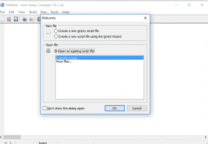

Inno 安装程序的启动页面

虽然 Inno Setup 默认打开一个现有的文件，但你要做的是从顶部选择第二个选项:“使用脚本向导创建一个新的脚本文件”。然后按**确定* *。

您现在应该会看到 Inno 设置脚本向导的第一页。只需点击**下一个* *这里，因为你没有别的办法。

现在，您应该会看到类似这样的内容:

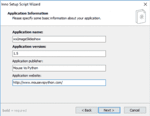

Inno 设置脚本向导应用程序信息页

您可以在此输入应用程序名称、版本信息、发行商名称和应用程序网站。我预先填写了一些例子，但你可以在这里输入你想输入的任何内容。

继续按下**下一个**，您应该会看到第 3 页:

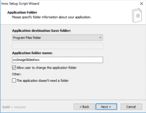

Inno 设置脚本向导应用程序文件夹页

在向导的这一页，您可以设置应用程序的安装目录。在 Windows 上，大多数应用程序安装到**程序文件* *，这也是这里的默认设置。这也是您为应用程序设置文件夹名称的地方。这是将出现在程序文件中的文件夹的名称。或者，您可以选中底部的框，表示您的应用程序根本不需要文件夹。

让我们进入下一页:

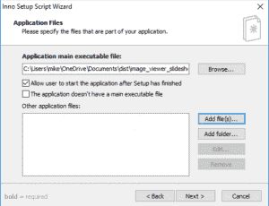

Inno 设置脚本向导应用程序文件页

这里是您选择主可执行文件的地方。在这种情况下，您希望选择使用 PyInstaller 创建的可执行文件。如果您没有使用 **- onefile** 标志创建可执行文件，那么您可以使用**添加文件来添加其他文件...**按钮。如果您的应用程序需要任何其他特殊文件，如 SQLite 数据库文件或图像，这也是您想要添加它们的地方。

默认情况下，当安装程序完成时，此页面将允许用户运行您的应用程序。很多安装程序都这样做，所以实际上这是大多数用户所期望的。

让我们继续:

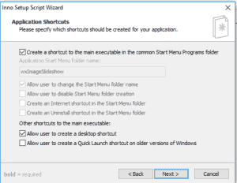

Inno 设置脚本向导应用程序快捷方式页

这是**应用程序快捷方式**页面，它允许您管理为您的应用程序创建了什么快捷方式以及它们应该去哪里。这些选项非常简单明了。我通常只使用默认值，但是你可以随意更改它们。

让我们看看文档页面上有什么:

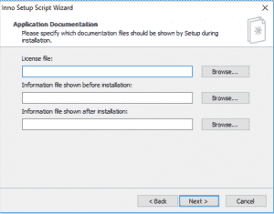

Inno 设置脚本向导应用程序文档页

向导的**文档页面**是您添加应用程序许可文件的地方。例如，如果你要发布一个开源应用程序，你可以在那里添加 GPL 或者 MIT 或者任何你需要的许可文件。如果这是一个商业应用程序，您可以在这里添加您的最终用户许可协议(EULA)文件。

让我们看看接下来会发生什么:

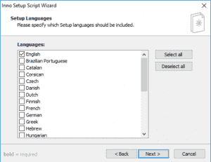

Inno 设置脚本向导设置语言页

在这里您可以设置应该包括哪些安装语言。Inno Setup 支持相当多的语言，默认选择是英语。

现在让我们来看看什么是编译器设置:

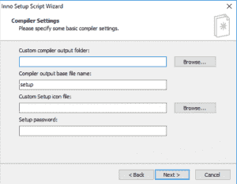

Inno 设置脚本向导编译器设置页面

通过**编译器设置**页面，您可以命名输出设置文件，默认为**setup**。您可以在这里设置输出文件夹，添加自定义安装文件图标，甚至为安装文件添加密码保护。我通常只保留默认值，但是如果你手边有一个很好的图标文件，这是一个给设置添加一些品牌的机会。

下一页是为预处理器准备的:

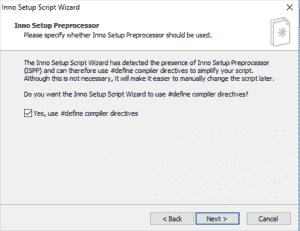

Inno 设置脚本向导预处理程序页

预处理器主要用于捕捉 Inno 设置脚本文件中的错别字。它主要是在编译时向 Inno 设置脚本添加一些有用的选项。

查看[文档](http://www.jrsoftware.org/ispphelp/)了解全部细节。

点击**下一步**，您应该会看到向导的最后一页:

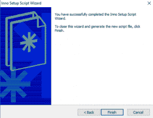

Inno 设置脚本向导结束页

点击**完成**，Inno Setup 将生成一个 Inno Setup 脚本(。iss)文件。完成后，它会问你是否愿意编译这个文件。

继续并接受该对话框，您应该看到以下内容:

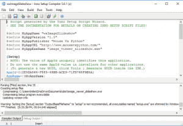

Inno 安装脚本

这是 Inno 安装脚本编辑器，其中预加载了您新生成的脚本。上半部分是生成的脚本，下半部分显示编译器的输出。在这个屏幕截图中，它显示安装文件已成功生成，但也显示了一个警告，提示您可能需要重命名安装文件。

此时，您应该有一个工作的安装程序可执行文件，它会将您的程序和它所依赖的任何文件安装到正确的位置。它还会在 Windows“开始”菜单和您在向导中指定的任何其他位置创建快捷方式。

脚本文件本身可以编辑。它只是一个文本文件，语法在 Inno Setup 的网站上有很好的记录。

* * *

### 代码签名

Windows 和 Mac OSX 更喜欢应用程序由公司或开发者签名。否则你会看到一个警告，提示你正在使用一段未签名的代码或软件。这很重要的原因是它保护你的应用程序不被其他人修改。您可以将代码签名视为应用程序中的一种嵌入式 MD5 哈希。已签名的应用程序可以追溯到签名者，这使得它更值得信任。

如果你想在 Mac OSX 上签署代码，你可以使用 [XCode](https://developer.apple.com/support/code-signing/)

Windows 有几个签名代码的选项。这里有一个 URL，可以让您的应用程序[获得 Windows](https://docs.microsoft.com/en-us/windows/desktop/win_cert/windows-certification-portal) 的认证

也可以从各种专门做代码签名的公司购买证书，比如 [digicert](https://www.digicert.com/code-signing/) 。

还有自签名证书的概念，但这不是针对生产或最终用户的。您将只为内部测试、概念验证等进行自签名。你可以自己查找如何做到这一点。

* * *

### 包扎

您现在已经学习了如何在 Windows、Mac 和 Linux 上使用 PyInstaller 生成可执行文件。生成可执行文件的命令在所有平台上都是相同的。虽然您不能通过在 Linux 上运行 PyInstaller 来创建 Windows 可执行文件，但它对于为目标操作系统创建可执行文件仍然非常有用。

您还了解了如何使用 Inno Setup 为 Windows 创建安装程序。现在，您可以使用这些技能为您自己的应用程序或本书中创建的一些其他应用程序创建可执行文件！

* * *

### 进一步阅读

*   bbfreeze 教程-构建二进制序列！
*   包装 [wxPyMail for Distribution](https://www.blog.pythonlibrary.org/2008/08/27/packaging-wxpymail-for-distribution/)