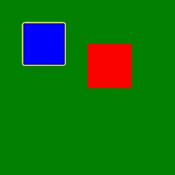

# 用枕头和 Python 绘制圆角矩形

> 原文：<https://www.blog.pythonlibrary.org/2021/05/12/drawing-rectangles-with-rounded-corners-with-pillow-and-python/>

Pillow 是一个致力于用 Python 处理图像的包。从 Pillow 8.2 开始，有了一种新的绘图类型:圆角矩形。圆角矩形允许您对矩形的角进行圆角处理。所以你得到的不是尖角，而是圆角！您可以在[枕头文档](https://pillow.readthedocs.io/en/stable/reference/ImageDraw.html#PIL.ImageDraw.ImageDraw.rounded_rectangle)中阅读所有关于新绘图类型的信息。

## 入门指南

确保你有最新版本的枕头。如果你的 Pillow 版本早于 8.2，那么你将不能使用这种新的绘图类型。

以下是升级枕头的方法:

```py
python3 -m pip install pillow --upgrade
```

现在您已经安装或升级了 Pillow，您可以使用新的绘图类型。

## 绘制圆角矩形

你现在可以画一个圆角矩形了。在您喜欢的 Python IDE 中打开一个新文件，并添加以下代码:

```py
# draw_rounded_rectangle.py

from PIL import Image, ImageDraw

def rectangle(output_path):
    image = Image.new("RGB", (400, 400), "green")
    draw = ImageDraw.Draw(image)
    # Draw a regular rectangle
    draw.rectangle((200, 100, 300, 200), fill="red")
    # Draw a rounded rectangle
    draw.rounded_rectangle((50, 50, 150, 150), fill="blue", outline="yellow",
                           width=3, radius=7)
    image.save(output_path)

if __name__ == "__main__":
    rectangle("rounded_rectangle.jpg")
```

**rounded_rectangle()** 函数接受一个由四个整数组成的元组。这些整数定义了边界框的两点。**半径**定义了拐角的圆角程度。你可以**用一种颜色填充**矩形。您也可以使用**轮廓**参数添加边框。**宽度**是边框的像素宽度。

当您运行此代码时，它将创建一个包含一个常规矩形和一个圆角矩形的图像，如下所示:



左边的蓝色矩形显示了圆角矩形的样子。如果将**半径**设置为零，那么拐角根本不会被倒圆。**半径**值越大，弯道上的曲线越大。

## 包扎

虽然这种新的绘图类型并不令人惊讶，但它是添加到您的绘图工具包中的一个很好的新工具。如果你坚持使用 8.2 之前的 Pillow 版本，有一些替代的方法可以在 [StackOverflow](https://stackoverflow.com/questions/7787375/python-imaging-library-pil-drawing-rounded-rectangle-with-gradient) 上创建圆角矩形。玩得开心！