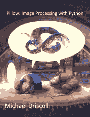

# 用 Python 和 Pillow 在图像上绘制形状

> 原文：<https://www.blog.pythonlibrary.org/2021/02/23/drawing-shapes-on-images-with-python-and-pillow/>

Pillow 提供了一个名为`ImageDraw`的绘图模块，你可以用它在你的`Image`对象上创建简单的 2D 图形。根据 Pillow 的文档，“你可以使用这个模块来创建新的图像，注释或修饰现有的图像，并动态生成图形供网络使用。”

如果你需要比 Pillow 更高级的绘图功能，你可以得到一个名为 [**aggdraw**](https://github.com/pytroll/aggdraw) 的单独包。

在本文中，您将重点关注枕头附带的内容。具体来说，您将了解以下内容:

*   通用参数
*   画线
*   画弧线
*   绘制和弦
*   绘制椭圆
*   绘制饼图切片
*   绘制多边形
*   绘制矩形

当使用 Pillow 绘图时，它使用与 Pillow 其他部分相同的坐标系。比如左上角还是(0，0)。如果您在图像边界之外绘制，这些像素将被丢弃。

如果您想指定一种颜色，您可以像使用`PIL.Image.new()`一样使用一系列数字或元组。对于“1”、“L”和“I”图像，使用整数。对于“RGB”图像，使用包含整数值的三元组。您也可以使用在第 2 章中了解到的 Pillow 支持的颜色名称。

## 通用参数

当你去使用各种绘图方法时，你会发现它们有许多共同的参数。您将提前了解这些参数，而不是在每一节中解释相同的参数！

### 正常男性染色体组型

大多数绘图方法都有一个`xy`参数，用于设置要在其中绘制图形的矩形区域。这可以通过以下两种方式来定义:

*   ((左上 x，左上 y)，(右下 x，右下 y))或者干脆((x1，y1)，(x2，y2))
*   (x1，y1，x2，y2)的盒元组

在绘制直线、多边形或点时，可以通过以下任一方式指定多个坐标:

*   `(x1, y1, x2, y2, x3, y3...)`
*   `((x1, y1), (x2, y2), (x3, y3)...)`

`line()`方法将画一条直线，连接每个点。`polygon()`将在每个点连接的地方画一个多边形。最后，`point()`会在每个点上画一个 1 像素的点。

### 充满

参数`fill`用于设置填充形状的颜色。设置`fill`的方式由图像模式决定:

*   `RGB`:使用(R，G，B)或颜色名称设置每个颜色值(0-255)
*   `L`(灰度):设置一个整数值(0-255)

默认为`None`或不填充。

### 概述

`outline`设置绘图的边框颜色。其规格与您用于`fill`的规格相同。

默认为`None`，表示无边框。

现在你已经知道了常用的参数，你可以继续学习如何开始绘画了！

## 画线

你将学习的第一种绘画是如何在枕头上画线。所有的形状都是由线条组成的。在 Pillow 的例子中，通过告诉 Pillow 在开始和结束坐标之间画线来画线。或者，您可以传入一系列 XY 坐标，Pillow 将绘制连线来连接这些点。

下面是`line()`方法定义:

```py
def line(self, xy, fill=None, width=0, joint=None):
    """Draw a line, or a connected sequence of line segments."""
```

您可以看到它接受几个不同的参数。在上一节中，您已经了解了其中一些参数的含义。`width`参数用于控制线条的宽度。

在你学会如何使用`joint`之前，你应该学会如何不用它画线。但是首先，你需要一张图片来画画。你将使用这张麦迪逊县大桥的图片:


麦迪逊县廊桥

现在打开您的 Python 编辑器，创建一个名为`draw_line.py`的新文件，并向其中添加以下代码:

```py
# draw_line.py

import random
from PIL import Image, ImageDraw

def line(image_path, output_path):
    image = Image.open(image_path)
    draw = ImageDraw.Draw(image)
    colors = ["red", "green", "blue", "yellow",
              "purple", "orange"]

    for i in range(0, 100, 20):
        draw.line((i, 0) + image.size, width=5, 
                  fill=random.choice(colors))

    image.save(output_path)

if __name__ == "__main__":
    line("madison_county_bridge_2.jpg", "lines.jpg")
```

这里你打开 Pillow 中的图像，然后将`Image`对象传递给`ImageDraw.Draw()`，后者返回一个`ImageDraw`对象。现在你可以在你的图像上画线了。在这种情况下，您使用一个`for`循环在图像上绘制五条线。在第一个循环中，起始图像从(0，0)开始。然后 X 位置在每次迭代中改变。端点是图像的大小。

您可以使用`random`模块从颜色列表中选择一种随机颜色。当您运行这段代码时，输出如下所示:


画在图像上的线条

现在你可以尝试创建一系列的点，并以这种方式画线。创建一个名为`draw_jointed_line.py`的新文件，并将以下代码放入您的文件中:

```py
# draw_jointed_line.py

from PIL import Image, ImageDraw

def line(output_path):
    image = Image.new("RGB", (400, 400), "red")
    points = [(100, 100), (150, 200), (200, 50), (400, 400)]
    draw = ImageDraw.Draw(image)
    draw.line(points, width=15, fill="green", joint="curve")
    image.save(output_path)

if __name__ == "__main__":
    line("jointed_lines.jpg")
```

这一次，你使用枕头而不是在你自己的枕头上画画来创建一个图像。然后创建一个点列表。为了使线条连接看起来更好，您可以将`joint`参数设置为“曲线”。如果你看一下`line()`方法的源代码，你会发现除了`None`之外,“曲线”是赋予它的唯一有效值。这可能会在枕头的未来版本中改变。

当您运行这段代码时，您的图像将如下所示:


绘制接合线

现在试着从代码中删除`joint`参数，并重新运行这个例子。您的输出将如下所示:


没有接头的线条

将`joint`设置为“曲线”，输出会稍微顺眼一些。

现在你已经准备好学习用枕头画弧线了！

## 画弧线

弧是一条曲线。你也可以用枕头画弧线。下面是`arc()`方法规范:

```py
def arc(self, xy, start, end, fill=None, width=1):
    """Draw an arc."""
```

也可以使用`xy`点生成一个`arc()`。`start`参数定义了起始角度，单位为度。`end`参数告诉 Pillow 结束角度是多少，也是以度为单位。另外两个参数已经介绍过了。

要查看如何绘制弧线，请创建一个名为`draw_arc.py`的新文件，并将以下代码添加到其中:

```py
# draw_arc.py

from PIL import Image, ImageDraw

def arc(output_path):
    image = Image.new("RGB", (400, 400), "white")
    draw = ImageDraw.Draw(image)
    draw.arc((25, 50, 175, 200), start=30, end=250, fill="green")

    draw.arc((100, 150, 275, 300), start=20, end=100, width=5, 
             fill="yellow")

    image.save(output_path)

if __name__ == "__main__":
    arc("arc.jpg")
```

在这段代码中，您创建了一个白色背景的新图像。然后你创建你的`Draw`对象。接下来，创建两条不同的弧。第一条弧线将填充绿色。第二条弧线将被填充为黄色，但其线宽将为 5。绘制弧线时，填充是指弧线的线条颜色。你没有填充弧线本身。

当您运行此代码时，您的输出图像将如下所示:


画弧线

尝试更改一些参数并重新运行代码，看看如何自己更改弧线。

现在让我们继续学习如何画和弦！

## 绘制和弦

枕头还支持**和弦**的概念。弦与弧相同，只是端点用直线连接。

下面是`chord()`的方法定义:

```py
def chord(self, xy, start, end, fill=None, outline=None, width=1):
    """Draw a chord."""
```

这里唯一的区别是你还可以添加一个`outline`颜色。可以用指定`fill`颜色的任何方式来指定该颜色。

创建一个新文件，命名为`draw_chord.py`。然后添加以下代码，这样您就可以看到自己是如何制作和弦的了:

```py
# draw_chard.py

from PIL import Image, ImageDraw

def chord(output_path):
    image = Image.new("RGB", (400, 400), "green")
    draw = ImageDraw.Draw(image)
    draw.chord((25, 50, 175, 200), start=30, end=250, fill="red")

    draw.chord((100, 150, 275, 300), start=20, end=100, width=5, fill="yellow",
                outline="blue")

    image.save(output_path)

if __name__ == "__main__":
    chord("chord.jpg")
```

此示例将在绿色图像上绘制两条弦。第一个和弦用红色填充。第二个和弦用黄色填充，但轮廓是蓝色的。蓝色轮廓的宽度为 5。

运行此代码时，您将创建以下图像:


绘制和弦

看起来不错。继续玩这个例子。稍加练习，你很快就会掌握用枕头制作和弦。

现在让我们继续学习画椭圆！

## 绘制椭圆

通过给 Pillow 一个边界框(xy ),在 Pillow 中绘制一个椭圆。在前面的章节中，您已经多次看到过这种情况。

下面是`ellipse()`方法的定义:

```py
def ellipse(self, xy, fill=None, outline=None, width=1):
    """Draw an ellipse."""
```

`ellipse()`让你用一种颜色填充它，添加一个彩色边框(`outline`)并改变那个`outline`的`width`。

要了解如何创建`ellipse()`，创建一个名为`draw_ellipse.py`的新文件，并将该代码添加到其中:

```py
# draw_ellipse.py

from PIL import Image, ImageDraw

def ellipse(output_path):
    image = Image.new("RGB", (400, 400), "white")
    draw = ImageDraw.Draw(image)
    draw.ellipse((25, 50, 175, 200), fill="red")

    draw.ellipse((100, 150, 275, 300), outline="black", width=5,
                 fill="yellow")

    image.save(output_path)

if __name__ == "__main__":
    ellipse("ellipse.jpg")
```

在这段代码中，您通过`new()`方法创建了一个漂亮的白色图像。然后你在它上面画一个红色的椭圆。最后，绘制第二个椭圆，用黄色填充并用黑色勾勒，轮廓宽度设置为 5。

当您运行此代码时，它创建的图像将如下所示:


绘制椭圆

您可以使用`ellipse()`创建椭圆形和圆形。试一试，看看你能用它做什么。

现在让我们来看看如何创建饼图切片！

## 绘制饼图切片

饼图切片与`arc())`相同，但也在边界框的端点和中心之间绘制直线。

下面是如何定义`pieslice()`方法的:

```py
def pieslice(self, xy, start, end, fill=None, outline=None, width=1):
    """Draw a pieslice."""
```

您已经在其他图形中使用了所有这些参数。回顾一下，`fill`给`pieslice()`的内部添加颜色，而`outline`给图形添加彩色边框。

要开始练习这个形状，创建一个名为`draw_pieslice.py`的新文件，并将以下代码添加到您的文件中:

```py
# draw_pieslice.py

from PIL import Image, ImageDraw

def pieslice(output_path):
    image = Image.new("RGB", (400, 400), "grey")
    draw = ImageDraw.Draw(image)
    draw.pieslice((25, 50, 175, 200), start=30, end=250, fill="green")

    draw.pieslice((100, 150, 275, 300), start=20, end=100, width=5, 
                  outline="yellow")

    image.save(output_path)

if __name__ == "__main__":
    pieslice("pieslice.jpg")
```

在这段代码中，您生成了一个灰色的图像来绘制。然后创建两个饼图切片。第一个`pieslice()`用绿色填充。第二个没填，但是确实有黄色的`outline`。注意，每个`pieslice()`都有不同的开始和结束程度。

当您运行此代码时，您将获得以下图像:


绘制饼图切片

只需做一点工作，您就可以使用 Pillow 创建一个饼图！您应该稍微修改一下代码，并更改一些值。你将很快学会如何自己制作一些美味的馅饼。

现在让我们来看看如何用枕头画多边形！

## 绘制多边形

多边形是一种几何形状，它有许多点(顶点)和相等数量的线段或边。正方形、三角形和六边形都是多边形。枕头可以让你创建自己的多边形。Pillow 的文档是这样定义多边形的:*多边形轮廓由给定坐标之间的直线，加上最后一个和第一个坐标之间的直线*组成。

下面是`polygon()`方法的代码定义:

```py
def polygon(self, xy, fill=None, outline=None):
    """Draw a polygon."""
```

现在，您应该对所有这些参数都很熟悉了。继续创建一个新的 Python 文件，并将其命名为`draw_polygon.py`。然后添加以下代码:

```py
# draw_polygon.py

from PIL import Image, ImageDraw

def polygon(output_path):
    image = Image.new("RGB", (400, 400), "grey")
    draw = ImageDraw.Draw(image)
    draw.polygon(((100, 100), (200, 50), (125, 25)), fill="green")

    draw.polygon(((175, 100), (225, 50), (200, 25)),
                  outline="yellow")

    image.save(output_path)

if __name__ == "__main__":
    polygon("polygons.jpg")
```

这段代码将创建一个类似于上一节中最后一个例子的灰色图像。然后它将创建一个多边形，用绿色填充。然后它将创建第二个多边形，用黄色勾勒出它的轮廓，不填充它。

在这两幅图中，您提供了三个点。这将创建两个三角形。

当您运行这段代码时，您将得到以下输出:


绘制多边形

尝试通过向上述代码中的一个或多个多边形添加额外的点来更改代码。只要稍加练习，你就能使用 Pillow 快速创建复杂的多边形。

## 绘制矩形

`rectangle()`方法允许你用枕头画一个矩形或正方形。下面是`rectangle()`的定义:

```py
def rectangle(self, xy, fill=None, outline=None, width=1):
    """Draw a rectangle."""
```

您可以传入定义开始和结束坐标的两个元组来绘制矩形。或者，您可以将四个坐标作为一个盒元组(4 项元组)来提供。然后你可以添加一个`outline`，`fill`给它加上颜色，并改变轮廓的`width`。

创建一个新文件，命名为`draw_rectangle.py`。然后用下面的代码填充它，这样你就可以开始画矩形了:

```py
# draw_rectangle.py

from PIL import Image, ImageDraw

def rectangle(output_path):
    image = Image.new("RGB", (400, 400), "blue")
    draw = ImageDraw.Draw(image)
    draw.rectangle((200, 100, 300, 200), fill="red")
    draw.rectangle((50, 50, 150, 150), fill="green", outline="yellow",
                   width=3)
    image.save(output_path)

if __name__ == "__main__":
    rectangle("rectangle.jpg")
```

这段代码将创建一个 400x400 像素的蓝色图像。然后它会画两个矩形。第一个矩形将用红色填充。第二个将用绿色填充，用黄色勾勒。

当您运行此代码时，您将得到以下图像作为输出:


绘制矩形

那些可爱的长方形不是吗？您可以修改矩形的点来创建更薄或更宽的矩形。您还可以修改添加到矩形的轮廓宽度。

## 包扎

您可以使用 Pillow 为图像添加形状。这有助于为图像添加轮廓，突出显示图像的一个或多个部分，等等。

在本文中，您了解了以下主题:

*   通用参数
*   画线
*   画弧线
*   绘制和弦
*   绘制椭圆
*   绘制饼图切片
*   绘制多边形
*   绘制矩形

您可以利用 Pillow 提供的形状做很多事情。你应该拿这些例子，并修改它们，用你自己的照片来测试它们。试一试，看看你能想出什么！

## 相关阅读

*   [用 Python 和 Pillow 在图像上绘制文本](https://www.blog.pythonlibrary.org/2021/02/02/drawing-text-on-images-with-pillow-and-python/)
*   PySimpleGUI: [用 Python GUI 在图像上绘制文本](https://www.blog.pythonlibrary.org/2021/02/03/pysimplegui-drawing-text-on-images-with-a-python-gui/)

| [](https://leanpub.com/pillow/) | 

### Pillow: image processing with Python

#### **Buy**

now on [Lean Pub](https://leanpub.com/pillow) t3 |