# 使用 Pillow 和 Python 在图像上绘制文本

> 原文：<https://www.blog.pythonlibrary.org/2021/02/02/drawing-text-on-images-with-pillow-and-python/>

除了形状之外，Pillow 还支持在图像上绘制文本。Pillow 使用自己的字体文件格式存储位图字体，限制为 256 个字符。Pillow 还支持 TrueType 和 OpenType 字体，以及 FreeType 库支持的其他字体格式。

在本章中，您将了解以下内容:

*   绘图文本
*   加载 TrueType 字体
*   更改文本颜色
*   绘制多行文本
*   对齐文本
*   更改文本不透明度
*   了解文本锚点

虽然这篇文章并没有完全覆盖使用 Pillow 绘制文本，但是当您阅读完这篇文章后，您将会对文本绘制的工作原理有一个很好的理解，并且能够自己绘制文本。

让我们从学习如何绘制文本开始。

#### 绘图文本

用枕头绘制文本类似于绘制形状。然而，绘制文本增加了复杂性，需要能够处理字体、间距、对齐等。您可以通过查看`text()`函数的签名来了解绘制文本的复杂性:

```py
def text(xy, text, fill=None, font=None, anchor=None, spacing=4, align='left', direction=None, 
	     features=None, language=None, stroke_width=0, stroke_fill=None, embedded_color=False)
```

这个函数接受的参数比你用 Pillow 绘制的任何形状都多！让我们依次检查一下这些参数:

*   `xy` -文本的锚点坐标(即开始绘制文本的位置)。
*   `text` -您希望绘制的文本字符串。
*   `fill` -文本的颜色(可以是一个元组，一个整数(0-255)或一个支持的颜色名称)。
*   `font` -一个`ImageFont`实例。
*   `anchor` -文本锚点对齐。确定锚点相对于文本的位置。默认对齐方式是左上方。
*   `spacing` -如果文本被传递到`multiline_text()`，这将控制行间的像素数。
*   `align` -如果文本被传递到`multiline_text()`、`"left"`、`"center"`或`"right"`。确定线条的相对对齐方式。使用锚定参数指定与`xy`的对齐。
*   `direction` -文字的方向。可以是`"rtl"`(从右到左)`"ltr"`(从左到右)或`"ttb"`(从上到下)。需要 libraqm。
*   `features` -文本布局期间使用的 OpenType 字体特性列表。需要 libraqm。
*   `language` -文本的语言。不同的语言可能使用不同的字形或连字。此参数告诉字体文本使用哪种语言，并根据需要应用正确的替换(如果可用)。这应该是 BCP 47 语言代码。需要 libraqm。
*   `stroke_width` -文本笔画的宽度
*   `stroke_fill` -文字笔画的颜色。如果没有设置，它默认为`fill`参数的值。
*   `embedded_color` -是否使用字体嵌入颜色字形(COLR 或 CBDT)。

除非您的工作需要使用外语或晦涩难懂的字体功能，否则您可能不会经常使用这些参数。

当谈到学习新事物时，从一个好的例子开始总是好的。打开 Python 编辑器，创建一个名为`draw_text.py`的新文件。然后向其中添加以下代码:

```py
# draw_text.py

from PIL import Image, ImageDraw, ImageFont

def text(output_path):
    image = Image.new("RGB", (200, 200), "green")
    draw = ImageDraw.Draw(image)
    draw.text((10, 10), "Hello from")
    draw.text((10, 25), "Pillow",)
    image.save(output_path)

if __name__ == "__main__":
    text("text.jpg")
```

这里你使用 Pillow 的`Image.new()`方法创建一个小图像。它有一个漂亮的绿色背景。然后创建一个绘图对象。接下来，您告诉 Pillow 在哪里绘制文本。在这种情况下，您绘制两行文本。

当您运行此代码时，您将获得以下图像:

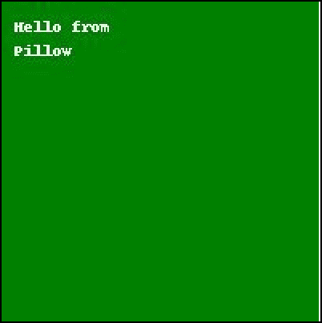

看起来不错。通常，当您在图像上绘制文本时，您会指定一种字体。如果手头没有字体，可以使用上面的方法，也可以使用 Pillow 的默认字体。

下面的示例更新了上一个示例，使用 Pillow 的默认字体:

```py
# draw_text_default_font.py

from PIL import Image, ImageDraw, ImageFont

def text(output_path):
    image = Image.new("RGB", (200, 200), "green")
    draw = ImageDraw.Draw(image)
    font = ImageFont.load_default()
    draw.text((10, 10), "Hello from", font=font)
    draw.text((10, 25), "Pillow", font=font)
    image.save(output_path)

if __name__ == "__main__":
    text("text.jpg")
```

在这个版本的代码中，您使用`ImageFont.load_default()`来加载 Pillow 的默认字体。然后将字体应用于文本，用`font`参数传递它。

这段代码的输出将与第一个示例相同。

现在让我们来看看如何使用枕头 TrueType 字体！

#### 加载 TrueType 字体

Pillow 支持加载 TrueType 和 OpenType 字体。因此，如果你有一个最喜欢的字体或公司规定的字体，Pillow 可能会加载它。您可以下载许多开源 TrueType 字体。一个流行的选择是 **Gidole** ，你可以在这里得到:

*   [https://github.com/larsenwork/Gidole](https://github.com/larsenwork/Gidole)

Pillow 包的测试文件夹中也有几种字体。你可以在这里下载 Pillow 的源代码:

*   [https://github.com/python-pillow/Pillow](https://github.com/python-pillow/Pillow)

本书在 Github 上的代码库包括 Gidole 字体以及 Pillow tests 文件夹中的一些字体，您可以在本章的示例中使用这些字体:

*   [https://github.com/driscollis/image_processing_with_python](https://github.com/driscollis/image_processing_with_python)

要查看如何加载 TrueType 字体，创建一个新文件并命名为`draw_truetype.py`。然后输入以下内容:

```py
# draw_truetype.py

from PIL import Image, ImageDraw, ImageFont

def text(input_image_path, output_path):
    image = Image.open(input_image_path)
    draw = ImageDraw.Draw(image)
    y = 10
    for font_size in range(12, 75, 10):
        font = ImageFont.truetype("Gidole-Regular.ttf", size=font_size)
        draw.text((10, y), f"Chihuly Exhibit ({font_size=}", font=font)
        y += 35
    image.save(output_path)

if __name__ == "__main__":
    text("chihuly_exhibit.jpg", "truetype.jpg")
```

对于这个例子，您使用 **Gidole** 字体并加载一张在德克萨斯州达拉斯植物园拍摄的图像:

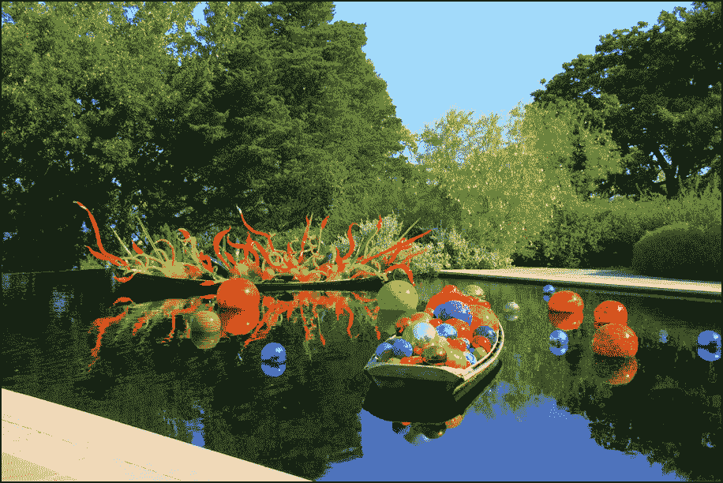

然后循环几种不同的字体大小，在图像的不同位置写出一个字符串。当您运行这段代码时，您将创建一个如下所示的图像:
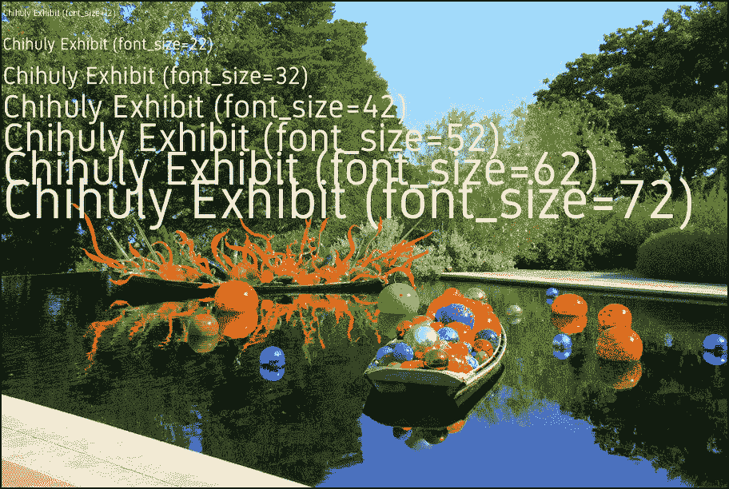

这段代码演示了如何使用 TrueType 字体改变字体大小。现在，您已经准备好学习如何在不同的 TrueType 字体之间切换。

创建另一个新文件，并将其命名为`draw_multiple_truetype.py`。然后把这段代码放进去:

```py
# draw_multiple_truetype.py

import glob
from PIL import Image, ImageDraw, ImageFont

def truetype(input_image_path, output_path):
    image = Image.open(input_image_path)
    draw = ImageDraw.Draw(image)
    y = 10
    ttf_files = glob.glob("*.ttf")
    for ttf_file in ttf_files:
        font = ImageFont.truetype(ttf_file, size=44)
        draw.text((10, y), f"{ttf_file} (font_size=44)", font=font)
        y += 55
    image.save(output_path)

if __name__ == "__main__":
    truetype("chihuly_exhibit.jpg", "truetype_fonts.jpg")
```

这里您使用 Python 的`glob`模块来搜索扩展名为`.ttf`的文件。然后你遍历这些文件，用`glob`找到的每种字体写出图片上的字体名称。

当您运行这段代码时，您的新图像将如下所示:

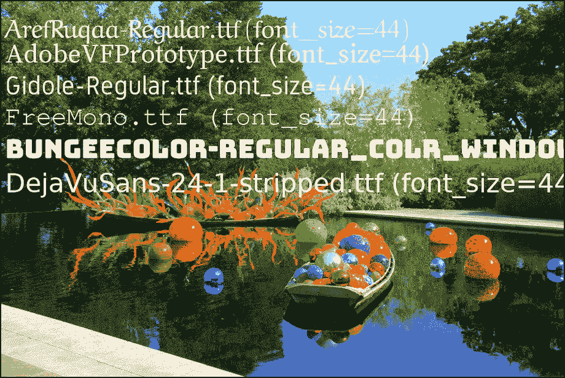

这演示了在一个代码示例中编写多种格式的文本。您始终需要提供要加载的 TrueType 或 OpenType 字体文件的相对或绝对路径。如果您不提供有效的路径，将会引发一个`FileNotFoundError`异常。

现在让我们继续学习如何改变你的文本颜色！

#### 更改文本颜色

Pillow 允许您通过使用`fill`参数来改变文本的颜色。您可以使用 RGB 元组、整数或支持的颜色名称来设置此颜色。

继续创建一个新文件，命名为`text_colors.py`。然后在其中输入以下代码:

```py
# text_colors.py

from PIL import Image, ImageDraw, ImageFont

def text_color(output_path):
    image = Image.new("RGB", (200, 200), "white")
    draw = ImageDraw.Draw(image)
    colors = ["green", "blue", "red", "yellow", "purple"]
    font = ImageFont.truetype("Gidole-Regular.ttf", size=12)
    y = 10
    for color in colors:
        draw.text((10, y), f"Hello from Pillow", font=font, fill=color)
        y += 35
    image.save(output_path)

if __name__ == "__main__":
    text_color("colored_text.jpg")
```

在本例中，您创建了一个新的白色图像。然后创建一个颜色列表。接下来，循环列表中的每种颜色，并使用`fill`参数应用颜色。

当您运行这段代码时，您将得到这个漂亮的输出:

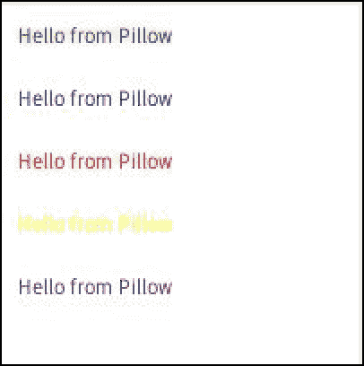

这个输出演示了如何改变文本的颜色。

现在让我们学习如何一次绘制多行文本！

#### 绘制多行文本

Pillow 还支持一次绘制多行文本。在本节中，您将学习绘制多条线的两种不同方法。第一种是通过使用 Python 的换行符:`\n`。

要了解其工作原理，创建一个文件并将其命名为`draw_multiline_text.py`。然后添加以下代码:

```py
# draw_multiline_text.py

from PIL import Image, ImageDraw, ImageFont

def text(input_image_path, output_path):
    image = Image.open(input_image_path)
    draw = ImageDraw.Draw(image)
    font = ImageFont.truetype("Gidole-Regular.ttf", size=42)
    text = "Chihuly Exhibit\nDallas, Texas"
    draw.text((10, 25), text, font=font)
    image.save(output_path)

if __name__ == "__main__":
    text("chihuly_exhibit.jpg", "multiline_text.jpg")
```

对于本例，您创建一个中间插入换行符的字符串。当您运行此示例时，您的结果应该如下所示:

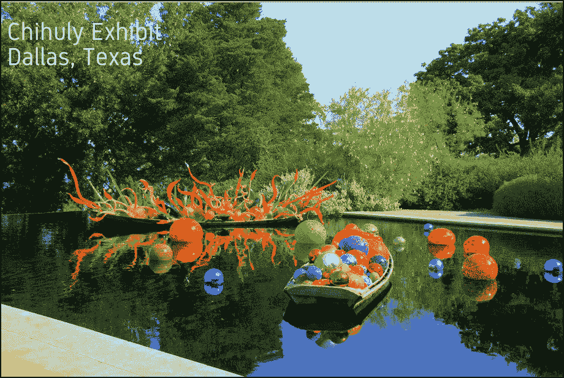

Pillow 也有一个用于绘制多行文本的内置方法。把你在上例中写的代码复制并粘贴到一个新文件中。保存新文件，并将其命名为`draw_multiline_text_2.py`。

现在修改代码，使其使用`multiline_text()`函数:

```py
# draw_multiline_text_2.py

from PIL import Image, ImageDraw, ImageFont

def text(input_image_path, output_path):
    image = Image.open(input_image_path)
    draw = ImageDraw.Draw(image)
    font = ImageFont.truetype("Gidole-Regular.ttf", size=42)
    text = """
    Chihuly Exhibit
    Dallas, Texas"""
    draw.multiline_text((10, 25), text, font=font)
    image.save(output_path)

if __name__ == "__main__":
    text("chihuly_exhibit.jpg", "multiline_text_2.jpg")
```

在本例中，您使用 Python 的三重引号创建了一个多行字符串。然后通过调用`multiline_text()`将该字符串绘制到图像上。

当您运行这段代码时，您的图像会略有不同:

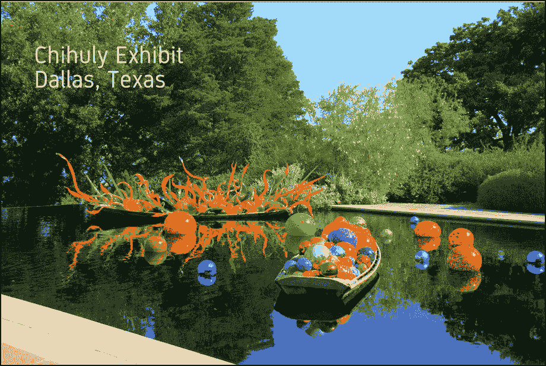

文本位于上一示例的右下方。原因是您使用了 Python 的三重引号来创建字符串。它保留了您给它的换行符和缩进。如果你把这个字符串放到前面的例子中，它看起来应该是一样的。

`multiline_text()`并不影响最终结果。

现在，让我们学习如何在绘制文本时对齐文本。

#### 对齐文本

枕头让你对齐文本。但是，对齐是相对于锚点的，并且仅适用于多行文字。在本节中，您将看到一种不使用`align`参数来对齐文本的替代方法。

要开始使用`align`，创建一个新文件并将其命名为`text_alignment.py`。然后添加以下代码:

```py
# text_alignment.py

from PIL import Image, ImageDraw, ImageFont

def alignment(output_path):
    image = Image.new("RGB", (200, 200), "white")
    draw = ImageDraw.Draw(image)
    alignments = ["left", "center", "right"]
    y = 10
    font = ImageFont.truetype("Gidole-Regular.ttf", size=12)
    for alignment in alignments:
        draw.text((10, y), f"Hello from\n Pillow", font=font,
                align=alignment, fill="black")
        y += 35
    image.save(output_path)

if __name__ == "__main__":
    alignment("aligned_text.jpg")
```

这里你创建了一个小的，白色的图像。然后创建所有有效对齐选项的列表:“左”、“居中”和“右”。接下来，循环遍历这些对齐值，并将它们应用于同一个多行字符串。

运行此代码后，您将得到以下结果:

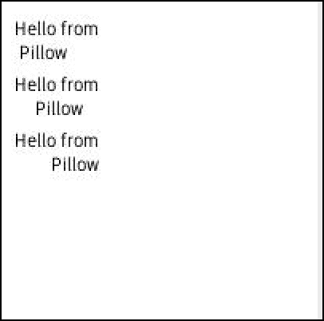

通过查看输出，您可以对 Pillow 中的对齐方式有所了解。这是否适合您的用例取决于您自己。除了设置参数`align`之外，您可能还需要调整开始绘图的位置，以获得您真正想要的结果。

你可以用 Pillow 来得到你的绳子的尺寸，然后做一些简单的数学运算来试着把它放在中间。为此，您可以使用绘图对象的`textsize()`方法或字体对象的`getsize()`方法。

要了解其工作原理，您可以创建一个名为`center_text.py`的新文件，并将以下代码放入其中:

```py
# center_text.py

from PIL import Image, ImageDraw, ImageFont

def center(output_path):
    width, height = (400, 400)
    image = Image.new("RGB", (width, height), "grey")
    draw = ImageDraw.Draw(image)
    font = ImageFont.truetype("Gidole-Regular.ttf", size=12)
    text = "Pillow Rocks!"
    font_width, font_height = font.getsize(text)

    new_width = (width - font_width) / 2
    new_height = (height - font_height) / 2
    draw.text((new_width, new_height), text, fill="black")
    image.save(output_path)

if __name__ == "__main__":
    center("centered_text.jpg")
```

在这种情况下，您跟踪图像的大小以及字符串的大小。对于这个例子，您使用了`getsize()`来获得基于字体和字体大小的字符串的宽度和高度。

然后你把图像的宽度和高度减去字符串的宽度和高度，再除以 2。这将为您提供在图像中心书写文本所需的坐标。

当您运行这段代码时，您可以看到文本很好地居中:

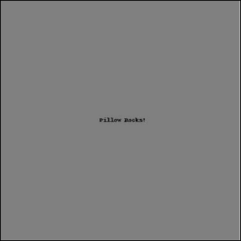

然而，当你增加字体大小时，这个值开始下降。你增加得越多，它就离中心越远。在 StackOverflow 上有几个备选解决方案:

*   [https://stack overflow . com/questions/1970 807/center-middle-align-text-with-pil](https://stackoverflow.com/questions/1970807/center-middle-align-text-with-pil)

主要的收获是，你可能最终需要为你正在使用的字体计算你自己的偏移量。毕竟排版是一件复杂的事情。

现在让我们来看看如何改变你的文字的不透明度！

#### 更改文本不透明度

Pillow 也支持改变文本的不透明度。这意味着你可以让文本透明、不透明或介于两者之间。这只适用于具有 alpha 通道的图像。

对于这个例子，您将使用这个花图像:


现在创建一个新文件，命名为`text_opacity.py`。然后将以下代码添加到新文件中:

```py
# text_opacity.py

from PIL import Image, ImageDraw, ImageFont

def change_opacity(input_path, output_path):
    base_image = Image.open(input_path).convert("RGBA")

    txt_img = Image.new("RGBA", base_image.size, (255,255,255,0))
    font = ImageFont.truetype("Gidole-Regular.ttf", 40)
    draw = ImageDraw.Draw(txt_img)

    # draw text at half opacity
    draw.text((10,10), "Pillow", font=font, fill=(255,255,255,128))

    # draw text at full opacity
    draw.text((10,60), "Rocks!", font=font, fill=(255,255,255,255))

    composite = Image.alpha_composite(base_image, txt_img)
    composite.save(output_path)

if __name__ == "__main__":
    change_opacity("flowers_dallas.png", "flowers_opacity.png")
```

在这个例子中，你打开花的形象，并将其转换为 RGBA。然后，创建一个与花图像大小相同的新图像。接下来，加载 Gidole 字体，并使用刚刚创建的自定义图像创建一个绘图上下文对象。

现在有趣的部分来了！你画一个字符串，设置 alpha 值为 128，这相当于大约一半的不透明度。然后你在下面的线上画第二条线，告诉 Pillow 使用完全不透明。请注意，在这两个实例中，您使用的是 RGBA 值，而不是颜色名称，就像您在前面的代码示例中所做的那样。这使您在设定 alpha 值时更加灵活。

最后一步是调用`alpha_composite()`并将`txt_img`合成到`base_image`上。

当您运行这段代码时，您的输出将如下所示:

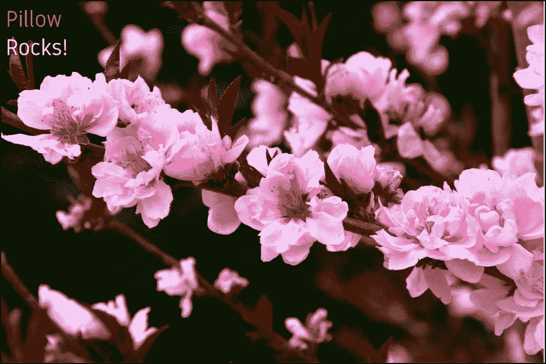

这演示了如何用 Pillow 改变文本的不透明度。你应该为你的`txt_img`尝试一些不同的值，看看它如何改变文本的不透明度。

现在，让我们了解什么是文本锚点，以及它们如何影响文本位置。

#### 了解文本锚点

您可以使用`anchor`参数来确定您的文本相对于您给定的`xy`坐标的对齐方式。默认是左上角，这是`la`(左上)锚。根据文档，`la`表示左上对齐的文本。

锚点中的第一个字母指定其**水平**对齐，而第二个字母指定其**垂直**对齐。在接下来的两个小节中，您将了解每个锚点名称的含义。

##### 水平锚定对齐

有四个水平锚。以下内容改编自关于水平锚的文件:

*   `l`(左)-锚点位于文本的左侧。说到*横文*，这就是第一个字形的由来。
*   `m`(中间)-锚点与文本水平居中。在*垂直文本*的情况下，你应该使用`s`(基线)对齐，因为它不会根据文本中使用的特定字形而改变。
*   `r`(右)-锚点在文本的右边。对于*横排文本*，这是最后一个字形的高级原点。
*   `s` -基线(仅垂直文本)。对于*垂直文本*这是推荐的对齐方式，因为它不会根据给定文本的特定字形而改变

##### 垂直锚定对齐

有六个垂直锚。以下内容改编自关于垂直锚的文件:

*   `a`(上升/顶部)-(仅横向文本)。锚点位于文本第一行的上行(顶部)，由字体定义。
*   `t`(顶部)——(仅限单行文本)。锚点在文本的顶部。对于垂直文本，这是第一个字形的原点。对于*水平文本*，建议使用(上升)对齐，因为它不会基于给定文本的特定字形而改变。
*   `m`(中间)-锚点与文本垂直居中。对于*水平文本*，这是第一个上行线和最后一个下行线的中点。
*   `s` —基线(仅限水平文本)。锚点位于文本第一行的基线(底部)，只有下行线延伸到锚点下方。
*   `b`(底部)-(仅单行文本)。锚点在文本的底部。对于*竖排文本*这是最后一个字形的高级原点。对于*水平文本*，建议使用`d`(下行)对齐，因为它不会根据给定文本的特定字形而改变。
*   `d`(下行/底部)-(仅横向文本)。锚点位于文本最后一行的下行线(底部)，由字体定义。

#### 锚点示例

如果你所做的只是谈论锚，锚是很难想象的。如果你能创造一些例子来看看到底发生了什么，那会很有帮助。Pillow 在他们关于 anchors 的文档中提供了一个例子，还有一些非常有用的图片:

*   [https://pillow . readthe docs . io/en/stable/handbook/text-anchors . html](https://pillow.readthedocs.io/en/stable/handbook/text-anchors.html)

你可以以他们为例，稍加修改，使之更有用。要了解如何操作，请创建一个新文件并将其命名为`create_anchor.py`。然后向其中添加以下代码:

```py
# create_anchor.py

from PIL import Image, ImageDraw, ImageFont

def anchor(xy=(100, 100), anchor="la"):
    font = ImageFont.truetype("Gidole-Regular.ttf", 32)
    image = Image.new("RGB", (200, 200), "white")
    draw = ImageDraw.Draw(image)
    draw.line(((0, 100), (200, 100)), "gray")
    draw.line(((100, 0), (100, 200)), "gray")
    draw.text((100, 100), "Python", fill="black", anchor=anchor, font=font)
    image.save(f"anchor_{anchor}.jpg")

if __name__ == "__main__":
    anchor(anchor)
```

您可以按原样运行这段代码。默认锚点是“la ”,但是您在这里明确地调用了它。你也可以画一个十字线来标记`xy`的位置。如果你用其他设置运行它，你可以看到锚是如何影响它的。

下面是使用六个不同主播的六次不同跑步的截图: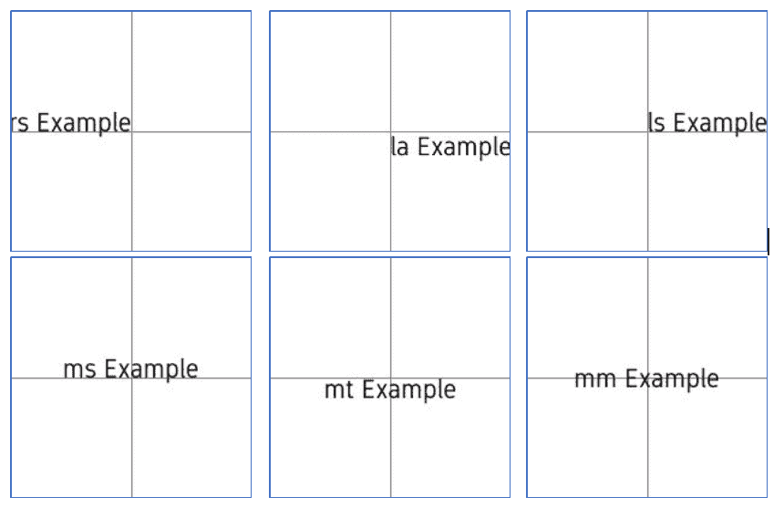

您可以尝试使用这里没有显示的其他锚来运行这段代码。也可以调整位置元组，用不同的锚点重新运行一遍。如果你想的话，你甚至可以创建一个循环来遍历锚点并创建一组例子。

#### 包扎

至此，您已经很好地理解了如何使用 Pillow 绘制文本。事实上，您已经学会了如何做以下所有事情:

*   绘图文本
*   加载 TrueType 字体
*   更改文本颜色
*   绘制多行文本
*   对齐文本
*   更改文本不透明度
*   了解文本锚点
*   创建文本绘图 GUI

你现在可以把你学到的东西付诸实践。本文中有很多例子，您可以用它们作为创建新应用程序的起点！