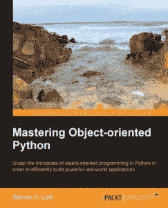

# 电子书竞赛:赢得免费的《掌握面向对象的 Python》副本

> 原文：<https://www.blog.pythonlibrary.org/2014/05/12/ebook-contest-win-a-free-copy-of-mastering-object-oriented-python/>

### 这场比赛结束了！

Packt Publishing 与我的博客合作，赠送了两本 Steven Lott 的电子书版本的《掌握面向对象的 Python》。你可以在这里阅读我的完整书评，但是坦率地说，我认为这是我很久以来读过的最好的高级 Python 书籍之一。它也是基于 Python 3 的，尽管大多数概念都适用于 Python 2。

### 你如何能赢

要赢得这本书，你需要做的就是在下面提出评论，强调“你为什么想赢得这本书”的原因。

### 竞赛持续时间和获胜者的选择

比赛有效期为两周，对所有人开放。获胜者将根据他们发表的评论选出。比赛将于 2014 年 5 月 26 日下午 1 点(美国中部时间)结束。