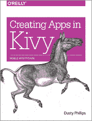

# 电子书评论:在 Kivy 中创建应用程序

> 原文：<https://www.blog.pythonlibrary.org/2014/05/01/ebook-review-creating-apps-in-kivy/>

Kivy 是一个简洁的包，允许 Python 开发者在移动设备上创建用户界面。您也可以将应用程序部署到桌面上。这是我看到的关于这个主题的第二本书。Roberto Ulloa 的第一本书《Python 中的 Kivy-Interactive Applications》于去年由 Packt 出版社出版。今年，我们有达斯丁·菲利普斯的作品，[在奥莱利用基维语创作应用程序。我将评论这本书的 PDF 版本。](http://www.amazon.com/gp/product/B00JKZSYS6/ref=as_li_tl?ie=UTF8&camp=1789&creative=390957&creativeASIN=B00JKZSYS6&linkCode=as2&tag=thmovsthpy-20&linkId=KFVINA3S7TDFWMKF)

* * *

### 快速回顾

*   **为什么拿起这本书:**因为喜欢作者之前的作品 [Python 3 面向对象编程](https://www.blog.pythonlibrary.org/2010/08/22/book-review-python-3-object-oriented-programming/)所以拿起这本书
*   我为什么要读完它:这本书很短，而且很有趣
*   **我会把它给:**一个已经了解 Python 的人

* * *

### 图书格式

你可以得到这本书的平装本、epub、mobi 或 PDF。

* * *

### 书籍内容

这本书实际上只是关于创建一个应用程序。共 9 章，132 页。

* * *

### 全面审查

第一章是对基维语和基维语的介绍。KV 语言有点像 GUI 的强大 CSS 版本。在这一章中，你将学习如何创建基本的小部件，并对 KV 进行深入研究，同时开始这本书的总体项目。第二章介绍了 Kivy 的事件系统是如何工作的，以及如何在 KV 定义的小部件中访问属性。

第 3 章深入探讨了如何操作小部件。这意味着您将学习如何交换小部件和整个表单。第四章讨论了“迭代开发”的概念，并通过一个例子说明了作者是如何从不同的角度解决问题的。您还将学习如何使用 Kivy 从互联网上检索数据。在第五章中，我们学习了 Kivy 的图形(如绘画/动画)来使用户界面更有吸引力。它还讨论了向应用程序添加图标。

第六章是关于 Kivy 世界的坚持。你如何保存你的设置？你将在本章中找到答案。您还将了解所有 Kivy 应用程序的默认设置以及如何修改它们。在第七章，我们学习手势。如何记录手势、触摸事件、基于手势的击发事件等。

第八章是关于 Kivy 的高级部件。您将了解 Carousel 小部件(允许在多个小部件之间滑动)、ModalView 和 Popup 小部件(用于在其他小部件上显示小部件)以及 ActionBar。本章还有一个重构代码的例子。第九章讲述了如何使用定制部署工具 buildozer 将你的应用发布到 Android 和 iOS。

我发现这本书比我读的上一本 Kivy 的书好了一步。虽然标题有点误导，但您仍然会学到很多关于 Kivy 及其内部的知识。我在这里和那里看到一些错别字，但我也有这本书的早期版本，所以我猜我的版本还没有完全编辑好。我要说的是，我在图形章节中遇到了一点麻烦，最终只是阅读了示例，而没有尝试。我喜欢学习许多关于如何使用 Kivy 以及如何适当地将 KV 代码与 Python 混合的简洁的小提示。

虽然我很想在书中看到其他应用示例，但本文涵盖了开始使用 Kivy 所需了解的所有要点。我认为如果你将这本书与 Kivy 文档和示例片段结合起来，你将很快掌握 Kivy。

|  | 

### 在 Kivy 中创建应用程序

达斯丁·菲利普斯**[亚马逊](http://www.amazon.com/gp/product/B00JKZSYS6/ref=as_li_tl?ie=UTF8&camp=1789&creative=390957&creativeASIN=B00JKZSYS6&linkCode=as2&tag=thmovsthpy-20&linkId=KFVINA3S7TDFWMKF target=)**奥莱利 |

* * *

### 其他书评

*   Python 中的交互式应用
*   Ron DuPlain 开发的
*   弗莱彻·海斯勒的《真正的蟒蛇》
*   [Python 3 面向对象编程](https://www.blog.pythonlibrary.org/2010/08/22/book-review-python-3-object-oriented-programming/)

* * *

### 关于 Kivy 的附加信息

*   [在 Kivy 中创建应用程序](http://archlinux.me/dusty/2013/06/13/creating-an-application-in-kivy-part-1/)
*   The [Kivy API](http://kivy.org/docs/api-kivy.html)