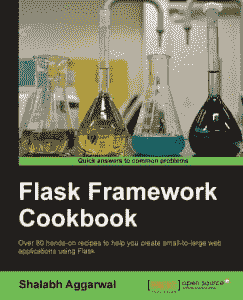

# 电子书评论:烧瓶框架食谱

> 原文：<https://www.blog.pythonlibrary.org/2014/12/19/ebook-review-flask-framework-cookbook/>

Packt Publishing 最近发给我一本电子书版本的 Shalabh Aggarwal 的《Flask Framework Cookbook》。我没有读完整本书，因为烹饪书通常不是非常有趣的线性读物。我只是通过它和樱桃挑选了各种食谱。但是在我进入太多细节之前，让我们快速回顾一下！

* * *

### 快速回顾

*   **拿起它的原因:**出版社让我看这本书。
*   我完成它的原因:正如已经提到的，我实际上只是浏览了一下这本书，看了一些随意的食谱
*   **我会把它给:**一个初涉 Flask 或可能是中级 Flask 开发人员的人

* * *

### 图书格式

你可以得到这本书的平装本、epub、mobi 或 PDF。

* * *

### 书籍内容

这本书分为 12 章，258 页，80 多个食谱。

* * *

### 全面审查

Packt 总是推出小众 Python 书籍。Flask 是比较流行的 Python 微型 web 框架之一，所以它可能有相当多的受众。让我们花点时间看看这些章节涵盖了什么。在第一章中，我们找到了许多配置 Flask 的方法。它包含了关于使用基于类的设置，静态文件，蓝图和更多的信息。第二章用一组关于模板语言 Jinja 的食谱稍微改变了一些事情。在第三章中，我们使用 SQLAlchemy 进行数据建模。还有 Redis，Alembic，MongoDB 的配方。第四章是关于使用视图。它包含关于 XHR 请求、基于类的视图、自定义 404 处理程序和其他几个配方的信息。

在第五章中，作者重点讨论了带有 WTForms 的 webforms。在这里，我们将了解字段验证、上传文件和跨站伪造。对于第 6 章，我们将讨论认证方案。有 Flask-Login 扩展、OpenID、脸书、Google 和 Twitter 的配方。第 7 章讨论 RESTful API 构建。本章只有四种方法，其中两种是关于创建不同类型的 REST 接口的。最后一个方法是一个完整的 REST API 示例。第八章是关于 Flask 中的管理界面。在这里你将学习 Flask-Admin 扩展，自定义表单，用户角色等等！

第九章带我们进入国际化和本地化。它的食谱最少，只有 3 种。您将学习如何添加新语言、语言切换和 gettext/ngettext。继续第十章，我们将学习调试、错误处理和测试。在这里，我们涵盖了从发送错误邮件到使用 pdb 调试器到 nose、mock 和覆盖率测试的所有内容。第 11 章是关于部署的。它涵盖了关于 apach，Gunicornm 龙卷风，织物，Heroku，AWS 弹性豆茎，应用程序监控和其他一些项目的食谱。第 12 章用其他技巧和诀窍来充实这本书，比如全文搜索、使用信号、缓存、芹菜等等。

总的来说，我觉得这本书写得相当好。有一些地方有点起伏，因为我不相信作者是以英语为母语的人，但散文并没有因此受到很大影响。大多数食谱作为独立的片段运行良好。有时候代码片段看起来并不完全可以运行，但是您应该能够从 Packt 下载完整的代码。我并不总是发现食谱的分组是完全一致的，但在大多数情况下，它们在一起是有意义的。我推荐这本书给那些想把自己的技能提升到一个新水平的 Flask 初学者，以及那些需要更完整地理解你可以用 Flask 做的事情的人。

|  | 

### 烧瓶框架食谱

作者:沙拉布·阿格沃尔**[亚马逊](http://www.amazon.com/gp/product/178398340X/ref=as_li_tl?ie=UTF8&camp=1789&creative=390957&creativeASIN=178398340X&linkCode=as2&tag=thmovsthpy-20&linkId=2QSNQXU6EGH5P7KH target=)**[打包发布](https://www.packtpub.com/web-development/flask-framework-cookbook) |

* * *

### 其他书评

*   L. Felipe Martins 著
*   达斯丁·菲利普斯用 Kivy 语言创建应用程序
*   Roberto Ulloa 的 Python 交互式应用
*   Ron DuPlain 开发的
*   弗莱彻·海斯勒的《真正的蟒蛇》
*   达斯丁·菲利普斯的 Python 3 面向对象编程