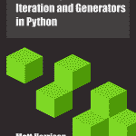

# 电子书评论-指南:学习 Python 中的迭代和生成器

> 原文：<https://www.blog.pythonlibrary.org/2012/04/28/ebook-review-guide-to-learning-iteration-and-generators-in-python/>

上个月大约在 2012 年美国 PyCon 的时候，Matt Harrison 给我发了一本他的新书,**Guide to:Learning Iteration and Generators in Python**。我一直想学习更多关于发电机的知识，所以我认为这是非常偶然的。可悲的是，我花了一个月才抽出时间来读它。mobi(即 Kindle)版本的电子书重量为 460 kb，epub 版本为 460 kb。在跳跃之后，我们将快速地看一下好的和坏的。

### 好人

这是一本技术性很强的书。我想如果它被印刷出来，它会有 50 页左右。所以是速读。另外，它在亚马逊上的零售价仅为 3.99 美元。我想说，这本书是为中高级 Python 程序员而写的，因为作者使用了许多高度技术性的术语，并深入挖掘了 Python 本身的本质，尤其是在最初几章。他也不会花太多时间来解释琐碎的事情，所以我认为这可以作为如今 PyCon 上自吹自擂的“极端”谈话的一个很好的模板。对我来说最重要的是，这本书向我展示了我可以在当天创建的代码中实现生成器的地方。我只是觉得那很酷！您还了解了迭代器和可迭代对象之间的区别，这有点令人难以置信。

### 坏事

作者并没有说他在给我发一个草稿，但我想这就是我收到的。我的意思是，有很多小句子问题，你会看到像“the”而不是“than”这样的东西，或者一个句子缺少“the”、“an”或“a”，这可能使句子读起来很别扭。我发现前几个例子有点令人困惑，因为作者使用了一个 **while** 循环来描述一个循环的**。最令人困惑的一点是，他指的是一个**而**循环，因为它是前面的**循环的例子。更有趣的错误之一是这句话:****

像 Stack Overfull 这样的网站充斥着声称 xrange 是一个生成器的答案。(Kindle 位置 403)

### 判决

我找不到这本书的勘误表，所以我不能说这些吹毛求疵的小问题已经解决了。因为这本书非常专业，所以这也不是初学者学习发电机的最佳方式。另一方面，有时先学习困难的方法是好的。如果你正在努力理解发电机，或者想知道它们为什么存在，那么我想这本书会帮助你。否则，您可以随时查看文档。

|  | 

### 指南:学习 Python 中的迭代和生成器

作者马特·哈里森**[从亚马逊购买](http://www.amazon.com/gp/product/B007JR4FCQ/ref=as_li_ss_tl?ie=UTF8&tag=thmovsthpy-20&linkCode=as2&camp=1789&creative=390957&creativeASIN=B007JR4FCQ)****[作者网站](http://hairysun.com/books/generators/)** |