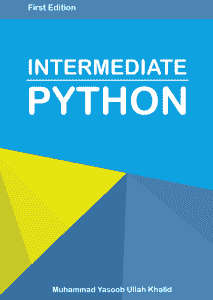

# 电子书评论:中级 Python

> 原文：<https://www.blog.pythonlibrary.org/2015/09/02/ebook-review-intermediate-python/>

最近，免费电子书《中级 Python》的作者 Muhammad Yasoob Ullah Khalid 找到我，评论他的作品。Yasoob 是 Python 技巧博客的幕后推手。这本书已经在 [Github](https://github.com/yasoob/intermediatePython) 上开源发布，但是可以从 [ReadTheDocs](http://readthedocs.org/projects/intermediatepythongithubio/downloads/pdf/latest/) 下载 PDF 格式。但是在我详细介绍这本书之前，我先简单回顾一下:

* * *

### 快速回顾

*   **为什么拿起:**作者让我看这本书。
*   为什么我读完了这本书:实际上，我通读了这本书的大部分内容，并浏览了剩下的部分
*   **我想把它给:**一个想要学习更多 Python 语言的初学者

* * *

### 图书格式

你可以得到这本书的 PDF，ePub，Mobi，HTML 或者它的源代码，在 RestructuredText 中。你可以在这里购买电子书。

* * *

### 书籍内容

在写这篇评论的时候，这本书被分成 24 章，共 75 页，但由于它是开源的，这可能会改变。

* * *

### 全面审查

这本书涵盖了很多材料，但没有深入任何主题。实际上，这让我想起了我自己的书。没有一堆介绍性的材料，每一章都给出了掌握主题所需的最少量的信息。有些话题确实比其他话题得到了更多的报道。每章长度在 2 至 8 页之间。我应该提一下，这本书相当粗糙，读起来像初稿。例如，目录是空的。英语似乎不是作者的第一语言，所以有些句子可能会有点尴尬。开源的好处之一是任何人都可以来解决这些小问题。

让我们花点时间讨论一下这本书涵盖的内容。

前几章介绍了*args / **kwargs、调试、生成器和映射/过滤器。在这一点上，我相信我的一些读者会质疑这本书是否真的涵盖了中级水平的材料，因为有些人会认为*args / **kwargs 或内置地图更适合初学者。坦率地说，在初级和中级之间有一条细微的界限，所以我真的不打算去那里。这本书是免费的，所以你可以自己做决定。此外，这里还有很多中级材料。

接下来的几章将介绍 decorators、mutation、__slots__ 和 virtualenv 等。您还会发现关于集合模块、对象自省、协同程序、lambdas、函数缓存和上下文管理器的章节。还有一大堆其他的章节，涵盖了异常处理、全局、枚举、理解、虚拟、三元运算符等等。

我觉得这本书很有趣，它确实涵盖了各种各样的信息。不过，这些主题似乎没有按照逻辑顺序进行分组。总的来说，我认为普通的 Python 程序员会从这本书里发现一些有价值的信息，而且入门价格是免费的，我认为这本书值得一读。如果你确实喜欢这本书，你应该通过购买这本书来支持作者。

|  | 

### 中级 Python

穆罕默德·亚索布·乌拉·哈立德**橡胶路 T3** |

* * *

### 其他书评

*   L. Felipe Martins 著
*   达斯丁·菲利普斯用 Kivy 语言创建应用程序
*   Roberto Ulloa 的 Python 交互式应用
*   Ron DuPlain 开发的
*   弗莱彻·海斯勒的《真正的蟒蛇》
*   达斯丁·菲利普斯的 Python 3 面向对象编程