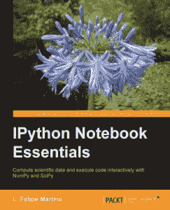

# 电子书评论:IPython 笔记本必备

> 原文：<https://www.blog.pythonlibrary.org/2014/12/04/ebook-review-ipython-notebook-essentials/>

本周，Packt Publishing 让我评论 L. Felipe Martins 的《IPython 笔记本精要》。他们给我发了一本电子书来评论。我一直对学习 IPython 笔记本很感兴趣，但从来没有抽出时间来，所以这似乎是一个了解更多的好方法。

* * *

### 快速回顾

*   **拿起它的原因:**出版社让我看这本书。
*   **为什么看完:**我只看了书的笔记本部分。其余的我只是浏览了一下。
*   **我会把它给:**一个已经了解 Python 并且是数据科学家的人

* * *

### 图书格式

你可以得到这本书的平装本、epub、mobi 或 PDF。

* * *

### 书籍内容

这本书分为五章和三个附录。

* * *

### 全面审查

这本书首先在第一章向读者展示了 IPython 笔记本。作者建议您使用 Python 的 Anaconda 发行版，并注册 Wakari 以使共享笔记本更容易。然后，您将学习如何运行笔记本，作者将使用咖啡冷却算法进行示例。这听起来可能有点奇怪，但了解如何计算咖啡随着时间的推移冷却了多少确实很有趣。我还认为这是展示笔记本电脑功能的好方法。这一章以几个简短的练习结束。

在第二章中，我们学习了更多关于笔记本界面的知识。在这里，我们学习如何编辑和导航笔记本和 IPython magics。您还将学习如何运行脚本以及加载和保存数据。本章最后用几个例子展示了如何在你的笔记本中嵌入图片、Youtube 视频和 HTML。我很喜欢这一章。

对于第三章，我们戏剧性地改变齿轮。从这一点直到我们到达附录，这本书基本上是给科学家的。这一章是关于在笔记本里用 Matplotlib 创建情节和动画。笔记本本身很少讨论。

第四章是关于熊猫项目，这是一个强大的数据处理和分析库。这超出了我的专业范围，所以我不能评论它的准确性，更不用说理解作者在这一章中所写的一切。简单地说，我只浏览了第四章。

第五章是关于 SciPy，Numba 和 NumbaPro。再次强调，重点是科学计算(SciPy)和如何加速这些计算(Numba/NumbaPro)。我也跳过了这一章。

附录包括以下内容:

*   IPython 笔记本参考卡
*   Python 语言的简要概述
*   NumPy 数组

进入这本书，我认为这将是一个 IPython 笔记本的指南。这个标题无疑给人一种这样的印象。然而，这本书的大部分内容根本不是关于 IPython 笔记本，而是专注于使用 Python 进行科学计算。有许多其他的书涉及这个主题，也许 IPython 笔记本主要是被科学家使用的。前言指出，这本书应该也在学习笔记本以及其他一些库。我只是觉得科学图书馆得到了大部分的散文，而笔记本受到了冷落。

如果你正在寻找一本 IPython 笔记本的指南，我不确定我能为你推荐这本书。它只有两章专门讨论这个主题，在附录中还有一张参考卡片。另一方面，如果您正在寻找一些可以在 Python 中使用的科学库的简要概述，并学习如何使用 IPython 笔记本，那么这本书可能适合您。

|  | 

### IPython 笔记本必备

菲利普·马丁斯**[亚马逊](http://www.amazon.com/gp/product/B00Q2N0CL6/ref=as_li_tl?ie=UTF8&camp=1789&creative=390957&creativeASIN=B00Q2N0CL6&linkCode=as2&tag=thmovsthpy-20&linkId=H4S6DVUH5TTRXJA2 target=)**[打包发布](http://goo.gl/jWYpJp) |

* * *

### 其他书评

*   达斯丁·菲利普斯用 Kivy 语言创建应用程序
*   Roberto Ulloa 的 Python 交互式应用
*   Ron DuPlain 开发的
*   弗莱彻·海斯勒的《真正的蟒蛇》
*   达斯丁·菲利普斯的 Python 3 面向对象编程