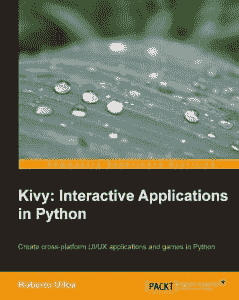

# 电子书评论:Python 中的交互式应用

> 原文：<https://www.blog.pythonlibrary.org/2013/12/17/ebook-review-kivy-interactive-applications-python/>

我最近收到了一本 Roberto Ulloa 写的《Kivy:Python 中的交互式应用》。这是目前唯一一本关于 Kivy 的书。Kivy 是一个跨平台的 GUI 工具包，可以在 Linux、Windows 和 OS X 以及 Android 和 iOS 上运行。事实上，Kivy 背后的人强调这主要是针对移动编程的。Kivy 支持多点触控，有一群非常活跃的程序员。你可以在他们项目的[主页](http://kivy.org/#home)上读到更多关于 Kivy 的信息。我将评论这本书的 PDF 版本。

这里是我给你们的快速回顾:

### 快速回顾

*   **我买这本书的原因:**我收到了这本书，作为帮助我复习另一本 Packt 书的报酬，但我自己也会买，因为我对学习 Android/iOS 版 Python 很感兴趣，而且我喜欢学习 Python GUI 工具包。
*   我为什么完成它:这本书很短，我乐观地认为它会变得更好。
*   我会把它给:一个已经了解 Python 和 Kivy 基础的人，尽管我不认为我会推荐它。

### 图书格式

你可以得到这本书的平装本、epub、mobi 或 PDF。

### 书籍内容

这本书分为五章。前四章涵盖了漫画创作者项目，这是关于创建形状和与 Kivy 绘图。读者应该学习 GUI 基础知识(第 1 章)，布局(第 1 章)，如何使用画布对象(第 2 章)，小部件事件(第 3 章)，改善用户体验(第 4 章)，最后一章涵盖了第二个也是最后一个项目，这是一个太空入侵者的克隆。

### 全面审查

Kivy 工具包支持两种语言。你可以完全用 Python 写你的程序，也可以混合使用 Python 和 Kv 语言。Kv 语言看起来有点像 CSS+Python，它有类似于 Python 的[缩进要求](http://kivy.org/docs/guide/lang.html)(即每个块必须缩进 4 个空格)。使用 Kv 语言的第一个例子在书中没有适当缩进。作者从来没有提到需要将 Kv 代码缩进四个空格，所以我花了一段时间才弄明白为什么代码不起作用。你会发现，书上几乎每一个 Kv 代码的例子，如果照搬都不行。一些 Python 代码也有缩进问题。Packt 雇佣了很多母语不是英语的作者。这本书有许多难以阅读或没有意义的句子的例子。让我们看看每一章。

第一章介绍了如何启动一个 Kivy 应用程序，如何添加一两个小部件，小部件的属性/变量，Kivy 和布局的各种坐标系。前几节非常简单。坐标部分很混乱，需要反复阅读才能理解。我只理解了版面部分的内容。Kivy 中的布局类似于 wxPython 中的 sizers。当用户改变窗口大小时，它们帮助控制部件如何动态定位。

第二章深入探讨了基维的画布物体。它涵盖了如何绘制形状，插入图像，如何使用颜色，缩放和翻译。本章中还有关于存储/检索当前坐标空间上下文的信息。图像和颜色部分是我的亮点。其余的，就没那么多了。

在第三章中，我们学习了 Kivy 中的事件绑定。您将学习如何覆盖、绑定、解除绑定和创建 Kivy 事件。您还将了解如何使用属性来保持 UI 最新。这一章旨在解释其他几个主题。我不确定我是否理解了作者不断绑定事件然后解除绑定的推理，但至少现在我知道怎么做了。有一节是关于小部件、小部件的父部件和窗口本身之间的相对和绝对坐标的转换。这一部分令人困惑，但也很有趣。

对于第四章，我们学习屏幕管理器。这个概念使得切换屏幕变得很容易，这有点像在 wxPython 中交换面板，只是它内置在 Kivy 中。它还谈到了一个颜色控制小部件，创建和保存手势，以及用于拖动、旋转和缩放的多点触摸。这一章的手势部分很吸引人，尽管我认为它解释得不够详细。Kivy 实际上内置了专门用于保存和检索自定义手势的类。我希望这一节提到 Kivy 在识别手势方面有多准确，但它没有。

第五章是关于太空入侵者的克隆。这一章只有 20 页，所以我认为它没有给出足够的细节来说明每件事情是如何工作的。我觉得太匆忙了。另一方面，我喜欢学习如何创建游戏，所以我会给作者一些支持。这一章有很多很酷的信息。不过，你只需要花大部分时间来破译密码。

最后，我想知道更多关于 Kivy 的事情。我发现 Kivy 的文档比这本书更有帮助，但这本书至少有一些有趣的想法。我认为这是它最有价值的地方。它让你想要学习 Kivy，这样你就可以改进书中的两个项目，并制作自己的项目。我认为非常缺少的一个关键话题是项目在一个或两个移动平台上的实际分配，以及如何在这些平台上进行测试。Kivy 在 Android 或 iOS 模拟器中工作吗？Kivy 有 7 个或 8 个以上的 widgets 吗？这些问题没有答案。如果你能便宜买到这本书，我会说去买吧。否则，坚持使用 Kivy 文档和演示程序。

|  | 

### kivy:Python 中的交互式应用

罗伯特·乌洛亚**[亚马逊](http://www.amazon.com/gp/product/1783281596/ref=as_li_ss_tl?ie=UTF8&camp=1789&creative=390957&creativeASIN=1783281596&linkCode=as2&tag=thmovsthpy-20)**[打包发布](http://www.packtpub.com/kivy-interactive-applications-in-python/book) |

### 其他书评

*   Ron DuPlain 开发的
*   弗莱彻·海斯勒的《真正的蟒蛇》
*   马特·哈里森著《踩 Python 第二卷:中级 Python》
*   约翰·罗兰的《快速学习 Python》

### 关于 Kivy 的附加信息

*   [在 Kivy 中创建应用程序](http://archlinux.me/dusty/2013/06/13/creating-an-application-in-kivy-part-1/)
*   The [Kivy API](http://kivy.org/docs/api-kivy.html)