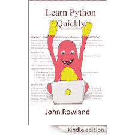

# 电子书评论:快速学习 Python

> 原文：<https://www.blog.pythonlibrary.org/2013/04/01/ebook-review-learn-python-quickly/>

几个月前，约翰·罗兰联系了我。他是全新电子书[快速学习 Python](http://www.amazon.com/gp/product/B00BU3LIOI/ref=as_li_ss_tl?ie=UTF8&camp=1789&creative=390957&creativeASIN=B00BU3LIOI&linkCode=as2&tag=thmovsthpy-20)的作者，他联系我，想用我的一篇博客文章作为他书中一个例子的基础。这个[确切的说是一个](https://www.blog.pythonlibrary.org/2012/07/26/tkinter-how-to-show-hide-a-window/)。无论如何，我告诉他当他的书出版的时候我会评论它。总之，这本书几周前出版了，这是我的评论。**注:我设法在它免费的时候弄到了一本，我想那是它发售的第二天。**

### 快速回顾

*   **我选择它的原因:**我选择这本书，首先是因为有人想在他们的书中使用我的一篇文章，这让我很感兴趣，其次，我偷偷看了几章，很喜欢作者的写作风格。此外，免费拿起它帮助！
*   **为什么写完:**因为想复习这本书。不过，我只阅读了正文，而且只浏览了相当广泛的术语表/附录。
*   我会把它给:新程序员，特别是如果他们已经有一点编程经验，比如 101 课程。

跳完可以看我的全评！

### 图书格式

在撰写本文时，这本书在亚马逊上仅作为 Kindle 图书出售。

### 全面审查

**快速学习 Python**教 Python 3。它涵盖了你能想到的所有话题和一些你想不到的话题。没想到只是涵盖了安装 Python，尤其是只在 Windows 上。我也很惊讶，像这本书这么短的一本书会在最后 3 章试图跳到用 Tkinter 进行 GUI 编程，但是它做到了。正常的东西当然也包括在内(不一定按这个顺序):数字、字符串、循环和 if 语句、列表和字典(尽管没有太多关于元组的内容)、函数和类、文件 I/O、异常处理、日期操作以及关于电子表格和数据库的一章。

电子表格和数据库章节(第 8 章)关注电子表格的 csv 模块，提到了 [xlwt](https://pypi.python.org/pypi/xlwt) 包，但没有提到 [xlrd](https://pypi.python.org/pypi/xlrd) 。我想这一章可能会谈到 PyWin32 以及如何使用 PyWin32 的 COM 模块访问 Microsoft Excel，但它没有。数据库部分是对 [pyodbc](http://code.google.com/p/pyodbc/) 的快速展示和讲述。他不教 SQL，这没问题，但是要注意。

这本书在书的最后涵盖了几个应用程序的开发。Rowland 先生让读者在课程章节中创建一个简单的银行应用程序的几种变体。然后，他继续让读者创建一些小的 Tkinter 应用程序。

这本书最独特的地方在于它使用了大量的超链接。事实上，如果没有术语表和附录，这本书将只有一半长。作者链接到他的词汇表中的各种术语以及一些外部资源。写作风格吸引人，有时很有趣，尤其是当作者放弃一些英国术语时。我觉得这篇课文直截了当，易于理解。不过，我不得不指出几个缺点。代码示例并不多，他经常在书的配套网站上提到代码:[http://www.learnpythonquickly.com](http://www.learnpythonquickly.com)。大多数情况下，这工作得很好，但是当我将 Tkinter 的代码复制到我的 Python IDE 中时，我的行号与作者的不太匹配。此外，如果你试图使用亚马逊云阅读器阅读这本书，那么代码大多数时候都不会正确缩进，尽管如果你在 Kindle 软件中打开这本书，它似乎会适当缩进代码。

除此之外，这本书非常好，我会推荐给那些刚接触这门语言，想快速入门的人。当然，如果你是新手，那么你会花很多时间阅读 Python 文档，而且这本书不可能涵盖整个 Python 语言的全部内容。无论如何，我认为这本书将让读者快速掌握 Python 的基础知识，并且当他们需要学习更多知识时，这些链接将帮助他们知道以后要搜索什么。

|  | 

### 快速学习 Python

约翰·道兰德**[亚马逊](http://www.amazon.com/gp/product/B00BU3LIOI/ref=as_li_ss_tl?ie=UTF8&camp=1789&creative=390957&creativeASIN=B00BU3LIOI&linkCode=as2&tag=thmovsthpy-20)** |