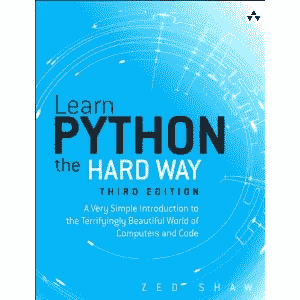

# 电子书评论:艰难地学习 Python

> 原文：<https://www.blog.pythonlibrary.org/2014/01/28/ebook-review-learn-python-the-hard-way/>

几年前，一个叫 Zed Shaw 的家伙创建了一个名为[艰难地学 Python](http://learnpythonthehardway.org/book/)的网站，受到了很多人的称赞。该网站由许多简短的练习组成，帮助初级程序员学习 Python 的各种细微差别，但都是以小块的形式。他不时地更新这本书，最终艾迪森-韦斯利把它写成了同名的书。最近有人给了我一份该书的 PDF 版本供我审阅。下面是快速版本:

### 快速回顾

*   **为什么选择这本书:**我收到这本书是为了对它进行评论，尽管我对阅读这本书很感兴趣，只是因为我听说过这个网站
*   我完成它的原因:这本书的章节很短...严格来说，我浏览了很多
*   **我会把它给:**想学习 Python 并且以前没有任何其他语言经验的人

### 图书格式

平装本、EPUB、MOBI 和 PDF

### 书籍内容

如果你愿意，这本书被分成 52 个练习或章节。大多数章节的长度都不到四页。事实上，有很多章节在它和下一章之间有一个空白页，所以这里有一些填充符。每一章都有一些练习和一些常见的学生问题。正如在介绍性文本中所预期的，您将了解作为 Python 程序员所需的所有数据结构。从字符串、字典和列表等简单的东西，到条件、循环、函数和类。这里都有。这本书还介绍了布尔值、Is-a / has-a、继承、组合、测试和 lpthw.web 框架。

### 全面审查

在导言中，肖先生大谈如果你，读者，觉得他在侮辱你的智慧，那么你就不是这本书的预期读者。无论你是否是初学者，单单这一部分就相当具有侮辱性。当他说“程序员经常谎称自己是数学天才，而实际上他们并不是”时，我并不十分欣赏。我想他是想搞笑，但他给人的印象最多是刻薄。

这本书很好地涵盖了 Python 的基础知识。通常每个新题目都有几个练习。例如，像文件 I/O 一样，学习打印到标准输出在 3 个练习中涉及。我认为包括学习练习和问答部分绝对是一个好主意，因为它们增强了每章中涉及的材料。我确实认为最后几个练习不太合适。它们相互之间并不适合，看起来像是独立的主题(游戏、骨骼、测试、网站等)。另一方面，这最后几个练习也比前几个长得多，所以也许没关系。

不管你是否喜欢刻薄/傲慢的部分，核心内容还是很不错的。我喜欢每一部分是如何组合在一起的，以及章节是如何相互构建的，一步一步地提高读者的能力。我认为初学者会受益于这本书，但我建议在你购买这本书之前，先查看一下网站。

|  | 

### 艰难地学习 Python

作者:泽德·肖**[亚马逊](http://www.amazon.com/gp/product/B00FGUS948/ref=as_li_ss_tl?ie=UTF8&camp=1789&creative=390957&creativeASIN=B00FGUS948&linkCode=as2&tag=thmovsthpy-20)**[培生/ InformIT](http://www.informit.com/store/learn-python-the-hard-way-a-very-simple-introduction-9780321884916) |

### 其他书评

*   Roberto Ulloa 的 Python 交互式应用
*   Ron DuPlain 开发的
*   弗莱彻·海斯勒的《真正的蟒蛇》
*   马特·哈里森著《踩 Python 第二卷:中级 Python》
*   约翰·罗兰的《快速学习 Python》