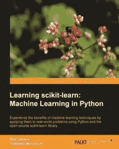

# 电子书评论:学习 scikit-learn:Python 中的机器学习

> 原文：<https://www.blog.pythonlibrary.org/2014/02/14/ebook-review-learning-scikit-learn-machine-learning-in-python/>

Packt Publishing 的人最近给我发了一本 ral Garreta 和 Guillermo Moncecchi 的书《学习 sci kit-learn:Python 中的机器学习》,请我阅读。机器学习不是我非常熟悉的话题，但我尝试了这本书，因为它听起来很有趣。对于时间不多的人，我先快速回顾一下:

### 快速回顾

*   **为什么我选择了它:**这本书是一本回顾版，但实际上我对任何 Python 编程书籍都感兴趣
*   我为什么要读完它:这本书写得很好，虽然我不太懂其中的很多内容，但它的主旨很有趣...我浏览了很多。
*   我会把它给:出于科学目的或机器学习而使用 Python 的人

如果你觉得有趣，那么请随意阅读完整的评论！

* * *

### 图书格式

这本书可以买到平装本、PDF、epub 和 Kindle 格式

* * *

### 全面审查

Packt Publishing 有一个概念，他们称之为“即时”书籍。这些书往往有 100 页左右长。虽然这本书没有被贴上“即时”的标签，但我认为它符合这一类别，因为它只有 4 章 118 页。这本书是为高级用户准备的。事实上，我会说它是为拥有高等数学或其他科学学位的人准备的。坦率地说，虽然内容很有趣，但我几乎没有领会其中的概念。因此，这将是一个相当轻松的审查。

首先，你需要 [scikit-learn](http://scikit-learn.org/stable/) 和 [NumPy](http://scipy.org/) 。我不确定是否也需要 SciPy。第一章是关于安装 scikit-learn，也是对机器学习的“温和介绍”。第 2 章涵盖了一个名为*的监督学习*的主题。在这一章中，你将学习图像识别、朴素贝叶斯、泰坦尼克号假说、决策树、随机森林和向量机。我喜欢贝叶斯的解释，学习图像识别也很酷。

第三章进入了**无监督学习**的世界，这是一个我觉得相当困惑的话题。作者写了关于主成分分析、k 均值聚类和各种其他聚类方法。我没有真正理解这一章。第 4 章是关于 scikit-learn 的高级特性。它涵盖了诸如特征提取和选择、模型选择和网格搜索等项目。

作者似乎在他们的领域很有知识，这本书写得很好。我真的没有注意到他们的散文有什么大问题。代码示例看起来很干净，但是我没有测试它们。我当然会向需要学习如何使用 Python 进行机器学习的程序员推荐这本书。。

|  | 

### 学习 scikit-learn:Python 中的机器学习

作者:ral Garreta 和 Guillermo Moncecchi**[亚马逊](http://www.amazon.com/gp/product/1783281936/ref=as_li_ss_tl?ie=UTF8&camp=1789&creative=390957&creativeASIN=1783281936&linkCode=as2&tag=thmovsthpy-20)**[打包发布](http://bit.ly/19KmNYv) |

* * *

### 其他书评

*   Ron DuPlain 开发的
*   弗莱彻·海斯勒的《真正的蟒蛇》
*   马特·哈里森著《踩 Python 第二卷:中级 Python》
*   约翰·罗兰的《快速学习 Python》