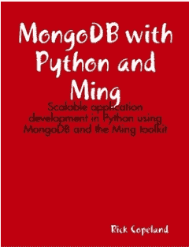

# 电子书评论:使用 Python 和 Ming 的 MongoDB

> 原文：<https://www.blog.pythonlibrary.org/2012/08/08/ebook-review-mongodb-with-python-and-ming/>

本周，我从亚马逊上买了里克·科普兰的《MongoDB with Python》和明的《T1》电子书。它刚刚在 2012 年 7 月发布，所以我想我应该检查一下，看看 MongoDB 和整个 NoSQL 时尚有什么大惊小怪的。

### 快速回顾

*   **我选择它的原因:**主要是因为我对 MongoDB 感兴趣有一段时间了，这本书价格合理，我还读过一点他的 [SQLAlchemy 的书](http://www.amazon.com/gp/product/0596516142/ref=as_li_ss_tl?ie=UTF8&camp=1789&creative=390957&creativeASIN=0596516142&linkCode=as2&tag=thmovsthpy-20)。我想我可能几年前也在 PyCon 见过这个人。
*   我为什么要读完一本书:我几乎总是试图读完一本书，尤其是如果我要复习的话。不过这个很难。
*   我会把它给:需要一个快速文本来让他们快速了解 MongoDB 和 Ming 的人

### 图书格式

据我所知，这本书只有 Lulu 的 epub 版本或 Kindle 版本。

### 书籍内容

这本书大约有 84 页长。它包含 6 个章节。第 1 章和第 2 章本质上是介绍性的。第一章是典型的一次性章节，简单描述了将会涉及的内容以及读者应该是谁。简单地说，如果你还不知道 Python，这本书不会帮助你。它也不会帮助您设置 MongoDB。实际上，我很惊讶第一章不是前言。第 2 章告诉你去设置 MongoDB 或者使用一个在线服务，比如 MongoLab 或者 MongoHQ。您还将学习如何安装 pyMongo 并使用它连接 MongoDB、插入数据、运行查询、创建索引、删除数据、更新数据，学习使用 GridFS，以及 MongoDB 中的聚合(mapreduce、分片、聚合框架)。是的，第二章很重。当你读完它的时候，这本书你差不多已经读了一半了。

第 3 章是关于如何获得 MongoDB 的最佳性能，并讨论了硬件升级和分片。第 4 章介绍 Ming(不要与 Windows 的 MingW 混淆)。Ming 基本上是 MongoDB 的一个 ORM(或 ODM - Object Document Mapper ),由 SourceForge 的人编写，并且是开源的。第 4 章非常全面地介绍了 Ming，包括强制性地和声明性地定义模式。它还涵盖了许多与第 2 章相同的内容(即 CRUD ),但都是从阿明/会议的角度出发。第五章建立在第四章的基础上，它谈到了明灿提供的另一个抽象层，它给了开发者自动持久化的能力，一个身份映射，一次刷新多个更新的方法和一些其他的东西。最后，第 6 章是一个零零碎碎的章节，包含了本书其他地方不适合的东西(这是作者的话，不是我的)。它讨论了在模式改变时支持数据库迁移的各种方法(比如使用 flyaway 模块)以及如何扩展 ODM 的 mapper。

### 回顾

这本书开头写得很好，作者写得很吸引人。然而，在第 2 章结束时，我发现自己陷入了一个又一个代码示例的泥潭。通常这不会困扰我，但有时感觉有点重复，我觉得没有足够的解释来解释来源。我自己只尝试了几个例子，但它们似乎在大多数时候都有效。就在 2.3 节之前，代码中有一个错别字，作者使用了一个不存在的 findOne()方法。而应该是 find_one()。我试图用谷歌查找 pyMongo 的 API 最近是否有变化，但什么也找不到。希望这是一个孤立的案例，但是正如我所说的，我没有测试很多代码。

这本书的另一个问题是有许多奇怪的小错别字。通常只是拼写错误，尽管偶尔会有一些语法问题。这是次要的东西，但是我用过的大多数拼写检查器都可以发现其中的大部分。有几处作者有点漫无边际，或者代码会话有点难以理解，但除此之外，我认为这本书相当不错。是的，到最后会变得很枯燥，但大多数编程教科书都是如此。如果你想加入 MongoDB 程序员的大军，并且想坚持使用 Python，那么这本书应该可以让你开始。如果你需要更多的信息，那么 Niall O'Higgins 的《MongoDB 和 Python:流行的面向文档的数据库的模式和过程 》可能会有所帮助(注意:我还没有读过那本书)。

|  | 

### 使用 Python 和 Ming 的 MongoDB

里克·科普兰**[亚马逊](http://www.amazon.com/gp/product/B008O528IA/ref=as_li_ss_tl?ie=UTF8&camp=1789&creative=390957&creativeASIN=B008O528IA&linkCode=as2&tag=thmovsthpy-20)** |