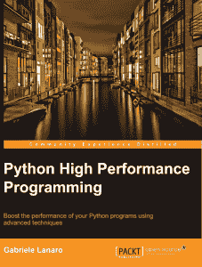

# 电子书评论:Python 高性能编程

> 原文：<https://www.blog.pythonlibrary.org/2014/02/18/ebook-review-python-high-performance-programming/>

去年，Packt Publishing 邀请我担任 Gabriele Lanaro 的《Python 高性能编程》一书的技术评审。它于 2013 年 12 月出版。对于那些注意力持续时间短的人，我给你们一个简短的回顾:

### 快速回顾

*   我拿起它的原因:我是免费得到它的，但我会拿起它，因为它的主题让我感兴趣
*   我为什么要读完它:这本书有很多有趣的提示，让我想继续读下去
*   **我想把它给:**想学习优化代码的人

* * *

如果这激起了你的兴趣，一定要点击查看完整的评论！

### 图书格式

这本书可以买到平装本，PDF，epub 和 Kindle 格式。

* * *

### 全面审查

这本书的编排方式让我想起了 Packt Publishing 的 Instant 系列，这是他们较短的书籍之一，只有 4 章 108 页。第一章是关于基准和剖析。它讲述了如何使用 Python 的 cProfile、dis 模块和 memory_profiler。我发现这一章非常有趣。虽然我知道这一章提到的几个项目，但它包含了足够多的新信息，让我的大脑充满了分析的想法。

在第二章中，我们学习了使用 NumPy 的快速数组。这有点奇怪，因为我通常不会想到通过向我的系统添加一个科学的 Python 包来提高性能。然而，如果您使用数组做大量工作，这是有意义的。它还讨论了一个粒子模拟器(整洁！)并使用 [numexpr](https://github.com/pydata/numexpr) ，NumPy 的快速数值表达式求值器。我个人现在不怎么使用数组，但是对于那些使用数组的人来说，这一章可能会很有意思。

第三章深入研究了 Cython 的世界。这里的想法是通过使用静态类型、使用 C 数组/指针、内存视图等，使用 Cython 来加速常规 Python 代码。我认为仅仅通过几个调整就可以提高**for**循环的速度，从而将它变成 C for 循环，这真的很酷。它有大量的例子。就我个人而言，我想看一本以 Cython 为主题的书。

在第四章中，作者深入探讨了并行处理。本章的重点是使用 Python 自带的[多重处理模块](http://docs.python.org/2/library/multiprocessing.html)。还有一节是关于使用 IPython 并行的。你可以在这里阅读一些关于这个话题[的内容。本章的最后一节将讨论如何使用 Cython 和 OpenMP 来实现 Cython 中的并行处理。](http://ipython.org/ipython-doc/stable/parallel/parallel_intro.html)

我觉得这本书唯一的问题是它有点太短了。我本想读一读关于这个主题的完整文本。无论如何，对于那些需要加速代码的人来说，我认为这本书可以帮助你开始。

|  | 

### Python 高性能编程

加布里埃尔·拉纳罗**[亚马逊](http://www.amazon.com/gp/product/B00HL2GOCI/ref=as_li_ss_tl?ie=UTF8&camp=1789&creative=390957&creativeASIN=B00HL2GOCI&linkCode=as2&tag=thmovsthpy-20)**[打包发布](http://www.packtpub.com/python-high-performance-programming/book) |

* * *

### 其他书评

*   [学习 scikit-learn:Python 中的机器学习](https://www.blog.pythonlibrary.org/2014/02/14/ebook-review-learning-scikit-learn-machine-learning-in-python/)
*   [艰难地学习 Python](https://www.blog.pythonlibrary.org/2014/01/28/ebook-review-learn-python-the-hard-way/)
*   Ron DuPlain 开发的
*   弗莱彻·海斯勒的《真正的蟒蛇》
*   马特·哈里森著《踩 Python 第二卷:中级 Python》
*   约翰·罗兰的《快速学习 Python》

http://www.packtpub.com/python-high-performance-programming