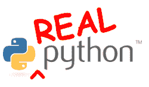

# 电子书评论:真正的 Python

> 原文：<https://www.blog.pythonlibrary.org/2013/04/19/ebook-review-real-python/>

我最近收到了弗莱彻·海斯勒的《真正的 Python》,刚刚读完。我从最近的 [KickStarter 活动](http://www.kickstarter.com/projects/1369857650/real-python-for-web-development-featuring-web2py)中得到它作为这本书的续集*Web 开发的真正 Python*的奖金，这本书实际上是别人写的。你可以去这本书的[网站](http://www.realpython.com/)购买这本书，并获得这本书谈到的文件。我将审查修订版 2.2，因为这是我几周前下载时得到的。似乎从那以后有了更新。这是我读过的第一本关于 Python 2.7.3 的书，尽管它提到了 Python 3 的一些不同之处。

### 快速回顾

*   **我买这本书的原因:**我买这本书是因为它的续集 Kickstarter 活动给了我额外的奖励。
*   我为什么要完成它:这本书有一种吸引人的写作风格
*   **我想给:**刚接触 Python 语言的程序员

如果你对那个介绍感兴趣，请在跳转之后和我一起阅读完整的评论！

### 图书格式

这本书有 PDF 版、MOBI 版(即 Kindles 版)和 EPUB 版。我不相信在这个审查的时候有一个死树版本。

### 全面审查

Heisler 先生很好地向我们介绍了 Python。起初，听起来好像你将通过编写大量代码来学习 Python(这让我想到了 Zed Shaw 的[网站](http://learnpythonthehardway.org/))，但作者最终做了大多数 Python 作者做的事情，并经历了一堆基础知识。总之，这本书被分成 13 章(如果算上第 0 章的话是 14 章！)和一些“插曲”部分扔在这里和那里。以下是承保范围的细分:

第零章只是一个介绍。第一章介绍了下载 Python 和使用 IDLE 的基础知识。然后我们遇到了一个包含代码中注释的插曲。第二章和第三章涵盖了字符串和字符串方法(查找字符串、切片等)。第 4 章讨论函数和循环。然后是另一个插曲，这一次涵盖了 Python 调试器:pdb。第五章讨论条件句(如 if/elif/else ),并讨论如何在循环中中断和继续。第六章是关于列表和字典的。在第七节中，我们学习文件 I/O 以及如何读写 CSV 文件。然后我们进入了另一个插曲，作者谈到了如何安装第三方 Python 模块。出于某种原因，他推荐 easy_install，我认为它在 Python 社区中已经失宠了。但是没有提到替代品，比如 pip。总之，在第八章中，我们学习了如何用 pyPDF 来读、写和操作 PDF。有提到 reportlab 和 PDFMiner，但是没有例子。第 9 章讨论了使用 Python 的 SQL，主要集中在 SQLite 上，尽管它提到了 pyodbc、pyscopg 和 MySQLdb。

第 10 章介绍了使用 Python 正则表达式的 web 抓取，beautifulsoup 和 mechanize。第 11 章是关于 Python 和图形的科学编程。它涵盖了一点 NumPy 和一点 matplotlib。第 12 章用 EasyGUI 和 Tkinter 探讨 Python GUI 工作。我认为 EasyGUI 是一个奇怪的选择，因为它基本上只是一个对话框生成器，但无论如何。最后一章介绍了使用谷歌应用引擎的网络应用。

每一章都有多个部分，这些部分通常以一两个练习结束，供读者尝试。文本是以一种非常非正式的方式写的，有一些有趣的例子，比如写一个 L33T 的翻译脚本。因为这是 KickStarter 上的一本书，最后几页列出了所有帮助这本书出版的支持者。我认为这本书涵盖了足够多的语言，足以让一个新的程序员入门。这不是一本深入的 Python 书籍，但也不应该是。它是为了让读者开始他们的 Python 之旅，它在这方面做得很好！

|  | 

### 真正的 Python

弗莱彻·海斯勒**RealPython.com** |