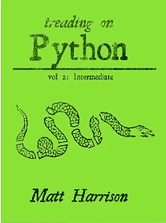

# 电子书评论:探索 Python 第 2 卷:中级 Python

> 原文：<https://www.blog.pythonlibrary.org/2013/04/03/ebook-review-treading-on-python-volume-2-intermediate-python/>

上周， [Matt Harrison](http://hairysun.com/) 给我发了一本他最新的 Python 电子书，名为 **[踏上 Python Vol 2:中级 Python](http://www.amazon.com/gp/product/B00BT95CWM/ref=as_li_ss_tl?ie=UTF8&camp=1789&creative=390957&creativeASIN=B00BT95CWM&linkCode=as2&tag=thmovsthpy-20)** 。我很感兴趣，因为我很少阅读中级 Python 书籍。事实上，我想说作者谈到的一些东西进入了高级水平。无论如何，我认为这是一本非常好的小书，如果你有时间，我会告诉你为什么。

### 快速回顾

*   **为什么选择它:**正如我提到的，这是一本中级水平的书，这是我的必读书目。
*   **为什么我读完了它:**因为这本书被证明非常有趣。
*   **我会把它给:** Python 程序员，他们对基础知识有很好的理解，但希望提高他们的 Python 技能。

现在如果你有几分钟的时间，你可以在跳转后阅读我的完整评论！

### 图书格式

据我所知，这本书只有在我写作的时候才能在亚马逊上买到。我收到的副本是 epub 格式的，所以可能还有其他版本...

### 全面审查

马特·哈里森的新书是他迄今为止最好的作品。我发现写作几乎没有错误，只有一些错别字，大部分在书的后半部分。这本书分成三个部分(不包括导言)。哈里森没有花时间向我们介绍 Python 相反，他假设您已经知道了，并开始深入研究函数构造。第一部分就这样开始了，他涵盖了 lambda、map、reduce、filter、recursion、list、set 和 dict comprehensions，最后是操作符模块。他使用了 lambda 后面的许多主题来说明 lambda 结构的高级用法。我认为这很有趣，并最终学到了一些新的技巧，我希望很快在自己的代码中实现。

第二部分致力于**迭代和生成器**。在这本书里，你将学习 iterables 和 iterators 之间的区别，如何构造一个普通的生成器和一个对象生成器，作者也给出了关于什么时候使用生成器和列表的提示。他还展示了 Python 内核中生成器和迭代器的一些真实例子。他在第一部分也做了一点。

第三部分是关于函数、闭包和装饰器的，重点是后者。我认为这部分是他关于装饰者的书的更新版本，因为一些例子看起来有点熟悉。不管怎样，这很有启发性。我承认，在书的最后的“替代装饰器实现”部分是相当混乱的。

最后，我认为这本书非常值得拥有它的成本。你几乎肯定会在第一部分学到一些新东西。如果你不太了解 Python 中的生成器、迭代器或装饰器，那么这本书将帮助你搞清楚，并希望给你一些如何在你的代码中使用它们的想法。我知道我学到了一些东西(可能还重新学到了其他一些东西！).

|  | 

### 行走在 Python 之上第二卷:中级 Python

马特·哈里森**[亚马逊](http://www.amazon.com/gp/product/B00BT95CWM/ref=as_li_ss_tl?ie=UTF8&camp=1789&creative=390957&creativeASIN=B00BT95CWM&linkCode=as2&tag=thmovsthpy-20)** |