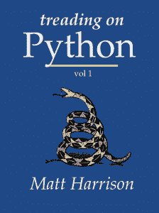

# 电子书评论:踩在 Python 上

> 原文：<https://www.blog.pythonlibrary.org/2011/11/26/ebook-review-treading-on-python/>

本周，我发现了一本关于 Python 的新书，书名是 *[《践踏 Python》第一卷](http://www.hairysun.com/blog/2011/11/21/introducing-treading-on-python/)* ，作者是[马特·哈里森](http://twitter.com/#!/__mharrison__)。这本书只有草稿形式，所以还很粗糙，但是作者好心地给了我一份 epub 和 mobi 格式的免费拷贝。我用 Firefox 的插件 [EPUBReader](https://addons.mozilla.org/en-US/firefox/addon/epubreader/versions/) 阅读了其中的一部分，这样我就可以在我的浏览器上阅读了。然后我就切换到 PC Kindle 软件来完成这本书。

这本书是典型的 Python 入门文本。我觉得它比我读过的一些介绍书要短一点，但这可能是因为它是一本电子书。他涵盖了你所期望的内容，但这里有一个简短的主题列表:

*   Python 的安装
*   翻译
*   数字和字符串
*   指导和帮助(自省，尽管他从未使用过这个词)
*   评论
*   序列(列表、元组和字典)
*   函数、类和方法
*   文件输入输出
*   例外——非常简短，没有展示如何创建自己的例外

他使用了一些我从未听说过的奇怪术语，比如将 Python 的双下划线方法称为“dunder 方法”(比如 __init__ 或 __seq__)。我只听说过“魔法方法”这个名字。他还说了下面的话:*在 Python 中经常听到关于布尔和布尔类对象的“真”或“假”* (Kindle 位置 700)。我读过很多关于 Python 的书，以前也从未遇到过。没什么大不了的，他们只是突然出现在我面前，让我挠头。

无论如何，我不能对它太苛刻，因为它仍然只是一个草稿。我确实注意到，这本书的前几节似乎在后来有所重复。我不确定那是不是故意的。也许这是强调材料的一种方式。不管怎样，书中的信息对于刚开始学习这门语言的人来说是相当不错的。我应该提到，这是一本概述性的书。每个主题平均只有 1-4 页的信息，所以这本书会给你足够的信息，但是如果你遇到困难，你仍然需要阅读文档。例如，他提到理解，但从来没有说它们是什么。当你编程的时候，你不需要这些，但是它们确实很好。另一方面，他确实说了很多“with”语句。

总的来说，我认为这是一本非常好的 Python 入门书。读者将会对这种语言有一个很好的了解，而不会对第三方包或者甚至是包含的模块感到困惑。他们对 Python 自省工具有一点了解，这很好。当这本书完成的时候，你可能会想把这本书记在心里，留给你的萌芽期的皮托尼斯塔。你现在可以从他的网站上以 4.99 美元的价格购买这本书，我想你会在完成后得到最终版本，有点像曼宁的早期访问计划(MEAP)。