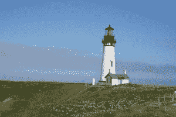
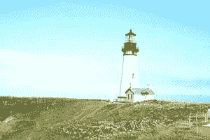
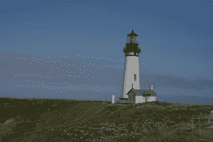
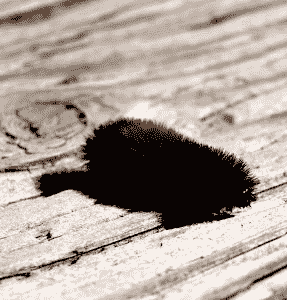
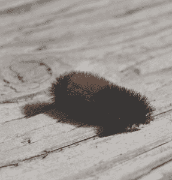
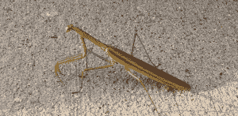
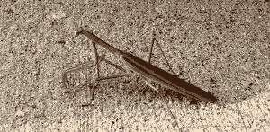

# 使用 Python 增强照片

> 原文：<https://www.blog.pythonlibrary.org/2017/10/24/enhancing-photos-with-python/>

有时当你拍照时，你会发现它并不是你想要的。这幅画看起来很棒，但就是有点太暗了。或者有点模糊，需要增加锐度。锐度问题现在已经不那么糟糕了，因为很多相机在拍照后会自动为你增加锐度。

无论如何，在这篇文章中，我们将学习如何做到以下几点:

*   如何调整照片的亮度
*   如何改变图像的对比度
*   如何锐化照片

您首先需要的是可以使用 pip 安装的[枕头包](https://python-pillow.org/):

```py

pip install Pillow

```

现在我们已经安装了枕头，我们可以开始了！

* * *

### 改变亮度



我个人认为这张照片看起来很好，但出于演示的目的，让我们试着让这张照片变亮。增强照片的关键是使用 Pillow 的 **ImageEnhance** 模块。让我们来看看:

```py

from PIL import Image
from PIL import ImageEnhance

def adjust_brightness(input_image, output_image, factor):
    image = Image.open(input_image)
    enhancer_object = ImageEnhance.Brightness(image)
    out = enhancer_object.enhance(factor)
    out.save(output_image)

if __name__ == '__main__':
    adjust_brightness('lighthouse.jpg',
                      'output/lighthouse_darkened.jpg',
                      1.7)

```

这里我们从 Pillow 导入我们需要的图片，然后在函数中打开输入的图片。接下来我们需要创建一个“增强器”对象。在这种情况下，我们使用 ImageEnhance 的 **Brightness** 类，并将我们的 image 对象传递给它。接下来我们调用 **enhance()** 方法，并赋予它增强因子。根据枕头[文档](http://pillow.readthedocs.io/en/4.2.x/reference/ImageEnhance.html)，你需要一个大于 1.0 的系数来增加照片的亮度。如果你只是给它一个 1.0 的因子，那么它将返回原始图像不变。

如果您运行这段代码，您将得到类似这样的结果:



您也可以将低于 1.0 的增强因子向下传递到 0.0。根据文档，如果一直降到 0.0，您将收到一个完全黑色的图像。只是为了好玩，试着将上面代码中的增强因子改为 0.7。如果你这样做了，那么你会得到以下结果:



现在让我们试着给图片增加一些对比度！

* * *

### 调整图像的对比度


我以前拍过一些非常暗的照片，并且能够通过给照片增加亮度和对比度来保存它们。在这个例子中，我们将只增加这张可爱的毛毛虫照片的对比。但是，您也可以通过将下面的代码与前面的示例相结合来轻松增加亮度:

```py

from PIL import Image
from PIL import ImageEnhance

def adjust_contrast(input_image, output_image, factor):
    image = Image.open(input_image)
    enhancer_object = ImageEnhance.Contrast(image)
    out = enhancer_object.enhance(factor)
    out.save(output_image)

if __name__ == '__main__':
    adjust_contrast('caterpillar.jpg',
                    'output/caterpillar_more_contrast.jpg',
                    1.7)

```

这段代码非常类似于增亮函数。唯一的区别是，这里我们使用的是 ImageEnhance 模块中的**对比度**类，而不是**亮度**类。当我运行这段代码时，我得到了以下增强:



ImageEnhance 模块中的所有类都以相同的方式运行。如果您碰巧尝试将增强值 1.0 传递给它，您只是得到原始图像，没有添加任何调整。但是如果你从 0.0 到 1.0，你会降低对比度。您可以自己尝试增强因子，看看可以对自己的图像进行什么样的更改。我试着把它改成 0.7，结果是这样的:



现在我们准备学习锐化照片！

* * *

### 更改照片的清晰度



我很少锐化模糊的照片，因为我很少发现它有帮助。然而，你可以锐化照片，使它看起来不同，在一个愉快的方式。让我们看看如何使用 Python 和 Pillow 来实现这一点:

```py

from PIL import Image
from PIL import ImageEnhance

def adjust_sharpness(input_image, output_image, factor):
    image = Image.open(input_image)
    enhancer_object = ImageEnhance.Sharpness(image)
    out = enhancer_object.enhance(factor)
    out.save(output_image)

if __name__ == '__main__':
    adjust_sharpness('mantis.png',
                     'output/mantis_sharpened.jpg',
                     1.7)

```

同样，唯一的变化是使用 ImageEnhance 的 **Sharpness** 类，而不是其他选择之一。同样像以前一样，我们需要使用一个大于 1.0 的增强因子来增加清晰度。结果如下:



实际上我有点喜欢这个的结局。你也可以通过使用小于 1.0 的增强因子来模糊图像，但我认为这只会使图像变得相当暗淡。尽管如此，你也可以随意摆弄这些值。

* * *

### 包扎

Pillow 包有这么多使用 Python 编程语言编辑和增强照片的简洁功能。试用起来也超级快。您应该给这些脚本一个旋转，并尝试增强因子，看看您自己能做些什么。还有一个**颜色**类，我没有在这里介绍，你也可以用它来增强你的照片。开心快乐编码！

* * *

### 相关阅读

*   Kanoki - [为你的照片画铅笔素描](http://kanoki.org/2017/08/15/draw-pencil-sketches-of-your-photo/)
*   如何用 Python 给你的[照片加水印](https://www.blog.pythonlibrary.org/2017/10/17/how-to-watermark-your-photos-with-python/)
*   [如何用 Python 调整照片大小](https://www.blog.pythonlibrary.org/2017/10/12/how-to-resize-a-photo-with-python/)
*   用 Python 将一张[照片转换成黑白](https://www.blog.pythonlibrary.org/2017/10/11/convert-a-photo-to-black-and-white-in-python/)
*   [如何用 Python 旋转/镜像照片](https://www.blog.pythonlibrary.org/2017/10/05/how-to-rotate-mirror-photos-with-python/)
*   [如何用 Python 裁剪照片](https://www.blog.pythonlibrary.org/2017/10/03/how-to-crop-a-photo-with-python/)