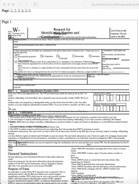

# 使用 Python 从 pdf 导出数据

> 原文：<https://www.blog.pythonlibrary.org/2018/05/03/exporting-data-from-pdfs-with-python/>

很多时候，您会希望从 PDF 中提取数据，并使用 Python 将其导出为不同的格式。不幸的是，没有很多 Python 包能很好地完成提取部分。在这一章中，我们将会看到各种不同的可以用来提取文本的包。我们还将学习如何从 pdf 中提取一些图像。虽然 Python 中没有针对这些任务的完整解决方案，但是您应该能够使用这里的信息来开始。一旦我们提取了我们想要的数据，我们还将研究如何获取这些数据并以不同的格式导出。

让我们从学习如何提取文本开始吧！

* * *

### 使用 PDFMiner 提取文本

可能最广为人知的是一个叫做 **PDFMiner** 的包。PDFMiner 包从 Python 2.4 开始就存在了。它的主要目的是从 PDF 中提取文本。事实上，PDFMiner 可以告诉您文本在页面上的确切位置以及关于字体的父信息。对于 Python 2.4 - 2.7，您可以参考以下网站以获得关于 PDFMiner 的更多信息:

*   github-[https://github.com/euske/pdfminer](https://github.com/euske/pdfminer)
*   PyPI-[https://pypi.python.org/pypi/pdfminer/](https://pypi.python.org/pypi/pdfminer/)
*   网页-[https://euke . github . io/pdf miner/](https://euske.github.io/pdfminer/)

PDFMiner 与 Python 3 不兼容。幸运的是，有一个名为 **PDFMiner.six** 的 PDFMiner 分支，其工作原理完全相同。你可以在这里找到:【https://github.com/pdfminer/pdfminer.sixT2

| [](https://leanpub.com/reportlab) | 想了解更多关于使用 Python 处理 pdf 的信息吗？然后看看我的书:

### ReportLab:使用 Python 处理 PDF

**[在 Leanpub](https://leanpub.com/reportlab) 上立即购买** |

安装 PDFMiner 的说明已经过时了。您实际上可以使用 pip 来安装它:

```py

python -m pip install pdfminer

```

如果您想为 Python 3 安装 PDFMiner(这可能是您应该做的)，那么您必须像这样进行安装:

```py

python -m pip install pdfminer.six

```

关于 PDFMiner 的文档充其量只能算是相当差的。你很可能需要使用 Google 和 StackOverflow 来弄清楚如何有效地使用本章没有涉及的 PDFMiner。

#### 提取所有文本

有时您会想要提取 PDF 中的所有文本。PDFMiner 包提供了几种不同的方法来实现这一点。我们将首先看一些编程方法。让我们试着读出国内税收服务 W9 表格中的所有文本。你可以从这里得到一份:[https://www.irs.gov/pub/irs-pdf/fw9.pdf](https://www.irs.gov/pub/irs-pdf/fw9.pdf)

一旦您正确保存了 PDF，我们就可以查看代码:

```py

import io

from pdfminer.converter import TextConverter
from pdfminer.pdfinterp import PDFPageInterpreter
from pdfminer.pdfinterp import PDFResourceManager
from pdfminer.pdfpage import PDFPage

def extract_text_from_pdf(pdf_path):
    resource_manager = PDFResourceManager()
    fake_file_handle = io.StringIO()
    converter = TextConverter(resource_manager, fake_file_handle)
    page_interpreter = PDFPageInterpreter(resource_manager, converter)

    with open(pdf_path, 'rb') as fh:
        for page in PDFPage.get_pages(fh, 
                                      caching=True,
                                      check_extractable=True):
            page_interpreter.process_page(page)

        text = fake_file_handle.getvalue()

    # close open handles
    converter.close()
    fake_file_handle.close()

    if text:
        return text

if __name__ == '__main__':
    print(extract_text_from_pdf('w9.pdf'))

```

当您直接使用 PDFMiner 包时，它可能有点冗长。在这里，我们从 PDFMiner 的各个部分导入不同的片段。因为没有这些类的文档，也没有 docstrings，所以我不会深入解释它们是做什么的。如果你真的很好奇的话，可以自己钻研源代码。然而，我认为我们可以跟着代码走。

我们做的第一件事是创建一个资源管理器实例。然后我们通过 Python 的 **io** 模块创建一个类似文件的对象。如果你使用的是 Python 2，那么你会希望使用 **StringIO** 模块。我们的下一步是创建一个转换器。在本例中，我们选择了 **TextConverter** ，但是如果你愿意，你也可以使用 **HTMLConverter** 或者 **XMLConverter** 。最后，我们创建一个 PDF 解释器对象，它将接受我们的资源管理器和转换器对象并提取文本。

最后一步是打开 PDF 并循环浏览每一页。最后，我们获取所有文本，关闭各种处理程序，并将文本打印到 stdout。

#### 逐页提取文本

坦白地说，从一个多页文档中抓取所有文本并不那么有用。通常，您会希望在文档的较小子集上工作。因此，让我们重写代码，以便它能够逐页提取文本。这将允许我们一页一页地检查文本:

```py

# miner_text_generator.py

import io

from pdfminer.converter import TextConverter
from pdfminer.pdfinterp import PDFPageInterpreter
from pdfminer.pdfinterp import PDFResourceManager
from pdfminer.pdfpage import PDFPage

def extract_text_by_page(pdf_path):
    with open(pdf_path, 'rb') as fh:
        for page in PDFPage.get_pages(fh, 
                                      caching=True,
                                      check_extractable=True):
            resource_manager = PDFResourceManager()
            fake_file_handle = io.StringIO()
            converter = TextConverter(resource_manager, fake_file_handle)
            page_interpreter = PDFPageInterpreter(resource_manager, converter)
            page_interpreter.process_page(page)

            text = fake_file_handle.getvalue()
            yield text

            # close open handles
            converter.close()
            fake_file_handle.close()

def extract_text(pdf_path):
    for page in extract_text_by_page(pdf_path):
        print(page)
        print()

if __name__ == '__main__':
    print(extract_text('w9.pdf'))

```

在这个例子中，我们创建了一个生成器函数，**生成**每页的文本。 **extract_text** 函数打印出每一页的文本。在这里我们可以添加一些解析逻辑来解析出我们想要的东西。或者我们可以将文本(或 HTML 或 XML)保存为单独的文件，以便将来解析。

您会注意到文本可能没有按照您期望的顺序排列。所以你肯定需要找出解析出你感兴趣的文本的最佳方法。

PDFMiner 的好处在于，您已经可以将 PDF 导出为文本、HTML 或 XML。

如果您不想自己尝试找出 PDFMiner，也可以使用 PDFMiner 的命令行工具， **pdf2txt.py** 和 **dumppdf.py** 来为您完成导出。根据 **pdf2txt.py** 的源代码，可以用来将一个 pdf 导出为纯文本、html、xml 或者“标签”。

* * *

### 通过 pdf2txt.py 导出文本

默认情况下，pdfMiner 附带的 **pdf2txt.py** 命令行工具将从 PDF 文件中提取文本并将其打印到 stdout。它不能识别图像文本，因为 PDFMiner 不支持光学字符识别(OCR)。让我们试试使用它的最简单的方法，就是把路径传递给 PDF 文件。我们将使用 w9.pdf 的**。打开终端并导航到您保存该 PDF 的位置，或者修改下面的命令以指向该文件:**

```py

pdf2txt.py w9.pdf

```

如果运行这个命令，它会将所有文本打印到 stdout。您也可以让 pdf2txt.py 将文本以文本、HTML、XML 或“标记 pdf”的形式写入文件。XML 格式将给出关于 PDF 的大部分信息，因为它包含文档中每个字母的位置以及字体信息。不推荐使用 HTML，因为 pdf2txt 生成的标记往往很难看。以下是获得不同格式输出的方法:

```py

pdf2txt.py -o w9.html w9.pdf 
pdf2txt.py -o w9.xml w9.pdf 

```

第一个命令将创建一个 HTML 文档，而第二个命令将创建一个 XML 文档。以下是我在进行 HTML 转换时得到的一张照片:



正如你所看到的，最终的结果看起来有点差，但还不算太差。它输出的 XML 非常冗长，所以我不能在这里全部复制。不过，这里有一个片段可以让你了解它的样子:

```py
 <pages><page id="1" bbox="0.000,0.000,611.976,791.968" rotate="0"><textbox id="0" bbox="36.000,732.312,100.106,761.160"><textline bbox="36.000,732.312,100.106,761.160"><text font="JYMPLA+HelveticaNeueLTStd-Roman" bbox="36.000,736.334,40.018,744.496" size="8.162">F</text>
<text font="JYMPLA+HelveticaNeueLTStd-Roman" bbox="40.018,736.334,44.036,744.496" size="8.162">o</text>
<text font="JYMPLA+HelveticaNeueLTStd-Roman" bbox="44.036,736.334,46.367,744.496" size="8.162">r</text>
<text font="JYMPLA+HelveticaNeueLTStd-Roman" bbox="46.367,736.334,52.338,744.496" size="8.162">m</text>

<text font="ZWOHBU+HelveticaNeueLTStd-BlkCn" bbox="60.122,732.312,78.794,761.160" size="28.848">W</text>
<text font="ZWOHBU+HelveticaNeueLTStd-BlkCn" bbox="78.794,732.312,87.626,761.160" size="28.848">-</text>
<text font="ZWOHBU+HelveticaNeueLTStd-BlkCn" bbox="87.626,732.312,100.106,761.160" size="28.848">9</text></textline></textbox></page></pages>
```

* * *

### 使用 Slate 提取文本

Tim McNamara 不喜欢 PDFMiner 使用起来如此迟钝和困难，所以他写了一个名为 **slate** 的包装器，使得从 pdf 中提取文本更加容易。不幸的是，它似乎与 Python 3 不兼容。如果你想试一试，你可能需要有 **easy_install** 来安装 **distribute** 包，就像这样:

```py

easy_install distribute

```

我无法让 pip 正确安装软件包。一旦安装完毕，您将能够使用 pip 来安装 slate:

```py

python -m pip install slate

```

请注意，最新版本是 0.5.2，pip 可能会也可能不会获取该版本。如果没有，那么您可以直接从 Github 安装 slate:

```py

python -m pip install git+https://github.com/timClicks/slate

```

现在我们准备编写一些代码来从 PDF 中提取文本:

```py

# slate_text_extraction.py

import slate

def extract_text_from_pdf(pdf_path):
    with open(pdf_path) as fh:
        document = slate.PDF(fh, password='', just_text=1)

    for page in document:
        print(page)

if __name__ == '__main__':
    extract_text_from_pdf('w9.pdf')

```

如您所见，要让 slate 解析 PDF，您只需导入 slate，然后创建其 **PDF** 类的一个实例。PDF 类实际上是 Python 的**列表**内置的一个子类，所以它只返回文本页面的列表/ iterable。您还会注意到，如果 PDF 设置了密码，我们可以传入一个密码参数。无论如何，一旦文档被解析，我们只需打印出每页上的文本。

我真的很喜欢 slate 的易用性。不幸的是，几乎没有与这个包相关的文档。查看源代码后，似乎这个包只支持文本提取。

* * *

### 导出您的数据

现在我们有了一些要处理的文本，我们将花一些时间学习如何以各种不同的格式导出数据。具体来说，我们将学习如何通过以下方式导出文本:

*   可扩展标记语言
*   JSON
*   战斗支援车

我们开始吧！

* * *

### 导出到 XML

可扩展标记语言(XML)格式是最广为人知的输出和输入格式之一。它在互联网上被广泛用于许多不同的事情。正如我们在本章中已经看到的，PDFMiner 也支持 XML 作为其输出之一。

不过，让我们创建自己的 XML 创建工具。这里有一个简单的例子:

```py

# xml_exporter.py

import os
import xml.etree.ElementTree as xml

from miner_text_generator import extract_text_by_page
from xml.dom import minidom

def export_as_xml(pdf_path, xml_path):
    filename = os.path.splitext(os.path.basename(pdf_path))[0]
    root = xml.Element('{filename}'.format(filename=filename))
    pages = xml.Element('Pages')
    root.append(pages)

    counter = 1
    for page in extract_text_by_page(pdf_path):
        text = xml.SubElement(pages, 'Page_{}'.format(counter))
        text.text = page[0:100]
        counter += 1

    tree = xml.ElementTree(root)
    xml_string = xml.tostring(root, 'utf-8')
    parsed_string = minidom.parseString(xml_string)
    pretty_string = parsed_string.toprettyxml(indent='  ')

    with open(xml_path, 'w') as fh:
        fh.write(pretty_string)
    #tree.write(xml_path)

if __name__ == '__main__':
    pdf_path = 'w9.pdf'
    xml_path = 'w9.xml'
    export_as_xml(pdf_path, xml_path)

```

这个脚本将使用 Python 的内置 XML 库， **minidom** 和 **ElementTree** 。我们还导入了 PDFMiner 生成器脚本，用于一次抓取一页文本。在这个例子中，我们创建了顶层元素，它是 PDF 的文件名。然后我们在它下面添加一个**页面**元素。下一步是我们的 **for** 循环，我们从 PDF 中提取每一页并保存我们想要的信息。您可以在这里添加一个特殊的解析器，将页面分成句子或单词，解析出更多有趣的信息。例如，您可能只想要带有特定名称或日期/时间戳的句子。您可以使用 Python 的正则表达式来查找这些内容，或者只是检查句子中是否存在子字符串。

对于这个例子，我们只从每个页面中提取前 100 个字符，并将它们保存到一个 XML **子元素**中。从技术上讲，下一段代码可以简化为只写出 XML。然而，ElementTree 并没有对 XML 做任何处理以使其易于阅读。它看起来有点像缩小的 javascript，因为它只是一个巨大的文本块。因此，我们没有将文本块写入磁盘，而是使用 **minidom** 在写出之前用空格“美化”XML。结果看起来像这样:

```py


 <w9><pages><page_1>Form W-9(Rev. November 2017)Department of the Treasury Internal Revenue Service Request for Taxp</page_1>
<page_2>Form W-9 (Rev. 11-2017)Page 2 By signing the filled-out form, you: 1\. Certify that the TIN you are g</page_2>
<page_3>Form W-9 (Rev. 11-2017)Page 3 Criminal penalty for falsifying information. Willfully falsifying cert</page_3>
<page_4>Form W-9 (Rev. 11-2017)Page 4 The following chart shows types of payments that may be exempt from ba</page_4>
<page_5>Form W-9 (Rev. 11-2017)Page 5 1\. Interest, dividend, and barter exchange accounts opened before 1984</page_5>
<page_6>Form W-9 (Rev. 11-2017)Page 6 The IRS does not initiate contacts with taxpayers via emails. Also, th</page_6></pages></w9>
```

这是非常干净的 XML，也很容易阅读。作为奖励，您可以利用在 PyPDF2 章节中学到的知识，从 PDF 中提取元数据并添加到 XML 中。

* * *

### 导出到 JSON

JavaScript Object Notation 或 JSON 是一种易于读写的轻量级数据交换格式。Python 在其标准库中包含了一个 **json** 模块，允许您以编程方式读写 json。让我们利用上一节学到的知识，创建一个输出 JSON 而不是 XML 的导出器脚本:

```py

# json_exporter.py

import json
import os

from miner_text_generator import extract_text_by_page

def export_as_json(pdf_path, json_path):
    filename = os.path.splitext(os.path.basename(pdf_path))[0]
    data = {'Filename': filename}
    data['Pages'] = []

    counter = 1
    for page in extract_text_by_page(pdf_path):
        text = page[0:100]
        page = {'Page_{}'.format(counter): text}
        data['Pages'].append(page)
        counter += 1

    with open(json_path, 'w') as fh:
        json.dump(data, fh)

if __name__ == '__main__':
    pdf_path = 'w9.pdf'
    json_path = 'w9.json'
    export_as_json(pdf_path, json_path)

```

在这里，我们导入我们需要的各种库，包括我们的 PDFMiner 模块。然后我们创建一个接受 PDF 输入路径和 JSON 输出路径的函数。JSON 基本上是 Python 中的一个字典，所以我们创建了几个简单的顶级键:**文件名**和**页面**。第**页的**键映射到一个空列表。接下来，我们遍历 PDF 的每一页，提取每页的前 100 个字符。然后，我们创建一个以页码为键、以 100 个字符为值的字典，并将其添加到顶级页面的列表中。最后，我们使用 **json** 模块的 **dump** 命令来编写文件。

文件的内容最终看起来像这样:

```py

{'Filename': 'w9',
 'Pages': [{'Page_1': 'Form    W-9(Rev. November 2017)Department of the Treasury  Internal Revenue Service Request for Taxp'},
           {'Page_2': 'Form W-9 (Rev. 11-2017)Page 2 By signing the filled-out form, you: 1\. Certify that the TIN you are g'},
           {'Page_3': 'Form W-9 (Rev. 11-2017)Page 3 Criminal penalty for falsifying information. Willfully falsifying cert'},
           {'Page_4': 'Form W-9 (Rev. 11-2017)Page 4 The following chart shows types of payments that may be exempt from ba'},
           {'Page_5': 'Form W-9 (Rev. 11-2017)Page 5 1\. Interest, dividend, and barter exchange accounts opened before 1984'},
           {'Page_6': 'Form W-9 (Rev. 11-2017)Page 6 The IRS does not initiate contacts with taxpayers via emails. Also, th'}]}

```

同样，我们有一些易读的输出。如果您愿意，也可以用 PDF 的元数据来增强这个例子。请注意，输出会根据您希望从每个页面或文档中解析出的内容而变化。

现在，让我们快速了解一下如何导出到 CSV。

* * *

### 导出到 CSV

CSV 代表**逗号分隔值* *。这是一种非常标准的格式，已经存在了很长时间。CSV 的好处在于 Microsoft Excel 和 LibreOffice 会自动在一个漂亮的电子表格中打开它们。如果您想查看原始值，也可以在文本编辑器中打开 CSV 文件。

Python 有一个内置的 **csv** 模块，可以用来读写 csv 文件。我们将在这里使用它从 PDF 中提取的文本创建一个 CSV。让我们来看看一些代码:

```py

# csv_exporter.py

import csv
import os

from miner_text_generator import extract_text_by_page

def export_as_csv(pdf_path, csv_path):
    filename = os.path.splitext(os.path.basename(pdf_path))[0]

    counter = 1
    with open(csv_path, 'w') as csv_file:
        writer = csv.writer(csv_file)
        for page in extract_text_by_page(pdf_path):
            text = page[0:100]
            words = text.split()
            writer.writerow(words)

if __name__ == '__main__':
    pdf_path = 'w9.pdf'
    csv_path = 'w9.csv'
    export_as_csv(pdf_path, csv_path)

```

对于这个例子，我们导入 Python 的 **csv** 库。否则，导入与前面的示例相同。在我们的函数中，我们使用 CSV 文件路径创建了一个 CSV 文件处理程序。然后，我们初始化一个 CSV writer 对象，将该文件处理程序作为唯一的参数。接下来，我们像以前一样遍历 PDF 的页面。这里唯一的不同是，我们将前 100 个字符拆分成单独的单词。这允许我们将一些实际数据添加到 CSV 中。如果我们不这样做，那么每一行中只有一个元素，这就不是一个真正的 CSV 文件。最后，我们将单词列表写入 CSV 文件。

这是我得到的结果:

```py

Form,W-9(Rev.,November,2017)Department,of,the,Treasury,Internal,Revenue,Service,Request,for,Taxp
Form,W-9,(Rev.,11-2017)Page,2,By,signing,the,filled-out,"form,",you:,1.,Certify,that,the,TIN,you,are,g
Form,W-9,(Rev.,11-2017)Page,3,Criminal,penalty,for,falsifying,information.,Willfully,falsifying,cert
Form,W-9,(Rev.,11-2017)Page,4,The,following,chart,shows,types,of,payments,that,may,be,exempt,from,ba
Form,W-9,(Rev.,11-2017)Page,5,1.,"Interest,","dividend,",and,barter,exchange,accounts,opened,before,1984
Form,W-9,(Rev.,11-2017)Page,6,The,IRS,does,not,initiate,contacts,with,taxpayers,via,emails.,"Also,",th

```

我认为这个例子比 JSON 或 XML 例子更难理解，但也不算太差。现在让我们继续，看看我们如何从 PDF 中提取图像。

* * *

### 从 pdf 中提取图像

不幸的是，没有 Python 包真正从 pdf 中提取图像。我找到的最接近的是一个名为 **minecart** 的项目，它声称可以做到，但只在 Python 2.7 上工作。我无法让它与我拥有的样本 pdf 一起工作。内德·巴奇尔德的[博客](https://nedbatchelder.com/blog/200712/extracting_jpgs_from_pdfs.html)上有一篇文章讲述了他是如何从 pdf 中提取 jpg 的。他的代码如下:

```py

# Extract jpg's from pdf's. Quick and dirty.
import sys

pdf = file(sys.argv[1], "rb").read()

startmark = "\xff\xd8"
startfix = 0
endmark = "\xff\xd9"
endfix = 2
i = 0

njpg = 0
while True:
    istream = pdf.find("stream", i)
    if istream < 0:
        break
    istart = pdf.find(startmark, istream, istream+20)
    if istart < 0:
        i = istream+20
        continue
    iend = pdf.find("endstream", istart)
    if iend < 0:
        raise Exception("Didn't find end of stream!")
    iend = pdf.find(endmark, iend-20)
    if iend < 0:
        raise Exception("Didn't find end of JPG!")

    istart += startfix
    iend += endfix
    print("JPG %d from %d to %d" % (njpg, istart, iend))
    jpg = pdf[istart:iend]
    jpgfile = file("jpg%d.jpg" % njpg, "wb")
    jpgfile.write(jpg)
    jpgfile.close()

    njpg += 1
    i = iend

```

这也不适用于我正在使用的 pdf。有些人在评论中声称它对他们的一些 pdf 文件有效，评论中也有一些更新代码的例子。StackOverflow 上有这段代码的变体，其中一些以某种方式使用了 PyPDF2。这些对我来说都不起作用。

我的建议是使用像 **Poppler** 这样的工具来提取图像。Poppler 有一个叫做 **pdfimages** 的工具，你可以和 Python 的**子流程**模块一起使用。以下是在没有 Python 的情况下如何使用它:

```py

pdfimages -all reportlab-sample.pdf images/prefix-jpg

```

确保已经创建了**图像**文件夹(或您想要创建的任何输出文件夹),因为 pdfimages 不会为您创建它。

让我们编写一个 Python 脚本来执行这个命令，并确保输出文件夹也为您存在:

```py

# image_exporter.py

import os
import subprocess

def image_exporter(pdf_path, output_dir):
    if not os.path.exists(output_dir):
        os.makedirs(output_dir)

    cmd = ['pdfimages', '-all', pdf_path, 
           '{}/prefix'.format(output_dir)]
    subprocess.call(cmd)
    print('Images extracted:')
    print(os.listdir(output_dir))

if __name__ == '__main__':
    pdf_path = 'reportlab-sample.pdf'
    image_exporter(pdf_path, output_dir='images')

```

在这个例子中，我们导入了**子进程**和**操作系统**模块。如果输出目录不存在，我们尝试创建它。然后我们使用子进程的**调用**方法来执行 pdfimages。我们使用**调用**，因为它将等待 pdfimages 完成运行。你可以使用 **Popen** 来代替，但是那将基本上在后台运行这个过程。最后，我们打印出输出目录的列表，以确认图像被提取到其中。

互联网上还有其他一些文章引用了一个名为 **Wand** 的库，您可能也想试试。它是一个 ImageMagick 包装器。同样值得注意的是，有一个名为 **pypoppler** 的 Python 绑定到 Poppler，尽管我找不到该包进行图像提取的任何示例。

* * *

### 包扎

我们在这一章中讲述了许多不同的信息。您了解了几种不同的包，我们可以使用它们从 pdf(如 PDFMiner 或 Slate)中提取文本。我们还学习了如何使用 Python 的内置库将文本导出为 XML、JSON 和 CSV。最后，我们看了从 pdf 导出图像的难题。虽然 Python 目前没有任何好的库来完成这项任务，但是您可以通过使用其他工具来解决这个问题，比如 Poppler 的 pdfimage 实用程序。

* * *

### 相关阅读

*   使用 Wand 从 python 中的[pdf 中提取图像](http://mikelynchgames.com/software-development/using-wand-to-extract-pngs-from-pdfs/)
*   Ned Batchelder - [从 pdf 中提取 JPGs】](https://nedbatchelder.com/blog/200712/extracting_jpgs_from_pdfs.html)
*   [用 Python 提取 PDF 元数据](https://www.blog.pythonlibrary.org/2018/04/10/extracting-pdf-metadata-and-text-with-python/)和文本
*   StackOverflow: [在 python 中使用 PDFMiner 从 PDF 文件中提取文本？](https://stackoverflow.com/a/26495057/393194)**