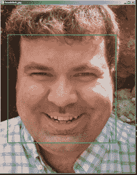
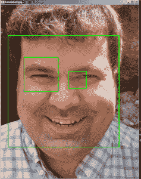

# 基于 Python 和 OpenCV 的人脸检测

> 原文：<https://www.blog.pythonlibrary.org/2018/08/15/face-detection-using-python-and-opencv/>

机器学习、人工智能和人脸识别是眼下的热门话题。所以我想看看用 Python 来检测照片中的人脸是多么容易，这会很有趣。本文将只关注检测人脸，而不是人脸识别，人脸识别实际上是给一张脸指定一个名字。使用 Python 检测人脸最流行也可能是最简单的方法是使用 OpenCV 包。OpenCV 是一个用 C++编写的计算机视觉库，有 Python 绑定。根据您使用的操作系统，安装可能有点复杂，但在大多数情况下，您可以使用 pip:

```py
pip install opencv-python

```

我在旧版本的 Linux 上使用 OpenCV 时遇到了问题，我无法正确安装最新版本。但是这在 Windows 上工作得很好，并且现在似乎在最新版本的 Linux 上也工作得很好。对于本文，我使用的是 OpenCV 的 Python 绑定的 3.4.2 版本。

* * *

### 寻找面孔

使用 OpenCV 查找人脸主要有两种方法:

*   哈尔分类器
*   LBP 级联分类器

大部分教程都用 Haar，因为它更准确，但也比 LBP 慢很多。在本教程中，我将继续使用 Haar。OpenCV 包实际上包含了有效使用 Harr 所需的所有数据。基本上，您只需要一个 XML 文件，其中包含正确的面部数据。如果你知道你在做什么，你可以创建你自己的，或者你可以使用 OpenCV 自带的。我不是数据科学家，所以我将使用内置的分类器。在这种情况下，您可以在您安装的 OpenCV 库中找到它。只需转到 Python 安装中的**/Lib/site-packages/cv2/data**文件夹，并查找**Haar cascade _ frontal face _ alt . XML**。我把那个文件复制出来，放在我写人脸检测代码的那个文件夹里。

哈尔通过观察一系列正面和负面的图像来工作。基本上，有人会将一堆照片中的特征标记为相关或不相关，然后通过机器学习算法或神经网络进行运行。哈尔着眼于边缘，线条和四矩形特征。OpenCV 网站上有一个很好的解释。一旦你有了数据，你就不需要做任何进一步的训练，除非你需要完善你的检测算法。

现在我们已经做好了准备，让我们写一些代码:

```py
import cv2
import os

def find_faces(image_path):
    image = cv2.imread(image_path)

    # Make a copy to prevent us from modifying the original
    color_img = image.copy()

    filename = os.path.basename(image_path)

    # OpenCV works best with gray images
    gray_img = cv2.cvtColor(color_img, cv2.COLOR_BGR2GRAY)

    # Use OpenCV's built-in Haar classifier
    haar_classifier = cv2.CascadeClassifier('haarcascade_frontalface_alt.xml')

    faces = haar_classifier.detectMultiScale(gray_img, scaleFactor=1.1, minNeighbors=5)
    print('Number of faces found: {faces}'.format(faces=len(faces)))

    for (x, y, width, height) in faces:
        cv2.rectangle(color_img, (x, y), (x+width, y+height), (0, 255, 0), 2)

    # Show the faces found
    cv2.imshow(filename, color_img)
    cv2.waitKey(0)
    cv2.destroyAllWindows()

if __name__ == '__main__':
    find_faces('headshot.jpg')

```

我们在这里做的第一件事是进口。OpenCV 绑定在 Python 中被称为 **cv2** 。然后，我们创建一个接受图像文件路径的函数。我们使用 OpenCV 的 **imread** 方法来读取图像文件，然后创建一个副本来防止我们意外修改原始图像。接下来，我们将图像转换为灰度。你会发现计算机视觉几乎总是用灰色比用彩色效果更好，至少 OpenCV 是这样。

下一步是使用 OpenCV 的 XML 文件加载 Haar 分类器。现在，我们可以尝试使用分类器对象的**检测多尺度**方法在我们的图像中找到人脸。我打印出我们找到的面孔的数量，如果有的话。分类器对象实际上返回元组的迭代器。每个元组包含它找到的面的 x/y 坐标以及面的宽度和高度。我们使用这些信息在使用 OpenCV 的**矩形**方法找到的脸部周围画一个矩形。最后我们展示了结果:



我直视镜头的照片效果很好。只是为了好玩，让我们试着运行我通过代码找到的这张[免版税图片](https://www.pexels.com/photo/group-of-people-wearing-blue-volunteer-shirts-1081223/):


当我在代码中运行这个图像时，我得到了如下结果:


正如你所看到的，OpenCV 只找到了四个人脸中的两个，所以这个特定的层叠文件不足以找到照片中的所有人脸。

* * *

### 在照片中寻找眼睛

OpenCV 还有一个 Haar Cascade eye XML 文件，用于查找照片中的眼睛。如果你做过很多摄影，你可能知道当你做肖像的时候，你想试着聚焦在眼睛上。事实上，一些相机甚至有眼睛自动对焦功能。例如，我知道索尼已经吹嘘他们的眼睛对焦功能好几年了，在我对他们的一款相机的测试中，它实际上工作得很好。它很可能使用类似于 Haars 本身的东西来实时发现眼睛。

无论如何，我们需要稍微修改一下代码来创建一个眼睛探测器脚本:

```py
import cv2
import os

def find_faces(image_path):
    image = cv2.imread(image_path)

    # Make a copy to prevent us from modifying the original
    color_img = image.copy()

    filename = os.path.basename(image_path)

    # OpenCV works best with gray images
    gray_img = cv2.cvtColor(color_img, cv2.COLOR_BGR2GRAY)

    # Use OpenCV's built-in Haar classifier
    haar_classifier = cv2.CascadeClassifier('haarcascade_frontalface_alt.xml')
    eye_cascade = cv2.CascadeClassifier('haarcascade_eye.xml')

    faces = haar_classifier.detectMultiScale(gray_img, scaleFactor=1.1, minNeighbors=5)
    print('Number of faces found: {faces}'.format(faces=len(faces)))

    for (x, y, width, height) in faces:
        cv2.rectangle(color_img, (x, y), (x+width, y+height), (0, 255, 0), 2)
        roi_gray = gray_img[y:y+height, x:x+width]
        roi_color = color_img[y:y+height, x:x+width]
        eyes = eye_cascade.detectMultiScale(roi_gray)
        for (ex,ey,ew,eh) in eyes:
            cv2.rectangle(roi_color,(ex,ey),(ex+ew,ey+eh),(0,255,0),2)

    # Show the faces / eyes found
    cv2.imshow(filename, color_img)
    cv2.waitKey(0) 
    cv2.destroyAllWindows()

if __name__ == '__main__':
    find_faces('headshot.jpg')

```

这里我们添加第二个级联分类器对象。这一次，我们使用 OpenCV 内置的 **haarcascade_eye.xml** 文件。另一个变化是在我们的循环中，我们对找到的人脸进行循环。在这里，我们也试图找到眼睛，并在眼睛周围画矩形。我试着在这个新例子中运行我的原始头像，得到了以下结果:



这做得相当好，虽然它没有在右边的眼睛周围画出那么好的矩形。

### 包扎

OpenCV 有很多强大的功能让你开始用 Python 做计算机视觉。你不需要写很多行代码来创建有用的东西。当然，您可能需要做比本教程中显示的更多的工作，训练您的数据并优化您的数据集，以使这种代码正常工作。我的理解是，培训部分是真正耗时的部分。无论如何，我强烈推荐去看看 OpenCV，试一试。这是一个非常整洁的图书馆，有很好的文档。

* * *

### 相关阅读

*   OpenCV - [使用哈尔级联的人脸检测](https://docs.opencv.org/3.3.0/d7/d8b/tutorial_py_face_detection.html)
*   [用 Python 进行人脸识别](https://realpython.com/face-recognition-with-python/)
*   DataScienceGo - [OpenCV 人脸检测](https://www.superdatascience.com/opencv-face-detection/)