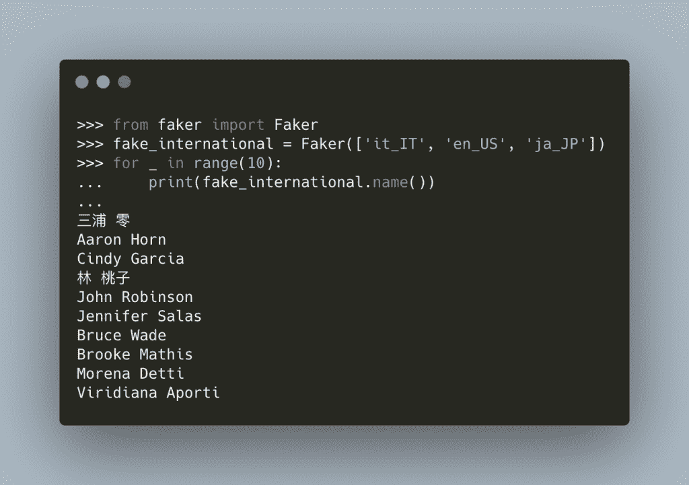

# 用 Faker 软件包伪造数据

> 原文：<https://www.blog.pythonlibrary.org/2021/09/09/faking-data/>

如果您是一名软件开发人员或工程师，那么您知道拥有样本数据会非常有帮助。数据也不一定是真实的数据。相反，数据可能是假的。例如，如果您正在编写一个处理 HIPAA 数据的程序，那么您将不会使用实际数据进行测试，因为这将违反隐私法。

优秀的程序员知道他们应该测试他们的代码，但是当数据受到保护或不可用时，如何测试呢？这就是虚假数据的来源。你可以用假数据填充你的数据库，创建 XML 或 JSON，或者用它来匿名化真实数据。有一个叫做 [Faker](https://faker.readthedocs.io/en/master/) 的 Python 包，可以用来生成假数据。

Faker 的灵感主要来自于 [PHP Faker](https://github.com/fzaninotto/Faker) 、 [Perl Faker](http://search.cpan.org/~jasonk/Data-Faker-0.07/) 和 [Ruby Faker](https://github.com/stympy/faker) 。

使用 Faker 的第一步是安装它！

## 装置

如果你知道如何使用 **pip** ，Faker 很容易安装。以下是您可以运行的命令:

```py
python3 -m pip install Faker
```

现在 Faker 已经安装好了，您可以开始创建假数据了！

## 用 Faker 创建假数据

Faker 让伪造数据变得异常容易。打开您的终端(或 cmd.exe/Powershell)并运行 Python。然后，您可以在您的 REPL 中尝试以下代码:

```py
>>> from faker import Faker
>>> fake = Faker()
>>> fake.name()
'Paul Lynn'
>>> fake.name()
'Keith Soto'
>>> fake.address()
'Unit 6944 Box 5854\nDPO AA 14829'
>>> fake.address()
'44817 Wallace Way Apt. 376\nSouth Ashleymouth, GA 03737'
```

这里你从 **faker** 模块导入 **Faker** 类。接下来，调用几次**名称()**和**地址()**函数。每次调用这些函数时，都会返回一个新的假名字或假地址。

您可以通过创建一个循环并调用 **name()** 十次来看到这一点:

```py
>>> for _ in range(10):
...     print(fake.name())
... 
Tiffany Mueller
Zachary Burgess
Clinton Castillo
Yvonne Scott
Randy Gilbert
Christina Frazier
Samantha Rodriguez
Billy May
Joel Ross
Lee Morales

```

这段代码演示了每次调用函数时，名字都是不同的！

## 创建假的国际数据

Faker 支持在实例化 **Faker()** 类时设置区域设置。这意味着你可以用其他语言伪造数据。

例如，尝试将地区设置为意大利语，然后打印出一些名字:

```py
>>> fake_italian = Faker(locale="it_IT")
>>> for _ in range(10):
...     print(fake_italian.name())
... 
Virgilio Cignaroli
Annibale Tutino
Alessandra Iannucci
Flavio Bianchi
Pier Peruzzi
Marcello Mancini-Saragat
Marina Sismondi
Rolando Comolli
Dott. Benvenuto Luria
Giancarlo Folliero-Dallapé

```

这些名字现在都是意大利语。如果您想要更多的变化，您可以将一个地区列表传递给 **Faker()** 来代替:



**注意:这个例子是一个图像而不是文本，因为语法荧光笔工具不能正确显示亚洲字符。**

## 创建假的 Python 数据

Faker 包甚至可以伪造 Python 数据。如果你不想拿出你的 Python 列表、整数、字典等等，你可以让 Faker 帮你做。

这里有几个例子:

```py
>>> fake.pylist()
['http://www.torres.com/category/', -956214947820.653, 'bPpdDhlEBEbhbQETwXOZ', Decimal('256.347612040523'), '
dPypmKDRlQqxpdkhOfmP', 5848, 'PGyduoxaLewOUdTEdeBs', Decimal('-43.8777257283172'), 'oxqvWiDyWaOErUBrkhIa', 
'hkJbiRnTaPqZpEnuJoFF', 8471, 'scottjason@yahoo.com', 'rXQBeNIKEiGcQpLZKBvR']
>>> fake.pydict()
{'eight': 'http://nielsen.com/posts/about/', 'walk': Decimal('-2945142151233.25'), 'wide': 'mary80@yahoo.com', 
'sell': 5165, 'information': 2947, 'fire': 'http://www.mitchell.com/author.html', 'sea': 4662, 
'claim': 'xhogan@jackson.com'}
>>> fake.pyint()
493
>>> fake.pyint()
6280
```

这不是很好吗？

## 包扎

Faker 允许您设置自定义种子或创建自己的假数据提供者。要了解全部细节，请阅读 Faker 的[文档](https://faker.readthedocs.io/en/master/)。您应该今天就看看这个包，看看它对您自己的代码有多大用处。

## 其他简洁的 Python 包

想了解其他整洁的 Python 包吗？查看以下教程:

*   arrow—[Python 的新日期/时间包](https://www.blog.pythonlibrary.org/2014/08/05/arrow-a-new-date-time-package-for-python/)
*   PySimpleGUI 简介
*   OpenPyXL–[使用 Python 使用 Microsoft Excel】](https://www.blog.pythonlibrary.org/2020/11/03/openpyxl-working-with-microsoft-excel-using-python/)