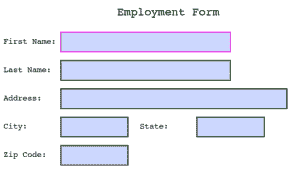
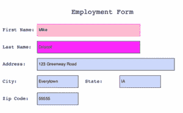

# 用 Python 填充 PDF 表单

> 原文：<https://www.blog.pythonlibrary.org/2018/05/22/filling-pdf-forms-with-python/>

多年来，可填写表格一直是 Adobe PDF 格式的一部分。在美国，可填写表单最著名的例子之一是来自国内税收署的文档。有许多政府表格使用可填写的表格。以编程方式填写这些表单有许多不同的方法。我听说过的最耗时的方法是在 ReportLab 中手工重新创建表单，然后填写。坦白地说，我认为这可能是最糟糕的主意，除非你的公司自己负责创建 pdf。那么这可能是一个可行的选择，因为这样你就可以完全控制 PDF 的创建和输入。

* * *

### 创建简单的表单

我们需要一个简单的表单用于我们的第一个例子。ReportLab 内置了对创建交互式窗体的支持，所以让我们使用 ReportLab 来创建一个简单的窗体。下面是代码:

```py

# simple_form.py

from reportlab.pdfgen import canvas
from reportlab.pdfbase import pdfform
from reportlab.lib.colors import magenta, pink, blue, green

def create_simple_form():
    c = canvas.Canvas('simple_form.pdf')

    c.setFont("Courier", 20)
    c.drawCentredString(300, 700, 'Employment Form')
    c.setFont("Courier", 14)
    form = c.acroForm

    c.drawString(10, 650, 'First Name:')
    form.textfield(name='fname', tooltip='First Name',
                   x=110, y=635, borderStyle='inset',
                   borderColor=magenta, fillColor=pink, 
                   width=300,
                   textColor=blue, forceBorder=True)

    c.drawString(10, 600, 'Last Name:')
    form.textfield(name='lname', tooltip='Last Name',
                   x=110, y=585, borderStyle='inset',
                   borderColor=green, fillColor=magenta, 
                   width=300,
                   textColor=blue, forceBorder=True)

    c.drawString(10, 550, 'Address:')
    form.textfield(name='address', tooltip='Address',
                   x=110, y=535, borderStyle='inset',
                   width=400, forceBorder=True)

    c.drawString(10, 500, 'City:')
    form.textfield(name='city', tooltip='City',
                   x=110, y=485, borderStyle='inset',
                   forceBorder=True)

    c.drawString(250, 500, 'State:')
    form.textfield(name='state', tooltip='State',
                   x=350, y=485, borderStyle='inset',
 forceBorder=True)

    c.drawString(10, 450, 'Zip Code:')
    form.textfield(name='zip_code', tooltip='Zip Code',
                   x=110, y=435, borderStyle='inset',
                   forceBorder=True)

    c.save()

if __name__ == '__main__':
    create_simple_form() 
```

运行此示例时，交互式 PDF 表单如下所示:



现在，我们准备学习填写此表格的方法之一！

* * *

### 合并覆盖

Jan Ch 撰写了一篇关于 [Medium](https://medium.com/@zwinny/filling-pdf-forms-in-python-the-right-way-eb9592e03dba) 的文章，其中包含了几种不同的方法来解决在 pdf 中填写表单的问题。提出的第一个解决方案是在 PDF 中获取一个未填充的表单，并使用 ReportLab 创建一个单独的 PDF，其中包含我们希望“填充”该表单的数据。然后作者使用 **pdfrw** 将两个 pdf 合并在一起。理论上，您也可以将 PyPDF2 用于合并过程。让我们来看看这个方法是如何使用 **pdfrw** 包工作的。

让我们从安装 **pdfrw** 开始:

```py

python -m pip install pdfrw

```

现在我们已经安装了这些，让我们创建一个名为 **fill_by_overlay.py** 的文件。我们将向该文件添加两个函数。第一个函数将创建我们的覆盖。让我们来看看:

```py

# fill_by_overlay.py

import pdfrw
from reportlab.pdfgen import canvas

def create_overlay():
    """
    Create the data that will be overlayed on top
    of the form that we want to fill
    """
    c = canvas.Canvas('simple_form_overlay.pdf')

    c.drawString(115, 650, 'Mike')
    c.drawString(115, 600, 'Driscoll')
    c.drawString(115, 550, '123 Greenway Road')
    c.drawString(115, 500, 'Everytown')
    c.drawString(355, 500, 'IA')
    c.drawString(115, 450, '55555')

    c.save()

```

在这里，我们导入了 **pdfrw** 包，还从 ReportLab 导入了**画布**子模块。然后我们创建一个名为 **create_overlay** 的函数，它使用 ReportLab 的 **Canvas** 类创建一个简单的 PDF。我们只是用**拉带**画布的方法。这需要反复试验。幸运的是，在 Linux 和 Mac 上，有不错的 PDF 预览应用程序，你可以用它来保持 PDF 打开，它们会随着每次更改自动刷新。这对于计算出绘制字符串所需的精确坐标非常有帮助。因为我们创建了原始表单，所以计算覆盖图的偏移量实际上非常容易。我们已经知道表单元素在页面上的位置，所以我们可以很好地猜测将字符串绘制到哪里。

这个难题的下一部分实际上是将我们在上面创建的覆盖图与我们在前一部分创建的表单合并。接下来让我们编写这个函数:

```py

def merge_pdfs(form_pdf, overlay_pdf, output):
    """
    Merge the specified fillable form PDF with the 
    overlay PDF and save the output
    """
    form = pdfrw.PdfReader(form_pdf)
    olay = pdfrw.PdfReader(overlay_pdf)

    for form_page, overlay_page in zip(form.pages, olay.pages):
        merge_obj = pdfrw.PageMerge()
        overlay = merge_obj.add(overlay_page)[0]
        pdfrw.PageMerge(form_page).add(overlay).render()

    writer = pdfrw.PdfWriter()
    writer.write(output, form)

if __name__ == '__main__':
    create_overlay()
    merge_pdfs('simple_form.pdf', 
               'simple_form_overlay.pdf', 
               'merged_form.pdf')

```

这里我们使用 pdfrw 的 **PdfReader** 类打开表单和覆盖 pdf。然后我们遍历两个 pdf 的页面，并使用**页面合并**将它们合并在一起。在代码的最后，我们创建了一个 **PdfWriter** 的实例，我们用它来写出新合并的 PDF。最终结果应该是这样的:



注意:当我运行这段代码时，我确实在 stdout 上收到了一些错误。这里有一个例子:

```py

[ERROR] tokens.py:226 stream /Length attribute (171) appears to be too small (size 470) -- adjusting (line=192, col=1)

```

正如我提到的，这实际上并不妨碍合并 PDF 的创建。但是你可能要留意这些，因为如果你有任何问题，它们可能暗示着一个问题。

* * *

### 填写表单的其他方式

我读过一些其他的方法来“填充”这些类型的 pdf 中的字段。其中一个是获取一个 PDF 文件，并将页面保存为一系列图像。然后在您想要添加文本的位置绘制矩形，然后使用您的新图像作为配置文件来填写 PDF。似乎有点古怪，坦白说，我不想去做那些工作。

更好的方法是在 PDF 编辑器中打开 PDF，您可以在其中添加不可见的只读字段。您可以用唯一的名称标记字段，然后通过 PDF 的元数据访问它们。在元数据上循环，并使用 ReportLab 的 canvas 方法再次创建一个覆盖图，然后以与之前大致相同的方式将其合并。

我也看到很多人在谈论使用表单数据格式或 FDF。这是 PDF 应该用来保存要在 PDF 中填充的数据的格式。您可以使用 **PyPDFtk** 和 **PdfJinja** 来完成表单填写。有趣的是， **PyPDFtk** 不能处理图像字段，比如你可能想要粘贴签名图像的地方。为此，您可以使用 **PdfJinja** 。然而 **PdfJinja** 在使用复选框和单选按钮时似乎有一些限制。

您可以通过以下链接了解有关这些主题的更多信息:

*   [https://yoongkang.com/blog/pdf-forms-with-python/](https://yoongkang.com/blog/pdf-forms-with-python/)
*   [https://medium . com/@ zwin ny/filling-pdf-forms-in-python-the-right-way-EB 9592 e 03 DBA](https://medium.com/@zwinny/filling-pdf-forms-in-python-the-right-way-eb9592e03dba)

* * *

### 使用 pdf 表单包

我认为在易用性方面最有希望的包是新的 **pdfforms** 包。不过它要求你安装一个名为 **pdftk** 的跨平台应用程序。幸运的是 pdftk 是免费的，所以这不是一个真正的问题。

您可以使用 pip 安装 pdfforms，如下所示:

```py

python -m pip install pdfforms

```

要使用 pdfforms，您必须首先让它**检查**包含表单的 PDF，以便它知道如何填写。你可以这样做检查:

```py

pdfforms inspect simple_form.pdf

```

如果 pdfforms 工作正常，它会在“test”子文件夹中创建一个“filled”PDF。该子文件夹出现在 pdfforms 本身所在位置的旁边，而不是您运行它的位置。它将按顺序用数字填充表单。这些是**字段编号**。

接下来您要做的是创建一个 CSV 文件，其中第一列和第一行包含 PDF 的名称。第一列中的其他行对应于字段编号。您在此输入要填写的字段的编号。然后，在 CSV 文件的第三列中输入要在表单中填写的数据。第二列被忽略，所以您可以在这里放置一个描述。第三列之后的所有列也将被忽略，因此这些列可以用于您想要的任何用途。

对于本例，您的 CSV 文件可能如下所示:

```py

simple_form.pdf,,,
1,first name,Mike
2,last name,Driscoll

```

填写完 CSV 后，您可以运行以下命令，用您的自定义数据实际填写表单:

```py

pdfforms fill data.csv

```

默认情况下，填充的 PDF 会出现在名为 **filled** 的子文件夹中。

现在说说坏消息。我无法让它在 Windows 或 Mac 上正常工作。我让 **inspect** 步骤在 Windows 上运行，但在 Mac 上它只是挂起。在 Windows 上，当我运行 **fill** 命令时，它失败了，并显示一个错误，说找不到要填充的 PDF。

我想当这个包变得不那么容易出错的时候，真的会很神奇。除了运行有问题之外，唯一主要的缺点是你需要安装一个根本不是用 Python 写的第三方工具。

* * *

### 包扎

在查看了 Python 开发人员可用于填充 PDF 表单的许多不同选项后，我认为最直接的方法是创建覆盖图，然后使用 pdfrw 之类的工具将其合并到可填充的表单 PDF 中。虽然这感觉有点像黑客，但我见过的其他方法看起来也一样的黑客和耗时。一旦您知道了表单中一个单元格的位置，您就可以合理地计算出页面上大多数其他单元格的位置。

* * *

### 附加阅读

*   在 [PyPI](https://pypi.python.org/pypi/pdfforms/1.0.0) 上的 pdfforms 包
*   [Github](https://github.com/pmaupin/pdfrw) 上的 pdfrw 包
*   [Github](https://github.com/rammie/pdfjinja) 上的 PdfJinja 包
*   使用 Python 的 PDF 表单[博客文章](https://yoongkang.com/blog/pdf-forms-with-python/)