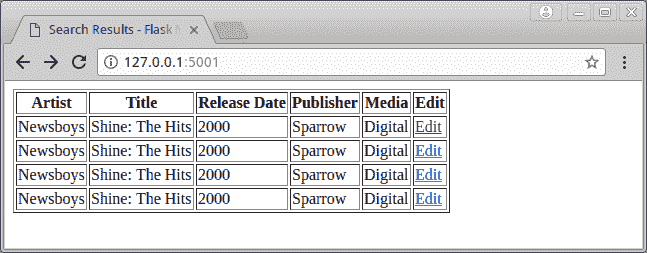

# 烧瓶 101:添加、编辑和显示数据

> 原文：<https://www.blog.pythonlibrary.org/2017/12/14/flask-101-adding-editing-and-displaying-data/>

[上次](https://www.blog.pythonlibrary.org/2017/12/13/flask-101-how-to-add-a-search-form/)我们学习了如何在我们的音乐数据库应用程序中添加一个搜索表单。当然，我们还没有向数据库中添加任何数据，所以搜索表单实际上并没有做什么，只是告诉我们它没有找到任何东西。在本教程中，我们将学习如何实际添加数据，显示搜索结果和编辑数据库中的条目。

我们开始吧！

* * *

### 向数据库添加数据

让我们从编写新专辑开始吧。打开我们在上一个教程中创建的“forms.py”文件，并添加以下类:

```py

class AlbumForm(Form):
    media_types = [('Digital', 'Digital'),
                   ('CD', 'CD'),
                   ('Cassette Tape', 'Cassette Tape')
                   ]
    artist = StringField('Artist')
    title = StringField('Title')
    release_date = StringField('Release Date')
    publisher = StringField('Publisher')
    media_type = SelectField('Media', choices=media_types)

```

这定义了创建新相册所需的所有字段。现在我们需要打开“main.py”并添加一个函数来处理当我们想要创建新相册时发生的事情。

```py

# main.py

from app import app
from db_setup import init_db, db_session
from forms import MusicSearchForm, AlbumForm
from flask import flash, render_template, request, redirect
from models import Album

init_db()

@app.route('/', methods=['GET', 'POST'])
def index():
    search = MusicSearchForm(request.form)
    if request.method == 'POST':
        return search_results(search)

    return render_template('index.html', form=search)

@app.route('/results')
def search_results(search):
    results = []
    search_string = search.data['search']

    if search.data['search'] == '':
        qry = db_session.query(Album)
        results = qry.all()

    if not results:
        flash('No results found!')
        return redirect('/')
    else:
        # display results
        return render_template('results.html', table=table)

@app.route('/new_album', methods=['GET', 'POST'])
def new_album():
    """
    Add a new album
    """
    form = AlbumForm(request.form)
    return render_template('new_album.html', form=form)

if __name__ == '__main__':
    app.run()

```

在这里，我们添加了一个导入来导入顶部的新表单，然后我们创建了一个名为 **new_album()** 的新函数。然后，我们创建新表单的一个实例，并将其传递给我们的 **render_template()** 函数，该函数将呈现一个名为“new_album.html”的文件。当然，这个 HTML 文件还不存在，所以这将是我们需要创建的下一个东西。当您保存这个新的 HTML 文件时，请确保将其保存到“musicdb”文件夹内的“templates”文件夹中。

创建“new_album.html”后，向其中添加以下 html:

```py

 <title>New Album - Flask Music Database</title>

## 新相册



<form method="post">

        {{ render_field(form.artist) }}
        {{ render_field(form.title) }}
        {{ render_field(form.release_date) }}
        {{ render_field(form.publisher) }}
        {{ render_field(form.media_type) }}

 

</form> 
```

这段代码将呈现表单中的每个字段，它还创建了一个提交按钮，这样我们就可以保存我们的更改。我们需要做的最后一件事是更新我们的“index.html”代码，这样它就有一个链接可以加载我们的新相册页面。基本上，我们需要做的就是添加以下内容:

```py

 New Album 

```

所以完整的变化看起来是这样的:

```py

 <title>Flask Music Database</title>

## 烧瓶音乐数据库

[新专辑]({{ url_for('.new_album') }})

{ % with messages = get _ flash _ messages()% }
{ % if messages % }

*   {{消息}}

  




<form method="post">

    {{ render_field(form.select) }}

{{ render_field(form.search) }}

 

</form> 
```

现在，如果您加载 web 应用程序的主页，它应该是这样的:

[](https://www.blog.pythonlibrary.org/wp-content/uploads/2017/12/flask_musicdb_main_with_new_link.png)

如果你点击“新相册”链接，你应该会在你的浏览器中看到这样的内容:

[](https://www.blog.pythonlibrary.org/wp-content/uploads/2017/12/flask_musicdb_new_album.png)

现在我们有了一个丑陋但功能强大的新相册表单，但我们实际上并没有让**提交**按钮工作。这是我们的下一个任务。

* * *

### 保存数据

当按下提交按钮时，我们需要新的相册表单来保存数据。但是当你按下提交按钮时会发生什么呢？如果您返回到“new_album.html”文件，您会注意到我们将**表单方法**设置为 POST。所以我们需要更新 **main.py** 中的代码，这样它就可以在 POST 上做一些事情。

为了进行保存，我们需要更新 **main.py** 中的 **new_album()** 函数，因此结果如下:

```py

@app.route('/new_album', methods=['GET', 'POST'])
def new_album():
    """
    Add a new album
    """
    form = AlbumForm(request.form)

    if request.method == 'POST' and form.validate():
        # save the album
        album = Album()
        save_changes(album, form, new=True)
        flash('Album created successfully!')
        return redirect('/')

    return render_template('new_album.html', form=form)

```

现在，当我们发布时，我们创建一个相册实例，并将其与表单对象一起传递给一个 **save_changes()** 函数。我们还传递一个标志，表明该项目是否是新的。我们将在文章的后面讨论我为什么添加最后一个。不过现在，我们需要创建 **save_changes()** 函数。将下面的代码保存在 **main.py** 脚本中。

```py

def save_changes(album, form, new=False):
    """
    Save the changes to the database
    """
    # Get data from form and assign it to the correct attributes
    # of the SQLAlchemy table object
    artist = Artist()
    artist.name = form.artist.data

    album.artist = artist
    album.title = form.title.data
    album.release_date = form.release_date.data
    album.publisher = form.publisher.data
    album.media_type = form.media_type.data

    if new:
        # Add the new album to the database
        db_session.add(album)

    # commit the data to the database
    db_session.commit()

```

这里，我们从表单中提取数据，并相应地将其分配给相册对象的属性。您还会注意到，我们需要创建一个**艺术家**实例来将艺术家正确地添加到相册中。如果不这样做，将会得到一个与 SQLAlchemy 相关的错误。这里使用新参数向数据库添加新记录。

下面是我做的一个测试:

[](https://www.blog.pythonlibrary.org/wp-content/uploads/2017/12/flask_musicdb_new_album_saves.png)

一旦项目保存，它应该带你回到网站的主页。需要注意的一点是，我没有在数据库中做任何检查来防止用户多次保存一个条目。如果你想接受挑战，这是你可以自己添加的。无论如何，当我测试这个的时候，我提交了相同的条目几次，所以当我搜索的时候，我应该会得到相同条目的多个条目。如果您现在尝试进行搜索，您将会看到一个错误，因为我们还没有创建结果页面。

让我们接着做吧！

* * *

### 显示搜索结果

我更喜欢表格化的结果，这需要使用表格。您可以下载另一个名为[烧瓶表](http://flask-table.readthedocs.io/en/stable/)的烧瓶扩展，而不是摆弄 HTML 表元素。要安装它，只需像这样使用 pip:

```py

pip install flask_table

```

现在我们已经安装了 Flask 表，我们需要创建一个表定义。让我们创建一个名为“tables.py”的文件，并将其保存在 musicdb 文件夹中。在编辑器中打开它，并添加以下代码:

```py

from flask_table import Table, Col

class Results(Table):
    id = Col('Id', show=False)
    artist = Col('Artist')
    title = Col('Title')
    release_date = Col('Release Date')
    publisher = Col('Publisher')
    media_type = Col('Media')

```

当您定义表类时，您会希望使类属性与将传递给它的对象中的属性具有相同的名称。在本例中，我使用了 Album 类中的属性。现在我们只需要创建一个**results.html**文件，并将其保存到**模板**文件夹中。该文件中应该包含以下内容:

```py

 <title>Search Results - Flask Music Database</title>
{{ table }} 
```

正如您所看到的，我们需要做的只是添加一个 title 元素，这实际上是可选的，并在 Jinja 中添加一个 table 对象。

最后，我们需要更新我们的 **main.py** 中的搜索功能，以使用一个表:

```py

@app.route('/results')
def search_results(search):
    results = []
    search_string = search.data['search']

    if search.data['search'] == '':
        qry = db_session.query(Album)
        results = qry.all()

    if not results:
        flash('No results found!')
        return redirect('/')
    else:
        # display results
        table = Results(results)
        table.border = True
        return render_template('results.html', table=table)

```

现在，当您使用空字符串运行搜索时，您应该会看到类似这样的内容:

[](https://www.blog.pythonlibrary.org/wp-content/uploads/2017/12/flask_musicdb_search_results.png)

是的，它很简单，但是它很有效，你现在可以看到你数据库中的所有东西。

* * *

### 编辑数据库中的数据

我们需要涉及的最后一项是如何编辑数据库中的数据。最简单的方法之一是搜索一个条目，并为用户添加一种方法来编辑找到的条目。打开 tables.py 文件并添加一个 **LinkCol** :

```py

from flask_table import Table, Col, LinkCol

class Results(Table):
    id = Col('Id', show=False)
    artist = Col('Artist')
    title = Col('Title')
    release_date = Col('Release Date')
    publisher = Col('Publisher')
    media_type = Col('Media')
    edit = LinkCol('Edit', 'edit', url_kwargs=dict(id='id'))

```

LinkCol 将列名作为一个字符串以及端点应该是什么。端点是单击链接时将调用的函数。我们还传递条目的 id，以便在数据库中查找它(即 url_kwargs 参数)。现在我们需要用一个名为 **edit()** 的函数来更新我们的 **main.py** 文件:

```py

@app.route('/item/', methods=['GET', 'POST'])
def edit(id):
    qry = db_session.query(Album).filter(
                Album.id==id)
    album = qry.first()

    if album:
        form = AlbumForm(formdata=request.form, obj=album)
        if request.method == 'POST' and form.validate():
            # save edits
            save_changes(album, form)
            flash('Album updated successfully!')
            return redirect('/')
        return render_template('edit_album.html', form=form)
    else:
        return 'Error loading #{id}'.format(id=id) 
```

这里要注意的第一点是，我们为 URL 设置了一个自定义路由，它使用我们传递给它的 id 来创建一个惟一的 URL。接下来，我们在数据库中搜索有问题的 id。如果我们找到了 id，那么我们就可以使用之前创建的表单来创建表单。但是这次我们传递给它的是相册对象，所以表单已经预先填充了数据，这样我们就有东西可以编辑了。如果用户按下这个页面上的 Submit 按钮，那么它会将条目保存到数据库中，并向用户显示一条消息。如果我们传入一个错误的 id，那么将向用户显示一条消息。

我们还需要在我们的**模板**文件夹中创建一个 **edit_album.html** 文件。下面是您需要放入该文件的 HTML:

```py

 <title>Edit Album - Flask Music Database</title>

## 编辑相册



<form method="post">

        {{ render_field(form.artist) }}
        {{ render_field(form.title) }}
        {{ render_field(form.release_date) }}
        {{ render_field(form.publisher) }}
        {{ render_field(form.media_type) }}

 

</form> 
```

现在，当我们运行之前的空搜索时，您应该会看到:

[](https://www.blog.pythonlibrary.org/wp-content/uploads/2017/12/flask_musicdb_search_edit.png)

让我们点击第一行的编辑链接:

[](https://www.blog.pythonlibrary.org/wp-content/uploads/2017/12/flask_musicdb_edit_album.png)

在这里，我编辑页面上的大多数字段。然后我点击提交，得到这个:

[](https://www.blog.pythonlibrary.org/wp-content/uploads/2017/12/flask_musicdb_album_updated.png)

据推测，该条目已根据我的更改进行了更新。要进行验证，请尝试运行另一个空搜索:

[](https://www.blog.pythonlibrary.org/wp-content/uploads/2017/12/flask_musicdb_edited_results.png)

看起来没错，所以现在我们已经完成了编辑功能！

* * *

### 包扎

此时，您应该能够向数据库添加条目，显示所有条目并编辑这些条目。缺少的主要项目是如何过滤搜索结果，以便它实际上寻找您想要的搜索词，而不是总是返回数据库中的所有内容。我们可能还应该添加从数据库中删除项目的功能。这些是我们将在下一篇文章中探讨的主题。现在，享受快乐的编码吧！

* * *

### 下载代码

从本文下载一个代码包:[flask _ musicdb _ part _ iv . tar](https://www.blog.pythonlibrary.org/wp-content/uploads/2017/12/flask_musicdb_part_iv.tar.gz)或者在 [Github](https://github.com/driscollis/flask101) 上克隆它

* * *

### 本系列的其他文章

*   **第一部分**-101 号烧瓶:[入门](https://www.blog.pythonlibrary.org/2017/12/12/flask-101-getting-started/)
*   **第二部分** -烧瓶 101: [添加数据库](https://www.blog.pythonlibrary.org/2017/12/12/flask-101-adding-a-database/)
*   **第三部分** -烧瓶 101: [如何添加搜索表单](https://www.blog.pythonlibrary.org/2017/12/13/flask-101-how-to-add-a-search-form/)