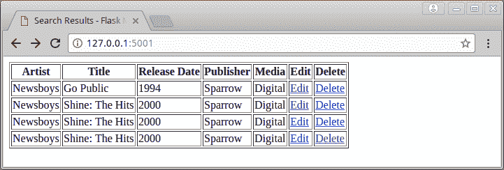
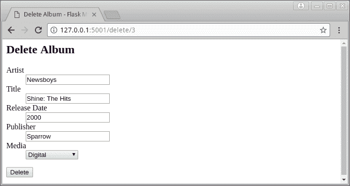
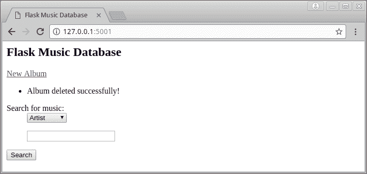
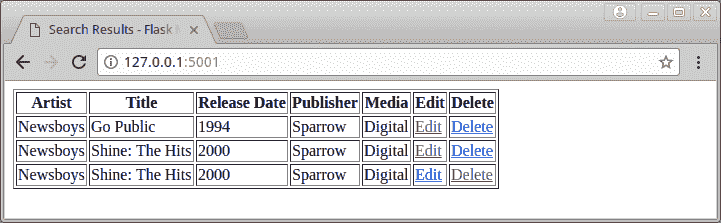

# Flask 101:过滤搜索和删除数据

> 原文：<https://www.blog.pythonlibrary.org/2017/12/15/flask-101-filtering-searches-and-deleting-data/>

[上次](https://www.blog.pythonlibrary.org/2017/12/14/flask-101-adding-editing-and-displaying-data/)我们让基于 Flask 的音乐数据库应用程序部分运行。它现在可以向数据库中添加数据，编辑所述数据，还可以显示数据库中的所有内容。但是我们没有介绍如何使用用户的过滤器选择(艺术家、专辑名称或出版商名称)和搜索字符串来过滤数据。我们也没有讨论如何从数据库中删除条目。这是本文的双重目标。

* * *

### 过滤搜索结果

使用 SQLAlchemy(通过 Flask-SQLAlchemy)过滤搜索结果实际上非常容易。您需要做的就是创建一些非常简单的查询对象。打开我们上次编辑的 **main.py** 文件，用下面的代码版本替换 **search_results()** 函数:

```py

@app.route('/results')
def search_results(search):
    results = []
    search_string = search.data['search']

    if search_string:
        if search.data['select'] == 'Artist':
            qry = db_session.query(Album, Artist).filter(
                Artist.id==Album.artist_id).filter(
                    Artist.name.contains(search_string))
            results = [item[0] for item in qry.all()]
        elif search.data['select'] == 'Album':
            qry = db_session.query(Album).filter(
                Album.title.contains(search_string))
            results = qry.all()
        elif search.data['select'] == 'Publisher':
            qry = db_session.query(Album).filter(
                Album.publisher.contains(search_string))
            results = qry.all()
        else:
            qry = db_session.query(Album)
            results = qry.all()
    else:
        qry = db_session.query(Album)
        results = qry.all()

    if not results:
        flash('No results found!')
        return redirect('/')
    else:
        # display results
        table = Results(results)
        table.border = True
        return render_template('results.html', table=table)

```

这里我们添加了一个有点长的条件 if 语句。我们首先检查用户是否在搜索文本框中输入了搜索字符串。如果是，那么我们检查用户从组合框中选择了哪个过滤器:艺术家、专辑或出版商。根据用户的选择，我们创建一个定制的 SQLAlchemy 查询。如果用户没有输入搜索词，或者如果我们的 web 应用程序搞混了，不能识别用户的过滤器选择，那么我们对整个数据库进行查询。如果数据库变得非常大，那么在生产中可能不应该这样做，然后对数据库进行查询会导致您的 web 应用程序没有响应。您可以简单地向表单的输入添加一些验证来防止这种情况发生(即不要使用空的搜索字符串查询数据库)。然而，我们不会在这里涵盖这一点。

无论如何，继续尝试这段代码，看看它是如何工作的。我尝试了几个不同的搜索词，它似乎对我的用例很有效。您会注意到，我只是使用了 [contains 方法](http://docs.sqlalchemy.org/en/latest/orm/internals.html#sqlalchemy.orm.properties.RelationshipProperty.Comparator.contains),这对于在表的列中查找字符串非常有用。你可以随时索引你的数据库，并对其进行其他各种优化，包括让这些查询更加集中，如果你愿意的话。请随意使用这段代码，看看如何改进它。

现在我们将继续学习如何从数据库中删除项目！

* * *

### 删除数据

有时候，当你在数据库中输入一些东西，你只是想删除。从技术上讲，你可以使用我们的编辑功能来编辑条目，但有时你只需要永久清除数据。因此，我们需要做的第一件事是在结果表中添加一个 **Delete** 列。您将希望打开 **tables.py** 并将一个新的 **LinkCol** 实例添加到 **Results** 类中:

```py

from flask_table import Table, Col, LinkCol

class Results(Table):
    id = Col('Id', show=False)
    artist = Col('Artist')
    title = Col('Title')
    release_date = Col('Release Date')
    publisher = Col('Publisher')
    media_type = Col('Media')
    edit = LinkCol('Edit', 'edit', url_kwargs=dict(id='id'))
    delete = LinkCol('Delete', 'delete', url_kwargs=dict(id='id'))

```

正如我们在创建用于编辑数据的链接时所做的那样，我们添加了一个用于删除数据的新链接。您会注意到第二个参数，也就是端点，指向一个删除函数。所以下一步是打开我们的 **main.py** 文件并添加所说的 **delete()** 函数:

```py

@app.route('/delete/', methods=['GET', 'POST'])
def delete(id):
    """
    Delete the item in the database that matches the specified
    id in the URL
    """
    qry = db_session.query(Album).filter(
        Album.id==id)
    album = qry.first()

    if album:
        form = AlbumForm(formdata=request.form, obj=album)
        if request.method == 'POST' and form.validate():
            # delete the item from the database
            db_session.delete(album)
            db_session.commit()

            flash('Album deleted successfully!')
            return redirect('/')
        return render_template('delete_album.html', form=form)
    else:
        return 'Error deleting #{id}'.format(id=id) 
```

这段代码实际上非常类似于上一篇文章中的 edit()函数。你会注意到我们更新了路线。所以没有指定`'/item/<id>'`，而是做成`'/delete/<id>'`。这使得两个函数之间的 URL 不同，所以当链接被点击时，它们实际上执行正确的函数。另一个区别是，我们不需要在这里创建一个特殊的保存函数。我们只是直接引用 **db_session** 对象，并告诉它如果在数据库中找到相册就删除它，然后提交我们的更改。

如果您运行该代码，在执行空字符串搜索时，您应该会看到如下内容:

[](https://www.blog.pythonlibrary.org/wp-content/uploads/2017/12/flask_musicdb_deleting_link.png)

我们需要做的最后一件事是创建上面提到的 **delete_album.html** 。让我们创建该文件，并将其保存到我们的**模板**文件夹中。一旦创建了该文件，只需添加以下内容:

```py

 <title>Delete Album - Flask Music Database</title>

## 删除相册



<form method="post">

        {{ render_field(form.artist) }}
        {{ render_field(form.title) }}
        {{ render_field(form.release_date) }}
        {{ render_field(form.publisher) }}
        {{ render_field(form.media_type) }}

 

</form> 
```

这段代码将呈现我们的表单，向用户显示他们正在删除的内容。让我们尝试单击表中一个副本的删除链接。您应该会看到这样一个屏幕:

[](https://www.blog.pythonlibrary.org/wp-content/uploads/2017/12/flask_musicdb_delete_album.png)

当您按下“删除”按钮时，它会将您重定向到主页，在那里您会看到一条消息，说明该项目已成功删除:

[](https://www.blog.pythonlibrary.org/wp-content/uploads/2017/12/flask_musicdb_del_success.png)

要验证删除是否有效，只需再进行一次空字符串搜索。您的结果应该在表格中少显示一项:

[](https://www.blog.pythonlibrary.org/wp-content/uploads/2017/12/flask_musicdb_deleted_results.png)

* * *

### 包扎

现在，您应该知道如何对数据库中的搜索结果进行一些基本的过滤。您还学习了如何在 Flask 应用程序中成功地从数据库中删除项目。代码中有几个地方可以使用重构和常规清理。您还可以在应用程序中添加一些 CSS 样式，使其看起来更漂亮。这些是我留给读者的练习。玩代码玩得开心点，试试 Flask 吧。这是一个简洁的 web 框架，非常值得一看！

* * *

### 下载代码

从本文下载一段代码: [flask_musicdb_v.tar](https://www.blog.pythonlibrary.org/wp-content/uploads/2017/12/flask_musicdb_v.tar.gz)

* * *

### 本系列的其他文章

*   **第一部分**-101 号烧瓶:[入门](https://www.blog.pythonlibrary.org/2017/12/12/flask-101-getting-started/)
*   **第二部分** -烧瓶 101: [添加数据库](https://www.blog.pythonlibrary.org/2017/12/12/flask-101-adding-a-database/)
*   **第三部分** -烧瓶 101: [如何添加搜索表单](https://www.blog.pythonlibrary.org/2017/12/13/flask-101-how-to-add-a-search-form/)
*   **第四部分** -烧瓶 101: [添加、编辑和显示数据](https://www.blog.pythonlibrary.org/2017/12/14/flask-101-adding-editing-and-displaying-data/)