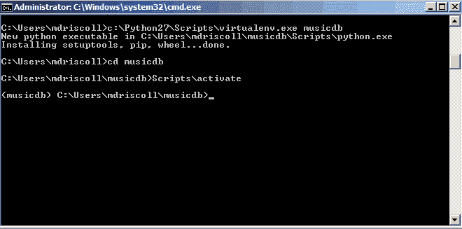
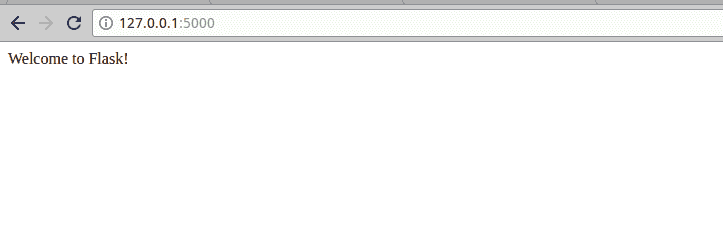

# 烧瓶 101:开始

> 原文：<https://www.blog.pythonlibrary.org/2017/12/12/flask-101-getting-started/>

Flask 101 系列是我学习 Python 的 Flask 微框架的尝试。对于那些没听说过的人来说，Flask 是用 Python 创建 web 应用程序的微型 web 框架。根据他们的网站， [Flask](http://flask.pocoo.org/) 是*基于 Werkzeug，Jinja 2 和 good intentions* 。对于这一系列文章，我想创建一个 web 应用程序，它将做一些有用的事情，而不会太复杂。所以为了我的学习理智，我决定创建一个简单的 web 应用程序，我可以用它来存储我的音乐库的信息。

在多篇文章中，您将看到这一旅程是如何展开的。

* * *

### 获取设置

要开始使用 Flask，您需要安装它。我们将为这一系列教程创建一个虚拟环境，因为我们将需要添加许多其他 Flask 依赖项，而且大多数人可能不想用大量他们可能最终不会使用的 cruft 来污染他们的主 Python 安装。所以在我们安装 Flask 之前，让我们使用 **virtualenv** 创建一个虚拟环境。如果你想使用 virtualenv，那么我们需要安装 pip:

```py

pip install virtualenv

```

现在我们已经安装了，我们可以创建我们的虚拟环境。在您的本地系统上找到一个您想要存储 web 应用程序的位置。然后打开终端并运行以下命令:

```py

virtualenv musicdb

```

在 Windows 上，您可能必须给出 virtualenv 的完整路径，通常类似于**C:\ python 36 \ Scripts \ virtualenv . exe**。

注意，从 Python 3.3 开始，还可以使用 Python 内置的 [venv](https://docs.python.org/3/library/venv.html) 模块来创建虚拟环境，而不是使用 virtualenv。当然，virtualenv 包可以安装在 Python 3 中，所以要用哪个由你决定。它们的工作方式非常相似。

设置好虚拟环境后，您需要激活它。为此，您需要将终端中的目录更改为您刚刚使用“cd”命令创建的文件夹:

```py

cd musicdb

```

如果您在 Linux 或 Mac OS 上，您应该运行以下程序:

```py

source bin/activate

```

Windows 有点不同。您仍然需要“cd”到您的文件夹中，但是要运行的命令是这样的:

```py

Scripts/activate

```

有关激活和停用虚拟环境的更多详细信息，请查看[用户指南](https://virtualenv.pypa.io/en/stable/userguide/)。

您可能已经注意到，当您创建您的虚拟环境时，它复制到您的 Python 可执行文件以及 pip 中。这意味着您现在可以使用 pip 将软件包安装到您的虚拟环境中，这也是许多人喜欢虚拟环境的原因。一旦虚拟环境被激活，您应该看到您的终端已经更改为将虚拟环境的名称添加到终端的提示符前面。下面是一个使用 Python 2.7 的截图示例:



现在我们准备安装 Flask！

* * *

### 开始使用 Flask

使用 pip 安装程序很容易安装 Flask。你可以这样做:

```py

pip install flask

```

这个命令将安装 Flask 和它需要的任何依赖项。这是我收到的输出:

```py

Collecting flask
Downloading Flask-0.12.2-py2.py3-none-any.whl (83kB)
100% |████████████████████████████████| 92kB 185kB/s
Collecting itsdangerous>=0.21 (from flask)
Downloading itsdangerous-0.24.tar.gz (46kB)
100% |████████████████████████████████| 51kB 638kB/s
Collecting Jinja2>=2.4 (from flask)
Downloading Jinja2-2.10-py2.py3-none-any.whl (126kB)
100% |████████████████████████████████| 133kB 277kB/s
Collecting Werkzeug>=0.7 (from flask)
Downloading Werkzeug-0.12.2-py2.py3-none-any.whl (312kB)
100% |████████████████████████████████| 317kB 307kB/s
Collecting click>=2.0 (from flask)
Downloading click-6.7-py2.py3-none-any.whl (71kB)
100% |████████████████████████████████| 71kB 414kB/s
Collecting MarkupSafe>=0.23 (from Jinja2>=2.4->flask)
Building wheels for collected packages: itsdangerous
Running setup.py bdist_wheel for itsdangerous ... done
Stored in directory: /home/mdriscoll/.cache/pip/wheels/fc/a8/66/24d655233c757e178d45dea2de22a04c6d92766abfb741129a
Successfully built itsdangerous
Installing collected packages: itsdangerous, MarkupSafe, Jinja2, Werkzeug, click, flask
Successfully installed Jinja2-2.10 MarkupSafe-1.0 Werkzeug-0.12.2 click-6.7 flask-0.12.2 itsdangerous-0.24

```

现在让我们写一些简单的东西来证明 Flask 工作正常。将下面的代码保存在我们之前创建的 **musicdb** 文件夹中。

```py

# test.py

from flask import Flask

app = Flask(__name__)

@app.route('/')
def test():
    return "Welcome to Flask!"

```

这些代码所做的就是导入 **Flask** 类并创建一个我们称之为 **app** 的实例。然后，我们为我们网站的主页(又名根或索引)设置默认路径。这是通过下面的装饰器完成的: **@app.route('/')** 。最后，我们创建一个函数，只返回一个字符串。

当这段代码在 Flask 中运行时，您将能够导航到您的新 web 应用程序的主页并看到该文本。这就引出了我们如何运行这段代码。在您的终端中，确保您在您的 **musicdb** 文件夹中。然后在终端中运行以下命令:

```py

FLASK_APP=test.py flask run

```

当您运行这个命令时，您应该在终端中看到类似这样的内容:

```py

* Serving Flask app "test"
* Running on http://127.0.0.1:5000/ (Press CTRL+C to quit)

```

现在你只需要打开一个浏览器，比如 Chrome 或者 Firefox，去上面提到的网址: **http://127.0.0.1:5000/** 。以下是我在 Chrome 中访问该网址时得到的结果:



* * *

### 包扎

至此，您应该能够启动并运行 Flask 的工作版本。你可以用你现在拥有的东西做一些非常基本的网络应用。在本系列的下一篇文章中，我们将看看如何为我们的 web 应用程序添加数据库支持。

* * *

### 本系列的其他文章

*   **第二部分**:烧瓶 101 - [添加数据库](https://www.blog.pythonlibrary.org/2017/12/12/flask-101-adding-a-database/)