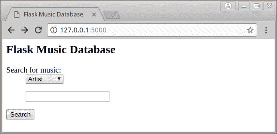
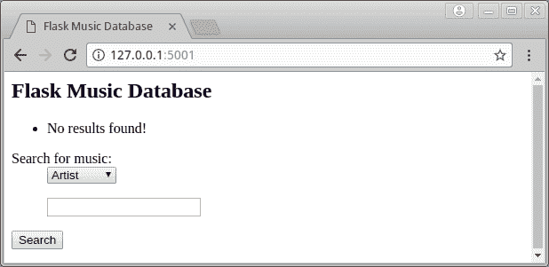

# Flask 101:如何添加搜索表单

> 原文：<https://www.blog.pythonlibrary.org/2017/12/13/flask-101-how-to-add-a-search-form/>

在上一篇文章中，我们向 Flask web 应用程序添加了一个数据库，但是没有办法向数据库添加任何东西。我们也没有办法查看任何东西，所以基本上我们最终拥有了一个非常无用的 web 应用程序。本文将花时间教你如何做到以下几点:

*   创建一个表单来添加数据到我们的数据库
*   使用表单编辑我们数据库中的数据
*   创建数据库中内容的某种视图

一旦你弄清楚要安装什么扩展，向 Flask 添加表单也很容易。我听说过 WTForms 的优点，所以我将在本教程中使用它。要安装 WTForms，您需要安装 [Flask-WTF](https://flask-wtf.readthedocs.io/en/stable/install.html) 。安装 Flask-WTF 相当容易；只要打开你的终端，激活我们在[第一教程](https://www.blog.pythonlibrary.org/2017/12/08/flask-101-getting-started/)中设置的虚拟环境。然后使用 pip 运行以下命令:

```py

pip install Flask-WTF

```

这将把 WTForms 和 Flask-WTF(以及任何依赖项)安装到 web 应用程序的虚拟环境中。

* * *

### 提供 HTML 文件

最初当我开始这个系列时，我在 web 应用程序的索引页面上提供的只是一个字符串。我们可能应该稍微修饰一下，使用一个真正的 HTML 文件。在“musicdb”文件夹中创建一个名为“templates”的文件夹。现在，在“templates”文件夹中创建一个名为“index.html”的文件，并将以下内容放入其中:

```py

 <title>Flask Music Database</title>

## 烧瓶音乐数据库 
```

现在，在我们更新 web 应用程序代码之前，让我们创建一个搜索表单来过滤音乐数据库的结果。

* * *

### 添加搜索表单

使用数据库时，您需要一种在其中搜索项目的方法。幸运的是，用 WTForms 创建搜索表单非常容易。创建一个名为“forms.py”的 Python 脚本，保存到“musicdb”文件夹，内容如下:

```py

# forms.py

from wtforms import Form, StringField, SelectField

class MusicSearchForm(Form):
    choices = [('Artist', 'Artist'),
               ('Album', 'Album'),
               ('Publisher', 'Publisher')]
    select = SelectField('Search for music:', choices=choices)
    search = StringField('')

```

这里我们只是从 **wtforms** 模块导入我们需要的项目，然后我们子类化**forms**类。在我们的子类中，我们创建了一个选择字段(一个组合框)和一个字符串字段。这使我们能够将搜索过滤到艺术家、专辑或出版商类别，并输入要搜索的字符串。

现在我们准备更新我们的主应用程序。

* * *

### 更新主应用程序

让我们将 web 应用程序的脚本从“test.py”重命名为“main.py ”,并对其进行更新，如下所示:

```py

# main.py

from app import app
from db_setup import init_db, db_session
from forms import MusicSearchForm
from flask import flash, render_template, request, redirect
from models import Album

init_db()

@app.route('/', methods=['GET', 'POST'])
def index():
    search = MusicSearchForm(request.form)
    if request.method == 'POST':
        return search_results(search)

    return render_template('index.html', form=search)

@app.route('/results')
def search_results(search):
    results = []
    search_string = search.data['search']

    if search.data['search'] == '':
        qry = db_session.query(Album)
        results = qry.all()

    if not results:
        flash('No results found!')
        return redirect('/')
    else:
        # display results
        return render_template('results.html', results=results)

if __name__ == '__main__':
    app.run()

```

我们修改了 **index()** 函数，使其可以处理 POST 和 GET 请求，并告诉它加载我们的 MusicSearchForm。您会注意到，当您第一次加载 web 应用程序的索引页面时，它将执行 GET，index()函数将呈现我们刚刚创建的 index.html**。当然，我们实际上还没有将表单添加到我们的 index.html 中，所以搜索表单还不会出现。**

 **我们还添加了一个 **search_results()** 来处理非常基本的搜索。然而，在我们真正实现显示结果的方法之前，这个函数不会被调用。因此，让我们继续让搜索表单对我们的用户可见。

在我学习如何用 wtforms 创建表单的时候， [Flask-WTF 网站](http://flask.pocoo.org/docs/0.12/patterns/wtforms/)推荐用一个叫做“_formhelpers.html”的宏创建一个模板。继续创建一个同名文件，并将其保存到您的“模板”文件夹中。然后将以下内容添加到该文件中:

```py



```

{{ field.label }}

{{ field(**kwargs)|safe }} 

*   {{错误}}





这个语法可能看起来有点奇怪，因为它显然不仅仅是 HTML。这其实就是 [Jinja2](http://jinja.pocoo.org/) 语法，是 Flask 使用的模板语言。基本上，无论你在哪里看到弯弯曲曲的大括号(即{})，你都会看到 Jinja 语法。这里我们传入一个**字段**对象，并访问它的**标签**和**错误**属性。请随意查阅文档以获取更多信息。

现在打开您的“index.html”文件并更新它，使其包含以下内容:

```py

 <title>Flask Music Database</title>

## 烧瓶音乐数据库



<form method="post">

    {{ render_field(form.select) }}

{{ render_field(form.search) }}

 

</form> 
```

本例中的新代码展示了如何将创建的宏导入到另一个 HTML 文件中。接下来，我们将表单方法设置为 **post** ，并将**选择**小部件和**搜索**小部件传递给我们的 **render_field** 宏。我们还创建了一个带有以下标签的**提交**按钮:**搜索**。当您按下搜索按钮时，它会将表单的其他两个字段中的数据发布到它所在的页面，在本例中是我们的**index.html**或“/”。

当这种情况发生时，我们的 **main.py** 脚本中的 index()方法将执行:

```py

@app.route('/', methods=['GET', 'POST'])
def index():
    search = MusicSearchForm(request.form)
    if request.method == 'POST':
        return search_results(search)

    return render_template('index.html', form=search)

```

你会注意到我们检查它是哪个请求方法，如果是 POST 方法，那么我们调用 **search_results()** 函数。如果你真的在这个阶段按下搜索按钮，你会收到一个**内部服务器错误**，因为我们还没有实现“results.html”。无论如何，现在您的 web 应用程序应该是这样的:

[](https://www.blog.pythonlibrary.org/wp-content/uploads/2017/12/flask_musicdb_search.png)

让我们花点时间让结果函数做些有用的事情。

* * *

### 更新结果功能

现在我们的数据库中实际上没有任何数据，所以当我们试图查询它时，我们不会得到任何结果。因此，我们需要让我们的 web 应用程序表明没有找到任何结果。为此，我们需要更新“index.html”页面:

```py

 <title>Flask Music Database</title>

## 烧瓶音乐数据库


  

*   {{消息}}

  




<form method="post">

    {{ render_field(form.select) }}

{{ render_field(form.search) }}

 

</form> 
```

你会注意到新代码是一个新的金贾块。在这里，我们抓取“闪现”的消息并显示它们。现在我们只需要运行 web 应用程序并尝试搜索一些东西。如果一切按计划进行，当您进行搜索时，应该会看到如下内容:

[](https://www.blog.pythonlibrary.org/wp-content/uploads/2017/12/flask_musicdb_search_no_results.png)

* * *

### 包扎

现在我们有了一个简洁的搜索表单，可以用来搜索我们的数据库，尽管坦白地说，由于我们的数据库目前是空的，它实际上并没有做太多事情。在我们的下一篇文章中，我们将关注最终创建一种向数据库添加数据、显示搜索结果以及编辑数据的方法！

* * *

### 下载代码

从本文下载一个代码包:[flask _ music dv _ part _ iii . tar](https://www.blog.pythonlibrary.org/wp-content/uploads/2017/12/flask_musicdv_part_iii.tar.gz)

* * *

### 本系列的其他文章

*   **第一部分**-101 号烧瓶:[入门](https://www.blog.pythonlibrary.org/2017/12/12/flask-101-getting-started/)
*   **第二部分** -烧瓶 101: [添加数据库](https://www.blog.pythonlibrary.org/2017/12/12/flask-101-adding-a-database/)

* * *

### 相关阅读

*   Jinja2 [网站](http://jinja.pocoo.org/docs/2.10/)
*   Flask-WTForms [网站](http://flask.pocoo.org/docs/0.12/patterns/wtforms/)
*   Flask-SQLAlchemy [网站](http://flask-sqlalchemy.pocoo.org/2.3/)
*   SQLAlchemy [网站](http://www.sqlalchemy.org/)
*   一个简单的 [SQLAlchemy 教程](https://www.blog.pythonlibrary.org/2012/07/01/a-simple-sqlalchemy-0-7-0-8-tutorial/)**