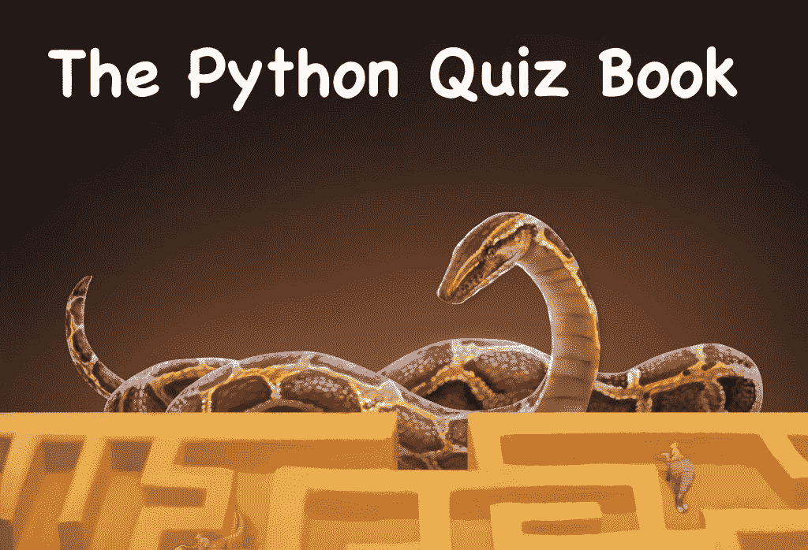

# 提前获取 Python 测验书籍和课程

> 原文：<https://www.blog.pythonlibrary.org/2022/12/07/get-early-access-to-the-python-quiz-book-and-course/>

Python 测验书和[Python 测验课程](https://www.teachmepython.com/courses/the-python-quiz-course/)现在可以提前获取。课程和书都将有 100 多个测验和答案。

以下是您将要了解的一些内容:

*   （听力或阅读）理解测试
*   f 弦
*   布尔数学
*   发电机
*   拆包概括
*   希腊字母的第 11 个
*   模数运算符
*   三元表达式
*   可召回商品
*   名称隐藏
*   限幅
*   赋值表达式(Walrus 运算符)
*   还有更多！

课程与书的主要区别在于，课程允许我包含更多的链接、媒体和互动，而这些是我在电子书上做不到的。

您可以从以下网址获得**Python 问答书**电子书:

*   [Leanpub](https://leanpub.com/pyquiz/)
*   [Gumroad](https://driscollis.gumroad.com/l/pyquiz)

可以在[教我 Python](https://www.teachmepython.com/courses/the-python-quiz-course/) 上获取 Python 小测验课程。