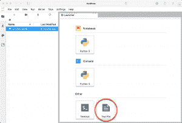

# JupyterLab 入门

> 原文：<https://www.blog.pythonlibrary.org/2019/02/05/getting-started-with-jupyterlab/>

JupyterLab 是来自 Project Jupyter 的最新包。在某些方面，它是 Jupyter 笔记本的替代品。然而，Jupyter 笔记本是 JupyterLab 的一个独立项目。我喜欢把 JupyterLab 想象成一种基于网络的集成开发环境，你可以用它来操作 Jupyter 笔记本，也可以使用终端、文本编辑器和代码控制台。你可能会说 JupyterLab 是 Jupyter Notebook 的更强大版本。

无论如何，这里有一些 JupyterLab 能够做到的事情:

*   代码控制台——这些是代码暂存区，你可以用它来交互式地运行代码，有点像 Python 的 IDLE
*   内核支持的文档——这些文档允许您启用任何文本文件(Markdown、Python、R 等)中的代码，然后这些代码可以在 Jupyter 内核中运行
*   镜像笔记本单元输出-这让您可以创建简单的仪表板
*   同一文档的多个视图-让您能够实时编辑文档并查看结果

JupyterLab 将允许您查看和处理多种类型的数据。您还可以使用各种可视化或降价来显示这些格式的丰富输出。

对于导航，您可以使用 vim、emacs 甚至 SublimeText 中的可定制键盘快捷键或键映射。

您可以通过扩展向 JupyterLab 实例添加新的行为。这包括主题支持、文件编辑器等等。

[](https://leanpub.com/jupyternotebook101/)

* * *

### 装置

可以使用 conda、pip 或 pipenv 来安装 JupyterLab。

#### 康达

如果您是 Anaconda 用户，那么您可以使用以下命令将 conda 用于安装目的:

```py

conda install -c conda-forge jupyterlab

```

#### 点

如果您喜欢使用 Python 的本地安装程序 pip，那么这就是您想要的命令:

```py

pip install jupyterlab

```

注意:如果您使用的是 **pip install - user** ，那么您需要将用户级的“bin”目录添加到 PATH 环境变量中，以便能够启动 jupyterlab。

#### pipenv

**pipenv** 工具是一个新的包，可用于创建 Python 虚拟环境并将包下载到其中。如果您碰巧安装了它，那么您可以使用以下两个命令来获取 JupyterLab:

```py

pipenv install jupyterlab
pipenv shell

```

请注意，如果您想从安装 JupyterLab 的 virtualenv 中启动 JupyterLab，则需要调用 **shell** 命令。

* * *

### 运行 JupyterLab

现在我们已经安装了 JupyterLab，我们应该试着运行它。你可以使用 **jupyter-lab** 或者 **jupyter lab** 来运行它。当我运行这些命令时，我得到了下面的初始 web 应用程序:


新 JupyterLab 的初始登录页面

右边的标签叫做**启动器**。这是一个地方，你可以去开始一个新的笔记本，代码控制台，终端或文本文件。新文档作为新选项卡打开。你会注意到，当你创建一个新的笔记本或其他项目，启动消失。如果你想打开第二个文档，只需点击左边的“+”按钮，我在下面画了圈:


在 JupyterLab 中添加新项目

让我们打开笔记本，然后单击加号按钮。如果你这样做，你的屏幕应该是这样的:


JupyterLab 中的多个选项卡

您也可以使用屏幕顶部的**菜单* *创建新项目。只需转到**文件**-> * *新建* *，然后选择您要创建的项目类型。如果你用过 Jupyter Notebook，大部分菜单项你应该很熟悉。不过，这里有一些新条目是专门针对 JupyterLab 的。例如:

*   新启动器-启动一个新的启动器
*   从路径打开-从不同于开始路径的路径打开文档
*   将笔记本另存为...-让您用新文件名保存当前选定的笔记本
*   将笔记本导出为...-让您将笔记本导出为不同的格式，如 PDF、Markdown 等

浏览菜单，看看你还能找到什么。这是不言自明的。

* * *

### 文件浏览器

左边的树被称为**文件浏览器**。它显示了从您启动 JupyterLab 的位置可用的文件。只需单击文件夹图标使树折叠，以便选项卡可以充满浏览器:


文件浏览器最小化

您会注意到，您也可以通过单击文件夹+图标(下面画圈的)在文件浏览器中创建新文件夹:


创建新文件夹

如果您需要从计算机上的另一个位置向 JupyterLab 添加文件，您需要点击**上传**按钮:


将文件上传/保存到工作区

当你这样做时，它会弹出一个文件打开对话框:


上传对话框

就像在另一个程序中打开文件一样使用它。请记住，您不是打开一个文件，而是将它“上传”或“复制”到您的 JupyterLab 工作区。

最后，如果您碰巧通过使用上传按钮之外的方法将文件复制到工作区中，则可以使用刷新按钮来刷新工作区:


刷新文件浏览器按钮

* * *

### 特殊 URL

与 Jupyter Notebook 一样，JupyterLab 允许用户将 URL 复制到浏览器中，以打开特定的笔记本或文件。然而，JupyterLab 还增加了通过 URL 管理工作区和文件导航的能力。

例如，如果你想使用文件导航，你可以使用特殊的关键字**树**来实现。以下是使用无标题笔记本的 URL 示例:

```py

http://localhost:8888/lab/tree/Untitled.ipynb

```

如果你尝试这样做，你会看到普通的 Jupyter 笔记本界面，而不是 JupyterLab 内部的笔记本。

#### 工作区

默认的工作区没有名字，但是可以在 **/lab** 找到。如果您想要克隆您的工作区，您可以使用以下格式:

```py

http://localhost:8888/lab/workspaces/test?clone

```

这将把您当前的工作区复制到一个名为 **test** 的工作区中。如果您想要将测试工作区复制到您的默认工作区中，URL 应该是这样的:

```py

http://localhost:8888/lab?clone=test

```

您也可以使用**重置** URL 参数重置工作区。重置工作区时，您正在清除其内容。以下是重置默认工作空间的示例:

```py

http://localhost:8888/lab/workspaces/lab?reset

```

### 牢房检查员

让我们在 JupyterLab 实例中创建一个笔记本。转到启动器，选择一个内核。默认情况下，您将拥有 Python 2 或 Python 3。创建之后，您应该会看到一个名为“Untitled.ipynb”的新选项卡，如下所示:


JupyterLab 的一个空笔记本

如你所见，我们有一个只有一个电池的笔记本。让我们将以下代码添加到幻灯片中:

```py

def adder(a, b):
   return a + b

adder(2, 3)

```

现在，让我们单击左侧工具栏中的小扳手。下面是一个按钮被圈起来的屏幕截图:


牢房检查员

当您单击那个扳手时，您的屏幕应该看起来如上所示。这被称为**细胞检查员**。您可以在这里设置笔记本以用于演示目的。您可以设置哪些单元格是载玻片或子载玻片。我们在第 9 章中谈到的与笔记本本身相关的几乎任何事情都可以在这里完成。您还会注意到，单元格检查器将显示 JupyterLab / Notebook 添加到单元格中的任何元数据。

如果你想看实际操作，那么试着将你的第一个单元格设置为一个**幻灯片**。现在，您应该看到元数据字段是这样填充的:


单元格的元数据

* * *

### 使用文件

您可以使用 JupyterLab 的文件浏览器和文件菜单来处理系统中的文件和目录。这允许您打开、创建、删除、重命名、下载/上传、复制和共享文件和目录。您可以在左侧边栏中找到文件浏览器:


文件浏览器

如果您的浏览器中有文件，您只需双击该文件即可打开它，就像您通常在系统的文件浏览器中所做的那样。您也可以将文件从文件浏览器拖到工作区(右侧),这将打开该文件。

JupyterLab 支持的许多文件类型也有多个查看器和编辑器。例如，您可以在编辑器中打开 Markdown 文件，或者以 HTML 格式查看它。如果您想在非默认的查看器/编辑器中打开该文件，只需右键单击该文件并选择“打开方式...”即可从上下文菜单中:


文件的上下文菜单

请注意，您可以在多个查看器/编辑器中打开一个文件，它们将保持同步。

* * *

### 文本编辑器

JupyterLab 带有一个内置的文本编辑器，可以用来创建或打开文本文件。打开启动程序，不要创建笔记本，转到启动程序的底部，创建一个文本文件。



启动文本编辑器

它会默认创建一个 **untitled.txt** 文件。但是你可以进入**文件**菜单，使用“另存为……”把它存为别的东西。这允许你创建 Python 文件，Markdown 和几乎任何你想做的事情。它甚至为某些文件类型提供语法高亮，尽管不支持代码完成。您也可以通过**文件**菜单创建文件。

文本编辑器还支持可配置的缩进(制表符和空格)、键映射和基本主题。只需进入**设置**菜单查看或编辑即可:


文件设置

如果你想编辑一个现有的文本文件，你需要做的就是在文件浏览器中双击它。

* * *

### 交互式代码控制台

JupyterLab 的新特性之一是**代码控制台**，它基本上是浏览器中的 REPL。它将让你在当前选择的内核中交互式地运行代码。代码控制台的“单元”显示代码运行的顺序。要创建新的代码控制台，请单击文件浏览器中的“+”按钮，并选择您选择的内核:


代码控制台启动器

输入一些代码。如果你自己想不起来，这里有一个例子:

```py

print('Hello Console!')

```

现在按下 **Shift+Enter** 运行代码。如果一切正常，您应该会看到以下输出:


代码控制台

代码完成通过**选项卡**键工作。你也可以通过按下 **Shift+Tab** 来调出工具提示。

如果需要在不重启内核的情况下清除代码控制台，可以右击控制台本身，选择“清除控制台单元格”。

* * *

### 终端

JupyterLab 项目继续支持浏览器中的系统外壳。对于 Mac / Linux，它支持 bash、tsch 等，而在 Windows 上，它支持 Powershell。这些终端可以运行您通常从系统终端运行的任何程序，包括其他程序，如 vim 或 emacs。请注意，JupyterLab 终端运行在您安装了 JupyterLab 的系统上，因此它也将使用您的用户权限。

无论如何，如果你想看到一个运行中的终端，只需按下文件浏览器中的“+”按钮启动启动器。然后选择终端:


终端发射器

如果您关闭终端标签，JupyterLab 将让它在后台运行。下面是一个运行的终端:


正在运行的终端

如果您想重新打开终端，只需转到**运行**选项卡:


运行应用程序

然后从运行的应用程序列表中选择终端。

* * *

### 命令选项板

JupyterLab 中的用户操作都要通过一个中央指挥系统。这包括菜单栏、上下文菜单、键盘快捷键等使用的命令。您可以通过**命令面板**访问可用的命令，您可以在**命令**选项卡下找到:


命令选项板

在这里，您可以搜索命令并直接执行它们，而不是在菜单系统中搜索它们。你也可以用下面的快捷键调出命令面板: **Command/Ctrl Shift C**

* * *

### 支持的文件类型

JupyterLab 支持相当多的文件类型，它可以显示或允许您编辑。这允许您在笔记本或代码控制台中布局丰富的单元格输出。对于文件，JupyterLab 将通过查看文件的扩展名或完整的文件名(如果扩展名不存在)来检测数据格式。请注意，多个编辑器/查看器可以与一个文件类型相关联。例如，您可以编辑降价文件并以 HTML 格式查看。只需右击一个文件，进入**打开方式**上下文菜单项，查看该文件类型可用的编辑器和查看器:


使用打开方式

您可以使用 Python 代码在笔记本或代码控制台中显示不同的数据格式。这里有一个例子:

```py

from IPython.display import display, HTML
display(HTML('你好，来自 JupyterLab'))

```

当您在笔记本中运行这段代码时，它应该是这样的:


在笔记本中运行 HTML

关于 JupyterLab 支持的文件类型的完整列表，我建议查看[文档](https://jupyterlab.readthedocs.io/en/stable/user/file_formats.html)。这应该总是最新的，而且比我自己列出这些项目更有用。

* * *

### 关于扩展的一句话

如您所料，JupyterLab 支持扩展，并且在设计时考虑了可扩展性。扩展可以定制用户体验或增强 JupyterLab 的一个或多个部分。例如，您可以向菜单或命令面板添加新项目，或者添加一些新的键盘快捷键。JupyterLab 本身其实就是一个扩展的集合。

如果你想为 JupyterLab 创建一个扩展，那么你需要熟悉 Javascript 或者愿意学习。扩展需要采用 npm 打包格式。要安装预制的扩展，您需要在您的机器上安装 **Node.js** 。一定要查看他们的[网站](https://nodejs.org/en/)，以获得你的操作系统的正确安装说明。

#### 安装/卸载扩展

一旦安装了 Node.js，就可以通过运行以下命令来安装 JupyterLab 的扩展:

```py

jupyter labextension install the-extension-name

```

如果您需要特定版本的扩展，那么该命令将如下所示:

```py

jupyter labextension install the-extension-name@1.2

```

其中“1.2”是您需要的版本。您还可以扩展为 gzipped tarball 或 gzipped tarball 的 URL。

要获得当前安装的 JupyterLab 扩展的列表，只需运行

```py

jupyter labextension list

```

如果您想卸载某个扩展，可以像这样轻松地完成:

```py

jupyter labextension uninstall the-extension-name

```

您也可以通过在 install 或 uninstall 命令后列出软件包的名称来安装或卸载多个扩展。由于 JupyterLab 在每次安装后都会重新构建，这可能需要相当长的时间。为了在安装或卸载多个扩展时加快速度，可以包含** - no-build**标志。安装或卸载完成后，您需要自己运行构建命令，如下所示:

```py

jupyter lab build

```

#### 禁用扩展

如果你不想卸载一个扩展，但你想禁用它，这也很容易做到。只需运行**禁用**命令:

```py

jupyter labextension disable the-extension-name

```

然后当你想重新启用它时，你可以运行 **enable** 命令:

```py

jupyter labextension enable the-extension-name

```

### 包扎

JupyterLab 包真的很神奇。比起 Jupyter 笔记本，你可以用它做更多的事情。然而，用户界面也更复杂，所以学习曲线会更陡一些。然而，我认为值得学习如何使用它，因为编辑文档和实时查看文档的能力在创建演示文稿或做其他类型的工作时非常有用。至少，我会在虚拟环境中尝试一下，看看它是否适合您的工作流程。

* * *

### 相关阅读

*   JupyterLab on [Github](https://github.com/jupyterlab/jupyterlab)
*   使用 [Jupyter 笔记本小工具](https://www.blog.pythonlibrary.org/2018/10/24/working-with-jupyter-notebook-widgets/)
*   Jupyter [笔记本调试](https://www.blog.pythonlibrary.org/2018/10/17/jupyter-notebook-debugging/)