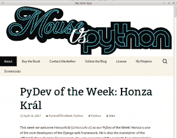

# pywebview 入门

> 原文：<https://www.blog.pythonlibrary.org/2017/04/25/getting-started-with-pywebview/>

几周前，我偶然发现了 pywebview 项目。pywebview 包“是一个轻量级的跨平台 webview 组件包装器，它允许在自己的本地 GUI 窗口中显示 HTML 内容它在 OSX 和 Linux 上使用 WebKit，在 Windows 上使用 Trident (MSHTML)，这实际上也是 wxPython 的 [webview](https://wxpython.org/Phoenix/docs/html/wx.html2.WebView.html) 小工具所做的。pywebview 背后的想法是，它让你能够在桌面应用程序中加载网站，有点像[电子](https://electron.atom.io/)。

虽然 pywebview 声称它“不依赖于外部 GUI 框架”，但在 Windows 上，它需要安装 pythonnet、PyWin32 和 comtypes。OSX 需要“pyobjc”，尽管它包含在 OSX 安装的默认 Python 中。对于 Linux 来说，这有点复杂。在基于 GTK3 的系统上，你需要 PyGObject，而在基于 Debian 的系统上，你需要安装 PyGObject + gir1.2-webkit-3.0。最后，你也可以使用 PyQt 4 或 5。

你可以通过 pywebview 使用 Python 微 web 框架，比如 Flask 或者 bottle，用 HTML5 代替 Python 来创建很酷的应用。

要安装 pywebview 本身，只需使用 pip:

```py
pip install pywebview

```

安装完成后，假设您也具备了先决条件，您可以这样做:

```py
import webview

webview.create_window('My Web App', 'http://www.mousevspython.com')
webview.start()

```

这将在具有指定标题(即第一个参数)的窗口中加载指定的 URL。您的新应用程序应该看起来像这样:



pywebview 的 API 非常简短，可以在以下位置找到:

*   [https://github.com/r0x0r/pywebview#api](https://github.com/r0x0r/pywebview#api)

你能使用的方法屈指可数，这使得它们很容易记住。但是因为您不能为 pywebview 应用程序创建任何其他控件，所以您需要在 web 应用程序中完成所有的用户界面逻辑。

pywebview 包支持使用 PyInstaller for Windows 和 py2app for OSX 进行冻结。它也适用于 virtualenv，尽管在使用 virtualenv 之前，您需要阅读一些已知的问题。

### 包扎

pywebview 包实际上非常简洁，我个人认为值得一看。如果您想要一些更好地集成到您的桌面的东西，那么您可能想要尝试 wxPython 或 PyQt。但是如果你需要做的只是发布一个基于 HTML5 的 web 应用程序，那么这个包可能就是你想要的。