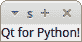
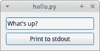
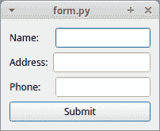

# Python 入门

> 原文：<https://www.blog.pythonlibrary.org/2018/04/18/getting-started-with-qt-for-python/>

Qt 团队最近[发布了](http://blog.qt.io/blog/2018/04/13/qt-for-python-is-coming-to-a-computer-near-you/)消息，Qt 现在将正式支持 PySide2 项目，他们称之为“Python 的 Qt”。它将是原 PySide 的完整端口，原 py side 只支持 Qt 4。PySide2 支持 Qt 5。Qt for Python 将拥有以下许可类型:GPL、LGPL 和商业许可。

PySide2 支持 Python 2.7 以及 Python 3.4 - 3.6。这里有可用的快照轮版本。假设我们下载了 Windows Python wheel。要安装它，您可以像这样使用 pip:

```py

python -m pip install PySide2-5.11.0a1-5.11.0-cp36-cp36m-win_amd64.whl

```

一旦安装了 PySide2，我们就可以从一个非常简单的例子开始:

```py

import sys
from PySide2.QtWidgets import QApplication, QLabel

if __name__ == '__main__':
    app = QApplication([])
    label = QLabel("Qt for Python!")
    label.show()
    sys.exit(app.exec_())

```

这段代码将创建我们的应用程序对象(QApplication)和一个 QLabel。当您运行 **app.exec_()** 时，您启动了 PySide2 的事件循环。因为我们没有指定标签或应用程序的大小，所以应用程序的大小默认为刚好足以容纳屏幕上的标签:



这是一个很无聊的例子，所以让我们看看如何把一个事件和一个按钮联系起来。

* * *

### 添加事件处理

PySide2 中的事件处理使用了信号和底层插槽的概念。你可以在他们的[文档](http://doc.qt.io/qt-5/signalsandslots.html)中了解这是如何工作的。让我们来看看如何设置按钮事件:

```py

import sys
from PySide2.QtWidgets import QApplication, QLabel, QLineEdit
from PySide2.QtWidgets import QDialog, QPushButton, QVBoxLayout

class Form(QDialog):
    """"""

    def __init__(self, parent=None):
        """Constructor"""
        super(Form, self).__init__(parent)

        self.edit = QLineEdit("What's up?")
        self.button = QPushButton("Print to stdout")

        layout = QVBoxLayout()
        layout.addWidget(self.edit)
        layout.addWidget(self.button)

        self.setLayout(layout)

        self.button.clicked.connect(self.greetings)

    def greetings(self):
        """"""
        text = self.edit.text()
        print('Contents of QLineEdit widget: {}'.format(text))

if __name__ == "__main__":
    app = QApplication([])
    form = Form()
    form.show()
    sys.exit(app.exec_())

```

这里，我们通过 QLineEdit 小部件创建一个文本框，并通过 QPushButton 小部件创建一个按钮。然后，我们将这两个小部件放在 QVBoxLayout 中，这个容器允许您更改应用程序的大小，并让布局中包含的小部件相应地更改大小和位置。在这种情况下，我们使用垂直方向的布局，这意味着小部件垂直“堆叠”。

最后，我们将按钮的“clicked”信号与 greetings (slot)函数联系起来。每当我们点击按钮时，它都会调用我们指定的函数。这个函数将获取我们的文本框的内容，并将其打印到 stdout。下面是我运行代码时的样子:



我认为这看起来不错，但它仍然不是一个非常有趣的界面。

* * *

### 创建简单的表单



让我们通过用 PySide2 创建一个简单的表单来总结一下。在这个例子中，我们不会将表单与任何东西挂钩。这只是一段简单快速的示例代码，展示了如何创建一个简单的表单:

```py

import sys

from PySide2.QtWidgets import QDialog, QApplication
from PySide2.QtWidgets import QHBoxLayout, QVBoxLayout
from PySide2.QtWidgets import QLineEdit, QLabel, QPushButton

class Form(QDialog):
    """"""

    def __init__(self, parent=None):
        """Constructor"""
        super(Form, self).__init__(parent)
        main_layout = QVBoxLayout()

        name_layout = QHBoxLayout()
        lbl = QLabel("Name:")
        self.name = QLineEdit("")
        name_layout.addWidget(lbl)
        name_layout.addWidget(self.name)
        name_layout.setSpacing(20)

        add_layout = QHBoxLayout()
        lbl = QLabel("Address:")
        self.address = QLineEdit("")
        add_layout.addWidget(lbl)
        add_layout.addWidget(self.address)

        phone_layout = QHBoxLayout()
        self.phone = QLineEdit("")
        phone_layout.addWidget(QLabel("Phone:"))
        phone_layout.addWidget(self.phone)
        phone_layout.setSpacing(18)

        button = QPushButton('Submit')

        main_layout.addLayout(name_layout, stretch=1)
        main_layout.addLayout(add_layout, stretch=1)
        main_layout.addLayout(phone_layout, stretch=1)
        main_layout.addWidget(button)
        self.setLayout(main_layout)

if __name__ == "__main__":
    app = QApplication([])
    form = Form()
    form.show()
    sys.exit(app.exec_())    

```

在这段代码中，我们使用了几个盒子布局来排列屏幕上的小部件。也就是说，我们使用 QVBoxLayout 作为顶层布局，然后在其中嵌套 QHBoxLayouts。您还会注意到，当我们添加 QHBoxLayouts 时，我们告诉它们在我们调整主小部件大小时进行拉伸。代码的其余部分与您已经看到的几乎相同。

* * *

### 包扎

我已经很多年没有玩 PySide2(或者 PyQt)了，所以看到 Qt 再次拿起这个很令人兴奋。我认为 PySide2 和 PyQt 之间的一些竞争将是一件好事，它也可能推动其他 Python UI 框架的一些创新。虽然 PySide2 背后的开发人员目前没有支持移动平台的计划，但不幸的是，他们似乎很想知道开发人员是否会对此感兴趣。坦率地说，我希望很多人附和并告诉他们是的，因为我们在 Python 移动 UI 领域需要其他选择。

无论如何，我认为这个项目有很大的潜力，我期待看到它如何成长。

* * *

### 相关阅读

*   PySide2 [Wiki](https://wiki.qt.io/PySide2)
*   Python 的 Qt 是[来到你身边的计算机](http://blog.qt.io/blog/2018/04/13/qt-for-python-is-coming-to-a-computer-near-you/)
*   [快照将 PySide2 的](http://download.qt.io/snapshots/ci/pyside/)构建为 Python 轮子