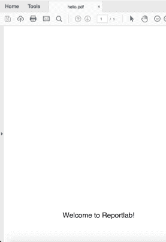
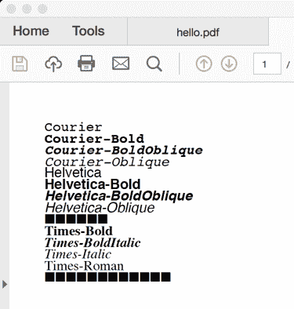
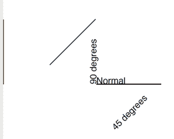
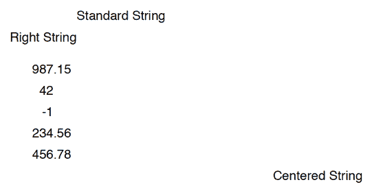
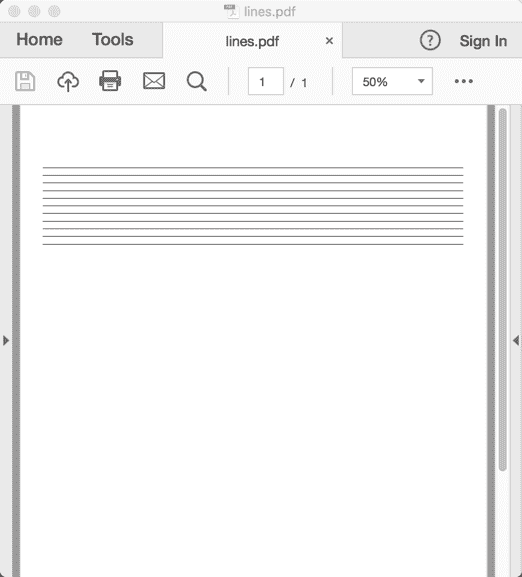
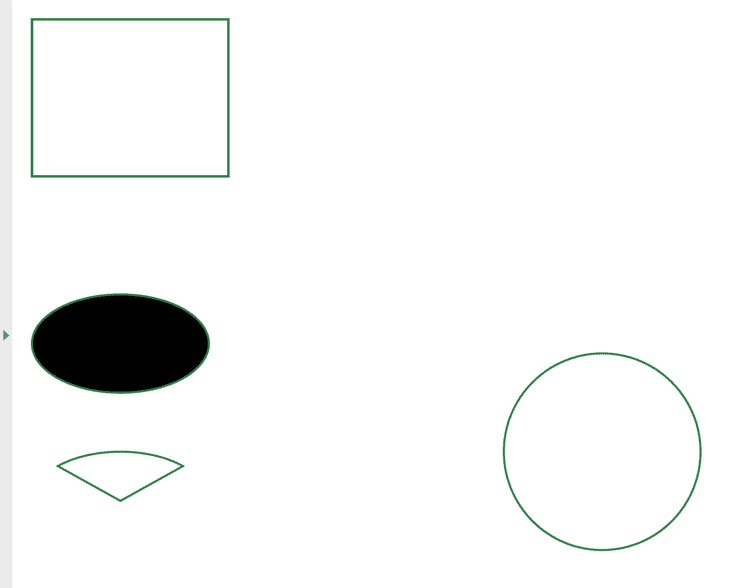
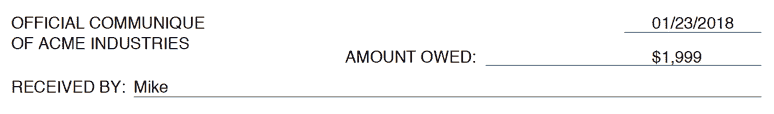

# ReportLab 画布入门

> 原文：<https://www.blog.pythonlibrary.org/2021/09/15/getting-started-with-reportlabs-canvas/>

ReportLab 是一个非常强大的库。只需一点点努力，你就可以做出任何你能想到的布局。这些年来，我用它复制了许多复杂的页面布局。在本教程中，您将学习如何使用 ReportLab 的 **pdfgen** 包。您将发现如何执行以下操作:

*   绘制文本
*   了解字体和文本颜色
*   创建文本对象
*   画线
*   画各种形状

**pdfgen** 包很低级。您将在画布上绘制或“绘画”来创建您的 PDF。画布从 pdfgen 包中导入。当您在画布上进行绘制时，您需要指定 X/Y 坐标来告诉 ReportLab 从哪里开始绘制。默认值为(0，0)，其原点位于页面的左下角。许多桌面用户界面工具包，如 wxPython、Tkinter 等，也有这个概念。您也可以使用 X/Y 坐标在这些套件中放置按钮。这样可以非常精确地放置您添加到页面中的元素。

你需要知道的另一件事是，当你在 PDF 中定位一个项目时，你是根据你离原点的**点数**来定位的。是点，不是像素或毫米或英寸。积分！让我们来看看一张信纸大小的纸上有多少个点:

```py
>>> from reportlab.lib.pagesizes import letter
>>> letter
(612.0, 792.0)
```

这里你了解到一个字母宽 612 点，高 792 点。让我们分别找出一英寸和一毫米中有多少个点:

```py
>>> from reportlab.lib.units import inch
>>> inch
72.0
>>> from reportlab.lib.units import mm
>>> mm
2.834645669291339
```

这些信息将帮助您在绘画中定位您的绘图。至此，您已经准备好创建 PDF 了！

## 画布对象

画布对象位于 **pdfgen** 包中。让我们导入它并绘制一些文本:

```py
# hello_reportlab.py

from reportlab.pdfgen import canvas

c = canvas.Canvas("hello.pdf")
c.drawString(100, 100, "Welcome to Reportlab!")
c.showPage()
c.save()
```

在本例中，您导入 canvas 对象，然后实例化一个 Canvas 对象。您会注意到唯一需要的参数是文件名或路径。接下来，调用 canvas 对象上的 drawString()，告诉它开始在原点右侧 100 点和上方 100 点处绘制字符串。之后，你调用 **showPage()** 方法。 **showPage()** 方法将保存画布的当前页面。其实不要求，但是推荐。

方法还会结束当前页面。如果您在调用 **showPage()后绘制另一个字符串或其他元素，**该对象将被绘制到一个新页面。最后，调用 canvas 对象的 save()方法，将文档保存到磁盘。现在你可以打开它，看看我们的 PDF 是什么样的:



您可能会注意到，您的文本位于文档底部附近。原因是原点(0，0)是文档的左下角。因此，当您告诉 ReportLab 绘制您的文本时，您是在告诉它从左侧开始绘制 100 个点，从底部开始绘制 100 个点。这与在像 Tkinter 或 wxPython 这样的 Python GUI 框架中创建用户界面形成对比，其中原点在左上方。

还要注意，因为您没有指定页面大小，所以它默认为 ReportLab 配置中的大小，通常是 A4。在 **reportlab.lib.pagesizes** 中可以找到一些常见的页面大小。

现在您已经准备好查看**画布**的构造函数，看看它需要什么参数:

```py
def __init__(self,filename,
             pagesize=None,
             bottomup = 1,
             pageCompression=None,
             invariant = None,
             verbosity=0,
             encrypt=None,
             cropMarks=None,
             pdfVersion=None,
             enforceColorSpace=None,
             ):
```

在这里你可以看到你可以把页面大小作为一个参数传入。**页面大小**实际上是以磅为单位的宽度和高度的元组。如果您想改变默认的左下角的原点，那么您可以将 **bottomup** 参数设置为 0，这会将原点改变到左上角。

**pageCompression** 参数默认为零或关闭。基本上，它会告诉 ReportLab 是否压缩每个页面。启用压缩后，文件生成过程会变慢。如果您的工作需要尽快生成 pdf，那么您会希望保持默认值零。

但是，如果速度不是问题，并且您希望使用更少的磁盘空间，那么您可以打开页面压缩。请注意，pdf 中的图像总是被压缩的，因此打开页面压缩的主要用例是当每页有大量文本或大量矢量图形时。

ReportLab 的用户指南没有提到不变参数的用途，所以我查看了源代码。根据消息来源，它*用相同的时间戳信息*产生可重复的、相同的 pdf。我从未见过任何人在他们的代码中使用这个参数，既然源代码说这是为了回归测试，我想你可以放心地忽略它。

下一个参数是 verbosity，用于记录级别。在零(0)时，ReportLab 将允许其他应用程序从标准输出中捕获 PDF。如果您将其设置为一(1)，则每次创建 PDF 时都会打印出一条确认消息。可能会添加额外的级别，但在撰写本文时，只有这两个级别有文档记录。

encrypt 参数用于确定 PDF 是否应该加密，以及如何加密。缺省值显然是 None，这意味着根本没有加密。如果您传递一个要加密的字符串，该字符串将成为 PDF 的密码。如果您想要加密 PDF，那么您将需要创建一个**report lab . lib . PDF encrypt . standard encryption**的实例，并将其传递给 encrypt 参数。

可以将 **cropMarks** 参数设置为 True、False 或某个对象。印刷厂使用裁切标记来知道在哪里裁切页面。当您在 ReportLab 中将 cropMarks 设置为 True 时，页面将比您设置的页面大小大 3 mm，并在边角添加一些裁剪标记。可以传递给**裁剪标记**的对象包含以下参数:**边框宽度**、**标记颜色**、**标记宽度**和**标记长度**。对象允许您自定义裁剪标记。

**pdfVersion** 参数用于确保 PDF 版本大于或等于传入的版本。目前，ReportLab 支持版本 1-4。

最后， **enforceColorSpace** 参数用于在 PDF 中实施适当的颜色设置。您可以将其设置为以下选项之一:

*   用于印刷的四分色
*   rgb
*   九月
*   性黑
*   sep_cmyk

当其中一个被设置时，一个标准的 **_PDFColorSetter** 可调用函数将被用来执行颜色强制。您还可以传入一个用于颜色实施的可调用。

让我们回到你最初的例子，稍微更新一下。在 ReportLab 中，您可以使用点来定位元素(文本、图像等)。但是当你习惯使用毫米或英寸时，用点来思考就有点困难了。有一个巧妙的函数可以帮助你处理[堆栈溢出](http://stackoverflow.com/questions/4726011/wrap-text-in-a-table-reportlab):

```py
def coord(x, y, height, unit=1):
    x, y = x * unit, height -  y * unit
    return x, y
```

这个函数需要你的 x 和 y 坐标以及页面的高度。也可以传入单位大小。这将允许您执行以下操作:

```py
# canvas_coords.py

from reportlab.pdfgen import canvas
from reportlab.lib.pagesizes import letter
from reportlab.lib.units import mm

def coord(x, y, height, unit=1):
    x, y = x * unit, height -  y * unit
    return x, y

c = canvas.Canvas("hello.pdf", pagesize=letter)
width, height = letter

c.drawString(*coord(15, 20, height, mm), text="Welcome to Reportlab!")
c.showPage()
c.save()
```

在这个例子中，您向 **coord** 函数传递 x 和 y 坐标，但是您告诉它使用毫米作为您的单位。因此，不是以磅为单位，而是告诉 ReportLab，我们希望文本从页面左侧 15 毫米和顶部 20 毫米开始。

是的，你没看错。当您使用**坐标**功能时，它使用高度从底部到顶部交换原点的 y。如果你已经将画布的**底向上**参数设置为零，那么这个函数就不会像预期的那样工作。事实上，您可以将**坐标**函数简化为以下内容:

```py
def coord(x, y, unit=1):
    x, y = x * unit, y * unit
    return x, y
```

现在，您可以像这样更新前面的示例:

```py
# canvas_coords2.py

from reportlab.pdfgen import canvas	
from reportlab.lib.units import mm

def coord(x, y, unit=1):
    x, y = x * unit, y * unit
    return x, y

c = canvas.Canvas("hello.pdf", bottomup=0)

c.drawString(*coord(15, 20, mm), text="Welcome to Reportlab!")
c.showPage()
c.save()
```

这似乎很简单。您应该花一两分钟的时间来试验这两个例子。尝试更改传入的 x 和 y 坐标。然后尝试改变文本，看看会发生什么！

## 画布方法

canvas 对象有许多方法。在本节中，您将学习如何使用这些方法使您的 PDF 文档更有趣。最容易使用的方法之一是 **setFont** ，它将允许您使用 PostScript 字体名称来指定您想要使用的字体。这里有一个简单的例子:

```py
# font_demo.py

from reportlab.lib.pagesizes import letter
from reportlab.pdfgen import canvas

def font_demo(my_canvas, fonts):
    pos_y = 750
    for font in fonts:
        my_canvas.setFont(font, 12)
        my_canvas.drawString(30, pos_y, font)
        pos_y -= 10

if __name__ == '__main__':
    my_canvas = canvas.Canvas("fonts.pdf",
                              pagesize=letter)
    fonts = my_canvas.getAvailableFonts()
    font_demo(my_canvas, fonts)
    my_canvas.save()
```

为了让事情变得更有趣一点，您将使用**getAvailableFonts**()canvas 方法来获取您可以在运行代码的系统上使用的所有可用字体。然后你将把画布对象和字体名称列表传递给你的 **font_demo** ()函数。在这里，您循环遍历字体名称，设置字体，并调用 **drawString** ()方法将每个字体的名称绘制到页面上。

您还会注意到，您已经为起始 Y 位置设置了一个变量，然后每次循环时都将这个变量减 10。这是为了让每个文本字符串绘制在单独的一行上。如果你不这样做，字符串会写在对方的顶部，你会以一片混乱结束。

以下是运行字体演示的结果:



如果您想使用 canvas 方法来改变字体颜色，那么您会希望查看 **setFillColor** 或它的一个相关方法。只要在绘制字符串之前调用它，文本的颜色也会改变。

您可以使用画布的**旋转**方法从不同角度绘制文本。你还将学习如何使用**翻译**方法。让我们来看一个例子:

```py
# rotating_demo.py

from reportlab.lib.pagesizes import letter
from reportlab.lib.units import inch
from reportlab.pdfgen import canvas

def rotate_demo():
    my_canvas = canvas.Canvas("rotated.pdf",
                              pagesize=letter)
    my_canvas.translate(inch, inch)
    my_canvas.setFont('Helvetica', 14)
    my_canvas.drawString(inch, inch, 'Normal')
    my_canvas.line(inch, inch, inch+100, inch)

    my_canvas.rotate(45)
    my_canvas.drawString(inch, -inch, '45 degrees')
    my_canvas.line(inch, inch, inch+100, inch)

    my_canvas.rotate(45)
    my_canvas.drawString(inch, -inch, '90 degrees')
    my_canvas.line(inch, inch, inch+100, inch)

    my_canvas.save()

if __name__ == '__main__':
    rotate_demo()
```

在这里，您使用 translate 方法将您的原点从左下方设置为距左下方一英寸并向上一英寸。然后你设置字体和字体大小。接下来，正常写出一些文本，然后在你画一个字符串之前，你把坐标系本身旋转 45 度。

根据 ReportLab 用户指南，由于坐标系现在处于旋转状态，您可能希望以负数指定 y 坐标。如果你不这样做，你的字符串将被绘制在页面的边界之外，你将看不到它。最后，将坐标系再旋转 45 度，总共旋转 90 度，写出最后一个字符串并绘制最后一条线。

每次旋转坐标系时，观察线条如何移动是很有趣的。你可以看到最后一行的原点一直移动到了页面的最左边。

以下是运行代码时的结果:



现在是时候学习对齐了。

## 字符串对齐

画布支持更多的字符串方法，而不仅仅是普通的 drawString 方法。您也可以使用 drawRightString，它将绘制与 x 坐标右对齐的字符串。您也可以使用 drawAlignedString，它将绘制一个与第一个轴心字符对齐的字符串，默认为句点。

如果您想在页面上排列一系列浮点数，这很有用。最后，还有 drawCentredString 方法，它将绘制一个以 x 坐标为“中心”的字符串。让我们来看看:

```py
# string_alignment.py

from reportlab.pdfgen import canvas
from reportlab.lib.pagesizes import letter

def string_alignment(my_canvas):
    width, height = letter

    my_canvas.drawString(80, 700, 'Standard String')
    my_canvas.drawRightString(80, 680, 'Right String')

    numbers = [987.15, 42, -1,234.56, (456.78)]
    y = 650
    for number in numbers:
        my_canvas.drawAlignedString(80, y, str(number))
        y -= 20

    my_canvas.drawCentredString(width / 2, 550, 'Centered String')

    my_canvas.showPage()

if __name__ == '__main__':
    my_canvas = canvas.Canvas("string_alignment.pdf")
    string_alignment(my_canvas)
    my_canvas.save()
```

当您运行这段代码时，您将很快看到这些字符串是如何对齐的。

下面是运行代码的结果:



接下来你要学习的画布方法是如何绘制线条、矩形和网格！

## 在画布上画线

在 ReportLab 中画线其实挺容易的。一旦您习惯了它，您实际上可以在您的文档中创建非常复杂的绘图，尤其是当您将它与 ReportLab 的一些其他功能结合使用时。画直线的方法简单来说就是**线**。

以下是一些示例代码:

```py
# drawing_lines.py

from reportlab.lib.pagesizes import letter
from reportlab.pdfgen import canvas

def draw_lines(my_canvas):
    my_canvas.setLineWidth(.3)

    start_y = 710
    my_canvas.line(30, start_y, 580, start_y)

    for x in range(10):
        start_y -= 10
        my_canvas.line(30, start_y, 580, start_y)

if __name__ == '__main__':
    my_canvas = canvas.Canvas("lines.pdf", pagesize=letter)
    draw_lines(my_canvas)
    my_canvas.save()
```

这里您创建了一个简单的 **draw_lines** 函数，它接受一个 canvas 对象作为它的唯一参数。然后通过**设置线宽**方法设置线条的宽度。最后，创建一条直线。line 方法接受四个参数: **x1，y1，x2，y2** 。这些是开始的 x 和 y 坐标以及结束的 x 和 y 坐标。通过使用一个用于循环的**来添加另外 10 行。**

如果您运行这段代码，您的输出将如下所示:



画布支持其他几种绘图操作。例如，你也可以画矩形、楔形和圆形。这里有一个简单的演示:

```py
# drawing_polygons.py

from reportlab.lib.pagesizes import letter
from reportlab.pdfgen import canvas

def draw_shapes():
    c = canvas.Canvas("draw_other.pdf")
    c.setStrokeColorRGB(0.2, 0.5, 0.3)
    c.rect(10, 740, 100, 80, stroke=1, fill=0)
    c.ellipse(10, 680, 100, 630, stroke=1, fill=1)
    c.wedge(10, 600, 100, 550, 45, 90, stroke=1, fill=0)
    c.circle(300, 600, 50)
    c.save()

if __name__ == '__main__':
    draw_shapes()
```

当您运行这段代码时，您应该会得到一个类似这样的文档:



让我们花点时间来看一下这些多边形方法接受的各种参数。rect 的代码签名如下所示:

```py
def rect(self, x, y, width, height, stroke=1, fill=0):
```

这意味着您通过其 x/y 参数设置矩形位置的左下角。然后你设置它的**宽度**和**高度**。stroke 参数告诉 ReportLab 它是否应该画线，因此在演示代码中，我设置 stroke=1 或 True。fill 参数告诉 ReportLab 用一种颜色填充我绘制的多边形的内部。

现在让我们看看椭圆的定义:

```py
def ellipse(self, x1, y1, x2, y2, stroke=1, fill=0):
```

这个和 **rect** 很像。根据方法的 docstring，x1、y1、x2、y2 参数是外接矩形的角点。stroke 和 fill 参数的操作方式与 rect 相同。只是为了好玩，你继续设置椭圆的填充为 1。

接下来，你有楔子:

```py
def wedge(self, x1,y1, x2,y2, startAng, extent, stroke=1, fill=0):
```

楔形体的 **x1、y1、x2、y2** 参数实际上对应于围绕楔形体的完整 360 度圆形的不可见封闭矩形的坐标。所以你需要想象一个有矩形环绕的完整的圆来帮助你正确定位一个楔子。它也有一个起始角度参数( **startAng** )和范围参数，基本上是告诉楔形区要弧出多远。其他参数已经解释过了。

最后，你到达**圆**多边形。它的方法如下所示:

```py
def circle(self, x_cen, y_cen, r, stroke=1, fill=0):
```

在你看过的所有多边形中，圆的论点可能是最不言自明的。x_cen 和 y_cen 参数是圆心的 x/y 坐标。r 参数是半径。描边和填充参数非常明显。

所有多边形都能够通过 **setStrokeColorRGB** 方法设置笔画(或线条)颜色。它接受红色、绿色、蓝色的参数值。您也可以使用 **setStrokeColor** 或 **setStrokeColorCMYK** 方法设置描边颜色。

也有相应的填充颜色设置器(即 **setFillColor** 、**setfillcolorgb**、 **setFillColorCMYK** )，虽然这些方法在这里没有演示。您可以通过将正确的名称或元组传递给适当的函数来使用这些函数。

现在，您已经准备好了解如何添加分页符了！

## 创建分页符

使用 ReportLab 创建 PDF 时，您首先需要知道的一件事是如何添加分页符，以便您可以拥有多页 PDF 文档。canvas 对象允许您通过 **showPage** 方法来实现这一点。

但是请注意，对于复杂的文档，您几乎肯定会使用 ReportLab 的 flowables，这是专门用于跨多个页面“流动”您的文档的特殊类。Flowables 本身就有点令人费解，但比起试图一直跟踪你在哪一页和你的光标位置，它们使用起来要好得多。

## 画布方向(纵向与横向)

ReportLab 将其页面方向默认为纵向，这也是所有文字处理程序所做的。但有时你会想用横向页面来代替。至少有两种方法可以告诉 Reportlab 使用风景:

```py
from reportlab.lib.pagesizes import landscape, letter
from reportlab.pdfgen import canvas

c = canvas.Canvas('test.pdf', pagesize=letter)
c.setPageSize( landscape(letter) )
```

设置横向的另一种方法是直接设置页面大小:

```py
from reportlab.lib.pagesizes import letter
from reportlab.pdfgen import canvas
from reportlab.lib.units import inch

c = canvas.Canvas('test.pdf', pagesize=letter)
c.setPageSize( (11*inch, 8.5*inch) )
```

您可以通过这样做来使它更通用:

```py
from reportlab.lib.pagesizes import letter
from reportlab.pdfgen import canvas

width, height = letter

c = canvas.Canvas('test.pdf', pagesize=letter)
c.setPageSize( (height, width) )
```

这可能更有意义，尤其是如果您想使用其他流行的页面大小，如 A4。

## 一个简单的示例应用程序

有时候，看看你如何运用你所学到的东西，看看是否能应用到实践中，这是一件好事。因此，让我们采用您在这里学到的一些方法，创建一个简单的应用程序来创建一个表单:

```py
# sample_form_letter.py

from reportlab.lib.pagesizes import letter
from reportlab.pdfgen import canvas

def create_form(filename, date, amount, receiver):
    """
    @param date: The date to use
    @param amount: The amount owed
    @param receiver: The person who received the amount owed
    """
    my_canvas = canvas.Canvas(filename, pagesize=letter)
    my_canvas.setLineWidth(.3)
    my_canvas.setFont('Helvetica', 12)

    my_canvas.drawString(30, 750,'OFFICIAL COMMUNIQUE')
    my_canvas.drawString(30, 735,'OF ACME INDUSTRIES')

    my_canvas.drawString(500, 750, date)
    my_canvas.line(480, 747, 580, 747)

    my_canvas.drawString(275, 725,'AMOUNT OWED:')
    my_canvas.drawString(500, 725, amount)
    my_canvas.line(378,723, 580, 723)

    my_canvas.drawString(30, 703,'RECEIVED BY:')
    my_canvas.line(120, 700, 580, 700)
    my_canvas.drawString(120, 703, receiver)

    my_canvas.save()

if __name__ == '__main__':
    create_form('form.pdf', '01/23/2018',
                '$1,999', 'Mike')
```

这里创建一个名为 create_form 的简单函数，它接受文件名、表单日期、欠款金额和收款人。然后，在所需的位置绘制所有内容，并保存文件。运行该程序时，您将看到以下内容:



对于一小段代码来说，这看起来相当专业。

## 包扎

在本教程中，您了解了许多关于 ReportLab 画布及其许多方法的内容。虽然没有涵盖所有的 canvas 方法，但是您现在已经知道如何执行以下操作:

*   绘制文本
*   了解字体和文本颜色
*   创建文本对象
*   画线
*   画各种形状

试试 ReportLab。你会发现它非常有用，很快你就可以创建自己的令人惊叹的 PDF 报告了！

## 相关文章

想了解更多关于 ReportLab 和 Python 的信息吗？查看以下一些资源:

*   ReportLab - [关于字体的一切](https://www.blog.pythonlibrary.org/2013/07/19/reportlab-all-about-fonts/)
*   reportlab—[如何使用 Python 在 pdf 中创建条形码](https://www.blog.pythonlibrary.org/2013/03/25/reportlab-how-to-create-barcodes-in-your-pdfs-with-python/)

*   Reportlab 表格–[使用 Python 在 pdf 中创建表格](https://www.blog.pythonlibrary.org/2010/09/21/reportlab-tables-creating-tables-in-pdfs-with-python/)

*   ReportLab: [使用 Python 向 PDF 添加图表](https://www.blog.pythonlibrary.org/2019/04/08/reportlab-adding-a-chart-to-a-pdf-with-python/)