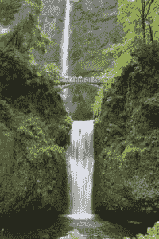
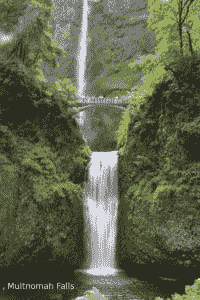

# 如何在 Python 中创建图像的差异

> 原文：<https://www.blog.pythonlibrary.org/2016/10/11/how-to-create-a-diff-of-an-image-in-python/>

在过去的几年里，我一直在为我的雇主编写自动化测试。我做的许多测试类型之一是比较应用程序如何绘制。它每次都是以同样的方式画的吗？如果不是，那么我们就有一个严重的问题。检查它每次都绘制相同图形的一个简单方法是截取一个屏幕截图，然后在应用程序更新时将其与同一图形的未来版本进行比较。

枕头库为这种叫做**图像印章**的东西提供了一个方便的工具。如果你还没有枕头，你应该现在就去安装它，这样你就可以跟随这个简短的教程。

* * *

### 比较两幅图像

我们需要做的第一件事是找到两幅略有不同的图像。你可以使用相机的连拍模式，拍摄一组动物移动的照片，最好是使用三脚架。或者你可以在一张现有的照片上添加某种覆盖，比如文字。我打算采用后一种方法。这是我在俄勒冈州摩特诺玛瀑布的原始照片:



这是修改后的版本，我添加了一些文字来标识照片的位置:



现在让我们使用 ImageChops 来找出我们的不同之处！

```py

import Image
import ImageChops

def compare_images(path_one, path_two, diff_save_location):
    """
    Compares to images and saves a diff image, if there
    is a difference

    @param: path_one: The path to the first image
    @param: path_two: The path to the second image
    """
    image_one = Image.open(path_one)
    image_two = Image.open(path_two)

    diff = ImageChops.difference(image_one, image_two)

    if diff.getbbox():
        diff.save(diff_save_location)

if __name__ == '__main__':
    compare_images('/path/to/multnomah_falls.jpg',
                   '/path/to/multnomah_falls_text.jpg',
                   '/path/to/diff.jpg')

```

这里我们有一个简单的函数，我们可以用它来寻找图像中的差异。你需要做的就是通过三条路径！前两条路径用于我们想要比较的图像。最后一个路径是保存 diff 图像的位置，如果我们找到一个 diff。对于这个例子，我们肯定应该找到一个差异，我们做到了。下面是我运行这段代码时得到的结果:


* * *

### 包扎

枕头包有许多惊人的功能来处理图像。我喜欢摄影，所以能够拍摄照片，然后使用我最喜欢的编程语言来帮助我处理结果，这很有趣。你也应该尝试一下，看看枕头文档，看看这个聪明的包还能做什么！

* * *

### 相关阅读

*   蟒蛇枕[官网](https://python-pillow.org/)
*   枕头[文档](http://pillow.readthedocs.io/en/3.4.x/index.html)
*   介绍 [Python 图像库/ Pillow](https://www.blog.pythonlibrary.org/2016/10/07/an-intro-to-the-python-imaging-library-pillow/)