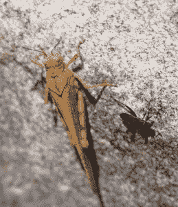
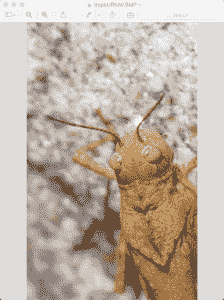

# 如何用 Python 裁剪照片

> 原文：<https://www.blog.pythonlibrary.org/2017/10/03/how-to-crop-a-photo-with-python/>

如果你喜欢拍照，你可能会发现自己会时不时地裁剪照片。我会裁剪照片，以消除背景噪音，或者更专注于我试图捕捉的主题。我也喜欢拍摄昆虫或其他小生物的高分辨率照片，然后进行裁剪，让我看起来比实际情况更接近昆虫。

现在大多数人会使用照片编辑应用程序来裁剪他们的图像，例如 Photoshop Elements。我也使用这些工具，但是你也可以使用 Python 编程语言来为你进行裁剪。一个您可能想要使用 Python 的好例子是，如果您有数千个相同类型的扫描图像，那么只需编写一个脚本来为您进行裁剪就更有意义了。

Python 中最流行的图像操作包是 [Pillow](https://python-pillow.org/) 包，它是“Python 图像库(PIL)的友好分支”。您可以使用 pip 安装枕头:

```py

pip install Pillow

```

现在我们已经安装了枕头，我们只需要一张照片。这是我拍的一只蚱蜢:



让我们编写一些代码，尝试将图片裁剪到蚱蜢的头部:

```py

from PIL import Image

def crop(image_path, coords, saved_location):
    """
    @param image_path: The path to the image to edit
    @param coords: A tuple of x/y coordinates (x1, y1, x2, y2)
    @param saved_location: Path to save the cropped image
    """
    image_obj = Image.open(image_path)
    cropped_image = image_obj.crop(coords)
    cropped_image.save(saved_location)
    cropped_image.show()

if __name__ == '__main__':
    image = 'grasshopper.jpg'
    crop(image, (161, 166, 706, 1050), 'cropped.jpg')

```

在这段代码中，我们做的第一件事是从 PIL 导入**图像**子模块。然后我们创建一个 **crop()** 函数，它有 3 个参数:

*   image_path -要裁剪的文件的文件路径
*   coords——一个 4 元素元组，包含图像裁剪的开始和结束坐标
*   saved_location -保存裁剪文件的文件路径

在我们打开初始图像后，我们得到一个可以调用 **crop()** on 的对象。crop 方法获取我们传入的坐标，并适当地裁剪图像，然后返回第二个图像对象。然后我们调用第二个图像对象的 **save()** 方法，并告诉它将它保存到指定的位置。

当您运行代码时，它将显示裁剪后的图像并保存它:



这非常接近我想要的。您可以在上面的代码中对 x/y 坐标进行一点试验，尝试以各种方式裁剪图像，看看效果如何。

* * *

### 包扎

这段代码应该有一个检查，防止用户覆盖原始图像。任何好的照片编辑器都不会覆盖原始照片，因为那真的很烦人，而且通常是件坏事。但是我将把它留给读者去解决。

无论如何，Pillow 项目对于用 Python 处理图像来说是一个非常强大和有用的包。试一试，看看你能完成什么有趣的事情！

* * *

### 相关阅读

*   介绍 [Python 图像库/ Pillow](https://www.blog.pythonlibrary.org/2016/10/07/an-intro-to-the-python-imaging-library-pillow/)