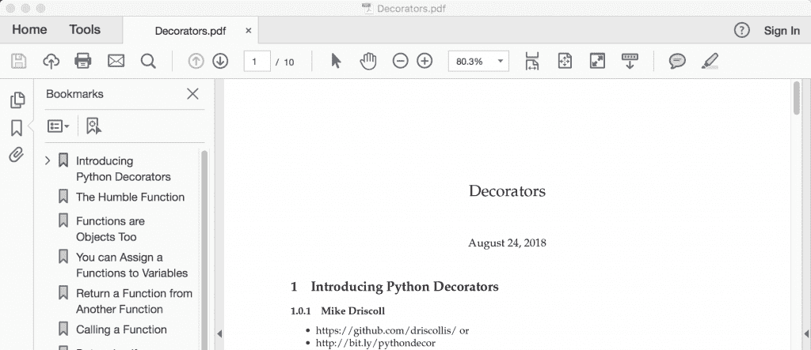
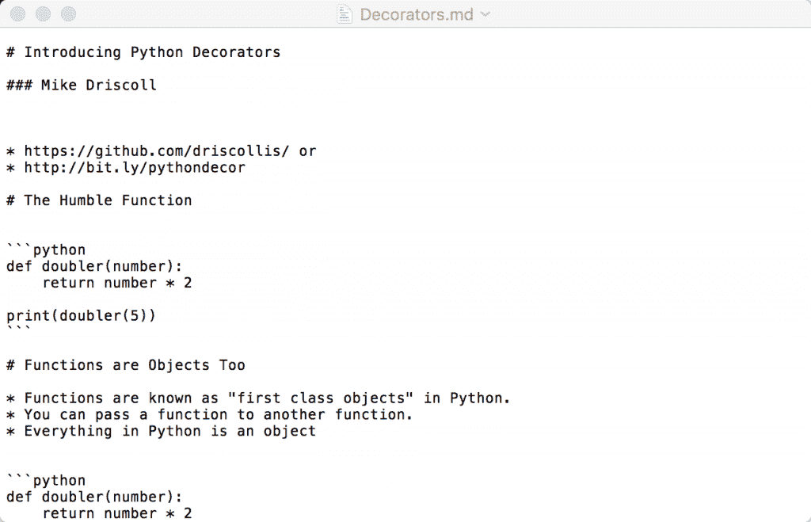
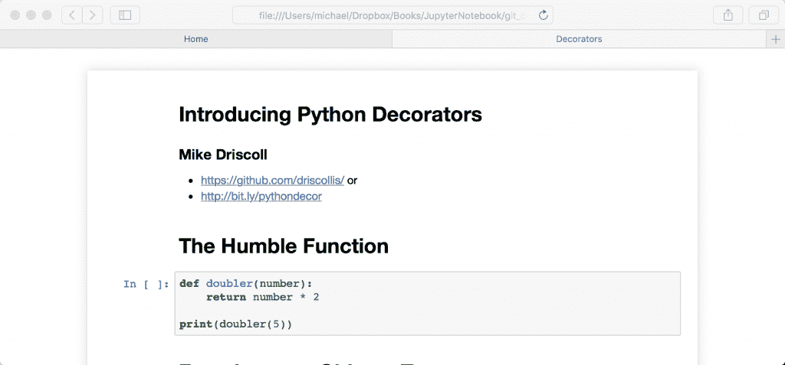

# 如何将 jupiter 笔记本导出为其他格式

> 原文：<https://www.blog.pythonlibrary.org/2018/10/09/how-to-export-jupyter-notebooks-into-other-formats/>

使用 Jupyter Notebook 时，您会发现自己需要分发笔记本，而不是笔记本文件。最有可能的原因是，您希望将笔记本的内容共享给非技术用户，这些用户不想安装 Python 或使用笔记本所需的其他依赖项。将笔记本导出为其他格式的最流行的解决方案是内置的 **nbconvert** 工具。您可以使用 **nbconvert** 导出到以下格式:

*   HTML ( -到 HTML)
*   乳胶(至乳胶)
*   PDF ( -至 PDF)
*   显示 JS ( -到幻灯片)
*   降价(md)
*   重新构造的文本(rst)
*   可执行脚本(- to 脚本)

nbconvert 工具使用 Jinja 模板来转换您的笔记本文件(**)。ipynb** )转换为其他静态格式。Jinja 是 Python 的模板引擎。nbconvert 工具依赖于 Pandoc 和 TeX 进行一些转换。您可能需要在您的计算机上单独安装这些软件。这在 [ReadTheDocs](https://nbconvert.readthedocs.io/en/latest/) 上有记录。

| [](https://leanpub.com/jupyternotebook101/) | 想了解更多关于使用 Jupyter 笔记本的信息吗？然后看看我的书:

### Jupyter 笔记型电脑 101

**[在 Leanpub](https://leanpub.com/jupyternotebook101/) 上立即购买** |

* * *

### 使用 nbconvert

我们首先需要的是一台想要转换的笔记本。我用一个 Jupyter 笔记本做了一个关于 Python decorators 的演示。我们将使用那一个。可以在 [Github](https://github.com/driscollis/NebraskaCode_Python_Decorators) 上获取。如果你想使用其他的东西，请随意下载你最喜欢的笔记本。我还发现了这个[有趣的笔记本图库](https://github.com/jupyter/jupyter/wiki/A-gallery-of-interesting-Jupyter-Notebooks)，你也可以用它。

我们将使用的笔记本名为 **Decorators.ipynb** 。使用 nbconvert 导出的典型命令如下:

```py
jupyter nbconvert  --to 
```

默认的输出格式是 HTML。但是让我们从尝试将 Decorators 笔记本转换成 PDF 开始:

```py
jupyter nbconvert Decorators.ipynb --to pdf

```

我不会在每次运行 nbconvert 时都提到这一点，但是当我运行这个命令时，我在终端中得到以下输出:

```py
[NbConvertApp] Converting notebook Decorators.ipynb to pdf
[NbConvertApp] Writing 45119 bytes to notebook.tex
[NbConvertApp] Building PDF
[NbConvertApp] Running xelatex 3 times: [u'xelatex', u'notebook.tex']
[NbConvertApp] Running bibtex 1 time: [u'bibtex', u'notebook']
[NbConvertApp] WARNING | bibtex had problems, most likely because there were no citations
[NbConvertApp] PDF successfully created
[NbConvertApp] Writing 62334 bytes to Decorators.pdf

```

当您将笔记本转换为其他格式时，您会看到类似的内容，尽管输出会明显不同。这是输出的样子:



如果您将笔记本转换为 reStructuredText 或 latex，那么 nbconvert 将使用封面下的 **pandoc** 进行转换。这意味着 pandoc 是一个依赖项，在转换成这些格式之前，您可能需要安装它。

让我们尝试将我们的笔记本电脑转换为 Markdown，看看我们会得到什么:

```py
jupyter nbconvert Decorators.ipynb --to markdown

```

当您运行此命令时，您将得到如下所示的输出:



让我们对笔记本进行一次转换。对于这种转换，我们将把我们的笔记本变成 HTML。HTML 转换实际上有两种模式:

*   -模板完整(默认)
*   -模板基本

完整版将使笔记本的 HTML 呈现看起来非常像普通笔记本在其“交互式视图”中的样子，而基本版使用 HTML 标题，主要针对那些希望将笔记本嵌入网页或博客的人。让我们试一试:

```py
jupyter nbconvert Decorators.ipynb --to html 

```

当我运行这个程序时，我得到了一个很好的 HTML 文件。如果在 web 浏览器中打开 HTML，您应该会看到以下内容:



* * *

### 转换多个笔记本

nbconvert 实用程序还支持一次转换多个笔记本。如果您有一组名称相似的笔记本，您可以使用以下命令:

```py
jupyter nbconvert notebook*.ipynb --to FORMAT 

```

这将把文件夹中的所有笔记本转换为您指定的格式，只要笔记本以“Notebook”开头。您也可以只向 nbconvert 提供一个以空格分隔的笔记本列表:

```py
jupyter nbconvert Decorators.ipynb my_other_notebook.ipynb --to FORMAT

```

如果您有许多笔记本，另一种批量转换它们的方法是创建一个 Python 脚本作为配置文件。根据此[文档](https://nbconvert.readthedocs.io/en/latest/usage.html)，您可以创建一个包含以下内容的 Python 脚本:

```py
c = get_config()
c.NbConvertApp.notebooks = ["notebook1.ipynb", "notebook2.ipynb"]

```

如果保存该文件，则可以使用以下命令运行它:

```py
jupyter nbconvert --config mycfg.py

```

这将把列出的笔记本转换成您选择的格式。

* * *

### 执行笔记本

正如您所料，大多数情况下，Jupyter 笔记本是在输出单元格被清除的情况下保存的。这意味着，当您运行转换时，您不会自动在导出中获得输出。要做到这一点，您必须使用 **- execute** 标志。这里有一个例子:

```py
jupyter nbconvert --execute my_notebook.ipynb --to pdf

```

请注意，笔记本中的代码不能有任何错误，否则转换将会失败。这就是为什么我在这个例子中没有使用 Decorators 笔记本的原因，因为我有一些故意创建的单元格，但它们不能用于演示目的。

* * *

### 使用 Python 执行笔记本

您还可以创建一个 Python 脚本，用于以编程方式执行笔记本。让我们写一些代码来运行我的 Decorators 笔记本中的所有单元，包括抛出异常的单元。让我们创建一个空的 Python 脚本，并将其命名为 **notebook_runner.py** 。在编辑器中输入以下代码:

```py
# notebook_runner.py

import nbformat
import os

from nbconvert.preprocessors import ExecutePreprocessor

def run_notebook(notebook_path):
    nb_name, _ = os.path.splitext(os.path.basename(notebook_path))
    dirname = os.path.dirname(notebook_path)

    with open(notebook_path) as f:
        nb = nbformat.read(f, as_version=4)

    proc = ExecutePreprocessor(timeout=600, kernel_name='python3')
    proc.allow_errors = True

    proc.preprocess(nb, {'metadata': {'path': '/'}})
    output_path = os.path.join(dirname, '{}_all_output.ipynb'.format(nb_name))

    with open(output_path, mode='wt') as f:
        nbformat.write(nb, f)

if __name__ == '__main__':
    run_notebook('Decorators.ipynb')

```

感兴趣的第一项位于代码的顶部。这里我们从 **nbconvert.preprocessors** 导入 **nbformat** 和一个预处理器，称为**execute preprocessors**。接下来，我们创建一个名为 **run_notebook** 的函数，它接受一个指向我们想要运行的笔记本的路径。在这个函数中，我们从传入的路径中提取文件名和目录名。

然后我们使用 **nbformat.read** 读取笔记本文件。您会注意到，您可以告诉 nbformat 将文件读取为哪个版本。请务必将此设置为与您正在使用的 Jupyter 笔记本的版本相匹配。下一步是实例化 **ExecutePreprocessor** 类。这里我们给它一个超时和内核名。如果您使用的是 Python 之外的东西，那么这里就是您想要指定该信息的地方。

因为我们想忽略错误，我们将 **allow_errors** 属性设置为 **True** 。默认为**假**。如果我们没有这样做，我们将需要在一个 **try/except** 块中包装下一步。无论如何，我们告诉 Python 通过**预处理**方法调用进行预处理。您会注意到，我们需要传入我们读取的笔记本数据，并通过元数据字典告诉它笔记本的位置。如果您的路径不同于本例中使用的路径，请务必更新此信息。

最后，我们创建输出路径，并将笔记本写到一个新位置。如果您打开它，您应该看到所有实际产生输出的代码单元格的输出。

* * *

### 配置

nbconvert 实用程序有许多配置选项，您可以使用它们来自定义其工作方式。要了解完整的细节，我推荐阅读这里的文档。

* * *

### 包扎

在本文中，我们学习了如何将 Jupyter 笔记本导出/转换为其他格式，如 HTML、Markdown 和 PDF。我们还了解到，我们可以用几种不同的方式一次转换多台笔记本电脑。最后，我们学习了在导出笔记本之前执行它的不同方法。

* * *

*   Jupyter 笔记本[扩展基础知识](https://www.blog.pythonlibrary.org/2018/10/02/jupyter-notebook-extension-basics/)
*   使用 [Jupyter 笔记本](https://www.blog.pythonlibrary.org/2018/09/25/creating-presentations-with-jupyter-notebook/)创建演示文稿