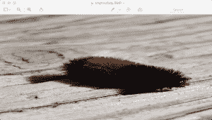

# 如何用 Python 调整照片大小

> 原文：<https://www.blog.pythonlibrary.org/2017/10/12/how-to-resize-a-photo-with-python/>

有时你会发现自己想要调整照片的大小。我通常想这样做的照片，我想通过电子邮件或张贴在网站上，因为我的一些图像可以相当大。正常人用的是图像编辑器。我通常也这样做，但是为了好玩，我想我会研究如何用 Python 编程语言来做这件事。

最快的方法是使用 pip 可以安装的枕头包。一旦你有了它，打开你最喜欢的代码编辑器，尝试下面的代码:

```py

from PIL import Image

def resize_image(input_image_path,
                 output_image_path,
                 size):
    original_image = Image.open(input_image_path)
    width, height = original_image.size
    print('The original image size is {wide} wide x {height} '
          'high'.format(wide=width, height=height))

    resized_image = original_image.resize(size)
    width, height = resized_image.size
    print('The resized image size is {wide} wide x {height} '
          'high'.format(wide=width, height=height))
    resized_image.show()
    resized_image.save(output_image_path)

if __name__ == '__main__':
    resize_image(input_image_path='caterpillar.jpg',
                 output_image_path='caterpillar_small.jpg',
                 size=(800, 400))

```

这里我们从**枕头**包中导入**图像**类。接下来，我们有一个带 3 个参数的函数:我们要打开的文件的位置，我们要保存调整后的图像的位置，以及一个表示图像新大小的元组，其中元组分别是宽度和高度。接下来，我们打开我们的图像并打印出它的大小。然后我们用传入的 **size** 元组调用图像对象的 **resize()** 方法。最后，我们获取新的尺寸，将其打印出来，然后在保存调整后的照片之前显示图像。现在看起来是这样的:



如您所见，resize()方法不做任何缩放。接下来我们将看看如何去做！

* * *

### 缩放图像

大多数时候，除非你想写一个缩放方法，否则你不会想像我们在前面的例子中那样调整你的图像的大小。前一种方法的问题是，当调整大小时，它不能保持照片的纵横比。所以不用调整大小，你可以使用 **thumbnail()** 方法。让我们来看看:

```py

from PIL import Image

def scale_image(input_image_path,
                output_image_path,
                width=None,
                height=None
                ):
    original_image = Image.open(input_image_path)
    w, h = original_image.size
    print('The original image size is {wide} wide x {height} '
          'high'.format(wide=w, height=h))

    if width and height:
        max_size = (width, height)
    elif width:
        max_size = (width, h)
    elif height:
        max_size = (w, height)
    else:
        # No width or height specified
        raise RuntimeError('Width or height required!')

    original_image.thumbnail(max_size, Image.ANTIALIAS)
    original_image.save(output_image_path)

    scaled_image = Image.open(output_image_path)
    width, height = scaled_image.size
    print('The scaled image size is {wide} wide x {height} '
          'high'.format(wide=width, height=height))

if __name__ == '__main__':
    scale_image(input_image_path='caterpillar.jpg',
                output_image_path='caterpillar_scaled.jpg',
                width=800)

```

这里我们允许程序员传入输入和输出路径以及我们的最大宽度和高度。然后我们使用一个条件来决定我们的最大尺寸应该是多少，然后我们在打开的图像对象上调用 **thumbnail()** 方法。我们也传入了**的图像。抗锯齿**标志，该标志将应用高质量下采样滤波器，从而产生更好的图像。最后，我们打开新保存的缩放图像，并打印出它的大小，以便与原始大小进行比较。如果你打开缩放后的图像，你会看到照片的纵横比保持不变。

* * *

### 包扎

玩枕头包很有趣！在本文中，您了解了如何调整图像的大小，以及如何在保持照片纵横比的同时缩放照片。现在，您可以使用这些知识来创建一个函数，该函数可以迭代一个文件夹并创建该文件夹中所有照片的缩略图，或者您可以创建一个简单的照片查看应用程序，其中这种功能可能很方便。

* * *

### 相关阅读

*   stack overflow:[Python/Pillow:如何缩放图像](https://stackoverflow.com/questions/24745857/python-pillow-how-to-scale-an-image)
*   用 Python 将一张[照片转换成黑白](https://www.blog.pythonlibrary.org/2017/10/11/convert-a-photo-to-black-and-white-in-python/)
*   [如何用 Python 旋转/镜像照片](https://www.blog.pythonlibrary.org/2017/10/05/how-to-rotate-mirror-photos-with-python/)
*   [如何用 Python 裁剪照片](https://www.blog.pythonlibrary.org/2017/10/03/how-to-crop-a-photo-with-python/)